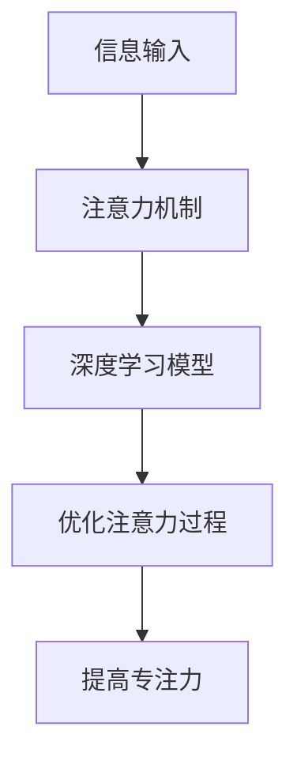

                 

**注意力深度开发：AI优化的专注力培养技术**

**作者：禅与计算机程序设计艺术 / Zen and the Art of Computer Programming**

## 1. 背景介绍

在当今信息爆炸的时代，保持专注力是一项至关重要的技能。然而，现代生活中充斥着各种干扰，使得保持专注变得越来越困难。人工智能（AI）的发展为我们提供了新的工具和技术，帮助我们优化注意力，提高专注力。本文将深入探讨注意力深度开发，即利用AI技术优化注意力的过程。

## 2. 核心概念与联系

### 2.1 注意力机制

注意力机制是指大脑选择性地关注特定信息，忽略其他信息的过程。在神经网络中，注意力机制被用来模拟人类的注意力过程，以提高模型的性能。

### 2.2 深度学习

深度学习是一种人工神经网络，其结构模仿了人类大脑的神经元结构。深度学习模型通过多层神经元网络进行特征提取和表示，从而提高模型的性能。

### 2.3 注意力深度开发

注意力深度开发是指利用深度学习模型和注意力机制，优化注意力过程，提高专注力的技术。注意力深度开发的目标是帮助个体更好地关注重要信息，忽略无关信息，从而提高学习和工作效率。



## 3. 核心算法原理 & 具体操作步骤

### 3.1 算法原理概述

注意力深度开发的核心算法是注意力机制。注意力机制通过计算输入信息的重要性，动态地调整模型的权重，从而关注重要信息，忽略无关信息。

### 3.2 算法步骤详解

1. **信息输入**：将输入信息输入到模型中。
2. **注意力权重计算**：计算输入信息的重要性，生成注意力权重。
3. **加权信息**：根据注意力权重，对输入信息进行加权，关注重要信息，忽略无关信息。
4. **模型输出**：将加权信息输入到深度学习模型中，生成模型输出。

### 3.3 算法优缺点

**优点**：
- 可以提高模型的性能，特别是在处理长序列数据时。
- 可以帮助个体更好地关注重要信息，忽略无关信息。

**缺点**：
- 计算复杂度高，需要大量的计算资源。
- 训练过程复杂，需要大量的标注数据。

### 3.4 算法应用领域

注意力深度开发的应用领域包括但不限于：
- 自然语言处理：帮助模型更好地理解文本，提高翻译、问答等任务的性能。
- 计算机视觉：帮助模型更好地关注图像中的关键区域，提高目标检测、图像分类等任务的性能。
- 个体注意力优化：帮助个体更好地关注重要信息，提高学习和工作效率。

## 4. 数学模型和公式 & 详细讲解 & 举例说明

### 4.1 数学模型构建

注意力机制的数学模型可以表示为：

$$A = \text{softmax}(W_a \cdot \text{concat}(Q, K))$$

其中，$Q$和$K$分别是查询向量和键向量，$W_a$是可学习的权重矩阵，$\text{concat}$表示向量拼接操作，$\text{softmax}$表示softmax函数。

### 4.2 公式推导过程

1. **向量表示**：将输入信息转换为向量表示$Q$和$K$。
2. **注意力权重计算**：计算注意力权重$A$。首先，将$Q$和$K$进行向量拼接，然后乘以可学习的权重矩阵$W_a$，最后通过softmax函数生成注意力权重$A$。
3. **加权信息**：根据注意力权重$A$，对输入信息进行加权，关注重要信息，忽略无关信息。

### 4.3 案例分析与讲解

例如，在自然语言处理任务中，输入信息是一段文本，查询向量$Q$表示当前词，键向量$K$表示文本中的其他词。注意力机制可以帮助模型更好地关注文本中的关键词，忽略无关词，从而提高模型的性能。

## 5. 项目实践：代码实例和详细解释说明

### 5.1 开发环境搭建

本项目使用Python语言开发，需要安装以下库：
- TensorFlow：深度学习框架
- NumPy：数值计算库
- Matplotlib：数据可视化库

### 5.2 源代码详细实现

以下是注意力机制的Python实现代码：

```python
import numpy as np
import tensorflow as tf

def attention(Q, K, W_a):
    # 向量拼接
    concat = tf.concat([Q, K], axis=-1)
    # 计算注意力权重
    A = tf.nn.softmax(tf.matmul(concat, W_a))
    return A

# 示例输入
Q = tf.constant(np.random.rand(1, 10))
K = tf.constant(np.random.rand(1, 10))
W_a = tf.Variable(tf.random.normal([20, 1]))

# 调用注意力机制函数
A = attention(Q, K, W_a)
```

### 5.3 代码解读与分析

- `Q`和`K`分别是查询向量和键向量，其维度为$(batch\_size, d\_model)$。
- `W_a`是可学习的权重矩阵，其维度为$(d\_model \times 2, 1)$。
- `concat`表示向量拼接操作，生成的向量维度为$(batch\_size, d\_model \times 2)$。
- `tf.matmul`表示矩阵乘法操作，生成的矩阵维度为$(batch\_size, 1)$。
- `tf.nn.softmax`表示softmax函数，生成的注意力权重$A$维度为$(batch\_size, 1)$。

### 5.4 运行结果展示

运行上述代码后，`A`变量中存储了注意力权重。注意力权重表示了输入信息的重要性，模型可以根据注意力权重关注重要信息，忽略无关信息。

## 6. 实际应用场景

### 6.1 注意力深度开发在自然语言处理中的应用

在自然语言处理任务中，注意力机制可以帮助模型更好地理解文本，提高翻译、问答等任务的性能。例如，在机器翻译任务中，注意力机制可以帮助模型更好地关注源语言中的关键词，生成更准确的目标语言翻译。

### 6.2 注意力深度开发在计算机视觉中的应用

在计算机视觉任务中，注意力机制可以帮助模型更好地关注图像中的关键区域，提高目标检测、图像分类等任务的性能。例如，在目标检测任务中，注意力机制可以帮助模型更好地关注图像中的目标区域，生成更准确的目标边界框。

### 6.3 注意力深度开发在个体注意力优化中的应用

注意力深度开发还可以帮助个体更好地关注重要信息，提高学习和工作效率。例如，开发注意力深度开发应用程序，帮助个体监测注意力水平，提供个性化的注意力训练计划。

### 6.4 未来应用展望

未来，注意力深度开发将会在更多领域得到应用，帮助个体更好地关注重要信息，忽略无关信息。例如，注意力深度开发可以应用于自动驾驶、医疗诊断等领域，帮助系统更好地关注关键信息，提高系统的性能和安全性。

## 7. 工具和资源推荐

### 7.1 学习资源推荐

- **书籍**：
  - "Attention Is All You Need" by Vaswani et al.
  - "Natural Language Processing with Python" by Steven Bird, Ewan Klein, and Edward Loper
- **在线课程**：
  - "Natural Language Processing in TensorFlow" by Laurence Moroney on Coursera
  - "Computer Vision with Python" by DeepLearning.AI on Coursera

### 7.2 开发工具推荐

- **深度学习框架**：TensorFlow, PyTorch, Keras
- **数值计算库**：NumPy, SciPy
- **数据可视化库**：Matplotlib, Seaborn
- **注意力机制库**：Transformers by Hugging Face, TensorFlow Addons

### 7.3 相关论文推荐

- "Attention Is All You Need" by Vaswani et al.
- "The Transformer Model: A State-of-the-Art Natural Language Processing System" by Vaswani et al.
- "BERT: Pre-training of Deep Bidirectional Transformers for Language Understanding" by Jacob Devlin, Ming-Wei Chang, and Kenton Lee

## 8. 总结：未来发展趋势与挑战

### 8.1 研究成果总结

注意力深度开发是一种有效的技术，可以帮助个体更好地关注重要信息，忽略无关信息。注意力深度开发的核心是注意力机制，其数学模型和公式已经得到广泛的研究和应用。

### 8.2 未来发展趋势

未来，注意力深度开发将会在更多领域得到应用，帮助个体更好地关注重要信息，忽略无关信息。注意力机制的研究也将会不断深入，开发出更先进的注意力机制模型。

### 8.3 面临的挑战

注意力深度开发面临的挑战包括：
- 计算复杂度高，需要大量的计算资源。
- 训练过程复杂，需要大量的标注数据。
- 注意力机制的解释性差，难以理解模型的决策过程。

### 8.4 研究展望

未来的研究方向包括：
- 开发更先进的注意力机制模型，提高模型的性能和解释性。
- 研究注意力机制在更多领域的应用，帮助个体更好地关注重要信息，忽略无关信息。
- 研究注意力机制的可解释性，帮助个体理解模型的决策过程。

## 9. 附录：常见问题与解答

**Q1：注意力深度开发适合哪些领域？**

**A1：注意力深度开发适合自然语言处理、计算机视觉、个体注意力优化等领域。**

**Q2：注意力深度开发的优缺点是什么？**

**A2：注意力深度开发的优点是可以提高模型的性能，帮助个体更好地关注重要信息，忽略无关信息。缺点是计算复杂度高，需要大量的计算资源，训练过程复杂，需要大量的标注数据。**

**Q3：注意力机制的数学模型是什么？**

**A3：注意力机制的数学模型可以表示为：$A = \text{softmax}(W_a \cdot \text{concat}(Q, K))$。**

**Q4：注意力深度开发的未来发展趋势是什么？**

**A4：未来，注意力深度开发将会在更多领域得到应用，帮助个体更好地关注重要信息，忽略无关信息。注意力机制的研究也将会不断深入，开发出更先进的注意力机制模型。**

**Q5：注意力深度开发面临的挑战是什么？**

**A5：注意力深度开发面临的挑战包括计算复杂度高，需要大量的计算资源，训练过程复杂，需要大量的标注数据，注意力机制的解释性差，难以理解模型的决策过程。**

**Q6：未来的研究方向是什么？**

**A6：未来的研究方向包括开发更先进的注意力机制模型，提高模型的性能和解释性，研究注意力机制在更多领域的应用，研究注意力机制的可解释性，帮助个体理解模型的决策过程。**

**作者：禅与计算机程序设计艺术 / Zen and the Art of Computer Programming**

