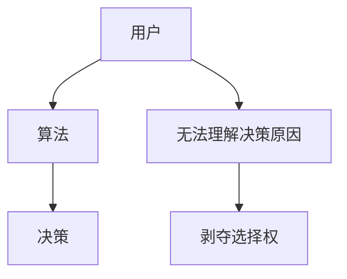

                 

**注意力的自主权：AI时代的个人选择**

## 1. 背景介绍

在人工智能（AI）飞速发展的今天，我们越来越依赖智能系统帮助我们做出决策、获取信息，然而，这也带来了一个问题：我们是否还拥有注意力的自主权？我们是否还能控制自己的选择，还是已经被算法所左右？本文将探讨这个问题，并提供一些方法来帮助我们重新夺回注意力的自主权。

## 2. 核心概念与联系

### 2.1 注意力经济学

注意力经济学是一种新兴的学科，它研究的是注意力在数字时代的分配和价值。在AI时代，注意力是一种稀缺资源，它被各种智能系统竞相争夺。这些系统使用各种算法，如推荐算法和广告算法，来吸引和保持用户的注意力。

### 2.2 算法偏见

算法偏见是指算法在决策过程中表现出的系统性偏见。这种偏见可能是由于数据集的偏见、算法的设计缺陷，或是算法开发者的偏见导致的。在注意力经济学中，算法偏见可能会导致某些内容或观点被放大或压制，从而影响用户的选择。

### 2.3 算法盒子

算法盒子是指用户无法看到算法内部工作原理的情况。这种情况会导致用户无法理解为什么算法会做出某些决策，从而剥夺了用户的选择权。



## 3. 核心算法原理 & 具体操作步骤

### 3.1 算法原理概述

推荐算法是注意力经济学中的核心算法。它使用用户的历史数据（如浏览历史、点赞历史等）来预测用户可能感兴趣的内容。常见的推荐算法包括协同过滤算法和内容过滤算法。

### 3.2 算法步骤详解

以协同过滤算法为例，其步骤如下：

1. 收集用户的历史数据，如浏览历史、点赞历史等。
2. 计算用户之间的相似度。常用的相似度计算方法包括余弦相似度和皮尔逊相关系数。
3. 根据用户的相似度，推荐与相似用户喜欢的内容。

### 3.3 算法优缺点

优点：推荐算法可以帮助用户发现他们可能感兴趣的内容，从而提高用户体验。

缺点：推荐算法可能会导致内容的同质化，因为它倾向于推荐与用户已有偏好的内容。此外，推荐算法可能会导致信息茧房现象，即用户只接触到与其偏好一致的信息，从而剥夺了用户接触不同观点的机会。

### 3.4 算法应用领域

推荐算法广泛应用于各种平台，如社交媒体、视频平台、电子商务平台等。它帮助这些平台提高用户参与度，从而提高平台的价值。

## 4. 数学模型和公式 & 详细讲解 & 举例说明

### 4.1 数学模型构建

协同过滤算法的数学模型可以表示为：

$$P_{u,i} = \frac{\sum_{v \in N(u)} S(u,v) \cdot r_{v,i}}{\sum_{v \in N(u)} |S(u,v)|}$$

其中，$P_{u,i}$表示用户$u$对项目$i$的推荐评分，$N(u)$表示用户$u$的邻居集，$S(u,v)$表示用户$u$和$v$之间的相似度，$r_{v,i}$表示用户$v$对项目$i$的评分。

### 4.2 公式推导过程

上述公式是基于用户-项目评分矩阵和用户-用户相似度矩阵推导出来的。首先，计算用户-用户相似度矩阵。然后，使用相似度矩阵和用户-项目评分矩阵，计算每个用户对每个项目的推荐评分。

### 4.3 案例分析与讲解

例如，在一个视频平台上，用户$u$的邻居集$N(u)$包含用户$v_1$, $v_2$, $v_3$, 且他们的相似度分别为$S(u,v_1)=0.8$, $S(u,v_2)=0.6$, $S(u,v_3)=0.5$. 如果用户$v_1$, $v_2$, $v_3$对视频$i$的评分分别为$r_{v_1,i}=4$, $r_{v_2,i}=3$, $r_{v_3,i}=2$, 那么用户$u$对视频$i$的推荐评分为：

$$P_{u,i} = \frac{0.8 \cdot 4 + 0.6 \cdot 3 + 0.5 \cdot 2}{0.8 + 0.6 + 0.5} = 3.4$$

## 5. 项目实践：代码实例和详细解释说明

### 5.1 开发环境搭建

本项目使用Python作为编程语言，并使用Pandas和NumPy库来处理数据。此外，还需要安装Surprise库，这是一个用于构建和评估推荐系统的Python库。

### 5.2 源代码详细实现

以下是协同过滤算法的Python实现代码：

```python
from surprise import KNNWithMeans
from surprise import Dataset
from surprise.model_selection import cross_validate

# Load the movielens-100k dataset (download it if needed)
data = Dataset.load_builtin('ml-100k')

# Use the KNNWithMeans algorithm
sim_options = {
    'name': 'pearson_baseline',
    'user_based': True  # Compute  similarities between users
}
algo = KNNWithMeans(sim_options=sim_options)

# Evaluate performances of our algorithm on the dataset
cross_validate(algo, data, measures=['RMSE', 'MAE'], cv=5, verbose=True)
```

### 5.3 代码解读与分析

这段代码使用Surprise库中的KNNWithMeans算法来实现协同过滤算法。首先，它加载了movielens-100k数据集。然后，它设置了相似度计算方法为皮尔逊相关系数，并指定了用户基于的相似度计算。最后，它使用5折交叉验证来评估算法的性能。

### 5.4 运行结果展示

运行这段代码后，您会看到算法在每个折叠上的RMSE和MAE值。这些值可以用来评估算法的性能。RMSE（均方根误差）和MAE（平均绝对误差）越小，表示算法的性能越好。

## 6. 实际应用场景

### 6.1 当前应用

推荐算法广泛应用于各种平台，如社交媒体、视频平台、电子商务平台等。它帮助这些平台提高用户参与度，从而提高平台的价值。

### 6.2 未来应用展望

未来，推荐算法可能会应用于更多领域，如智能城市、智能交通等。它可以帮助这些领域更好地理解用户需求，从而提供更好的服务。

## 7. 工具和资源推荐

### 7.1 学习资源推荐

- "推荐系统实践"（项立刚著）：这是一本介绍推荐系统原理和实现的权威指南。
- "推荐系统：从数据到智能"（项立刚著）：这是一本介绍推荐系统的最新进展和挑战的书籍。

### 7.2 开发工具推荐

- Surprise：这是一个用于构建和评估推荐系统的Python库。
- LightFM：这是一个用于构建和评估推荐系统的C++库。

### 7.3 相关论文推荐

- "The Filter Bubble Revisited"（Pariser, 2011）：这是一篇讨论信息茧房现象的经典论文。
- "Fairness and Machine Learning"（Verma and Rubin, 2018）：这是一篇讨论机器学习中的公平性问题的论文。

## 8. 总结：未来发展趋势与挑战

### 8.1 研究成果总结

本文介绍了注意力经济学、算法偏见和算法盒子等概念，并详细介绍了协同过滤算法的原理、步骤、优缺点和应用领域。此外，本文还提供了协同过滤算法的数学模型、Python实现代码，并讨论了其应用场景和挑战。

### 8.2 未来发展趋势

未来，注意力经济学和算法偏见等问题可能会变得更加突出。因此，我们需要开发更公平、更透明的算法，并帮助用户重新夺回注意力的自主权。

### 8.3 面临的挑战

面临的挑战包括如何开发更公平、更透明的算法，如何帮助用户重新夺回注意力的自主权，以及如何平衡算法的准确性和公平性。

### 8.4 研究展望

未来的研究方向包括开发更公平、更透明的算法，开发新的注意力经济学模型，以及开发新的方法来帮助用户重新夺回注意力的自主权。

## 9. 附录：常见问题与解答

**Q：如何评估推荐算法的性能？**

A：常用的指标包括精确度（Precision）、召回率（Recall）、F1分数（F1 score）、均方根误差（RMSE）和平均绝对误差（MAE）。这些指标可以帮助您评估推荐算法的准确性和完整性。

**Q：如何避免信息茧房现象？**

A：一种方法是提供更多的多样性内容，另一种方法是帮助用户发现与其偏好不同的内容。此外，还可以开发更公平、更透明的算法，从而帮助用户重新夺回注意力的自主权。

**Q：如何开发更公平的算法？**

A：一种方法是使用公平性指标（如差异公平性、等价公平性和集体公平性）来评估算法的公平性。另一种方法是使用偏见度量指标（如统计偏见和结构偏见）来评估算法的偏见。

## 作者：禅与计算机程序设计艺术 / Zen and the Art of Computer Programming

