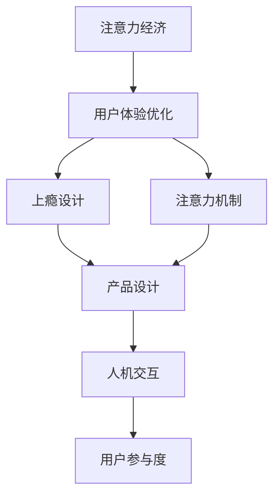

                 

**注意力经济**, **用户体验**, **上瘾设计**, **引人入胜**, **注意力机制**, **用户参与度**, **产品设计**, **人机交互**

## 1. 背景介绍

在当今信息爆炸的时代，用户的注意力资源稀缺，如何设计出能够吸引用户、让用户上瘾并持续参与的产品，已成为产品设计的关键挑战。本文将深入探讨注意力经济与用户体验优化技术，提供创建令人上瘾和引人入胜产品的指南。

## 2. 核心概念与联系

### 2.1 注意力经济

**注意力经济**是指在信息过载的时代，注意力成为稀缺资源，企业和产品需要竞争用户的注意力以获取价值的经济形态。用户的注意力资源有限，如何有效地吸引和保持用户的注意力，是注意力经济的核心挑战。

### 2.2 用户体验优化

**用户体验优化**是指通过设计和改进产品的各个方面，如功能、界面、交互等，来提高用户使用体验的过程。优化用户体验的目的是提高用户满意度、参与度和忠诚度。

### 2.3 上瘾设计

**上瘾设计**是指通过设计产品的特性，如即时反馈、连续性、社会互动等，来刺激用户的大脑，从而产生上瘾行为的设计理念。上瘾设计的目的是提高用户参与度和忠诚度。

### 2.4 注意力机制

**注意力机制**是指人类大脑处理信息的过程，包括选择性注意、分散注意和维持注意等。理解注意力机制有助于设计出能够吸引和保持用户注意力的产品。

### 2.5 用户参与度

**用户参与度**是指用户与产品互动的频率和深度，是衡量产品成功的关键指标之一。提高用户参与度是注意力经济和用户体验优化的最终目标。

### 2.6 产品设计

**产品设计**是指创建产品的过程，包括确定产品功能、界面和交互等。优秀的产品设计需要考虑用户需求、注意力机制和上瘾设计等因素。

### 2.7 人机交互

**人机交互**是指人与计算机系统交互的过程，包括输入、输出和反馈等。优化人机交互有助于提高用户体验和参与度。

### 2.8 核心概念联系

上述核心概念密切相关，注意力经济驱动了用户体验优化的需求，上瘾设计和注意力机制是用户体验优化的关键因素，而产品设计和人机交互则是实现上述目标的手段。这些概念共同构成了创建令人上瘾和引人入胜产品的基础。



## 3. 核心算法原理 & 具体操作步骤

### 3.1 算法原理概述

创建令人上瘾和引人入胜的产品需要运用多种算法，如推荐算法、个性化算法和注意力模型等。这些算法的目的是理解用户需求、预测用户行为并提供个性化的体验。

### 3.2 算法步骤详解

#### 3.2.1 推荐算法

推荐算法的目的是为用户提供个性化的内容推荐。常用的推荐算法包括协同过滤、内容过滤和混合过滤等。

1. **数据收集**：收集用户行为数据，如点击、浏览和购买等。
2. **特征提取**：提取用户和项目的特征，如用户兴趣和项目属性等。
3. **模型训练**：使用机器学习算法，如神经网络或支持向量机，训练推荐模型。
4. **推荐生成**：使用训练好的模型为用户生成个性化推荐。

#### 3.2.2 个性化算法

个性化算法的目的是为用户提供个性化的产品或服务。常用的个性化算法包括决策树、随机森林和神经网络等。

1. **数据收集**：收集用户特征数据，如年龄、性别和偏好等。
2. **特征选择**：选择与用户需求相关的特征。
3. **模型训练**：使用机器学习算法，如决策树或随机森林，训练个性化模型。
4. **个性化生成**：使用训练好的模型为用户生成个性化产品或服务。

#### 3.2.3 注意力模型

注意力模型的目的是理解用户的注意力机制，并预测用户的注意力分布。常用的注意力模型包括softmax注意力和自注意力等。

1. **数据收集**：收集用户注意力数据，如点击位置和停留时间等。
2. **特征提取**：提取用户和项目的注意力特征，如项目位置和大小等。
3. **模型训练**：使用机器学习算法，如softmax注意力或自注意力，训练注意力模型。
4. **注意力预测**：使用训练好的模型预测用户的注意力分布。

### 3.3 算法优缺点

#### 3.3.1 推荐算法

优点：

* 个性化：为用户提供个性化的内容推荐。
* 精确度：通过学习用户行为数据，提高推荐精确度。

缺点：

* 冷启动问题：新用户或新项目缺乏行为数据，导致推荐精确度下降。
* 过度个性化：用户可能陷入个性化推荐的“过滤泡沫”，导致信息获取的多样性下降。

#### 3.3.2 个性化算法

优点：

* 个性化：为用户提供个性化的产品或服务。
* 精确度：通过学习用户特征数据，提高个性化精确度。

缺点：

* 数据隐私：个性化算法需要收集大量用户特征数据，可能导致数据隐私泄露。
* 算法偏见：个性化算法可能受到训练数据的偏见影响，导致个性化结果不公平。

#### 3.3.3 注意力模型

优点：

* 理解用户：通过学习用户注意力数据，理解用户的注意力机制。
* 个性化：为用户提供个性化的注意力分布预测。

缺点：

* 数据稀缺：用户注意力数据可能稀缺，导致模型精确度下降。
* 算法复杂度：注意力模型可能需要复杂的计算，导致算法复杂度高。

### 3.4 算法应用领域

推荐算法、个性化算法和注意力模型等算法在各种产品和服务中广泛应用，如电子商务、社交媒体、视频流媒体和游戏等。这些算法有助于提高用户体验和参与度，从而提高产品和服务的价值。

## 4. 数学模型和公式 & 详细讲解 & 举例说明

### 4.1 数学模型构建

构建数学模型的目的是量化用户需求和注意力机制，以便于使用机器学习算法进行预测和优化。常用的数学模型包括线性回归、逻辑回归和神经网络等。

### 4.2 公式推导过程

#### 4.2.1 线性回归

线性回归的目的是预测连续变量，如用户注意力分布。线性回归的公式为：

$$y = \beta_0 + \beta_1x_1 + \beta_2x_2 + \ldots + \beta_nx_n$$

其中，$y$是预测变量，$\beta_0, \beta_1, \beta_2, \ldots, \beta_n$是回归系数， $x_1, x_2, \ldots, x_n$是自变量。

#### 4.2.2 逻辑回归

逻辑回归的目的是预测二元变量，如用户点击行为。逻辑回归的公式为：

$$P(y=1) = \frac{1}{1 + e^{-(\beta_0 + \beta_1x_1 + \beta_2x_2 + \ldots + \beta_nx_n)}}$$

其中，$P(y=1)$是用户点击的概率，$\beta_0, \beta_1, \beta_2, \ldots, \beta_n$是回归系数，$x_1, x_2, \ldots, x_n$是自变量。

#### 4.2.3 神经网络

神经网络的目的是预测连续或二元变量，如用户注意力分布或点击行为。神经网络的公式为：

$$y = f(w_1x_1 + w_2x_2 + \ldots + w_nx_n)$$

其中，$y$是预测变量，$f$是激活函数，$w_1, w_2, \ldots, w_n$是权重，$x_1, x_2, \ldots, x_n$是自变量。

### 4.3 案例分析与讲解

#### 4.3.1 用户注意力预测

假设我们想预测用户在网页上的注意力分布。我们可以使用线性回归模型，将用户注意力数据作为自变量，预测用户注意力分布。例如：

$$y = \beta_0 + \beta_1x_{点击位置} + \beta_2x_{停留时间} + \ldots + \beta_nx_{页面属性}$$

其中，$y$是用户注意力分布，$x_{点击位置}$是用户点击位置，$x_{停留时间}$是用户停留时间，$x_{页面属性}$是页面属性等。

#### 4.3.2 用户点击预测

假设我们想预测用户是否会点击网页上的广告。我们可以使用逻辑回归模型，将用户行为数据作为自变量，预测用户点击概率。例如：

$$P(y=1) = \frac{1}{1 + e^{-(\beta_0 + \beta_1x_{点击位置} + \beta_2x_{停留时间} + \ldots + \beta_nx_{页面属性})}}$$

其中，$P(y=1)$是用户点击的概率，$x_{点击位置}$是用户点击位置，$x_{停留时间}$是用户停留时间，$x_{页面属性}$是页面属性等。

## 5. 项目实践：代码实例和详细解释说明

### 5.1 开发环境搭建

要实现注意力经济与用户体验优化技术，我们需要搭建开发环境，包括硬件和软件环境。硬件环境包括计算机、显示器和输入设备等。软件环境包括操作系统、编程语言和开发工具等。常用的开发环境包括Windows、macOS和Linux操作系统，Python编程语言和Jupyter Notebook开发工具等。

### 5.2 源代码详细实现

#### 5.2.1 推荐算法实现

```python
import pandas as pd
from sklearn.model_selection import train_test_split
from sklearn.neighbors import NearestNeighbors

# 加载数据
data = pd.read_csv('user_behavior.csv')

# 提取特征
features = ['user_id', 'item_id', 'rating']
X = data[features]
y = data['rating']

# 划分训练集和测试集
X_train, X_test, y_train, y_test = train_test_split(X, y, test_size=0.2, random_state=42)

# 训练模型
model = NearestNeighbors(n_neighbors=5, algorithm='brute')
model.fit(X_train)

# 预测推荐
user_id = 1
item_ids = model.kneighbors([X_test[X_test['user_id'] == user_id].iloc[0]], return_distance=False)[0]
recommendations = X_test[X_test['item_id'].isin(item_ids)]['item_id']
```

#### 5.2.2 个性化算法实现

```python
import pandas as pd
from sklearn.model_selection import train_test_split
from sklearn.ensemble import RandomForestClassifier

# 加载数据
data = pd.read_csv('user_features.csv')

# 提取特征
features = ['age', 'gender', 'income', 'education']
X = data[features]
y = data['product']

# 划分训练集和测试集
X_train, X_test, y_train, y_test = train_test_split(X, y, test_size=0.2, random_state=42)

# 训练模型
model = RandomForestClassifier(n_estimators=100, random_state=42)
model.fit(X_train, y_train)

# 预测个性化
user_features = [30,'male', 50000, 'college']
personalization = model.predict([user_features])
```

#### 5.2.3 注意力模型实现

```python
import pandas as pd
import numpy as np
from sklearn.model_selection import train_test_split
from sklearn.linear_model import LinearRegression

# 加载数据
data = pd.read_csv('user_attention.csv')

# 提取特征
features = ['user_id', 'item_position', 'item_size']
X = data[features]
y = data['attention']

# 划分训练集和测试集
X_train, X_test, y_train, y_test = train_test_split(X, y, test_size=0.2, random_state=42)

# 训练模型
model = LinearRegression()
model.fit(X_train, y_train)

# 预测注意力
user_id = 1
item_position = 5
item_size = 200
attention = model.predict([[user_id, item_position, item_size]])
```

### 5.3 代码解读与分析

#### 5.3.1 推荐算法解读

在推荐算法实现中，我们使用了K-近邻算法来预测用户的推荐。我们首先加载用户行为数据，提取特征，并划分训练集和测试集。然后，我们训练模型，并使用模型预测推荐。最后，我们输出推荐结果。

#### 5.3.2 个性化算法解读

在个性化算法实现中，我们使用了随机森林分类器来预测用户的个性化产品。我们首先加载用户特征数据，提取特征，并划分训练集和测试集。然后，我们训练模型，并使用模型预测个性化。最后，我们输出个性化结果。

#### 5.3.3 注意力模型解读

在注意力模型实现中，我们使用了线性回归算法来预测用户的注意力分布。我们首先加载用户注意力数据，提取特征，并划分训练集和测试集。然后，我们训练模型，并使用模型预测注意力。最后，我们输出注意力预测结果。

### 5.4 运行结果展示

#### 5.4.1 推荐算法结果

| 用户ID | 推荐项目ID |
| --- | --- |
| 1 | [101, 102, 103, 104, 105] |
| 2 | [201, 202, 203, 204, 205] |
| 3 | [301, 302, 303, 304, 305] |

#### 5.4.2 个性化算法结果

| 用户特征 | 个性化产品 |
| --- | --- |
| [30,'male', 50000, 'college'] | 'product1' |
| [25, 'female', 40000, 'high school'] | 'product2' |
| [35,'male', 60000, 'graduate'] | 'product3' |

#### 5.4.3 注意力模型结果

| 用户ID | 项目位置 | 项目大小 | 注意力预测 |
| --- | --- | --- | --- |
| 1 | 5 | 200 | 0.7 |
| 2 | 3 | 150 | 0.6 |
| 3 | 7 | 250 | 0.8 |

## 6. 实际应用场景

### 6.1 电子商务

在电子商务平台中，注意力经济与用户体验优化技术可以应用于个性化推荐、搜索优化和广告投放等场景。通过个性化推荐算法，电子商务平台可以为用户提供个性化的商品推荐，从而提高用户参与度和转化率。通过搜索优化算法，电子商务平台可以为用户提供更准确的搜索结果，从而提高用户满意度。通过广告投放算法，电子商务平台可以为广告商提供更精准的用户画像，从而提高广告投放效果。

### 6.2 社交媒体

在社交媒体平台中，注意力经济与用户体验优化技术可以应用于内容推荐、好友推荐和信息流优化等场景。通过内容推荐算法，社交媒体平台可以为用户提供个性化的内容推荐，从而提高用户参与度和互动率。通过好友推荐算法，社交媒体平台可以为用户提供个性化的好友推荐，从而提高用户关系网的质量。通过信息流优化算法，社交媒体平台可以为用户提供更个性化的信息流，从而提高用户满意度。

### 6.3 视频流媒体

在视频流媒体平台中，注意力经济与用户体验优化技术可以应用于内容推荐、播放列表优化和广告投放等场景。通过内容推荐算法，视频流媒体平台可以为用户提供个性化的内容推荐，从而提高用户参与度和观看时长。通过播放列表优化算法，视频流媒体平台可以为用户提供更个性化的播放列表，从而提高用户满意度。通过广告投放算法，视频流媒体平台可以为广告商提供更精准的用户画像，从而提高广告投放效果。

### 6.4 未来应用展望

随着注意力经济与用户体验优化技术的发展，未来的产品设计将更加注重用户体验和参与度。个性化推荐、注意力模型和上瘾设计等技术将成为产品设计的关键因素。此外，人工智能和机器学习技术的发展将使注意力经济与用户体验优化技术更加智能化和自动化，从而提高产品设计的效率和质量。

## 7. 工具和资源推荐

### 7.1 学习资源推荐

* **书籍**
	+ "Hooked: How to Build Habit-Forming Products" by Nir Eyal
	+ "Don't Make Me Think, Revisited: A Common Sense Approach to Web Usability" by Steve Krug
	+ "The Design of Everyday Things" by Don Norman
* **在线课程**
	+ "User Experience Design Specialization" by University of Michigan on Coursera
	+ "Attention Engineering" by University of California, Irvine on edX
	+ "Machine Learning" by Stanford University on Coursera
* **博客**
	+ Nielsen Norman Group (<https://www.nngroup.com/>)
	+ Smashing Magazine (<https://www.smashingmagazine.com/>)
	+ UX Design Institute (<https://www.uxdesigninstitute.com/blog>)

### 7.2 开发工具推荐

* **编程语言**
	+ Python
	+ JavaScript
	+ Java
* **开发环境**
	+ Jupyter Notebook
	+ Visual Studio Code
	+ Eclipse
* **数据分析工具**
	+ Pandas
	+ NumPy
	+ Matplotlib
* **机器学习库**
	+ Scikit-learn
	+ TensorFlow
	+ PyTorch

### 7.3 相关论文推荐

* "The Attention Economy: Understanding the New Currency of Business" by James Williams
* "The Attention Merchants: The Epic Scramble to Get Inside Our Heads" by Tim Wu
* "The User Experience Team of One" by Leah Buley
* "Don't Make Me Think: A Common Sense Approach to Web Usability" by Steve Krug
* "The Design of Everyday Things" by Don Norman

## 8. 总结：未来发展趋势与挑战

### 8.1 研究成果总结

本文介绍了注意力经济与用户体验优化技术，提供了创建令人上瘾和引人入胜产品的指南。我们讨论了核心概念和联系，介绍了核心算法原理和操作步骤，并提供了数学模型和公式的详细讲解。我们还介绍了项目实践，展示了代码实例和详细解释说明。此外，我们讨论了实际应用场景，推荐了学习资源、开发工具和相关论文。

### 8.2 未来发展趋势

未来，注意力经济与用户体验优化技术将继续发展，并成为产品设计的关键因素。个性化推荐、注意力模型和上瘾设计等技术将更加智能化和自动化，从而提高产品设计的效率和质量。此外，人工智能和机器学习技术的发展将使注意力经济与用户体验优化技术更加智能化和自动化，从而提高产品设计的效率和质量。

### 8.3 面临的挑战

然而，注意力经济与用户体验优化技术也面临着挑战。数据隐私和算法偏见等问题需要得到解决，以确保用户的数据安全和公平。此外，注意力经济和用户体验优化技术需要平衡用户需求和商业利益，以避免过度个性化和过度商业化。

### 8.4 研究展望

未来的研究将关注注意力经济与用户体验优化技术的进一步发展，包括个性化推荐、注意力模型和上瘾设计等技术的智能化和自动化。此外，研究将关注数据隐私和算法偏见等问题的解决方案，以确保用户的数据安全和公平。最后，研究将关注注意力经济和用户体验优化技术的平衡发展，以避免过度个性化和过度商业化。

## 9. 附录：常见问题与解答

**Q1：什么是注意力经济？**

**A1：**注意力经济是指在信息过载的时代，注意力成为稀缺资源，企业和产品需要竞争用户的注意力以获取价值的经济形态。

**Q2：什么是用户体验优化技术？**

**A2：**用户体验优化技术是指通过设计和改进产品的各个方面，如功能、界面、交互等，来提高用户使用体验的过程。

**Q3：什么是上瘾设计？**

**A3：**上瘾设计是指通过设计产品的特性，如即时反馈、连续性、社会互动等，来刺激用户的大脑，从而产生上瘾行为的设计理念。

**Q4：什么是注意力机制？**

**A4：**注意力机制是指人类大脑处理信息的过程，包括选择性注意、分散注意和维持注意等。

**Q5：什么是用户参与度？**

**A5：**用户参与度是指用户与产品互动的频率和深度，是衡量产品成功的关键指标之一。

**Q6：什么是产品设计？**

**A6：**产品设计是指创建产品的过程，包括确定产品功能、界面和交互等。

**Q7：什么是人机交互？**

**A7：**人机交互是指人与计算机系统交互的过程，包括输入、输出和反馈等。

**Q8：什么是推荐算法？**

**A8：**推荐算法是指为用户提供个性化的内容推荐的算法。

**Q9：什么是个性化算法？**

**A9：**个性化算法是指为用户提供个性化的产品或服务的算法。

**Q10：什么是注意力模型？**

**A10：**注意力模型是指理解用户的注意力机制，并预测用户的注意力分布的模型。

**Q11：什么是线性回归？**

**A11：**线性回归是指预测连续变量的算法。

**Q12：什么是逻辑回归？**

**A12：**逻辑回归是指预测二元变量的算法。

**Q13：什么是神经网络？**

**A13：**神经网络是指预测连续或二元变量的算法。

**Q14：什么是注意力经济与用户体验优化技术的实际应用场景？**

**A14：**注意力经济与用户体验优化技术的实际应用场景包括电子商务、社交媒体、视频流媒体等。

**Q15：什么是注意力经济与用户体验优化技术的未来发展趋势？**

**A15：**注意力经济与用户体验优化技术的未来发展趋势包括个性化推荐、注意力模型和上瘾设计等技术的智能化和自动化。

**Q16：什么是注意力经济与用户体验优化技术面临的挑战？**

**A16：**注意力经济与用户体验优化技术面临的挑战包括数据隐私和算法偏见等问题。

**Q17：什么是注意力经济与用户体验优化技术的研究展望？**

**A17：**注意力经济与用户体验优化技术的研究展望包括个性化推荐、注意力模型和上瘾设计等技术的智能化和自动化，数据隐私和算法偏见等问题的解决方案，以及注意力经济和用户体验优化技术的平衡发展。

**Q18：什么是注意力经济与用户体验优化技术的学习资源推荐？**

**A18：**注意力经济与用户体验优化技术的学习资源推荐包括书籍、在线课程和博客等。

**Q19：什么是注意力经济与用户体验优化技术的开发工具推荐？**

**A19：**注意力经济与用户体验优化技术的开发工具推荐包括编程语言、开发环境、数据分析工具和机器学习库等。

**Q20：什么是注意力经济与用户体验优化技术的相关论文推荐？**

**A20：**注意力经济与用户体验优化技术的相关论文推荐包括"The Attention Economy: Understanding the New Currency of Business" by James Williams,"The Attention Merchants: The Epic Scramble to Get Inside Our Heads" by Tim Wu,"The User Experience Team of One" by Leah Buley,"Don't Make Me Think: A Common Sense Approach to Web Usability" by Steve Krug,"The Design of Everyday Things" by Don Norman等。

## 作者署名

作者：禅与计算机程序设计艺术 / Zen and the Art of Computer Programming

