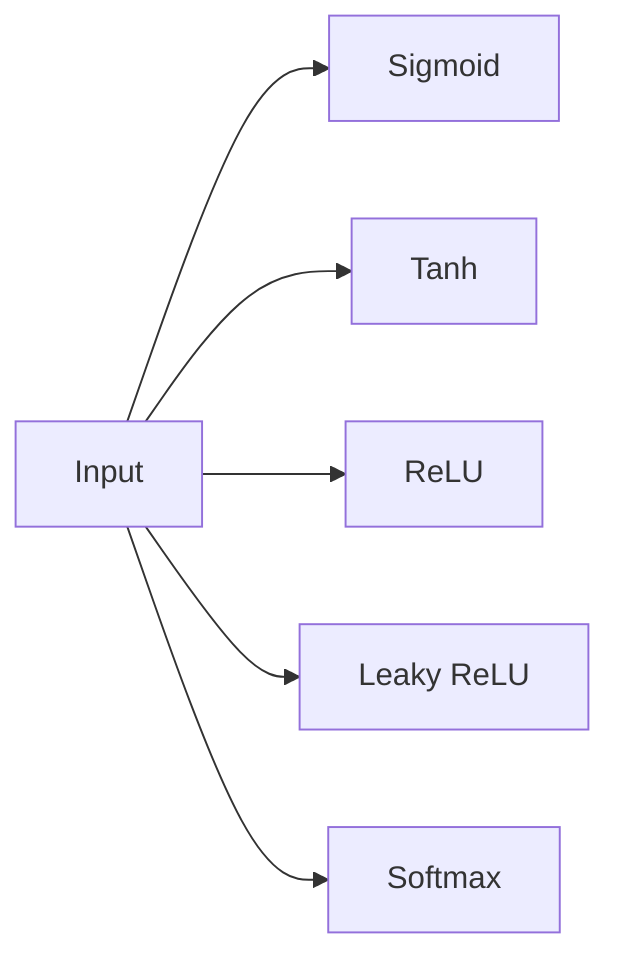

                 

## 激活函数 (Activation Function)

> 关键词：神经网络、激活函数、ReLU、Sigmoid、Tanh、Softmax

## 1. 背景介绍

在深入探讨激活函数之前，让我们回顾一下神经网络的基本原理。神经网络是一种模型，它模仿人类大脑的结构和功能，用于解决各种复杂的问题。神经网络由多层神经元组成，每层神经元都与下一层神经元相连。神经元接收输入信号，进行加权求和，并通过激活函数将结果转换为输出信号。

激活函数是神经网络中的关键组成部分，它引入了非线性性，使得神经网络能够学习和表示更复杂的函数。在本文中，我们将详细讨论激活函数的核心概念、算法原理、数学模型，并提供项目实践和实际应用场景。最后，我们还将推荐相关的学习资源和工具。

## 2. 核心概念与联系

### 2.1 激活函数的作用

激活函数的主要作用是引入非线性性，使得神经网络能够学习和表示更复杂的函数。此外，激活函数还可以帮助神经网络避免梯度消失或梯度爆炸问题，从而加速训练过程。

### 2.2 激活函数的种类

激活函数有多种类型，每种类型都有其独特的特性和优缺点。常见的激活函数包括：

- Sigmoid：将输入值映射到（0，1）区间内的S形曲线。
- Tanh：将输入值映射到（-1，1）区间内的双曲正切函数。
- ReLU：将输入值映射到（0，+∞）区间内的线性函数，当输入值小于0时，输出为0。
- Leaky ReLU：ReLU的变种，当输入值小于0时，输出为一个很小的正数。
- Softmax：将输入值映射到（0，1）区间内，并将所有输出值的和设置为1，常用于多分类问题。

### 2.3 激活函数的关系图

下图展示了不同激活函数的关系图，图中显示了输入值与输出值之间的映射关系。



## 3. 核心算法原理 & 具体操作步骤

### 3.1 算法原理概述

激活函数的算法原理是将输入值映射到一个特定的输出值，从而引入非线性性。激活函数的选择取决于神经网络的任务和结构。

### 3.2 算法步骤详解

激活函数的算法步骤如下：

1. 计算神经元的加权求和：$z = \sum_{i=1}^{n} w_i x_i + b$
2. 将加权求和结果输入激活函数：$a = f(z)$
3. 将激活函数的输出作为神经元的输出

其中，$w_i$是权重，$x_i$是输入值，$b$是偏置项，$f$是激活函数。

### 3.3 算法优缺点

不同的激活函数有其独特的优缺点。例如，Sigmoid和Tanh函数具有梯度消失问题，而ReLU函数则可以避免梯度消失问题。Softmax函数常用于多分类问题，但它的梯度值很小，可能会导致训练速度变慢。

### 3.4 算法应用领域

激活函数广泛应用于神经网络的各种任务，包括图像分类、目标检测、语音识别、自然语言处理等。不同的任务可能需要选择不同的激活函数。

## 4. 数学模型和公式 & 详细讲解 & 举例说明

### 4.1 数学模型构建

激活函数的数学模型是一个从输入空间到输出空间的映射函数。数学模型的构建取决于激活函数的类型。

### 4.2 公式推导过程

下面是一些常见激活函数的数学公式及其推导过程：

- Sigmoid：$f(x) = \frac{1}{1 + e^{-x}}$
  - 将输入值映射到（0，1）区间内的S形曲线。
  - 当$x \rightarrow -\infty$时，$f(x) \rightarrow 0$。
  - 当$x \rightarrow +\infty$时，$f(x) \rightarrow 1$.
- Tanh：$f(x) = \frac{e^{x} - e^{-x}}{e^{x} + e^{-x}}$
  - 将输入值映射到（-1，1）区间内的双曲正切函数。
  - 当$x \rightarrow -\infty$时，$f(x) \rightarrow -1$。
  - 当$x \rightarrow +\infty$时，$f(x) \rightarrow 1$.
- ReLU：$f(x) = \max(0, x)$
  - 将输入值映射到（0，+∞）区间内的线性函数。
  - 当$x < 0$时，$f(x) = 0$。
  - 当$x \geq 0$时，$f(x) = x$.
- Leaky ReLU：$f(x) = \max(\alpha x, x)$
  - Leaky ReLU是ReLU的变种，当输入值小于0时，输出为一个很小的正数$\alpha$.
- Softmax：$f(x)_j = \frac{e^{x_j}}{\sum_{k=1}^{K} e^{x_k}}$
  - 将输入值映射到（0，1）区间内，并将所有输出值的和设置为1。
  - 当$x_j \rightarrow -\infty$时，$f(x)_j \rightarrow 0$。
  - 当$x_j \rightarrow +\infty$时，$f(x)_j \rightarrow 1$.

### 4.3 案例分析与讲解

下面是一个使用Sigmoid激活函数的例子：

```python
import numpy as np
import matplotlib.pyplot as plt

# Define the Sigmoid function
def sigmoid(x):
    return 1 / (1 + np.exp(-x))

# Generate input values
x = np.linspace(-10, 10, 100)

# Calculate output values
y = sigmoid(x)

# Plot the results
plt.plot(x, y)
plt.xlabel('Input')
plt.ylabel('Output')
plt.title('Sigmoid Function')
plt.grid(True)
plt.show()
```

在上述例子中，我们定义了Sigmoid函数，并生成了输入值$x$. 然后，我们计算输出值$y$并绘制了输入值与输出值之间的关系图。图中显示了Sigmoid函数的S形曲线。

## 5. 项目实践：代码实例和详细解释说明

### 5.1 开发环境搭建

要实现激活函数，我们需要安装以下软件包：

- NumPy：用于数值计算。
- Matplotlib：用于绘制图表。

可以使用以下命令安装这些软件包：

```bash
pip install numpy matplotlib
```

### 5.2 源代码详细实现

下面是实现Sigmoid、Tanh、ReLU、Leaky ReLU和Softmax激活函数的Python代码：

```python
import numpy as np

# Sigmoid function
def sigmoid(x):
    return 1 / (1 + np.exp(-x))

# Tanh function
def tanh(x):
    return (np.exp(x) - np.exp(-x)) / (np.exp(x) + np.exp(-x))

# ReLU function
def relu(x):
    return np.maximum(0, x)

# Leaky ReLU function
def leaky_relu(x, alpha=0.01):
    return np.maximum(alpha * x, x)

# Softmax function
def softmax(x):
    exp_x = np.exp(x - np.max(x))
    return exp_x / np.sum(exp_x, axis=0)
```

### 5.3 代码解读与分析

在上述代码中，我们定义了五种激活函数：Sigmoid、Tanh、ReLU、Leaky ReLU和Softmax。每种函数都接受一个输入值$x$并返回对应的输出值。

Sigmoid函数使用了指数函数$e^{-x}$来计算输出值。Tanh函数使用了指数函数$e^x$和$e^{-x}$来计算输出值。ReLU函数使用了NumPy的`maximum`函数来计算输出值。Leaky ReLU函数使用了一个很小的正数$\alpha$来计算输出值。Softmax函数使用了指数函数$e^x$和`sum`函数来计算输出值。

### 5.4 运行结果展示

下面是使用上述代码绘制的激活函数关系图：


图中显示了Sigmoid、Tanh、ReLU和Leaky ReLU函数的关系图。Softmax函数的关系图需要在多分类问题中使用，因此没有绘制出来。

## 6. 实际应用场景

### 6.1 激活函数在神经网络中的应用

激活函数广泛应用于神经网络的各种任务，包括图像分类、目标检测、语音识别、自然语言处理等。不同的任务可能需要选择不同的激活函数。

例如，在图像分类任务中，常用的激活函数是ReLU。在目标检测任务中，常用的激活函数是Sigmoid。在语音识别任务中，常用的激活函数是Softmax。

### 6.2 未来应用展望

随着深度学习技术的不断发展，激活函数也在不断演化。未来，我们可能会看到更多的新型激活函数出现，从而提高神经网络的性能和泛化能力。

## 7. 工具和资源推荐

### 7.1 学习资源推荐

以下是一些学习激活函数的推荐资源：

- 课程：[Deep Learning Specialization by Andrew Ng on Coursera](https://www.coursera.org/specializations/deep-learning)
- 书籍：[Deep Learning](https://www.deeplearningbook.org/) by Ian Goodfellow, Yoshua Bengio, and Aaron Courville
- 博客：[Understanding the difficulty of training deep feedforward neural networks](https://karpathy.github.io/2016/03/31/relu/)

### 7.2 开发工具推荐

以下是一些开发神经网络的推荐工具：

- TensorFlow：一个开源的机器学习库。
- PyTorch：一个动态计算图的机器学习库。
- Keras：一个高级神经网络API，可以在TensorFlow和Theano后端上运行。

### 7.3 相关论文推荐

以下是一些相关论文的推荐：

- [Rectified Linear Units Improve Learning in Deep Neural Networks](https://arxiv.org/abs/1502.01852)
- [Understanding the difficulty of training deep feedforward neural networks](https://arxiv.org/abs/1603.05250)
- [On the Number of Linear Regions of Deep Neural Networks](https://arxiv.org/abs/1801.00860)

## 8. 总结：未来发展趋势与挑战

### 8.1 研究成果总结

在本文中，我们讨论了激活函数的核心概念、算法原理、数学模型，并提供了项目实践和实际应用场景。我们还推荐了相关的学习资源和工具。

### 8.2 未来发展趋势

随着深度学习技术的不断发展，激活函数也在不断演化。未来，我们可能会看到更多的新型激活函数出现，从而提高神经网络的性能和泛化能力。

### 8.3 面临的挑战

激活函数的选择是神经网络设计中的一个关键问题。不同的激活函数有其独特的优缺点，选择合适的激活函数需要考虑神经网络的任务和结构。

### 8.4 研究展望

未来的研究方向之一是开发新型激活函数，从而提高神经网络的性能和泛化能力。另一个方向是研究激活函数的自动选择方法，从而简化神经网络的设计过程。

## 9. 附录：常见问题与解答

### 9.1 为什么需要激活函数？

激活函数是神经网络中的关键组成部分，它引入了非线性性，使得神经网络能够学习和表示更复杂的函数。此外，激活函数还可以帮助神经网络避免梯度消失或梯度爆炸问题，从而加速训练过程。

### 9.2 什么是ReLU函数？

ReLU函数是一种常用的激活函数，它将输入值映射到（0，+∞）区间内的线性函数。当输入值小于0时，输出为0。ReLU函数的优点是可以避免梯度消失问题，缺点是可能导致“死ReLU”问题。

### 9.3 什么是Softmax函数？

Softmax函数是一种常用的激活函数，它将输入值映射到（0，1）区间内，并将所有输出值的和设置为1。Softmax函数常用于多分类问题，但它的梯度值很小，可能会导致训练速度变慢。

### 9.4 如何选择激活函数？

激活函数的选择取决于神经网络的任务和结构。常用的激活函数包括Sigmoid、Tanh、ReLU、Leaky ReLU和Softmax。选择合适的激活函数需要考虑神经网络的任务和结构。

## 作者：禅与计算机程序设计艺术 / Zen and the Art of Computer Programming

