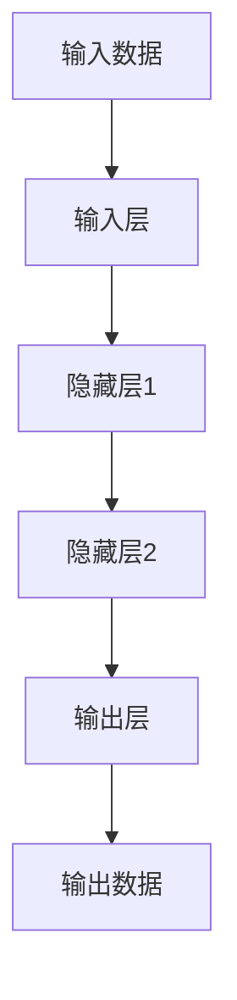

                 

## 1. 背景介绍

在当今的数字化时代，大模型已然成为人工智能领域的关键驱动力。大模型的出现，为我们带来了更强大的计算能力和更丰富的数据，从而推动了各行各业的数字化转型。然而，大模型的应用并非易事，它需要我们对其原理、算法和数学模型有着深入的理解，并能够将其应用于实际的项目中。本文将从大模型的核心概念、算法原理、数学模型、项目实践、实际应用场景等方面，为读者提供一场全面的大模型应用之旅。

## 2. 核心概念与联系

### 2.1 大模型的定义

大模型是指具有数百万甚至数十亿参数的模型，它能够处理大规模的数据，并从中学习到复杂的模式。大模型的规模和复杂性使其能够处理各种任务，从自然语言处理到图像识别，再到预测分析。

### 2.2 大模型的架构

大模型的架构通常由多层神经网络组成，每层神经网络都有数百万甚至数十亿个神经元。这些神经元通过权重连接在一起，权重的值通过训练过程不断调整，以最小化模型的预测误差。



### 2.3 大模型的训练

大模型的训练是一个复杂的过程，它需要大量的计算资源和时间。训练过程通常包括以下步骤：

1. 数据预处理：对原始数据进行清洗、标记和分割，以便模型可以学习到有用的特征。
2. 模型初始化：为模型的每个神经元初始化权重和偏置。
3. 前向传播：将输入数据通过模型的各层神经网络，计算出输出数据。
4. 误差反向传播：计算模型的预测误差，并将其反向传播到模型的各层神经网络，以更新模型的权重和偏置。
5. 重复步骤3-4，直到模型的预测误差小于预设阈值。

## 3. 核心算法原理 & 具体操作步骤

### 3.1 算法原理概述

大模型的核心算法是神经网络，它是一种模拟人类神经元结构的数学模型。神经网络的工作原理是通过学习数据中的模式，不断调整其内部权重和偏置，以最小化预测误差。

### 3.2 算法步骤详解

大模型的训练算法通常是梯度下降法，它是一种迭代优化算法，其目标是最小化模型的预测误差。梯度下降法的具体步骤如下：

1. 初始化模型的权重和偏置。
2. 计算模型的预测误差。
3. 计算模型的梯度，即模型权重和偏置对预测误差的偏导数。
4. 使用学习率乘以梯度，更新模型的权重和偏置。
5. 重复步骤2-4，直到模型的预测误差小于预设阈值。

### 3.3 算法优缺点

梯度下降法是一种简单有效的优化算法，但它也有其缺点。例如，梯度下降法容易陷入局部最小值，从而导致模型无法学习到最优解。此外，梯度下降法的收敛速度取决于学习率的选择，如果学习率过大，模型可能无法收敛；如果学习率过小，模型可能需要花费大量的时间收敛。

### 3.4 算法应用领域

大模型的算法原理广泛应用于各种领域，从自然语言处理到图像识别，再到预测分析。例如，在自然语言处理领域，大模型可以用于文本分类、文本生成和机器翻译等任务。在图像识别领域，大模型可以用于目标检测、图像分类和图像生成等任务。在预测分析领域，大模型可以用于预测销售额、预测客户流失率和预测股票价格等任务。

## 4. 数学模型和公式 & 详细讲解 & 举例说明

### 4.1 数学模型构建

大模型的数学模型通常是多层神经网络，每层神经网络都有数百万甚至数十亿个神经元。神经网络的数学模型可以表示为：

$$y = f(x; W, b)$$

其中，$x$是输入数据，$y$是输出数据，$W$是模型的权重，$b$是模型的偏置，$f$是激活函数。

### 4.2 公式推导过程

大模型的训练目标是最小化预测误差，预测误差通常使用均方误差（MSE）或交叉熵（CE）等损失函数来衡量。例如，均方误差的公式为：

$$L = \frac{1}{n} \sum_{i=1}^{n} (y_i - \hat{y}_i)^2$$

其中，$y_i$是真实值，$hat{y}_i$是模型的预测值，$n$是样本数。

### 4.3 案例分析与讲解

为了更好地理解大模型的数学模型和公式，我们来看一个例子。假设我们要构建一个二分类模型，用于预测客户是否会流失。我们的输入数据$x$是客户的特征向量，输出数据$y$是客户流失的标签（0表示不流失，1表示流失）。我们选择 sigmoid 函数作为激活函数，均方误差作为损失函数。我们的数学模型可以表示为：

$$y = sigmoid(x; W, b) = \frac{1}{1 + exp(-(Wx + b))}$$

我们的训练目标是最小化均方误差：

$$L = \frac{1}{n} \sum_{i=1}^{n} (y_i - \hat{y}_i)^2$$

其中，$y_i$是真实值，$hat{y}_i$是模型的预测值，$n$是样本数。我们可以使用梯度下降法来优化模型的权重和偏置，以最小化均方误差。

## 5. 项目实践：代码实例和详细解释说明

### 5.1 开发环境搭建

要构建大模型，我们需要一个强大的开发环境。我们推荐使用 Python 语言，并配合 TensorFlow、PyTorch 等深度学习框架。我们还需要一个强大的 GPU 来加速模型的训练过程。

### 5.2 源代码详细实现

下面是一个使用 TensorFlow 构建二分类模型的示例代码：

```python
import tensorflow as tf
from tensorflow.keras.models import Sequential
from tensorflow.keras.layers import Dense

# 定义模型
model = Sequential()
model.add(Dense(64, activation='relu', input_shape=(input_dim,)))
model.add(Dense(64, activation='relu'))
model.add(Dense(1, activation='sigmoid'))

# 编译模型
model.compile(optimizer='adam', loss='binary_crossentropy', metrics=['accuracy'])

# 训练模型
model.fit(x_train, y_train, epochs=10, batch_size=32, validation_data=(x_val, y_val))
```

### 5.3 代码解读与分析

在上述代码中，我们首先导入 TensorFlow 和 Keras，并定义了一个 Sequential 模型。我们添加了两个 Dense 层，每层都有 64 个神经元，激活函数为 ReLU。我们还添加了一个输出层，它只有一个神经元，激活函数为 sigmoid。我们使用 Adam 优化器，二进制交叉熵作为损失函数，并将 accuracy 作为评估指标。我们使用 10 个 epoch 来训练模型，每个 batch 处理 32 个样本，并使用验证集来评估模型的性能。

### 5.4 运行结果展示

通过运行上述代码，我们可以训练出一个二分类模型，并使用验证集来评估其性能。我们可以使用模型的 evaluate 方法来获取模型的准确率和损失值。例如：

```python
loss, accuracy = model.evaluate(x_test, y_test)
print('Test accuracy:', accuracy)
```

## 6. 实际应用场景

### 6.1 自然语言处理

大模型在自然语言处理领域有着广泛的应用。例如，大模型可以用于文本分类、文本生成和机器翻译等任务。在文本分类任务中，大模型可以学习到文本的语义特征，并将其分类到相应的类别中。在文本生成任务中，大模型可以学习到文本的语法和语义规则，并生成新的文本。在机器翻译任务中，大模型可以学习到源语言和目标语言之间的映射关系，并将源语言翻译为目标语言。

### 6.2 图像识别

大模型在图像识别领域也有着广泛的应用。例如，大模型可以用于目标检测、图像分类和图像生成等任务。在目标检测任务中，大模型可以学习到图像中的目标特征，并将其定位到图像中。在图像分类任务中，大模型可以学习到图像的语义特征，并将其分类到相应的类别中。在图像生成任务中，大模型可以学习到图像的语法和语义规则，并生成新的图像。

### 6.3 预测分析

大模型在预测分析领域也有着广泛的应用。例如，大模型可以用于预测销售额、预测客户流失率和预测股票价格等任务。在预测销售额任务中，大模型可以学习到销售额的相关因素，并预测未来的销售额。在预测客户流失率任务中，大模型可以学习到客户流失的相关因素，并预测客户流失的可能性。在预测股票价格任务中，大模型可以学习到股票价格的相关因素，并预测未来的股票价格。

### 6.4 未来应用展望

大模型的应用前景非常广阔，未来它将会在更多的领域得到应用。例如，大模型可以用于自动驾驶、医疗诊断和材料设计等任务。在自动驾驶任务中，大模型可以学习到路况的相关因素，并预测车辆的行驶路线。在医疗诊断任务中，大模型可以学习到病人的症状和病史，并预测病人的疾病。在材料设计任务中，大模型可以学习到材料的性能特征，并设计出新的材料。

## 7. 工具和资源推荐

### 7.1 学习资源推荐

要学习大模型的应用，我们推荐以下资源：

* 深度学习课程：斯坦福大学的深度学习课程（CS231n）和牛津大学的深度学习课程（CS16）是学习大模型的好地方。
* 书籍："Deep Learning" 由 Ian Goodfellow、Yoshua Bengio 和 Aaron Courville 合著，是学习大模型的权威指南。
* 论文：arXiv 是一个学术论文的预印本库，里面有大量关于大模型的最新研究成果。

### 7.2 开发工具推荐

要开发大模型，我们推荐以下工具：

* TensorFlow：一个强大的深度学习框架，支持 GPU 加速。
* PyTorch：一个灵活的深度学习框架，支持动态计算图。
* Jupyter Notebook：一个交互式计算环境，支持 Python、R 等编程语言。

### 7.3 相关论文推荐

要了解大模型的最新研究成果，我们推荐以下论文：

* "Attention Is All You Need"：一篇介绍了注意力机制的论文，该机制已成为大模型的标准组成部分。
* "BERT: Pre-training of Deep Bidirectional Transformers for Language Understanding"：一篇介绍了 BERT 等预训练模型的论文，这些模型已成为自然语言处理领域的标准。
* "ImageNet Classification with Deep Convolutional Neural Networks"：一篇介绍了 CNN 等卷积神经网络的论文，这些网络已成为图像识别领域的标准。

## 8. 总结：未来发展趋势与挑战

### 8.1 研究成果总结

大模型的研究已经取得了显著的成果，从自然语言处理到图像识别，再到预测分析，大模型已经在各个领域取得了突出的成就。大模型的成功应用，为我们带来了更强大的计算能力和更丰富的数据，从而推动了各行各业的数字化转型。

### 8.2 未来发展趋势

大模型的未来发展趋势包括以下几个方面：

* 更大的模型：未来的大模型将会更大，具有数千万甚至数十亿个参数。这些大模型将能够处理更大规模的数据，并学习到更复杂的模式。
* 更强的计算能力：未来的大模型将需要更强大的计算能力，以便能够在合理的时间内训练和推理。这将需要更先进的硬件和算法。
* 更丰富的数据：未来的大模型将需要更丰富的数据，以便能够学习到更复杂的模式。这将需要更先进的数据收集和预处理技术。

### 8.3 面临的挑战

大模型的未来发展也面临着以下挑战：

* 训练成本：大模型的训练需要大量的计算资源和时间，这导致了高昂的成本。如何降低大模型的训练成本，是一个关键的挑战。
* 过拟合：大模型容易受到过拟合的影响，从而导致模型在训练集上表现良好，但在测试集上表现不佳。如何防止过拟合，是另一个关键的挑战。
* 解释性：大模型的决策过程通常是不透明的，这使得模型难以解释。如何提高大模型的解释性，是又一个关键的挑战。

### 8.4 研究展望

未来的大模型研究将会朝着以下方向发展：

* 更先进的架构：未来的大模型将会具有更先进的架构，从而能够学习到更复杂的模式。
* 更先进的优化算法：未来的大模型将会使用更先进的优化算法，从而能够更快地收敛。
* 更先进的数据处理技术：未来的大模型将会使用更先进的数据处理技术，从而能够处理更丰富的数据。

## 9. 附录：常见问题与解答

### 9.1 什么是大模型？

大模型是指具有数百万甚至数十亿参数的模型，它能够处理大规模的数据，并从中学习到复杂的模式。

### 9.2 大模型的优势是什么？

大模型的优势包括能够处理大规模的数据，学习到复杂的模式，并具有强大的泛化能力。

### 9.3 大模型的缺点是什么？

大模型的缺点包括训练成本高、易受过拟合影响、决策过程不透明等。

### 9.4 如何构建大模型？

构建大模型需要以下步骤：数据预处理、模型初始化、前向传播、误差反向传播和重复训练过程。

### 9.5 大模型有哪些应用领域？

大模型的应用领域包括自然语言处理、图像识别、预测分析等。

### 9.6 大模型的未来发展趋势是什么？

大模型的未来发展趋势包括更大的模型、更强的计算能力、更丰富的数据等。

### 9.7 大模型的未来挑战是什么？

大模型的未来挑战包括训练成本高、易受过拟合影响、决策过程不透明等。

### 9.8 大模型的研究展望是什么？

大模型的研究展望包括更先进的架构、更先进的优化算法、更先进的数据处理技术等。

## 作者：禅与计算机程序设计艺术 / Zen and the Art of Computer Programming

