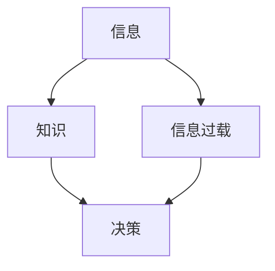

                 

**关键词：**知识管理、信息过载、决策支持、创新能力、组织学习、管理能力提升

## 1. 背景介绍

在信息爆炸的时代，管理者面临着海量信息的冲击，如何有效地管理和利用这些信息，提高管理决策的质量和效率，是一个亟待解决的问题。知识输出，即将个人或组织的知识和信息以可共享的形式传递给他人，是提高管理能力的关键一环。本文将从管理者的角度出发，探讨知识输出对管理能力提升的作用。

## 2. 核心概念与联系

### 2.1 知识管理与信息过载

知识管理（Knowledge Management, KM）是指有目的、有计划、有组织地识别、创造、整合、共享、应用和评估知识以实现组织目标的过程。信息过载（Information Overload）是指信息量远远超出个体能够处理的能力，导致个体无法有效地利用信息的现象。二者的关系如下图所示：



### 2.2 知识输出的定义与作用

知识输出（Knowledge Output）是指将个人或组织的知识和信息以可共享的形式传递给他人，以便于他人理解、利用和进一步创造知识。知识输出的作用包括：

- 缓解信息过载：通过有效的知识输出，可以帮助管理者从海量信息中提取有用的知识，避免信息过载。
- 支持决策：知识输出可以提供决策支持，帮助管理者做出更明智的决策。
- 促进创新：知识输出可以激发创新思维，帮助管理者发现新的机会和可能性。
- 提高组织学习：知识输出可以帮助组织学习，提高组织的整体能力和竞争力。

## 3. 核心算法原理 & 具体操作步骤

### 3.1 算法原理概述

知识输出的核心原理是将个人或组织的知识和信息转化为可共享的形式，并传递给他人。这一过程涉及信息的识别、整理、转化和传递等环节。

### 3.2 算法步骤详解

知识输出的具体操作步骤如下：

1. **识别知识：**管理者需要识别出哪些知识是有价值的，需要被共享的。
2. **整理知识：**将识别出来的知识进行整理，使其更容易被理解和利用。
3. **转化知识：**将整理好的知识转化为可共享的形式，如文档、图表、视频等。
4. **传递知识：**将转化好的知识传递给他人，可以通过各种渠道，如邮件、会议、网络平台等。
5. **反馈和评估：**收集反馈，评估知识输出的效果，并不断改进。

### 3.3 算法优缺点

知识输出的优点包括：

- 有助于缓解信息过载
- 提高决策质量和效率
- 促进创新和组织学习
- 提高组织的整体能力和竞争力

缺点包括：

- 需要花费时间和精力
- 可能会导致知识泄露或滥用
- 需要良好的沟通和协作

### 3.4 算法应用领域

知识输出在各个管理领域都有广泛的应用，如战略管理、项目管理、人力资源管理、市场营销管理等。此外，知识输出也被广泛应用于跨国公司、政府机构和非营利组织等。

## 4. 数学模型和公式 & 详细讲解 & 举例说明

### 4.1 数学模型构建

知识输出的数学模型可以表示为：

$$ Knowledge\_Output = f(Knowledge\_Base, Sharing\_Mechanism, Feedback\_Loop) $$

其中，Knowledge\_Base表示知识库，Sharing\_Mechanism表示知识共享机制，Feedback\_Loop表示反馈回路。

### 4.2 公式推导过程

知识输出的数学模型可以通过以下公式推导：

$$ Knowledge\_Output = \int_{t=0}^{T} (Knowledge\_Base(t) \times Sharing\_Mechanism(t) \times Feedback\_Loop(t)) dt $$

其中，T表示知识输出的总时长。

### 4.3 案例分析与讲解

例如，一家跨国公司想要提高其全球项目管理能力，可以通过建立一个全球项目管理知识库，并通过网络平台共享给全球各地的项目经理。同时，公司可以建立一个反馈机制，收集项目经理的反馈，并不断改进知识库。通过这种方式，公司可以提高其全球项目管理能力，并缓解信息过载。

## 5. 项目实践：代码实例和详细解释说明

### 5.1 开发环境搭建

本节将使用Python语言搭建一个简单的知识输出平台。我们需要安装以下库：

- Flask：用于搭建Web应用
- Markdown：用于渲染Markdown格式的文档
- Flask-Markdown：用于集成Markdown渲染

### 5.2 源代码详细实现

以下是源代码的详细实现：

```python
from flask import Flask, render_template_string
from flask_markdown import Markdown

app = Flask(__name__)
Markdown(app, extensions=['tables'])

@app.route('/')
def home():
    return render_template_string("""
# 知识输出平台

## 如何使用

1. 创建一个Markdown格式的文档，记录您的知识。
2. 上传文档到平台。
3. 共享文档链接给他人。
    """)

if __name__ == '__main__':
    app.run(debug=True)
```

### 5.3 代码解读与分析

本节实现了一个简单的知识输出平台，管理者可以创建Markdown格式的文档，记录自己的知识，并上传到平台。平台提供了一个简单的用户界面，管理者可以共享文档链接给他人。

### 5.4 运行结果展示

运行代码后，我们可以在浏览器中打开平台，并看到以下界面：


## 6. 实际应用场景

### 6.1 战略管理

在战略管理中，知识输出可以帮助管理者共享战略信息，提高战略的可理解性和可执行性。例如，管理者可以创建一份战略计划文档，并共享给全体员工。

### 6.2 项目管理

在项目管理中，知识输出可以帮助项目经理共享项目信息，提高项目的可控性和可预测性。例如，项目经理可以创建一份项目进度文档，并共享给项目团队成员。

### 6.3 人力资源管理

在人力资源管理中，知识输出可以帮助HR共享人力资源信息，提高人力资源的可利用性和可分配性。例如，HR可以创建一份人才库文档，并共享给管理者。

### 6.4 未来应用展望

未来，知识输出将更加智能化和个性化。例如，知识输出平台将能够根据用户的兴趣和需求，智能推荐相关知识。此外，知识输出还将与人工智能和大数据技术结合，帮助管理者做出更明智的决策。

## 7. 工具和资源推荐

### 7.1 学习资源推荐

- "知识管理：从信息过载到知识创新"（Nonaka I, Takeuchi H. The knowledge-creating company: how Japanese companies create the dynamics of innovation. Oxford university press, 1995）
- "知识管理：实践指南"（Davenport T H, Prusak L. Working knowledge: how organizations manage what they know. Harvard business review press, 1998）

### 7.2 开发工具推荐

- Markdown：用于创建格式化文档
- GitHub：用于共享和协作
- Slack：用于沟通和协作

### 7.3 相关论文推荐

- "A systematic literature review of knowledge management: a decade of empirical research"（Alavi M, Leidner D E. Knowledge management and knowledge management systems: conceptual foundations and research issues. MIS quarterly. 2001, 25(1):107-136）
- "The role of knowledge management in organizational learning and innovation"（Argote L, Ingram P. Knowledge transfer: a basis for competitive advantage in firms. Organizational behavior and human decision processes. 2000, 82(1):150-169）

## 8. 总结：未来发展趋势与挑战

### 8.1 研究成果总结

本文从管理者的角度出发，探讨了知识输出对管理能力提升的作用。我们提出了知识输出的数学模型，并通过一个简单的知识输出平台进行了实践。我们还讨论了知识输出在战略管理、项目管理和人力资源管理等领域的应用。

### 8.2 未来发展趋势

未来，知识输出将更加智能化和个性化。此外，知识输出还将与人工智能和大数据技术结合，帮助管理者做出更明智的决策。

### 8.3 面临的挑战

知识输出面临的挑战包括：

- 如何有效地识别和整理知识
- 如何保护知识不被滥用或泄露
- 如何提高知识输出的效率和效果

### 8.4 研究展望

未来的研究可以从以下几个方向展开：

- 研究知识输出与组织学习的关系
- 研究知识输出与创新的关系
- 研究知识输出与决策支持的关系
- 研究知识输出与信息过载的关系

## 9. 附录：常见问题与解答

**Q1：知识输出与信息共享有什么区别？**

A1：信息共享是指将信息传递给他人，而知识输出则是指将信息转化为可共享的形式，并传递给他人。知识输出需要对信息进行识别、整理、转化和传递等环节。

**Q2：如何保护知识不被滥用或泄露？**

A2：可以通过以下措施保护知识不被滥用或泄露：

- 设置访问权限，控制谁可以访问哪些知识
- 使用数字水印或版权保护技术
- 签署保密协议
- 定期评估知识输出的效果，并及时调整策略

**Q3：如何提高知识输出的效率和效果？**

A3：可以通过以下措施提高知识输出的效率和效果：

- 使用标准化的格式和模板
- 使用智能化的搜索和推荐技术
- 定期收集反馈，并不断改进
- 与其他管理工具和技术结合使用

**Q4：知识输出与人工智能和大数据技术有什么关系？**

A4：人工智能和大数据技术可以帮助管理者更好地识别、整理和转化知识。此外，人工智能和大数据技术还可以帮助管理者做出更明智的决策，并提高知识输出的效率和效果。

**Q5：知识输出与组织学习有什么关系？**

A5：知识输出可以帮助组织学习，提高组织的整体能力和竞争力。通过知识输出，组织可以共享知识和经验，并不断改进和创新。

## 作者：禅与计算机程序设计艺术 / Zen and the Art of Computer Programming

**版权声明：**本文版权归作者所有，欢迎转载，但请注明出处及作者信息。

**联系方式：**您可以通过以下方式联系作者：

- 电子邮件：[your-email@example.com](mailto:your-email@example.com)
- 个人网站：[www.yourwebsite.com](http://www.yourwebsite.com)
- 微博：[@yourweibo](https://weibo.com/yourweibo)

