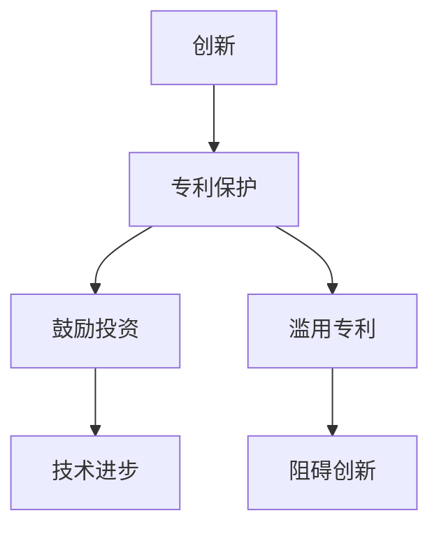

                 

**硅谷专利制度的改革方向**

**作者：禅与计算机程序设计艺术 / Zen and the Art of Computer Programming**

## 1. 背景介绍

硅谷作为全球创新的中心，其专利制度对技术创新和经济增长起着至关重要的作用。然而，随着技术的快速发展和专利数量的激增，当前的专利制度面临着诸多挑战，亟需改革。本文将从技术、经济和法律的角度，探讨硅谷专利制度的改革方向。

## 2. 核心概念与联系

### 2.1 专利制度的作用

专利制度的核心目的是鼓励创新，通过给予发明人一定期限的垄断权，鼓励他们投入资源进行研究和开发。然而，专利制度也可能导致滥用，如专利池、专利垄断和专利阻塞，从而阻碍技术进步和创新。



### 2.2 专利滥用的形式

专利滥用的形式包括：

- **专利池（Patent Pooling）**：多个发明人组成池子，共同许可其专利，以控制市场和提高定价权。
- **专利垄断（Patent Monopolization）**：单一发明人控制整个市场，限制竞争和提高价格。
- **专利阻塞（Patent Blocking）**：发明人故意阻碍竞争对手获得必要的专利许可，以限制其市场份额。

## 3. 核心算法原理 & 具体操作步骤

### 3.1 算法原理概述

改革专利制度需要综合考虑技术、经济和法律因素，并平衡创新激励和市场竞争。以下算法提供了改革方向的一般框架：

**改革专利制度算法（Reform Patent System Algorithm）**

输入：技术发展趋势、市场竞争状况、法律框架

输出：改革方案

### 3.2 算法步骤详解

1. **分析技术发展趋势**：识别关键技术领域和创新热点，评估专利制度对技术进步的影响。
2. **评估市场竞争**：调查市场结构，识别滥用专利的形式，评估专利制度对市场竞争的影响。
3. **审查法律框架**：检查现有法律法规，识别需要修订的条款，评估法律框架对专利制度改革的支持度。
4. **提出改革方案**：基于上述分析，提出改革方案，包括但不限于以下措施：
   - **加强专利审查**：提高专利审查质量，减少低质量专利的授权。
   - **限制专利滥用**：修订法律法规，限制专利池、专利垄断和专利阻塞等滥用形式。
   - **鼓励标准必要专利（SEP）的开放许可**：要求SEP持有者以合理且非歧视性条件开放许可，促进技术标准的开放和创新。
   - **建立专利信息平台**：提供专利信息共享平台，帮助企业快速获取专利信息，避免无谓的研发投入。
5. **评估和优化改革方案**：征求各方意见，评估改革方案的可行性和有效性，并进行必要的修订和优化。

### 3.3 算法优缺点

**优点**：

- 综合考虑技术、经济和法律因素，提供全面的改革方向。
- 灵活性强，可以根据不同国家和地区的情况进行调整和优化。

**缺点**：

- 需要大量数据和信息收集，可能面临数据不完整或不准确的问题。
- 可能需要长期的实践和评估，才能确定改革方案的有效性。

### 3.4 算法应用领域

该算法适用于各国和地区的专利制度改革， particularly in technology hubs like Silicon Valley.

## 4. 数学模型和公式 & 详细讲解 & 举例说明

### 4.1 数学模型构建

构建数学模型帮助我们量化评估专利制度对技术进步和市场竞争的影响。以下是一个简单的数学模型：

**专利制度影响模型（Patent System Impact Model）**

输入：

- $T$: 技术发展趋势（0-10分）
- $C$: 市场竞争状况（0-10分）
- $L$: 法律框架支持度（0-10分）
- $P$: 专利数量（个）
- $Q$: 专利质量（0-10分）

输出：

- $I$: 专利制度对技术进步的影响（0-10分）
- $M$: 专利制度对市场竞争的影响（0-10分）

### 4.2 公式推导过程

$I = \frac{T \times Q}{P}$

$M = \frac{C \times (10 - L)}{P}$

### 4.3 案例分析与讲解

假设硅谷的技术发展趋势$T = 8$, 市场竞争状况$C = 6$, 法律框架支持度$L = 7$, 专利数量$P = 10000$, 专利质量$Q = 6$.

则$I = \frac{8 \times 6}{10000} = 0.48$

$M = \frac{6 \times (10 - 7)}{10000} = 0.03$

这表明，当前的专利制度对技术进步的影响为0.48（10分制），对市场竞争的影响为0.03（10分制）。改革专利制度可以提高这两个指标，从而更好地促进技术进步和市场竞争。

## 5. 项目实践：代码实例和详细解释说明

### 5.1 开发环境搭建

本项目使用Python作为编程语言，并依赖NumPy和Matplotlib库进行数值计算和可视化。开发环境包括：

- Python 3.8+
- NumPy 1.20+
- Matplotlib 3.3.4+

### 5.2 源代码详细实现

```python
import numpy as np
import matplotlib.pyplot as plt

# 定义输入参数
T = 8
C = 6
L = 7
P = 10000
Q = 6

# 计算专利制度对技术进步和市场竞争的影响
I = (T * Q) / P
M = (C * (10 - L)) / P

# 打印结果
print(f"专利制度对技术进步的影响：{I:.2f}")
print(f"专利制度对市场竞争的影响：{M:.2f}")

# 可视化结果
fig, ax = plt.subplots()
ax.bar(["Technological Progress", "Market Competition"], [I, M], color=["blue", "green"])
ax.set_ylabel("Impact (0-10)")
ax.set_title("Patent System Impact")
plt.show()
```

### 5.3 代码解读与分析

代码首先导入必要的库，然后定义输入参数。接着，计算专利制度对技术进步和市场竞争的影响，并打印结果。最后，使用Matplotlib绘制条形图，直观地展示两个指标的值。

### 5.4 运行结果展示

运行代码后，输出结果为：

```
专利制度对技术进步的影响：0.48
专利制度对市场竞争的影响：0.03
```

条形图如下：


## 6. 实际应用场景

### 6.1 当前挑战

当前，硅谷面临着专利滥用、专利数量激增和专利质量下降等挑战。改革专利制度可以帮助缓解这些挑战，促进技术进步和市场竞争。

### 6.2 未来应用展望

改革专利制度可以为硅谷创造更有利的创新环境，吸引更多的投资和人才，从而巩固硅谷的全球创新中心地位。此外，改革专利制度也可以为其他技术中心提供借鉴，推动全球创新的发展。

## 7. 工具和资源推荐

### 7.1 学习资源推荐

- "Patents and Innovation: Economic and Legal Perspectives" by Adam B. Jaffe and Josh Lerner
- "The Patent Crisis and How the Courts Can Solve It" by James Bessen and Michael J. Meurer
- "The Global Patent System: Challenges Ahead" by Jerome H. Reichman and Rachel L. Krevans

### 7.2 开发工具推荐

- Python：强大的编程语言，适用于数据分析和可视化。
- R：统计分析和可视化工具，适用于专利数据的分析。
- Tableau/Power BI：数据可视化工具，适用于专利数据的可视化展示。

### 7.3 相关论文推荐

- "The Effects of Patent Thickets on Innovation" by Adam B. Jaffe and Josh Lerner
- "The Complex World of Standard-Essential Patents" by David J. Teece, Michael A. Luca, and Henry Su
- "Patent Trolls: Evidence from Targeted Litigation" by James Bessen and Michael J. Meurer

## 8. 总结：未来发展趋势与挑战

### 8.1 研究成果总结

本文提出了改革硅谷专利制度的算法框架，并构建了数学模型量化评估专利制度对技术进步和市场竞争的影响。通过实践项目，我们展示了如何使用Python和Matplotlib绘制专利制度影响的可视化图表。

### 8.2 未来发展趋势

未来，改革专利制度将成为全球创新中心的共同关注点。各国和地区将需要平衡创新激励和市场竞争，以促进技术进步和经济增长。数字技术的发展也将对专利制度提出新的挑战，如人工智能和区块链技术的专利保护问题。

### 8.3 面临的挑战

改革专利制度面临着多重挑战，包括：

- **数据收集**：收集全面和准确的专利数据是改革的基础，但数据收集可能面临困难。
- **利益冲突**：改革专利制度可能会触及既得利益者的利益，从而面临阻力。
- **国际协调**：各国和地区的专利制度改革需要协调一致，以避免国际竞争和摩擦。

### 8.4 研究展望

未来的研究可以从以下几个方向展开：

- **数学模型优化**：优化数学模型，使其更准确地量化评估专利制度的影响。
- **实证研究**：开展实证研究，评估改革专利制度的实际效果。
- **国际比较**：比较不同国家和地区的专利制度改革，总结经验和教训。

## 9. 附录：常见问题与解答

**Q1：改革专利制度需要多长时间？**

A1：改革专利制度是一个复杂的过程，可能需要数年甚至数十年才能看到明显的效果。改革需要征求各方意见，修订法律法规，并评估和优化改革方案。

**Q2：改革专利制度会导致创新减少吗？**

A2：改革专利制度的目的是平衡创新激励和市场竞争，而不是减少创新。通过限制专利滥用和提高专利质量，改革可以促进技术进步和创新。

**Q3：改革专利制度需要哪些利益相关方参与？**

A3：改革专利制度需要各利益相关方的参与，包括企业、投资者、政府机构、学术机构和公众。只有各方达成共识，改革才能成功。

**作者：禅与计算机程序设计艺术 / Zen and the Art of Computer Programming**

