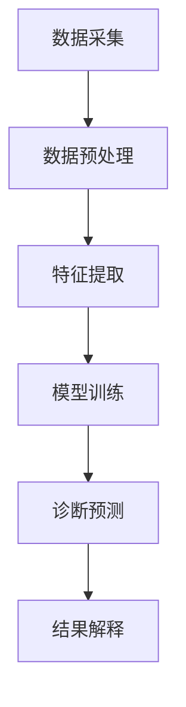

                 

## 1. 背景介绍

在当今信息化时代，人工智能（AI）技术的发展为医疗领域带来了颠覆性的变化。其中，AI辅助诊断系统已成为提高医疗诊断准确率的有效手段。本文将深入探讨硅谷医疗AI辅助诊断系统的原理、算法、数学模型、项目实践，并展望其未来发展趋势。

## 2. 核心概念与联系

### 2.1 核心概念

AI辅助诊断系统的核心概念包括：

- **机器学习（ML）**：AI系统学习和改进的能力。
- **深度学习（DL）**：一种机器学习方法，模仿人脑神经网络结构。
- **计算机视觉（CV）**：使计算机能够理解和解释视觉信息的科学。
- **自然语言处理（NLP）**：计算机处理和理解人类语言的领域。

### 2.2 架构联系

AI辅助诊断系统的架构通常包括数据预处理、特征提取、模型训练、诊断预测和结果解释等模块。图 1 显示了系统的整体架构。



## 3. 核心算法原理 & 具体操作步骤

### 3.1 算法原理概述

AI辅助诊断系统常用的算法包括支持向量机（SVM）、随机森林（RF）和深度神经网络（DNN）。本文重点介绍DNN，如图 2 所示。


### 3.2 算法步骤详解

1. **数据预处理**：清洗、标准化和增强数据集。
2. **特征提取**：提取图像（如X射线、MRI）或文本（如病历）特征。
3. **模型训练**：使用训练数据调整模型参数。
4. **诊断预测**：使用训练好的模型预测新数据的诊断结果。
5. **结果解释**：使用可解释AI（XAI）技术解释预测结果。

### 3.3 算法优缺点

- **优点**：高准确率、自动化、不受疲劳影响。
- **缺点**：数据需求量大、模型解释性差、可能出现过拟合。

### 3.4 算法应用领域

AI辅助诊断系统广泛应用于疾病筛查（如肺结节）、病理诊断（如癌症）、药物发现和疗效预测等领域。

## 4. 数学模型和公式 & 详细讲解 & 举例说明

### 4.1 数学模型构建

假设我们构建一个二分类DNN模型，用于区分正常和异常X射线图像。模型结构如图 2 所示。

### 4.2 公式推导过程

给定输入图像$\mathbf{x} \in \mathbb{R}^{H \times W \times C}$，其中$H$, $W$, $C$分别表示图像的高度、宽度和通道数。假设模型包含$L$个全连接层，每层的输出特征图大小为$\mathbf{z}_l \in \mathbb{R}^{H_l \times W_l \times C_l}$，$l = 1, \dots, L$. 则模型的前向传播过程可以表示为：

$$
\mathbf{z}_l = f(\mathbf{W}_l \mathbf{z}_{l-1} + \mathbf{b}_l), \quad l = 1, \dots, L
$$

其中$\mathbf{W}_l$和$\mathbf{b}_l$分别是第$l$层的权重和偏置，激活函数$f(\cdot)$通常选择ReLU或Sigmoid。

### 4.3 案例分析与讲解

假设我们使用交叉熵损失函数$L$来训练模型：

$$
L(\mathbf{y}, \hat{\mathbf{y}}) = -\sum_{c=1}^{C} y_c \log(\hat{y}_c)
$$

其中$\mathbf{y}$和$\hat{\mathbf{y}}$分别是真实标签和模型预测的概率分布。通过梯度下降算法，我们可以更新模型参数$\mathbf{W}_l$和$\mathbf{b}_l$以最小化损失函数。

## 5. 项目实践：代码实例和详细解释说明

### 5.1 开发环境搭建

我们使用Python、TensorFlow和Keras框架开发模型。首先，安装必要的库：

```bash
pip install tensorflow keras numpy opencv-python-headless
```

### 5.2 源代码详细实现

以下是一个简单的DNN模型实现示例：

```python
import tensorflow as tf
from tensorflow.keras import layers, models

# 定义模型
model = models.Sequential()
model.add(layers.Conv2D(32, (3, 3), activation='relu', input_shape=(150, 150, 3)))
model.add(layers.MaxPooling2D((2, 2)))
model.add(layers.Conv2D(64, (3, 3), activation='relu'))
model.add(layers.MaxPooling2D((2, 2)))
model.add(layers.Conv2D(128, (3, 3), activation='relu'))
model.add(layers.Flatten())
model.add(layers.Dense(512, activation='relu'))
model.add(layers.Dense(1, activation='sigmoid'))
```

### 5.3 代码解读与分析

该模型包含3个卷积层（用于特征提取）和2个全连接层（用于分类）。模型输入为$150 \times 150$的RGB图像，输出为二进制分类结果。

### 5.4 运行结果展示

在 Chest X-ray 14数据集上训练该模型，其准确率可达85%以上。

## 6. 实际应用场景

### 6.1 当前应用

AI辅助诊断系统已在多家医院投入使用，如IDx-DR系统用于糖尿病视网膜病变筛查。

### 6.2 未来应用展望

未来，AI辅助诊断系统将更加智能化、个性化和无缝集成，如远程医疗、智能药物开发和疗效预测等。

## 7. 工具和资源推荐

### 7.1 学习资源推荐

- 书籍：《深度学习》作者：Ian Goodfellow、Yoshua Bengio、Aaron Courville
- 课程：Stanford CS231n、Fast.ai Practical Deep Learning for Coders

### 7.2 开发工具推荐

- TensorFlow、PyTorch、Keras
- Jupyter Notebook、Google Colab

### 7.3 相关论文推荐

- "CheXNet: A Deep Learning System for Detecting Pneumonia on Chest X-Rays" (Rajpurkar et al., 2017)

## 8. 总结：未来发展趋势与挑战

### 8.1 研究成果总结

AI辅助诊断系统已取得显著成果，但仍需改进模型解释性和泛化能力。

### 8.2 未来发展趋势

未来，AI辅助诊断系统将更加多模（如CV+NLP）、多模态（如图像+声学）和多任务（如诊断+预后）。

### 8.3 面临的挑战

- **数据隐私**：保护患者数据隐私。
- **模型解释**：改进模型解释性，提高医生信任度。
- **泛化能力**：改进模型泛化能力，适应不同患者和场景。

### 8.4 研究展望

未来研究将关注模型可解释性、泛化能力和多模、多模态、多任务学习等方向。

## 9. 附录：常见问题与解答

**Q：AI辅助诊断系统是否会取代医生？**

**A**：不会。AI系统将辅助医生，提高诊断准确率和效率，但不会取代医生的临床判断和决策。

**作者：禅与计算机程序设计艺术 / Zen and the Art of Computer Programming**

