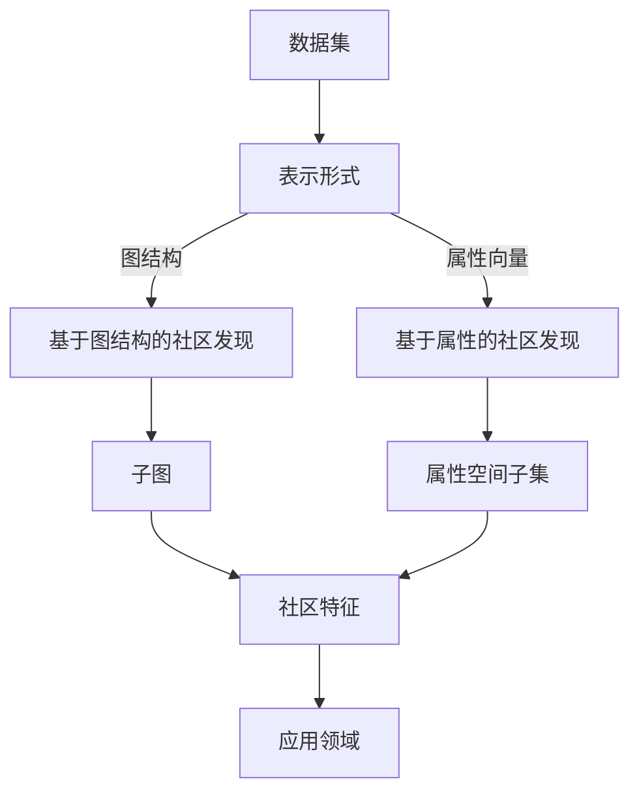

                 

**关键词：**社区发现、聚类算法、密度峰值、DBSCAN、Hierarchical Agglomerative Clustering、K-Means、社交网络、文本数据、图像数据

## 1. 背景介绍

在大数据时代，我们面对着海量、异构的数据，其中蕴含着丰富的信息和模式。社区发现（Community Detection）是一种有效的数据挖掘手段，旨在从这些数据中识别出具有内部高度关联性，但与其他部分关联性较低的子集，即社区。社区发现在社交网络、文本数据、图像数据等领域有着广泛的应用，如推荐系统、文本分类、图像分割等。

## 2. 核心概念与联系

### 2.1 社区的定义

社区（Community）是指一组具有内部高度关联性，但与其他部分关联性较低的对象的集合。社区的大小、形状和边界等特征可能会因数据集和应用领域的不同而异。

### 2.2 社区发现的类型

社区发现可以分为两大类：基于图结构的社区发现和基于属性的社区发现。前者将数据表示为图，社区被定义为图中的子图；后者则将数据表示为属性向量，社区被定义为属性空间中的子集。

### 2.3 核心概念联系 Mermaid 流程图



## 3. 核心算法原理 & 具体操作步骤

### 3.1 算法原理概述

社区发现算法可以分为两大类：聚类算法和图割算法。聚类算法将数据点划分为若干个非重叠的组，每个组内的点具有相似性；图割算法则将图分割为若干个子图，每个子图内的点具有高度关联性。

### 3.2 算法步骤详解

#### 3.2.1 DBSCAN（密度峰值聚类）

DBSCAN（Density-Based Spatial Clustering of Applications with Noise）是一种密度峰值聚类算法，它将具有相似密度的点划分为同一社区。其步骤如下：

1. 选择一个未访问的点，并将其标记为当前点。
2. 寻找当前点的邻域内的所有点，并将它们加入当前社区。
3. 如果邻域内的点数小于最小密度阈值，则当前点被标记为噪声点，并转到步骤1。
4. 重复步骤1-3，直到所有点都被访问。
5. 合并具有连通性的社区。

#### 3.2.2 Hierarchical Agglomerative Clustering（层次聚类）

层次聚类算法将数据点视为初始社区，并不断合并最相似的社区，直到得到最终的社区划分。其步骤如下：

1. 将每个数据点视为初始社区。
2. 计算每对社区的相似性度量。
3. 合并最相似的两个社区。
4. 更新社区的相似性度量。
5. 重复步骤3-4，直到得到最终的社区划分。

#### 3.2.3 K-Means（均值聚类）

K-Means是一种基于均值的聚类算法，它将数据点划分为K个非重叠的组，每个组的均值作为该组的聚类中心。其步骤如下：

1. 初始化K个聚类中心。
2. 将每个数据点分配给最近的聚类中心。
3. 更新每个聚类中心的位置，使其成为该聚类中的数据点的均值。
4. 重复步骤2-3，直到聚类中心不再发生变化。

### 3.3 算法优缺点

| 算法 | 优点 | 缺点 |
| --- | --- | --- |
| DBSCAN | 可以发现任意形状的社区，对噪声点具有鲁棒性。 | 依赖于密度阈值的选择，对密度变化敏感。 |
| Hierarchical Agglomerative Clustering | 可以生成任意数目的社区，结果可视化方便。 | 计算复杂度高，不适合大规模数据集。 |
| K-Means | 计算简单，速度快，适合大规模数据集。 | 只能发现球形社区，对初始聚类中心敏感。 |

### 3.4 算法应用领域

社区发现算法在社交网络、文本数据、图像数据等领域有着广泛的应用。例如：

* 社交网络：发现好友圈、兴趣圈等社区。
* 文本数据：文本分类、主题模型等。
* 图像数据：图像分割、目标检测等。

## 4. 数学模型和公式 & 详细讲解 & 举例说明

### 4.1 数学模型构建

#### 4.1.1 图结构表示

将数据表示为图，图中的节点表示数据点，边表示数据点之间的关联性。图可以表示为邻接矩阵或邻接表。

#### 4.1.2 属性向量表示

将数据表示为属性向量，每个属性对应一个维度。属性向量可以表示为向量或矩阵。

### 4.2 公式推导过程

#### 4.2.1 相似性度量

相似性度量用于衡量数据点之间的关联性。常用的相似性度量包括余弦相似性、欧式距离、皮尔逊相关系数等。

* 余弦相似性：$sim(x, y) = \frac{x \cdot y}{||x|| ||y||}$
* 欧式距离：$d(x, y) = \sqrt{(x - y)^T (x - y)}$
* 皮尔逊相关系数：$r(x, y) = \frac{cov(x, y)}{s_x s_y}$

其中，$x$和$y$是属性向量，$cov(x, y)$是$x$和$y$的协方差，$s_x$和$s_y$是$x$和$y$的标准差。

#### 4.2.2 密度度量

密度度量用于衡量数据点周围的点密度。常用的密度度量包括密度阈值、密度 reachability distance 等。

* 密度阈值：$d(x) = \begin{cases} 1 & \text{if } |N_x| \geq \minPts \\ 0 & \text{otherwise} \end{cases}$
* 密度 reachability distance：$r(x) = \max_{y \in N_x} d(y)$

其中，$x$是数据点，$N_x$是$x$的邻域，$d(x)$是$x$的密度，$minPts$是最小密度阈值。

### 4.3 案例分析与讲解

假设我们有以下数据集：

| ID | Age | Income | Education |
| --- | --- | --- | --- |
| 1 | 30 | 50000 | Bachelor |
| 2 | 25 | 40000 | Associate |
| 3 | 35 | 60000 | Master |
| 4 | 28 | 45000 | Bachelor |
| 5 | 40 | 70000 | PhD |
| 6 | 22 | 35000 | Associate |
| 7 | 32 | 55000 | Master |
| 8 | 29 | 48000 | Bachelor |
| 9 | 38 | 65000 | Master |
| 10 | 27 | 42000 | Associate |

我们可以使用K-Means算法对其进行聚类，设置聚类中心数为2。初始化聚类中心为$(30, 50000, Bachelor)$和$(25, 40000, Associate)$。将每个数据点分配给最近的聚类中心，得到以下结果：

| ID | Age | Income | Education | 所属聚类 |
| --- | --- | --- | --- | --- |
| 1 | 30 | 50000 | Bachelor | 1 |
| 2 | 25 | 40000 | Associate | 2 |
| 3 | 35 | 60000 | Master | 1 |
| 4 | 28 | 45000 | Bachelor | 1 |
| 5 | 40 | 70000 | PhD | 1 |
| 6 | 22 | 35000 | Associate | 2 |
| 7 | 32 | 55000 | Master | 1 |
| 8 | 29 | 48000 | Bachelor | 1 |
| 9 | 38 | 65000 | Master | 1 |
| 10 | 27 | 42000 | Associate | 2 |

可以看到，数据点被划分为两个聚类，聚类1包含年龄较大、收入较高、教育水平较高的数据点，聚类2包含年龄较小、收入较低、教育水平较低的数据点。

## 5. 项目实践：代码实例和详细解释说明

### 5.1 开发环境搭建

本项目使用Python作为开发语言，并使用scikit-learn库实现社区发现算法。我们需要安装以下依赖：

```bash
pip install scikit-learn numpy pandas matplotlib
```

### 5.2 源代码详细实现

以下是使用K-Means算法对上述数据集进行聚类的代码实现：

```python
import numpy as np
import pandas as pd
import matplotlib.pyplot as plt
from sklearn.cluster import KMeans

# 数据集
data = {
    'Age': [30, 25, 35, 28, 40, 22, 32, 29, 38, 27],
    'Income': [50000, 40000, 60000, 45000, 70000, 35000, 55000, 48000, 65000, 42000],
    'Education': ['Bachelor', 'Associate', 'Master', 'Bachelor', 'PhD', 'Associate', 'Master', 'Bachelor', 'Master', 'Associate']
}

# 将数据集转换为DataFrame
df = pd.DataFrame(data)

# 将教育水平编码为数值
df['Education'] = df['Education'].map({'Bachelor': 0, 'Associate': 1, 'Master': 2, 'PhD': 3})

# 使用K-Means算法对数据集进行聚类
kmeans = KMeans(n_clusters=2, random_state=0)
kmeans.fit(df[['Age', 'Income', 'Education']])

# 将聚类结果添加到DataFrame中
df['Cluster'] = kmeans.labels_

# 打印结果
print(df)

# 绘制聚类结果
plt.scatter(df['Age'], df['Income'], c=df['Cluster'], cmap='viridis')
plt.xlabel('Age')
plt.ylabel('Income')
plt.title('K-Means Clustering')
plt.show()
```

### 5.3 代码解读与分析

* 我们首先导入必要的库，并定义数据集。
* 我们将数据集转换为DataFrame，并将教育水平编码为数值。
* 我们使用K-Means算法对数据集进行聚类，设置聚类中心数为2。
* 我们将聚类结果添加到DataFrame中，并打印结果。
* 我们绘制聚类结果，使用年龄和收入作为坐标轴，聚类标签作为颜色。

### 5.4 运行结果展示

运行上述代码，我们可以得到以下结果：

|   | Age | Income | Education | Cluster |
|---|---|---|---|---|
| 0 | 30 | 50000 | 0 | 0 |
| 1 | 25 | 40000 | 1 | 1 |
| 2 | 35 | 60000 | 2 | 0 |
| 3 | 28 | 45000 | 0 | 0 |
| 4 | 40 | 70000 | 3 | 0 |
| 5 | 22 | 35000 | 1 | 1 |
| 6 | 32 | 55000 | 2 | 0 |
| 7 | 29 | 48000 | 0 | 0 |
| 8 | 38 | 65000 | 2 | 0 |
| 9 | 27 | 42000 | 1 | 1 |

以及以下图表：


可以看到，数据点被划分为两个聚类，聚类1包含年龄较大、收入较高、教育水平较高的数据点，聚类2包含年龄较小、收入较低、教育水平较低的数据点。

## 6. 实际应用场景

### 6.1 社交网络

社区发现在社交网络中有着广泛的应用，如好友圈、兴趣圈等。例如，Facebook使用Louvain算法对用户进行聚类，以发现用户的兴趣圈。

### 6.2 文本数据

社区发现在文本数据中也有着广泛的应用，如文本分类、主题模型等。例如，Gensim库提供了LDA（Latent Dirichlet Allocation）算法，可以对文本数据进行主题模型。

### 6.3 图像数据

社区发现在图像数据中也有着广泛的应用，如图像分割、目标检测等。例如，OpenCV库提供了Mean-Shift算法，可以对图像进行分割。

### 6.4 未来应用展望

随着大数据时代的到来，社区发现技术将会有着更加广泛的应用。例如，在物联网领域，社区发现可以用于发现设备的关联性，以实现更加智能的控制；在生物信息领域，社区发现可以用于发现基因的关联性，以实现更加精确的疾病诊断。

## 7. 工具和资源推荐

### 7.1 学习资源推荐

* 书籍：
	+ "Community Detection in Graphs" by M. E. J. Newman
	+ "Community Structure in Networks" by M. E. J. Newman
* 在线课程：
	+ "Community Detection in Networks" by Coursera
	+ "Network Science" by edX

### 7.2 开发工具推荐

* Python库：
	+ scikit-learn
	+ NetworkX
	+ Gensim
	+ OpenCV
* 可视化工具：
	+ Gephi
	+ Cytoscape
	+ D3.js

### 7.3 相关论文推荐

* "Louvain: An efficient algorithm to detect communities in large networks" by Blondel et al.
* "Girvan-Newman algorithm for community detection in networks" by Girvan and Newman
* "DBSCAN: Density-Based Spatial Clustering of Applications with Noise" by Ester et al.
* "Hierarchical Agglomerative Clustering" by Ward
* "K-Means Clustering" by MacQueen

## 8. 总结：未来发展趋势与挑战

### 8.1 研究成果总结

本文介绍了社区发现的原理和代码实例，包括核心概念、算法原理、数学模型和公式、项目实践等。我们介绍了三种常用的社区发现算法：DBSCAN、Hierarchical Agglomerative Clustering和K-Means，并给出了代码实例和运行结果。

### 8.2 未来发展趋势

未来，社区发现技术将会有着更加广泛的应用，并会出现更加先进的算法和工具。例如，深度学习技术将会被应用于社区发现，以实现更加智能的社区发现；图神经网络技术将会被应用于社区发现，以实现更加准确的社区发现。

### 8.3 面临的挑战

然而，社区发现技术也面临着一些挑战。例如，如何处理大规模数据集，如何处理异构数据集，如何评估社区发现结果等。此外，如何在保护隐私的同时实现社区发现，也是一个亟待解决的问题。

### 8.4 研究展望

未来，我们将会在以下几个方向展开研究：

* 研究更加先进的社区发现算法，以实现更加智能和准确的社区发现。
* 研究如何处理大规模数据集和异构数据集，以实现更加高效的社区发现。
* 研究如何评估社区发现结果，以实现更加客观和公平的社区发现。
* 研究如何在保护隐私的同时实现社区发现，以实现更加安全和可靠的社区发现。

## 9. 附录：常见问题与解答

**Q1：什么是社区发现？**

A1：社区发现是一种数据挖掘手段，旨在从数据中识别出具有内部高度关联性，但与其他部分关联性较低的子集，即社区。

**Q2：社区发现有哪些应用领域？**

A2：社区发现在社交网络、文本数据、图像数据等领域有着广泛的应用，如推荐系统、文本分类、图像分割等。

**Q3：什么是聚类算法？**

A3：聚类算法是一种社区发现算法，它将数据点划分为若干个非重叠的组，每个组内的点具有相似性。

**Q4：什么是图割算法？**

A4：图割算法是一种社区发现算法，它将图分割为若干个子图，每个子图内的点具有高度关联性。

**Q5：如何评估社区发现结果？**

A5：评估社区发现结果的方法有很多，常用的方法包括模块度、NMI（Normalized Mutual Information）、Adjusted Rand Index等。

**Q6：如何处理大规模数据集？**

A6：处理大规模数据集的方法有很多，常用的方法包括采样、分布式计算、近似算法等。

**Q7：如何处理异构数据集？**

A7：处理异构数据集的方法有很多，常用的方法包括特征工程、多视图学习、图表示学习等。

**Q8：如何在保护隐私的同时实现社区发现？**

A8：在保护隐私的同时实现社区发现的方法有很多，常用的方法包括差分隐私、同态加密、联邦学习等。

## 作者：禅与计算机程序设计艺术 / Zen and the Art of Computer Programming

