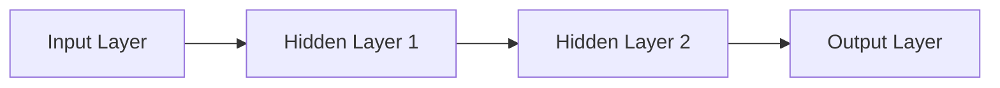

                 

**神经网络：人工智能的基石**

**作者：禅与计算机程序设计艺术 / Zen and the Art of Computer Programming**

## 1. 背景介绍

神经网络（Neural Network）是人工智能领域的核心组成部分，它模仿人类大脑的结构和功能，为计算机赋予了学习和适应能力。自从1943年Warren McCulloch和Walter Pitts首次提出神经网络概念以来，它已经发展成为人工智能领域的基石，支撑着当今各种先进的AI应用，从图像和语音识别到自动驾驶汽车。

## 2. 核心概念与联系

神经网络的核心是**神经元（Neuron）**，它们通过**连接（Edges）组成层（Layers）**，这些层又组成了整个网络。神经网络的架构可以用下面的Mermaid流程图表示：



神经网络的学习过程包括**前向传播（Forward Propagation）和反向传播（Backpropagation）**。在前向传播中，输入数据通过网络各层传递，生成输出。在反向传播中，网络根据输出和真实值计算误差，并调整权重以最小化误差。

## 3. 核心算法原理 & 具体操作步骤

### 3.1 算法原理概述

神经网络的核心算法是**反向传播算法**，它使用梯度下降法调整网络权重，以最小化损失函数。算法的目标是找到一组权重，使得网络的输出尽可能接近真实值。

### 3.2 算法步骤详解

1. **前向传播**：输入数据通过网络各层传递，生成输出。
2. **计算误差**：网络根据输出和真实值计算误差。
3. **反向传播**：误差反向传播，计算各层神经元的梯度。
4. **更新权重**：使用梯度下降法调整权重，以最小化误差。
5. **重复**：步骤1-4，直到网络收敛或达到预定的迭代次数。

### 3.3 算法优缺点

**优点**：反向传播算法是神经网络训练的标准方法，它可以处理各种类型的数据，并可以学习复杂的非线性关系。

**缺点**：反向传播算法易陷入局部最小值，收敛速度慢，对初始权重和学习率敏感。

### 3.4 算法应用领域

反向传播算法广泛应用于各种人工智能领域，包括图像和语音识别，自然语言处理，推荐系统，自动驾驶汽车等。

## 4. 数学模型和公式 & 详细讲解 & 举例说明

### 4.1 数学模型构建

神经网络的数学模型可以表示为：

$$y = f(w \cdot x + b)$$

其中，$x$是输入，$w$是权重，$b$是偏置，$f$是激活函数，$y$是输出。

### 4.2 公式推导过程

反向传播算法的数学基础是链式法则。给定一个函数$f(g(x))$，我们想计算$\frac{\partial f}{\partial x}$。根据链式法则，我们有：

$$\frac{\partial f}{\partial x} = \frac{\partial f}{\partial g} \cdot \frac{\partial g}{\partial x}$$

### 4.3 案例分析与讲解

考虑一个简单的单层神经网络，输入$x$，权重$w$，偏置$b$，激活函数为sigmoid函数$f(x) = \frac{1}{1 + e^{-x}}$。输出为：

$$y = f(w \cdot x + b) = \frac{1}{1 + e^{-(w \cdot x + b)}}$$

误差函数为均方误差：

$$E = \frac{1}{2}(y - t)^2$$

其中，$t$是真实值。我们想计算$\frac{\partial E}{\partial w}$和$\frac{\partial E}{\partial b}$。使用链式法则，我们有：

$$\frac{\partial E}{\partial w} = \frac{\partial E}{\partial y} \cdot \frac{\partial y}{\partial w} = -(y - t) \cdot y \cdot (1 - y) \cdot x$$

$$\frac{\partial E}{\partial b} = \frac{\partial E}{\partial y} \cdot \frac{\partial y}{\partial b} = -(y - t) \cdot y \cdot (1 - y)$$

## 5. 项目实践：代码实例和详细解释说明

### 5.1 开发环境搭建

我们将使用Python和TensorFlow框架来实现一个简单的神经网络。首先，安装必要的库：

```bash
pip install tensorflow
```

### 5.2 源代码详细实现

```python
import tensorflow as tf

# 定义输入、权重、偏置、激活函数
x = tf.placeholder(tf.float32, [None, 2])
w = tf.Variable(tf.zeros([2, 1]))
b = tf.Variable(tf.zeros([1]))
y = tf.nn.sigmoid(tf.matmul(x, w) + b)

# 定义误差函数
t = tf.placeholder(tf.float32, [None, 1])
E = tf.reduce_mean(tf.square(y - t))

# 定义优化器
optimizer = tf.train.GradientDescentOptimizer(0.01)
train = optimizer.minimize(E)

# 初始化变量
init = tf.global_variables_initializer()

# 训练数据
X = [[0, 0], [0, 1], [1, 0], [1, 1]]
T = [[0], [1], [1], [0]]

# 训练
with tf.Session() as sess:
    sess.run(init)
    for i in range(1000):
        sess.run(train, feed_dict={x: X, t: T})
    print("w:", sess.run(w))
    print("b:", sess.run(b))
```

### 5.3 代码解读与分析

这段代码定义了一个简单的单层神经网络，使用sigmoid激活函数，均方误差作为误差函数，梯度下降法作为优化器。它使用XOR问题作为训练数据。

### 5.4 运行结果展示

运行这段代码后，你会看到输出的权重$w$和偏置$b$。这些值是通过训练得出的，网络现在可以正确预测XOR问题的结果。

## 6. 实际应用场景

神经网络在各种实际应用场景中得到广泛应用，包括：

### 6.1 图像和语音识别

神经网络，特别是卷积神经网络（CNN），在图像和语音识别领域取得了突破性的进展。它们可以识别图像中的物体，理解语音指令，并实现实时翻译。

### 6.2 自动驾驶汽车

神经网络是自动驾驶汽车的核心技术之一。它们可以处理传感器数据，识别路况，并做出驾驶决策。

### 6.3 自然语言处理

神经网络，特别是递归神经网络（RNN）和长短期记忆网络（LSTM），在自然语言处理领域取得了重大进展。它们可以理解文本，生成人类可读的文本，并实现机器翻译。

### 6.4 未来应用展望

未来，神经网络将继续推动人工智能的发展。它们将应用于更多领域，包括医疗保健，金融，能源等。此外，新的神经网络架构和训练方法的开发将推动人工智能的进一步发展。

## 7. 工具和资源推荐

### 7.1 学习资源推荐

- **书籍**："Deep Learning" by Ian Goodfellow, Yoshua Bengio, and Aaron Courville
- **在线课程**：Coursera的"Deep Learning Specialization" by Andrew Ng
- **博客**：Distill.pub（<https://distill.pub/>）

### 7.2 开发工具推荐

- **TensorFlow** (<https://www.tensorflow.org/>)
- **PyTorch** (<https://pytorch.org/>)
- **Keras** (<https://keras.io/>)

### 7.3 相关论文推荐

- "A Neural Network for Recognizing Handwritten Digits" by Yann LeCun et al.
- "ImageNet Classification with Deep Convolutional Neural Networks" by Karen Simonyan and Andrew Zisserman
- "Attention Is All You Need" by Vaswani et al.

## 8. 总结：未来发展趋势与挑战

### 8.1 研究成果总结

神经网络已经取得了巨大的成功，它们在各种人工智能领域都取得了突破性的进展。

### 8.2 未来发展趋势

未来，神经网络的发展将朝着更深、更宽、更快的方向进行。这包括更深的网络，更宽的网络，以及更快的训练方法。

### 8.3 面临的挑战

神经网络面临的挑战包括计算资源的限制，数据的稀缺和噪声，以及模型的解释性。

### 8.4 研究展望

未来的研究将集中在新的神经网络架构，更有效的训练方法，以及模型的解释性上。

## 9. 附录：常见问题与解答

**Q：神经网络是如何学习的？**

**A**：神经网络通过调整权重和偏置来学习。它使用训练数据计算误差，然后使用反向传播算法调整权重和偏置，以最小化误差。

**Q：神经网络是如何泛化的？**

**A**：神经网络通过学习训练数据的模式来泛化。它可以从训练数据中提取特征，并使用这些特征预测新数据。

**Q：神经网络是如何避免过拟合的？**

**A**：神经网络可以通过各种方法避免过拟合，包括正则化， dropout，数据增强等。

**Q：神经网络是如何处理大数据的？**

**A**：神经网络可以使用各种技术处理大数据，包括分布式训练，数据并行，模型并行等。

**Q：神经网络是如何解释的？**

**A**：神经网络的解释是一个挑战。最近的研究提出了各种方法，包括LIME，SHAP等，但这仍然是一个活跃的研究领域。

**END**

