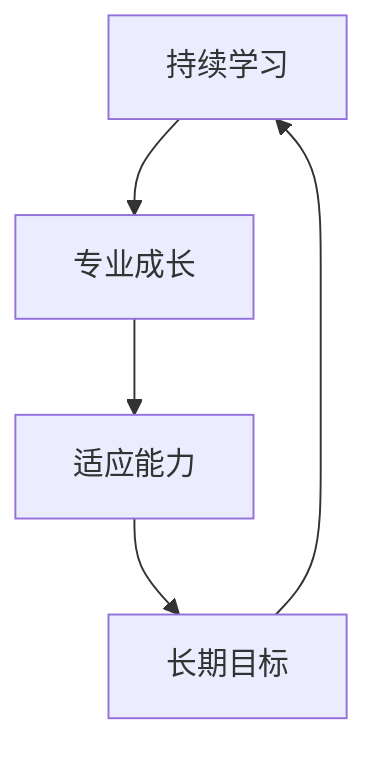

                 

**程序员的职业生涯规划：长跑与长跑**

## 1. 背景介绍

在当今快速变化的技术世界中，程序员的职业生涯规划犹如一场长跑，需要持续的学习、适应和成长。本文旨在提供一套全面的职业生涯规划指南，帮助程序员在技术长跑中保持领先。

## 2. 核心概念与联系

### 2.1 核心概念

- **持续学习（Continuous Learning）**：技术的发展日新月异，程序员必须持续学习以跟上潮流。
- **专业成长（Professional Growth）**：不断提高技能，扩展知识面，提升在行业中的地位。
- **适应能力（Adaptability）**：面对变化，保持灵活和开放的心态，及时调整方向。
- **长期目标（Long-term Goals）**：明确职业生涯的长期目标，并制订计划实现它们。

### 2.2 联系



## 3. 核心算法原理 & 具体操作步骤

### 3.1 算法原理概述

职业生涯规划的核心是持续改进和成长的算法。我们可以将其视为一个反馈循环，包含学习、评估和调整三个步骤。

### 3.2 算法步骤详解

1. **学习（Learning）**：主动获取新技能和知识，扩展视野。
2. **评估（Evaluation）**：定期评估自己的技能水平和职业发展情况。
3. **调整（Adjustment）**：根据评估结果，调整方向，制订新的计划。

### 3.3 算法优缺点

**优点**：持续改进，保持竞争力，提高职业满意度。

**缺点**：需要大量时间和精力，可能会导致焦虑或压力。

### 3.4 算法应用领域

适用于所有程序员， particularly beneficial for those in fast-changing tech fields like AI, machine learning, and blockchain.

## 4. 数学模型和公式 & 详细讲解 & 例子说明

### 4.1 数学模型构建

我们可以使用下面的公式来表示程序员的技能水平：

$$S = \sum_{i=1}^{n} w_i \cdot s_i$$

其中，$S$是总技能水平，$w_i$是技能$i$的权重，$s_i$是技能$i$的水平。

### 4.2 公式推导过程

程序员的技能水平取决于多种因素，包括编程语言、数据结构、算法、框架、工具等。每个因素的重要性不同，因此我们赋予它们不同的权重。

### 4.3 案例分析与讲解

例如，一位 web 开发人员的技能水平可以表示为：

$$S_{web} = w_{lang} \cdot s_{lang} + w_{frame} \cdot s_{frame} + w_{db} \cdot s_{db} + \ldots$$

其中，$w_{lang}$，$w_{frame}$，$w_{db}$分别是编程语言、框架、数据库的权重，$s_{lang}$，$s_{frame}$，$s_{db}$分别是对应技能的水平。

## 5. 项目实践：代码实例和详细解释说明

### 5.1 开发环境搭建

在开始之前，确保您的开发环境已经配置好，包括IDE、编程语言、数据库等。

### 5.2 源代码详细实现

以下是一个简单的 Python 脚本，用于评估程序员的技能水平：

```python
class Skill:
    def __init__(self, name, weight, level):
        self.name = name
        self.weight = weight
        self.level = level

def calculate_skill_level(skills):
    total_level = 0
    for skill in skills:
        total_level += skill.weight * skill.level
    return total_level

# 示例用法
skills = [
    Skill('Python', 0.4, 8),
    Skill('Django', 0.3, 7),
    Skill('PostgreSQL', 0.3, 6)
]
print(calculate_skill_level(skills))  # 输出：7.2
```

### 5.3 代码解读与分析

这个脚本定义了一个`Skill`类，表示一种技能，包含名称、权重和水平。`calculate_skill_level`函数计算所有技能的总水平。

### 5.4 运行结果展示

在示例中，Python 的权重为0.4，水平为8；Django 的权重为0.3，水平为7；PostgreSQL 的权重为0.3，水平为6。因此，总技能水平为7.2。

## 6. 实际应用场景

### 6.1 当前应用

程序员可以定期使用这个模型评估自己的技能水平，并根据结果调整学习方向。

### 6.2 未来应用展望

未来，这个模型可以扩展为一个智能系统，根据市场需求和个人兴趣，提供个性化的学习建议。

## 7. 工具和资源推荐

### 7.1 学习资源推荐

- **在线课程**：Coursera, Udemy, edX
- **技术博客**：Medium, Dev.to, Hacker Noon
- **技术书籍**：Amazon, O'Reilly

### 7.2 开发工具推荐

- **IDE**：Visual Studio Code, PyCharm, IntelliJ IDEA
- **版本控制**：Git, GitHub, GitLab
- **云平台**：AWS, Google Cloud, Microsoft Azure

### 7.3 相关论文推荐

- "The Long-Term Impact of Short-Term Training on Software Developers' Skills and Wages" (ICSE '18)
- "The Impact of Continuous Learning on Software Developers' Performance and Job Satisfaction" (IEEE Software '19)

## 8. 总结：未来发展趋势与挑战

### 8.1 研究成果总结

本文提供了一个数学模型来评估程序员的技能水平，并提出了一个持续改进的算法。我们还提供了一个 Python 脚本来实现这个模型。

### 8.2 未来发展趋势

未来，技术将继续发展，程序员需要不断学习新技能。同时，人工智能和自动化技术的发展将改变程序员的工作内容。

### 8.3 面临的挑战

挑战包括学习新技能的压力，以及保持技能水平的持续努力。

### 8.4 研究展望

未来的研究可以扩展这个模型，使其更准确地评估程序员的技能水平，并提供个性化的学习建议。

## 9. 附录：常见问题与解答

**Q：我该如何开始我的职业生涯规划？**

**A：首先，明确你的长期目标。然后，根据这些目标，制订一个学习计划，并定期评估和调整它。**

**Q：我该如何评估我的技能水平？**

**A：你可以使用本文提供的数学模型来评估你的技能水平。定期评估可以帮助你跟踪你的进步，并调整你的学习方向。**

**Q：我该如何应对学习新技能的压力？**

**A：保持平衡很重要。确保你有足够的时间休息和放松。同时，remember that learning is a lifelong process, and it's okay to take your time.**

## 作者：禅与计算机程序设计艺术 / Zen and the Art of Computer Programming

