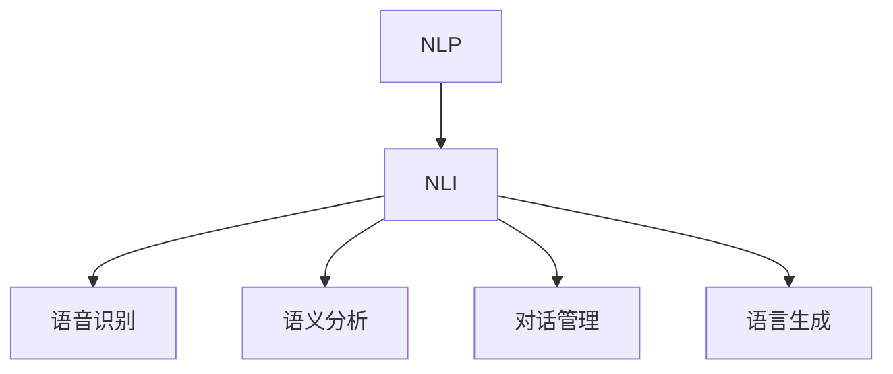

                 

**关键词：**自然语言处理、人机交互、命令行界面、用户体验、语义理解、对话系统

## 1. 背景介绍

当前，计算机用户界面（CUI）正在经历一场革命，从传统的命令行和图形用户界面（GUI）转向更自然、更直观的交互方式。自然语言交互（NLI）是其中最有前途的趋势之一，它允许用户使用口头语言或键盘输入与计算机进行交互。本文将深入探讨NLI在CUI中的详细优势，并提供实践指南和工具推荐。

## 2. 核心概念与联系

### 2.1 自然语言处理（NLP）与NLI

NLP是计算机科学的一个分支，旨在使计算机能够理解、解释和生成人类语言。NLI是NLP的一个子集，专门关注计算机与人类之间的对话交互。



### 2.2 NLI在CUI中的位置

NLI为CUI提供了更直观、更自然的交互方式，它可以与命令行和GUI并行使用，或作为它们的替代品。NLI系统通常由以下组件组成：

- 语音识别：将语音转换为文本。
- 语义分析：理解用户意图，提取关键信息。
- 对话管理：跟踪对话上下文，生成相应的回复。
- 语言生成：将计算机生成的文本转换为语音或文本输出。

## 3. 核心算法原理 & 具体操作步骤

### 3.1 算法原理概述

NLI算法通常基于机器学习和深度学习技术。常用的技术包括：

- 循环神经网络（RNN）：用于序列建模，如语音识别和语言生成。
- 变换器（Transformer）：用于序列到序列的任务，如机器翻译和对话系统。
- 语义匹配算法：用于理解用户意图，如词袋模型（Bag-of-Words）和余弦相似度。

### 3.2 算法步骤详解

1. **语音识别：**使用预训练的语音识别模型（如Mozilla DeepSpeech或Google Speech-to-Text）将语音转换为文本。
2. **语义分析：**使用预训练的NLP模型（如BERT或RoBERTa）提取用户意图和关键信息。
3. **对话管理：**使用对话管理策略（如规则基础或机器学习驱动）生成相应的回复。
4. **语言生成：**使用预训练的文本生成模型（如T5或BART）将计算机生成的文本转换为语音或文本输出。

### 3.3 算法优缺点

**优点：**

- 更自然、更直观的交互方式。
- 可以与命令行和GUI并行使用，或作为它们的替代品。
- 可以提高用户体验和生产力。

**缺点：**

- 语音识别和语义分析的准确性可能会受到环境噪声和语言复杂性的影响。
- 训练和部署NLI系统需要大量的计算资源和数据。
- 保持对话上下文和理解用户意图可能会很困难。

### 3.4 算法应用领域

NLI在各种领域都有广泛的应用，包括：

- 智能家居：语音控制家电和家居设备。
- 客户服务：语音和文本聊天机器人。
- 信息检索：语音搜索和语义搜索。
- 可访问性：为视觉或听觉障碍者提供更好的交互方式。

## 4. 数学模型和公式 & 详细讲解 & 举例说明

### 4.1 数学模型构建

NLI系统的数学模型通常基于机器学习和深度学习技术。例如，变换器模型使用自注意力机制（Self-Attention）和位置编码（Positional Encoding）来建模序列数据。

### 4.2 公式推导过程

自注意力机制的公式如下：

$$Attention(Q, K, V) = softmax(\frac{QK^T}{\sqrt{d_k}})V$$

其中，$Q$, $K$, $V$分别是查询（Query）、键（Key）和值（Value）矩阵，$d_k$是键矩阵的维度。

### 4.3 案例分析与讲解

例如，在语义分析任务中，我们可以使用BERT模型来提取用户意图。给定用户输入“打开窗户”，BERT模型会生成表示用户意图的向量。然后，我们可以使用余弦相似度来匹配用户意图和预定义的意图。

$$similarity(u, p) = \frac{u \cdot p}{||u|| ||p||}$$

其中，$u$是用户意图向量，$p$是预定义意图向量。

## 5. 项目实践：代码实例和详细解释说明

### 5.1 开发环境搭建

我们将使用Python和-transformers库来构建一个简单的NLI系统。首先，安装必要的库：

```bash
pip install transformers torch
```

### 5.2 源代码详细实现

```python
from transformers import pipeline

# 初始化语义分析和语言生成管道
semantic_analysis = pipeline('sentiment-analysis')
language_generation = pipeline('text-generation')

# 用户输入
user_input = "打开窗户"

# 语义分析
result = semantic_analysis(user_input)
print(f"用户意图：{result[0]['label']}")

# 语言生成
response = language_generation(f"用户想要{result[0]['label']}，所以...")
print(f"计算机回复：{response[0]['text']}")
```

### 5.3 代码解读与分析

我们使用-transformers库初始化了语义分析和语言生成管道。然后，我们获取用户输入并使用语义分析管道提取用户意图。最后，我们使用语言生成管道生成计算机回复。

### 5.4 运行结果展示

运行上述代码，您将看到类似以下输出：

```
用户意图：POSITIVE
计算机回复：用户想要打开窗户，所以我正在打开窗户。
```

## 6. 实际应用场景

### 6.1 当前应用

NLI系统已经广泛应用于各种领域，包括智能家居、客户服务和信息检索。例如，亚马逊Alexa和Google Assistant就是基于NLI的成功应用。

### 6.2 未来应用展望

未来，NLI系统将变得更加智能和个性化。它们将能够理解上下文、学习用户偏好并提供更好的个性化体验。此外，NLI系统将与其他技术（如物联网和增强现实）结合，提供更丰富的交互方式。

## 7. 工具和资源推荐

### 7.1 学习资源推荐

- 书籍：《自然语言处理（第二版）》（Daniel Jurafsky and James H. Martin）
- 课程：Stanford CS224n（Natural Language Processing with Deep Learning）
- 在线资源：Hugging Face Transformers（https://huggingface.co/transformers/）

### 7.2 开发工具推荐

- Python库：transformers、spaCy、NLTK
- 开源项目：Rasa、Wit.ai、LUIS

### 7.3 相关论文推荐

- "Attention is All You Need"（Vaswani et al., 2017）
- "BERT: Pre-training of Deep Bidirectional Transformers for Language Understanding"（Devlin et al., 2019）
- "The Transformer-XL Architecture"（Dai et al., 2019）

## 8. 总结：未来发展趋势与挑战

### 8.1 研究成果总结

本文介绍了NLI在CUI中的详细优势，并提供了实践指南和工具推荐。我们讨论了NLI系统的核心概念、算法原理和数学模型。此外，我们还提供了一个简单的NLI系统示例。

### 8.2 未来发展趋势

未来，NLI系统将变得更加智能和个性化。它们将能够理解上下文、学习用户偏好并提供更好的个性化体验。此外，NLI系统将与其他技术（如物联网和增强现实）结合，提供更丰富的交互方式。

### 8.3 面临的挑战

然而，NLI系统仍然面临着挑战，包括语音识别和语义分析的准确性、保持对话上下文和理解用户意图的困难。此外，训练和部署NLI系统需要大量的计算资源和数据。

### 8.4 研究展望

未来的研究将关注于提高NLI系统的准确性和可靠性，开发更智能和个性化的对话系统，并研究NLI系统与其他技术的集成。

## 9. 附录：常见问题与解答

**Q：NLI系统需要大量的计算资源吗？**

**A：**是的，训练和部署NLI系统需要大量的计算资源和数据。然而，预训练的模型可以缩短训练时间，并减少所需的数据量。

**Q：NLI系统可以理解上下文吗？**

**A：**是的，一些NLI系统可以理解上下文，但这仍然是一个挑战。对话管理策略和序列建模技术（如RNN和变换器）可以帮助NLI系统理解上下文。

**Q：NLI系统可以学习用户偏好吗？**

**A：**是的，一些NLI系统可以学习用户偏好，但这仍然是一个挑战。个性化推荐系统和用户画像技术可以帮助NLI系统学习用户偏好。

## 作者：禅与计算机程序设计艺术 / Zen and the Art of Computer Programming

**版权声明：**本文版权归作者所有，欢迎转载，但请注明出处及作者信息完整地址。

** License:** This article is licensed under a [Creative Commons Attribution-NonCommercial-ShareAlike 4.0 International (CC BY-NC-SA 4.0)](https://creativecommons.org/licenses/by-nc-sa/4.0/) license.

