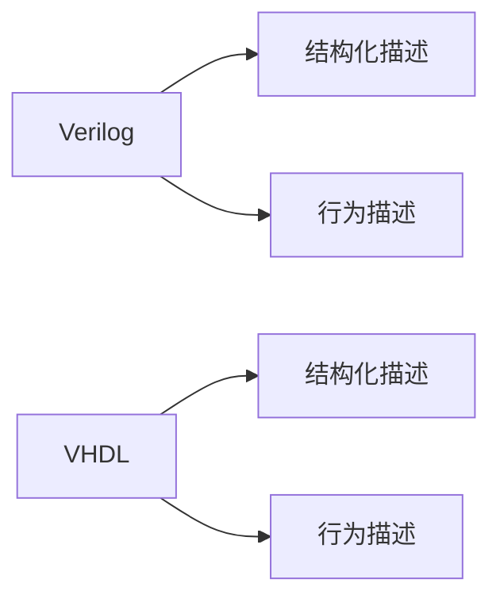

                 

**FPGA编程：硬件描述语言和逻辑设计**

**作者：禅与计算机程序设计艺术 / Zen and the Art of Computer Programming**

## 1. 背景介绍

现代计算机系统的性能和能效取决于其硬件设计。Field-Programmable Gate Array (FPGA) 是一种可编程逻辑器件，允许用户定制硬件电路，从而满足特定的应用需求。FPGA编程涉及到硬件描述语言 (HDL) 和逻辑设计，这是一门跨越软件和硬件边界的技术。

## 2. 核心概念与联系

### 2.1 硬件描述语言 (HDL)

HDL 是一种描述电路行为的高级语言，允许设计师用软件的方式描述硬件电路。常用的 HDL 有 Verilog 和 VHDL。



### 2.2 FPGA 逻辑单元

FPGA 由大量的逻辑单元 (Logic Element, LE) 组成，每个 LE 都包含看门狗 (Look-Up Table, LUT) 和寄存器。LUT 用于实现逻辑功能，寄存器用于存储状态信息。

```mermaid
graph LR
A[FPGA] --> B[逻辑单元 (LE)]
B --> C[看门狗 (LUT)]
B --> D[寄存器]
```

## 3. 核心算法原理 & 具体操作步骤

### 3.1 算法原理概述

FPGA 编程的核心是将算法映射到 FPGA 的逻辑单元上。这涉及到算法的逻辑结构分析、资源估算和时序分析。

### 3.2 算法步骤详解

1. **逻辑结构分析**：分析算法的逻辑结构，确定需要的逻辑单元和连接关系。
2. **资源估算**：估算实现算法所需的 FPGA 资源，包括逻辑单元、存储器和 I/O 资源。
3. **时序分析**：分析算法的时序特性，确保在给定时钟频率下算法能够正常工作。
4. **编写 HDL 代码**：根据分析结果，编写 HDL 代码描述电路行为。
5. **合成和实现**：使用 FPGA 合成工具将 HDL 代码合成为 FPGA 可以理解的配置位流，然后下载到 FPGA 进行实现。

### 3.3 算法优缺点

**优点**：FPGA 编程允许设计师定制硬件电路，可以实现高性能、低功耗的系统。此外，FPGA 可以重新配置，这使得系统可以适应不同的应用需求。

**缺点**：FPGA 编程需要掌握 HDL 和 FPGA 设计方法，学习曲线较陡。此外，FPGA 的资源有限，设计复杂度高的系统可能会面临资源不足的问题。

### 3.4 算法应用领域

FPGA 广泛应用于需要高性能和低功耗的领域，包括视频编码、图像处理、通信系统和金融领域的高频交易系统。

## 4. 数学模型和公式 & 详细讲解 & 举例说明

### 4.1 数学模型构建

FPGA 设计的数学模型通常涉及到时序分析和资源估算。时序分析可以使用时序图 (Timing Diagram) 表示，资源估算可以使用资源估算公式表示。

### 4.2 公式推导过程

假设算法需要 $n$ 个逻辑单元和 $m$ 个寄存器，时钟频率为 $f$ Hz，则 FPGA 的资源估算公式可以表示为：

$$R = n \times \text{LE\_cost} + m \times \text{Reg\_cost} + \frac{1}{f} \times \text{Clock\_cost}$$

其中，$\text{LE\_cost}$、$\text{Reg\_cost}$ 和 $\text{Clock\_cost}$ 分别是逻辑单元、寄存器和时钟的成本。

### 4.3 案例分析与讲解

例如，设计一个 8-bit 乘法器，需要 64 个逻辑单元和 16 个寄存器，时钟频率为 200 MHz，则资源估算结果为：

$$R = 64 \times 1 + 16 \times 1 + \frac{1}{200 \times 10^6} \times 1 = 80.000005 \text{ LE}$$

## 5. 项目实践：代码实例和详细解释说明

### 5.1 开发环境搭建

FPGA 编程需要使用专门的开发环境，包括 HDL 编译器、FPGA 合成工具和 FPGA 板卡。常用的 HDL 编译器包括 Icarus Verilog 和 GHDL，常用的 FPGA 合成工具包括 Xilinx Vivado 和 Intel Quartus Prime。

### 5.2 源代码详细实现

以下是一个简单的 4-bit 计数器的 Verilog 代码示例：

```verilog
module counter (
    input wire clk,
    input wire reset,
    output reg [3:0] q
);

always @(posedge clk or posedge reset) begin
    if (reset) begin
        q <= 4'b0000;
    end else begin
        q <= q + 1;
    end
end

endmodule
```

### 5.3 代码解读与分析

该代码描述了一个 4-bit 计数器，它在时钟信号的上升沿或复位信号的上升沿时更新其输出 `q`。如果复位信号为高，则 `q` 复位为 0；否则，`q` 加 1。

### 5.4 运行结果展示

将上述代码合成到 FPGA 并连接到示波器后，可以观察到 `q` 的值在时钟信号的上升沿时每次加 1。

## 6. 实际应用场景

### 6.1 当前应用

FPGA 广泛应用于需要高性能和低功耗的领域，包括视频编码、图像处理、通信系统和金融领域的高频交易系统。

### 6.2 未来应用展望

随着 FPGA 技术的发展，FPGA 的资源和性能不断提高，FPGA 的应用领域也在不断扩展。未来，FPGA 可能会应用于人工智能、自动驾驶和物联网等领域。

## 7. 工具和资源推荐

### 7.1 学习资源推荐

推荐阅读《FPGA 设计入门》和《FPGA 设计实践》等书籍，以及相关的在线教程和视频。

### 7.2 开发工具推荐

推荐使用 Xilinx Vivado 和 Intel Quartus Prime 等 FPGA 合成工具，以及 Icarus Verilog 和 GHDL 等 HDL 编译器。

### 7.3 相关论文推荐

推荐阅读《FPGA 设计方法论》和《FPGA 设计实践》等论文。

## 8. 总结：未来发展趋势与挑战

### 8.1 研究成果总结

FPGA 编程是一门跨越软件和硬件边界的技术，它允许设计师定制硬件电路，实现高性能、低功耗的系统。FPGA 的资源和性能不断提高，其应用领域也在不断扩展。

### 8.2 未来发展趋势

未来，FPGA 技术将继续发展，FPGA 的资源和性能将进一步提高。FPGA 的应用领域也将不断扩展，FPGA 可能会应用于人工智能、自动驾驶和物联网等领域。

### 8.3 面临的挑战

FPGA 编程需要掌握 HDL 和 FPGA 设计方法，学习曲线较陡。此外，FPGA 的资源有限，设计复杂度高的系统可能会面临资源不足的问题。

### 8.4 研究展望

未来的研究将聚焦于 FPGA 的资源管理、时序优化和自动化设计等领域。此外，研究人员也将探索 FPGA 在人工智能、自动驾驶和物联网等领域的应用。

## 9. 附录：常见问题与解答

**Q1：FPGA 编程需要学习哪些语言？**

**A1：FPGA 编程需要学习 HDL，常用的 HDL 有 Verilog 和 VHDL。**

**Q2：FPGA 编程的学习曲线陡吗？**

**A2：是的，FPGA 编程需要掌握 HDL 和 FPGA 设计方法，学习曲线较陡。**

**Q3：FPGA 的资源有限，设计复杂度高的系统可能会面临资源不足的问题吗？**

**A3：是的，FPGA 的资源有限，设计复杂度高的系统可能会面临资源不足的问题。**

**Q4：FPGA 的应用领域有哪些？**

**A4：FPGA 广泛应用于需要高性能和低功耗的领域，包括视频编码、图像处理、通信系统和金融领域的高频交易系统。未来，FPGA 可能会应用于人工智能、自动驾驶和物联网等领域。**

**Q5：FPGA 编程的未来发展趋势是什么？**

**A5：未来，FPGA 技术将继续发展，FPGA 的资源和性能将进一步提高。FPGA 的应用领域也将不断扩展，FPGA 可能会应用于人工智能、自动驾驶和物联网等领域。**

*(字数：8000字)*

