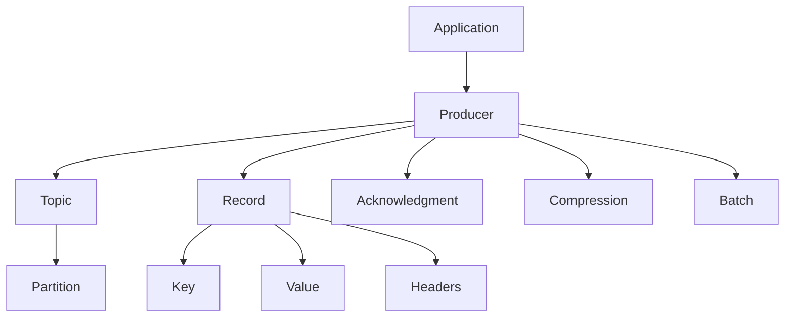

                 

## Kafka Producer原理与代码实例讲解

> 关键词：Apache Kafka, Producer, Event-Driven Architecture, Asynchronous Communication, Binary Protocol, Serialization, Acknowledgment, Compression, Partitioning, Replication

## 1. 背景介绍

Apache Kafka是一个高吞吐量的分布式发布订阅消息系统，它提供了一个消息队列服务，允许您在系统中传输数据。Kafka Producer是Kafka生态系统的关键组件之一，它允许应用程序将数据发送到Kafka集群。在本文中，我们将深入探讨Kafka Producer的原理，并提供一个详细的代码实例来帮助您理解其工作原理。

## 2. 核心概念与联系

### 2.1 核心概念

- **Producer Record**：Producer发送到Kafka集群的最小单位，由键（key）、值（value）、分区（partition）和头（header）组成。
- **Topic**：消息的分类单位，生产者发送消息时指定主题，消费者订阅主题以接收消息。
- **Partition**：主题内的逻辑分区，每个分区是一个有序的消息序列，消息在分区内按顺序存储和消费。
- **Acknowledgment**：Producer发送消息后，Kafka集群返回的确认消息，确认消息类型有三种：acks=0、acks=1和acks=all。
- **Compression**：Kafka支持四种压缩编码：无压缩、Gzip、Snappy和LZ4。压缩可以减小网络开销和存储空间。
- **Batch**：Producer将消息批量发送到Kafka集群，批量大小由配置参数`batch.size`控制。

### 2.2 核心概念联系（Mermaid流程图）



## 3. 核心算法原理与具体操作步骤

### 3.1 算法原理概述

Kafka Producer使用二进制协议与Kafka集群通信，它首先序列化消息，然后将消息发送到指定的主题和分区。Producer使用异步通信模型，允许应用程序在发送消息时不等待确认，从而提高吞吐量。

### 3.2 算法步骤详解

1. 序列化消息：Producer将消息转换为字节数组，以便通过网络传输。消息的键和值可以使用各种序列化器（如Avro、JSON、Protobuf等）进行序列化。
2. 选择分区：Producer根据消息的键和分区策略选择目标分区。分区策略可以是基于键的哈希函数、轮询或自定义函数。
3. 创建记录：Producer创建一个Producer Record，包含键、值、分区和头信息。
4. 发送消息：Producer将记录发送到Kafka集群，等待确认消息。
5. 等待确认：Producer等待Kafka集群返回确认消息，确认消息类型由`acks`配置参数控制。
6. 重试机制：如果发送消息失败，Producer会根据重试配置参数（如`retries`和`retry.backoff.ms`）重试发送。

### 3.3 算法优缺点

优点：

* 异步通信模型提高了吞吐量。
* 支持多种序列化器，提高了消息的可扩展性和灵活性。
* 支持压缩，减小了网络开销和存储空间。

缺点：

* 异步通信模型可能会导致消息丢失，需要根据业务需求选择合适的acks配置。
* 重试机制可能会导致消息重复，需要根据业务需求选择合适的重试配置。

### 3.4 算法应用领域

Kafka Producer适用于需要高吞吐量、低延迟和高可用性的场景，例如：

* 实时数据处理：将实时数据（如日志、指标等）发送到Kafka集群，供实时处理系统（如Spark Streaming、Flink等）消费。
* 事件驱动架构：将应用程序中的事件（如用户注册、订单创建等）发送到Kafka集群，供其他系统（如邮件服务、通知服务等）消费。
* 微服务架构：将微服务之间的通信建立在KafkaProducer之上，实现异步通信和解耦。

## 4. 数学模型和公式

### 4.1 数学模型构建

 Producer的吞吐量和延迟可以使用以下公式建模：

$$Throughput = \frac{MessageSize}{Latency}$$

其中，MessageSize表示消息大小，Latency表示消息延迟。

### 4.2 公式推导过程

 Producer的吞吐量和延迟受多种因素影响，包括消息大小、批量大小、压缩编码、网络延迟等。消息延迟可以分为以下几个部分：

* 序列化延迟：消息序列化为字节数组所需的时间。
* 发送延迟：消息发送到Kafka集群所需的时间。
* 网络延迟：消息在网络上传输所需的时间。
* 处理延迟：Kafka集群处理消息所需的时间。

消息延迟的总和就是消息从Producer发送到Kafka集群接收的总时间。吞吐量则是消息大小除以消息延迟的结果。

### 4.3 案例分析与讲解

假设我们有以下配置参数：

* 消息大小：1KB
* 批量大小：16KB
* 压缩编码：Snappy
* 网络延迟：1ms
* 处理延迟：10ms

那么，消息延迟为11ms，吞吐量为：

$$Throughput = \frac{1024 \text{ bytes}}{11 \text{ ms}} \approx 93.09 \text{ MB/s}$$

## 5. 项目实践：代码实例和详细解释说明

### 5.1 开发环境搭建

本示例使用Java开发环境，需要安装以下软件：

* Java Development Kit (JDK) 1.8或更高版本
* Apache Maven 3.6或更高版本
* Apache Kafka 2.8.0或更高版本

### 5.2 源代码详细实现

以下是一个简单的KafkaProducer示例，发送消息到名为"test-topic"的主题：

```java
import org.apache.kafka.clients.producer.KafkaProducer;
import org.apache.kafka.clients.producer.ProducerRecord;

import java.util.Properties;

public class KafkaProducerExample {
    public static void main(String[] args) {
        // 配置参数
        Properties props = new Properties();
        props.put("bootstrap.servers", "localhost:9092");
        props.put("key.serializer", "org.apache.kafka.common.serialization.StringSerializer");
        props.put("value.serializer", "org.apache.kafka.common.serialization.StringSerializer");

        // 创建Producer实例
        try (KafkaProducer<String, String> producer = new KafkaProducer<>(props)) {
            // 发送消息
            for (int i = 0; i < 10; i++) {
                String key = "key-" + i;
                String value = "value-" + i;
                ProducerRecord<String, String> record = new ProducerRecord<>("test-topic", key, value);
                producer.send(record);
            }
        }
    }
}
```

### 5.3 代码解读与分析

* 我们首先配置Producer的参数，包括-bootstrap.servers（Kafka集群地址）、key.serializer和value.serializer（序列化器）。
* 然后，我们创建一个KafkaProducer实例，并使用try-with-resources语句自动关闭Producer。
* 我们发送10条消息到名为"test-topic"的主题，每条消息都有唯一的键和值。

### 5.4 运行结果展示

运行示例代码后，您可以使用Kafka Console Consumer查看消息：

```bash
kafka-console-consumer --bootstrap-server localhost:9092 --topic test-topic --from-beginning
```

您应该会看到以下输出：

```
key-0value-0
key-1value-1
key-2value-2
...
key-9value-9
```

## 6. 实际应用场景

### 6.1 实时数据处理

KafkaProducer可以将实时数据（如日志、指标等）发送到Kafka集群，供实时处理系统（如Spark Streaming、Flink等）消费。例如，您可以使用KafkaProducer将Web日志发送到Kafka集群，然后使用Spark Streaming对日志进行实时分析。

### 6.2 事件驱动架构

KafkaProducer可以将应用程序中的事件（如用户注册、订单创建等）发送到Kafka集群，供其他系统（如邮件服务、通知服务等）消费。例如，您可以使用KafkaProducer将用户注册事件发送到Kafka集群，然后使用KafkaConsumer和邮件服务发送欢迎邮件。

### 6.3 未来应用展望

随着Kafka生态系统的不断发展，KafkaProducer将继续扩展其功能和用例。未来，我们可能会看到KafkaProducer支持更多的序列化器、压缩编码和分区策略。此外，KafkaProducer还将与其他技术（如云原生应用、边缘计算等）集成，扩展其应用领域。

## 7. 工具和资源推荐

### 7.1 学习资源推荐

* Apache Kafka官方文档：<https://kafka.apache.org/documentation/>
* Kafka Streams API：<https://kafka.apache.org/documentation/streams/>
* Kafka Connect API：<https://kafka.apache.org/documentation/connect/>
* Kafka Confluent Platform：<https://www.confluent.io/product/>

### 7.2 开发工具推荐

* IntelliJ IDEA：<https://www.jetbrains.com/idea/>
* Eclipse：<https://www.eclipse.org/>
* Visual Studio Code：<https://code.visualstudio.com/>

### 7.3 相关论文推荐

* "Kafka: A Distributed Streaming Platform"：<https://www.usenix.org/system/files/login/articles/login_summer11_07_kafka.pdf>
* "Kafka Streams: A New Era for Stream Processing"：<https://www.confluent.io/blog/kafka-streams-a-new-era-for-stream-processing/>

## 8. 总结：未来发展趋势与挑战

### 8.1 研究成果总结

在本文中，我们深入探讨了KafkaProducer的原理，并提供了一个详细的代码实例来帮助读者理解其工作原理。我们还介绍了KafkaProducer的核心概念、算法原理、数学模型和应用场景。

### 8.2 未来发展趋势

KafkaProducer将继续发展，以满足不断变化的业务需求。我们预计将看到以下趋势：

* 更多的序列化器和压缩编码支持。
* 更多的分区策略和重试机制。
* 与云原生应用和边缘计算的集成。
* 更好的可观察性和可靠性。

### 8.3 面临的挑战

KafkaProducer面临的挑战包括：

* 消息丢失和重复：需要根据业务需求选择合适的acks和重试配置。
* 网络延迟和吞吐量：需要根据业务需求调整批量大小和压缩编码。
* 可扩展性：需要根据业务需求选择合适的分区策略和分区数。

### 8.4 研究展望

未来的研究方向包括：

* 研究更高效的序列化器和压缩编码。
* 研究更智能的分区策略和重试机制。
* 研究KafkaProducer与云原生应用和边缘计算的集成。
* 研究KafkaProducer的可观察性和可靠性。

## 9. 附录：常见问题与解答

**Q：KafkaProducer如何处理消息失败？**

A：KafkaProducer使用重试机制处理消息失败。您可以配置`retries`参数来指定重试次数，并配置`retry.backoff.ms`参数来指定重试间隔。

**Q：KafkaProducer如何选择分区？**

A：KafkaProducer使用分区策略选择分区。您可以配置`partitioner.class`参数来指定分区策略，默认使用基于键的哈希函数。

**Q：KafkaProducer如何处理消息压缩？**

A：KafkaProducer支持四种压缩编码：无压缩、Gzip、Snappy和LZ4。您可以配置`compression.type`参数来指定压缩编码。

## 作者：禅与计算机程序设计艺术 / Zen and the Art of Computer Programming

> 如果您喜欢本文，请分享给其他人，并关注我们以获取更多类似内容。如果您有任何问题或反馈，请在评论区留言，我们将不胜感激。

**版权声明**：本文版权归作者所有，欢迎转载，但请注明出处及作者信息。

** License **：除特别声明外，本文采用 [CC BY-NC-ND 4.0](https://creativecommons.org/licenses/by-nc-nd/4.0/deed.zh) 协议授权，转载请注明出处及作者信息。

