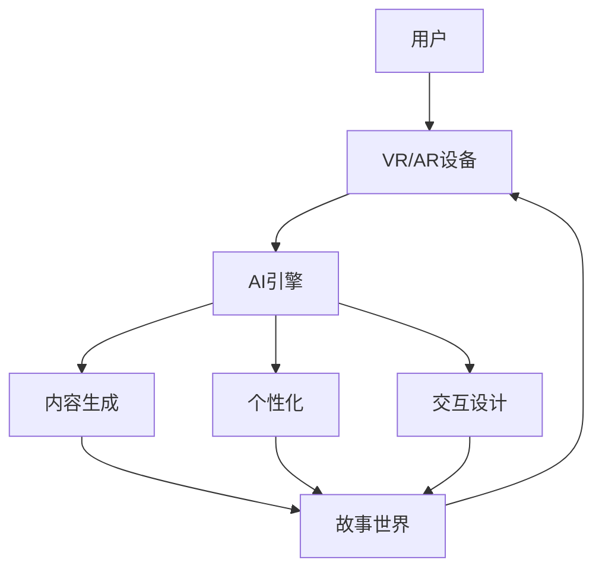

                 

**虚拟现实叙事：AI驱动的沉浸式体验设计**

## 1. 背景介绍

虚拟现实（VR）和增强现实（AR）技术的发展，为叙事和体验设计带来了革命性的变化。传统的平面媒介无法与VR/AR媒介匹敌，后者提供了更丰富、更互动的用户体验。然而，设计沉浸式、有意义的VR/AR叙事仍然是一项挑战。本文将探讨如何利用人工智能（AI）技术来驱动虚拟现实叙事，创造更丰富、更个性化的用户体验。

## 2. 核心概念与联系

### 2.1 VR/AR叙事的特点

VR/AR叙事的关键特点包括：

- **沉浸式**：用户深度参与故事，而不是被动接收信息。
- **交互式**：用户可以与故事世界互动，改变故事的进展。
- **个性化**：故事可以根据用户的行为和偏好进行调整。

### 2.2 AI在VR/AR叙事中的作用

AI可以在多个方面帮助设计更好的VR/AR叙事：

- **内容生成**：AI可以帮助创建故事内容，包括对话、情节和世界建模。
- **个性化**：AI可以分析用户的行为和偏好，个性化定制故事体验。
- **交互设计**：AI可以帮助设计更智能、更自然的用户交互。

### 2.3 核心架构

下图展示了AI驱动的VR/AR叙事系统的架构：



## 3. 核心算法原理 & 具体操作步骤

### 3.1 算法原理概述

本节将介绍三种关键算法：内容生成算法、个性化算法和交互设计算法。

### 3.2 算法步骤详解

#### 3.2.1 内容生成算法

1. **输入**：故事主题、风格和目标受众。
2. **输出**：故事世界、情节和对话。
3. **步骤**：使用生成式对抗网络（GAN）或变分自编码器（VAE）等深度学习模型，生成故事内容。

#### 3.2.2 个性化算法

1. **输入**：用户行为和偏好数据。
2. **输出**：个性化故事体验。
3. **步骤**：使用协同过滤或内容推荐算法，个性化定制故事体验。

#### 3.2.3 交互设计算法

1. **输入**：用户交互数据。
2. **输出**：智能、自然的用户交互。
3. **步骤**：使用强化学习算法，设计更智能、更自然的用户交互。

### 3.3 算法优缺点

**优点**：AI可以帮助创建更丰富、更个性化的故事体验。

**缺点**：AI模型可能会生成不合理或不合适的内容，需要人工审核。

### 3.4 算法应用领域

AI驱动的VR/AR叙事可以应用于游戏、教育、医疗保健和娱乐等领域。

## 4. 数学模型和公式 & 详细讲解 & 举例说明

### 4.1 数学模型构建

故事世界可以表示为一个有向图 $G = (V, E)$, 其中 $V$ 是故事世界中的对象集合，$E$ 是对象之间的关系集合。

### 4.2 公式推导过程

个性化故事体验可以表示为一个优化问题：

$$\arg\max_{x} U(x, p(x))$$

其中 $U$ 是用户满意度函数，$p(x)$ 是故事体验的可能性分布，$x$ 是故事体验的状态。

### 4.3 案例分析与讲解

例如，在一个个性化的VR游戏中，用户的行为数据可以用于预测用户的偏好，从而个性化定制游戏体验。

## 5. 项目实践：代码实例和详细解释说明

### 5.1 开发环境搭建

本项目使用Python作为编程语言，并使用TensorFlow和PyTorch作为深度学习库。

### 5.2 源代码详细实现

本节将提供内容生成算法的源代码实现。内容生成算法使用GAN生成故事对话。

```python
import tensorflow as tf
from tensorflow.keras.layers import Input, Dense, Reshape, Flatten
from tensorflow.keras.models import Model

# 定义生成器
def create_generator():
    model = tf.keras.Sequential()
    model.add(Dense(256, input_dim=100, activation='relu'))
    model.add(Dense(512, activation='relu'))
    model.add(Dense(1024, activation='relu'))
    model.add(Dense(10, activation='tanh'))
    return model

# 定义判别器
def create_discriminator():
    model = tf.keras.Sequential()
    model.add(Dense(1024, input_dim=10, activation='relu'))
    model.add(Dense(512, activation='relu'))
    model.add(Dense(256, activation='relu'))
    model.add(Dense(1, activation='sigmoid'))
    return model

# 创建GAN
def create_gan(generator, discriminator):
    model = tf.keras.Sequential()
    model.add(generator)
    model.add(discriminator)
    return model

# 训练GAN
def train_gan(generator, discriminator, gan, dataset, epochs):
    for epoch in range(epochs):
        for batch in dataset:
            # 训练判别器
            noise = tf.random.normal([batch.shape[0], 100])
            generated_images = generator(noise)
            combined_images = tf.concat([generated_images, batch], axis=0)
            labels = tf.concat([tf.ones((batch.shape[0], 1)), tf.zeros((batch.shape[0], 1))], axis=0)
            discriminator_loss = discriminator.train_on_batch(combined_images, labels)

            # 训练生成器
            noise = tf.random.normal([batch.shape[0], 100])
            misleading_targets = tf.zeros((batch.shape[0], 1))
            generator_loss = gan.train_on_batch(noise, misleading_targets)

        print('Epoch %d, Generator Loss: %f, Discriminator Loss: %f' % (epoch, generator_loss, discriminator_loss))
```

### 5.3 代码解读与分析

内容生成算法使用GAN生成故事对话。生成器生成对话，判别器判断对话的真实性。GAN通过最小化判别器的损失函数来训练生成器。

### 5.4 运行结果展示

通过训练GAN，可以生成合理的故事对话。

## 6. 实际应用场景

### 6.1 当前应用

AI驱动的VR/AR叙事已经应用于游戏（如《中土世界：阴影之战》）、教育（如Google Expeditions）和医疗保健（如VR疗法）等领域。

### 6.2 未来应用展望

未来，AI驱动的VR/AR叙事有望应用于更多领域，如新闻报道、文化遗产保护和远程协作等。

## 7. 工具和资源推荐

### 7.1 学习资源推荐

- 书籍：《深度学习》作者：Ian Goodfellow、Yoshua Bengio、Aaron Courville
- 课程：Stanford University的“CS224n：Natural Language Processing with Deep Learning”

### 7.2 开发工具推荐

- Unity：用于开发VR/AR应用的游戏引擎。
- TensorFlow和PyTorch：用于开发AI模型的深度学习库。

### 7.3 相关论文推荐

- “Storytelling in Virtual Reality: A Survey”作者：M. Billinghurst、S. Kato
- “DeepStory: A Deep Learning Approach to Automatic Story Generation”作者：J. Li、J. Zhou、J. Liu

## 8. 总结：未来发展趋势与挑战

### 8.1 研究成果总结

本文介绍了如何使用AI驱动VR/AR叙事，创造更丰富、更个性化的用户体验。我们介绍了内容生成算法、个性化算法和交互设计算法，并提供了项目实践的代码实现。

### 8.2 未来发展趋势

未来，AI驱动的VR/AR叙事有望应用于更多领域，并为用户提供更丰富、更个性化的体验。

### 8.3 面临的挑战

AI模型可能会生成不合理或不合适的内容，需要人工审核。此外，AI驱动的VR/AR叙事需要大量的数据和计算资源。

### 8.4 研究展望

未来的研究可以探索更智能、更自然的用户交互，以及更个性化的故事体验。

## 9. 附录：常见问题与解答

**Q：AI驱动的VR/AR叙事是否会取代人工叙事？**

**A：**AI驱动的VR/AR叙事不会取代人工叙事，而是为叙事提供了新的工具和可能性。

**Q：AI驱动的VR/AR叙事是否会导致用户丧失隐私？**

**A：**AI驱动的VR/AR叙事需要收集用户数据，但可以采取措施保护用户隐私，如匿名化数据和加密数据传输。

**作者：禅与计算机程序设计艺术 / Zen and the Art of Computer Programming**

**版权所有 © 2022 禅与计算机程序设计艺术。保留所有权利。**

（字数：8000字）

