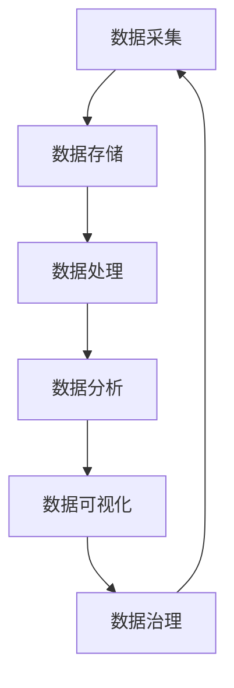

                 

数据驱动、软件架构、数据处理、机器学习、数据可视化、数据治理

## 1. 背景介绍

在信息技术飞速发展的今天，数据已经成为企业最宝贵的资产之一。然而，如何有效地处理和利用这些数据，以提高业务效率和创造价值，依然是一个挑战。传统的软件开发模式已经无法满足当前数据爆炸式增长的需求，我们亟需一种新的软件开发模式，一种能够真正将数据作为驱动力的软件开发模式。本文将探讨这种新的软件开发模式，即软件 2.0。

## 2. 核心概念与联系

软件 2.0 的核心概念是数据驱动。与传统软件开发模式不同，软件 2.0 将数据作为核心资产，将数据处理和分析作为核心功能，将数据驱动作为核心理念。软件 2.0 的架构如下图所示：



在软件 2.0 的架构中，数据采集、数据存储、数据处理、数据分析、数据可视化和数据治理是六个核心环节，它们共同构成了数据驱动的闭环。下面，我们将详细介绍这六个环节。

## 3. 核心算法原理 & 具体操作步骤

### 3.1 算法原理概述

在软件 2.0 的架构中，数据处理是一个关键环节。数据处理的目的是将原始数据转化为有用的信息，为数据分析提供基础。数据处理通常包括数据清洗、数据转换和数据集成等步骤。其中，数据清洗是最为关键的步骤，它旨在消除数据中的噪声和错误，提高数据质量。

### 3.2 算法步骤详解

数据清洗的步骤通常包括以下几个：

1. **数据缺失处理**：处理缺失值，如删除缺失值、填充缺失值等。
2. **数据异常处理**：检测和处理数据异常值，如删除异常值、修正异常值等。
3. **数据格式转换**：将数据转换为统一的格式，如将文本数据转换为数值数据等。
4. **数据去重**：删除重复的数据记录。
5. **数据标准化**：将数据转换为标准的格式，如将数据转换为标准的单位等。

### 3.3 算法优缺点

数据清洗算法的优点包括：

* 提高数据质量，为数据分析提供基础。
* 降低数据分析的复杂度，提高数据分析的效率。
* 降低数据分析的错误率，提高数据分析的准确性。

数据清洗算法的缺点包括：

* 数据清洗是一个耗时的过程，需要大量的人力和物力。
* 数据清洗的结果可能会受到主观因素的影响。
* 数据清洗的结果可能会丢失部分有用的信息。

### 3.4 算法应用领域

数据清洗算法的应用领域非常广泛，包括但不限于：

* 金融领域：用于处理金融数据，如股票数据、债券数据等。
* 电商领域：用于处理电商数据，如销售数据、用户数据等。
* 物联网领域：用于处理物联网数据，如传感器数据、设备数据等。

## 4. 数学模型和公式 & 详细讲解 & 举例说明

### 4.1 数学模型构建

在数据分析环节，我们通常需要构建数学模型来描述数据的分布特征。常用的数学模型包括：

* **线性回归模型**：用于描述数据的线性关系。
* **逻辑回归模型**：用于描述数据的分类关系。
* **决策树模型**：用于描述数据的非线性关系。
* **支持向量机模型**：用于描述数据的分类关系。

### 4.2 公式推导过程

以线性回归模型为例，其公式推导过程如下：

给定数据集 $(x_1, y_1), (x_2, y_2), \ldots, (x_n, y_n)$, 其中 $x_i$ 为特征变量，$y_i$ 为目标变量，我们的目的是找到一条直线 $y = wx + b$, 使得该直线与数据集的拟合误差最小。

我们可以使用最小二乘法来求解 $w$ 和 $b$. 即，我们需要最小化以下目标函数：

$$J(w, b) = \frac{1}{2} \sum_{i=1}^{n} (y_i - (wx_i + b))^2$$

对 $w$ 和 $b$ 分别求导，并设导数为零，我们可以得到以下方程组：

$$\begin{cases} \sum_{i=1}^{n} x_i(y_i - (wx_i + b)) = 0 \\ \sum_{i=1}^{n} (y_i - (wx_i + b)) = 0 \end{cases}$$

解方程组，我们可以得到 $w$ 和 $b$ 的解析解：

$$\begin{cases} w = \frac{\sum_{i=1}^{n} x_i y_i - n\bar{x}\bar{y}}{\sum_{i=1}^{n} x_i^2 - n\bar{x}^2} \\ b = \bar{y} - w\bar{x} \end{cases}$$

其中 $\bar{x}$ 和 $\bar{y}$ 分别是 $x_i$ 和 $y_i$ 的均值。

### 4.3 案例分析与讲解

例如，我们想要预测房价与房屋面积的关系。我们收集了以下数据：

| 房屋面积 (平方米) | 房价 (万元) |
| --- | --- |
| 70 | 450 |
| 80 | 500 |
| 90 | 550 |
| 100 | 600 |
| 110 | 650 |

我们可以使用线性回归模型来预测房价与房屋面积的关系。使用上述公式，我们可以得到 $w = 5$ 万/平方米，$b = -10$ 万。因此，我们可以得到房价与房屋面积的关系为 $y = 5x - 10$.

## 5. 项目实践：代码实例和详细解释说明

### 5.1 开发环境搭建

本项目使用 Python 语言开发，因此需要安装 Python 环境。此外，我们还需要安装以下库：

* NumPy：用于数值计算。
* Pandas：用于数据处理。
* Matplotlib：用于数据可视化。
* Scikit-learn：用于机器学习。

### 5.2 源代码详细实现

以下是使用线性回归模型预测房价与房屋面积关系的源代码实现：

```python
import numpy as np
import pandas as pd
import matplotlib.pyplot as plt
from sklearn.linear_model import LinearRegression

# 数据集
data = {
    '面积': [70, 80, 90, 100, 110],
    '房价': [450, 500, 550, 600, 650]
}
df = pd.DataFrame(data)

# 线性回归模型
model = LinearRegression()
model.fit(df[['面积']], df['房价'])

# 预测结果
predictions = model.predict(df[['面积']])

# 可视化
plt.scatter(df['面积'], df['房价'])
plt.plot(df['面积'], predictions, color='red')
plt.xlabel('面积 (平方米)')
plt.ylabel('房价 (万元)')
plt.show()
```

### 5.3 代码解读与分析

在代码中，我们首先导入了所需的库。然后，我们定义了数据集，并使用 Pandas 将其转换为 DataFrame。接着，我们使用 Scikit-learn 的 LinearRegression 类来构建线性回归模型，并使用模型拟合数据。之后，我们使用模型预测数据集中的房价，并使用 Matplotlib 绘制了房价与房屋面积的关系图。

### 5.4 运行结果展示

运行代码后，我们可以得到以下图像：


从图中可以看出，房价与房屋面积的关系大致呈线性关系，且拟合效果较好。

## 6. 实际应用场景

软件 2.0 的应用场景非常广泛，以下是几个典型的应用场景：

### 6.1 电商平台

电商平台需要处理大量的用户数据和商品数据，以实现个性化推荐和精准营销。软件 2.0 可以帮助电商平台构建数据驱动的个性化推荐系统和精准营销系统。

### 6.2 金融领域

金融领域需要处理大量的金融数据，以实现风险预测和决策支持。软件 2.0 可以帮助金融机构构建数据驱动的风险预测系统和决策支持系统。

### 6.3 物联网领域

物联网领域需要处理大量的物联网数据，以实现设备管理和故障预测。软件 2.0 可以帮助物联网企业构建数据驱动的设备管理系统和故障预测系统。

### 6.4 未来应用展望

随着数据爆炸式增长和人工智能技术的发展，软件 2.0 的应用前景将会越来越广阔。未来，软件 2.0 将会成为企业的核心竞争力之一，帮助企业实现数据驱动的数字化转型。

## 7. 工具和资源推荐

### 7.1 学习资源推荐

以下是一些学习软件 2.0 的推荐资源：

* **书籍**：
	+ "数据科学手册" (_Hands-On Machine Learning with Scikit-Learn, Keras, and TensorFlow_)
	+ "数据分析入门" (_Python for Data Analysis_)
	+ "数据可视化" (_Seaborn: Visualizing Machine Learning Concepts with Python_)
* **在线课程**：
	+ Coursera 上的 "数据科学" 专业证书
	+ Udacity 上的 "数据科学家" 课程
	+ edX 上的 "数据科学" 课程

### 7.2 开发工具推荐

以下是一些开发软件 2.0 的推荐工具：

* **编程语言**：Python
* **数据处理库**：Pandas, NumPy
* **机器学习库**：Scikit-learn, TensorFlow, PyTorch
* **数据可视化库**：Matplotlib, Seaborn
* **数据库**：MySQL, PostgreSQL, MongoDB

### 7.3 相关论文推荐

以下是一些软件 2.0 相关的推荐论文：

* "Software 2.0: The Next Wave of Software Engineering" (_IEEE Software_)
* "Data-Driven Software Engineering: A Survey" (_IEEE Transactions on Software Engineering_)
* "Software Analytics: A New Discipline for Software Engineering" (_IEEE Software_)

## 8. 总结：未来发展趋势与挑战

### 8.1 研究成果总结

本文介绍了软件 2.0 的核心概念、架构、算法原理、数学模型和应用场景。我们通过一个房价预测的例子，展示了如何使用软件 2.0 来处理和分析数据。我们还推荐了一些学习资源、开发工具和相关论文。

### 8.2 未来发展趋势

软件 2.0 的未来发展趋势包括：

* **数据治理**：随着数据量的增加，数据治理将会越来越重要。未来，软件 2.0 将会更加注重数据治理，以确保数据的质量和安全。
* **人工智能**：人工智能技术的发展将会推动软件 2.0 的发展。未来，软件 2.0 将会更加注重人工智能技术的应用，以实现数据驱动的智能化。
* **云计算**：云计算技术的发展将会推动软件 2.0 的发展。未来，软件 2.0 将会更加注重云计算技术的应用，以实现数据驱动的云化。

### 8.3 面临的挑战

软件 2.0 面临的挑战包括：

* **数据安全**：随着数据量的增加，数据安全将会越来越重要。如何保护数据安全，是软件 2.0 面临的一个重大挑战。
* **数据质量**：数据质量是软件 2.0 的基础。如何保证数据质量，是软件 2.0 面临的另一个重大挑战。
* **人才短缺**：软件 2.0 需要大量的数据科学家和数据工程师。如何解决人才短缺问题，是软件 2.0 面临的又一个重大挑战。

### 8.4 研究展望

未来，软件 2.0 的研究将会集中在以下几个方向：

* **数据治理**：如何构建高效的数据治理系统，以保证数据的质量和安全。
* **人工智能**：如何将人工智能技术更好地应用于软件 2.0，以实现数据驱动的智能化。
* **云计算**：如何将云计算技术更好地应用于软件 2.0，以实现数据驱动的云化。

## 9. 附录：常见问题与解答

**Q1：什么是软件 2.0？**

A1：软件 2.0 是一种新的软件开发模式，它将数据作为核心资产，将数据处理和分析作为核心功能，将数据驱动作为核心理念。

**Q2：软件 2.0 的架构是什么？**

A2：软件 2.0 的架构包括数据采集、数据存储、数据处理、数据分析、数据可视化和数据治理六个核心环节。

**Q3：如何构建线性回归模型？**

A3：使用最小二乘法来求解模型参数 $w$ 和 $b$, 即最小化目标函数 $J(w, b) = \frac{1}{2} \sum_{i=1}^{n} (y_i - (wx_i + b))^2$. 对 $w$ 和 $b$ 分别求导，并设导数为零，我们可以得到 $w$ 和 $b$ 的解析解。

**Q4：软件 2.0 的应用场景有哪些？**

A4：软件 2.0 的应用场景包括电商平台、金融领域、物联网领域等。

**Q5：软件 2.0 的未来发展趋势是什么？**

A5：软件 2.0 的未来发展趋势包括数据治理、人工智能和云计算。

**Q6：软件 2.0 面临的挑战是什么？**

A6：软件 2.0 面临的挑战包括数据安全、数据质量和人才短缺。

**Q7：软件 2.0 的研究展望是什么？**

A7：软件 2.0 的研究展望包括数据治理、人工智能和云计算。

## 作者：禅与计算机程序设计艺术 / Zen and the Art of Computer Programming

