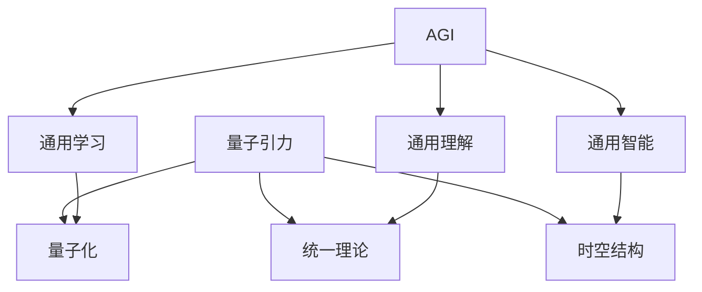

                 

**AGI与量子引力的跨学科研究**

**作者：禅与计算机程序设计艺术 / Zen and the Art of Computer Programming**

## 1. 背景介绍

人工智能（Artificial Intelligence，AI）的发展正在经历着前所未有的飞跃，从强人工智能（Artificial General Intelligence，AGI）到量子计算，这些领域的进展正在改变我们对未来的看法。然而，量子引力（Quantum Gravity）这个神秘的领域，却鲜少有人将其与AI联系起来。本文旨在探索AGI与量子引力之间的联系，并展示跨学科研究的可能性。

## 2. 核心概念与联系

### 2.1 AGI与量子引力的联系

AGI被定义为能够理解、学习任何智能任务的通用人工智能。量子引力则是寻求统一量子力学和广义相对论的理论。这两个领域看似风马牛不相及，但它们都涉及对复杂系统的理解和建模。AGI需要理解和模拟人类智能的各个方面，而量子引力则需要理解和建模宇宙中最基本的物理过程。

### 2.2 核心概念原理与架构

#### 2.2.1 AGI的核心概念

- **通用学习**：AGI需要能够学习任何智能任务，这包括认知、推理、规划等。
- **通用理解**：AGI需要理解任务的本质，而不是简单地模仿人类的行为。
- **通用智能**：AGI需要具备人类一样的智能水平，能够理解、学习和应用各种知识。

#### 2.2.2 量子引力的核心概念

- **量子化**：量子引力需要将引力理论量子化，即将其描述为量子系统。
- **统一理论**：量子引力需要统一量子力学和广义相对论，描述宇宙中最基本的物理过程。
- **时空结构**：量子引力需要描述时空的结构，包括时空的弯曲和量子化。

#### 2.2.3 AGI与量子引力的架构

AGI与量子引力的架构可以用下面的Mermaid流程图表示：



## 3. 核心算法原理 & 具体操作步骤

### 3.1 算法原理概述

AGI与量子引力的核心算法原理是建立在数学模型和物理模型基础上的。AGI需要使用机器学习算法来理解和学习任务，而量子引力需要使用量子计算算法来描述宇宙的基本过程。

### 3.2 算法步骤详解

#### 3.2.1 AGI算法步骤

1. **数据收集**：收集与任务相关的数据。
2. **特征提取**：从数据中提取特征。
3. **模型训练**：使用机器学习算法训练模型。
4. **模型评估**：评估模型的性能。
5. **任务理解**：使用模型理解任务的本质。
6. **任务执行**：执行任务。

#### 3.2.2 量子引力算法步骤

1. **物理模型建立**：建立描述宇宙基本过程的物理模型。
2. **量子化**：将物理模型量子化。
3. **算法选择**：选择适合的量子计算算法。
4. **算法实现**：实现量子计算算法。
5. **结果分析**：分析算法的结果。
6. **理论验证**：验证理论的正确性。

### 3.3 算法优缺点

#### 3.3.1 AGI算法优缺点

**优点**：能够学习和理解任务，具有通用智能。

**缺点**：需要大量的数据和计算资源，并且可能会出现过拟合等问题。

#### 3.3.2 量子引力算法优缺点

**优点**：能够描述宇宙的基本过程，具有统一性。

**缺点**：量子计算技术还处于初级阶段，并且量子引力理论还没有得到广泛认可。

### 3.4 算法应用领域

#### 3.4.1 AGI应用领域

AGI的应用领域非常广泛，包括自然语言处理、计算机视觉、自动驾驶、医疗诊断等。

#### 3.4.2 量子引力应用领域

量子引力的应用领域主要集中在基础物理研究上，包括黑洞物理、早期宇宙、量子信息等。

## 4. 数学模型和公式 & 详细讲解 & 举例说明

### 4.1 数学模型构建

#### 4.1.1 AGI数学模型

AGI的数学模型通常是基于机器学习算法的。例如，深度学习模型可以表示为：

$$y = f(x; \theta)$$

其中，$y$是输出，$x$是输入，$\theta$是模型的参数，而$f$是一个非线性函数。

#### 4.1.2 量子引力数学模型

量子引力的数学模型通常是基于量子场论的。例如，爱因斯坦-希尔伯特作用量可以表示为：

$$S = \int d^4x \sqrt{-g} \left( \frac{R}{2\kappa^2} - \mathcal{L}_m \right)$$

其中，$g$是度规张量，$R$是曲率标量，$\kappa$是引力常数，$\mathcal{L}_m$是物质 Lagrange 量。

### 4.2 公式推导过程

#### 4.2.1 AGI公式推导过程

机器学习算法的公式推导过程通常是基于数学优化的。例如，梯度下降算法的公式推导过程如下：

1. 定义目标函数：$J(\theta) = \frac{1}{m} \sum_{i=1}^{m} L(f(x^{(i)}; \theta), y^{(i)})$
2. 计算梯度：$\nabla J(\theta) = \frac{2}{m} \sum_{i=1}^{m} \nabla f(x^{(i)}; \theta) (f(x^{(i)}; \theta) - y^{(i)})$
3. 更新参数：$\theta := \theta - \eta \nabla J(\theta)$

其中，$L$是损失函数，$\eta$是学习率。

#### 4.2.2 量子引力公式推导过程

量子引力的公式推导过程通常是基于量子场论的。例如，爱因斯坦-希尔伯特作用量的公式推导过程如下：

1. 定义度规张量：$g_{\mu\nu} = \eta_{\mu\nu} e^{a_{\mu}} e^{a_{\nu}}$
2. 计算曲率标量：$R = g^{\mu\nu} R_{\mu\nu}$
3. 计算作用量：$S = \int d^4x \sqrt{-g} \left( \frac{R}{2\kappa^2} - \mathcal{L}_m \right)$

其中，$\eta_{\mu\nu}$是 Minkowski度规，$a_{\mu}$是vierbein，$R_{\mu\nu}$是里奇曲率张量。

### 4.3 案例分析与讲解

#### 4.3.1 AGI案例分析

例如，在自然语言处理任务中，AGI需要理解文本的含义，并生成相应的输出。数学模型可以表示为：

$$y = f(x; \theta)$$

其中，$x$是输入文本，$y$是输出文本，$\theta$是模型的参数。通过训练模型，AGI可以学习到文本的含义，并生成相应的输出。

#### 4.3.2 量子引力案例分析

例如，在描述黑洞物理时，量子引力需要描述黑洞的时空结构。数学模型可以表示为：

$$S = \int d^4x \sqrt{-g} \left( \frac{R}{2\kappa^2} - \mathcal{L}_m \right)$$

其中，$g$是度规张量，$R$是曲率标量，$\mathcal{L}_m$是物质 Lagrange 量。通过量子化这个模型，量子引力可以描述黑洞的量子化时空结构。

## 5. 项目实践：代码实例和详细解释说明

### 5.1 开发环境搭建

#### 5.1.1 AGI开发环境搭建

AGI的开发环境通常需要安装Python、TensorFlow或PyTorch等深度学习框架，以及相关的库和工具。

```bash
# 安装Python
sudo apt-get install python3

# 安装TensorFlow
pip3 install tensorflow

# 安装PyTorch
pip3 install torch torchvision
```

#### 5.1.2 量子引力开发环境搭建

量子引力的开发环境通常需要安装量子计算软件包，如Qiskit或Cirq。

```bash
# 安装Qiskit
pip3 install qiskit

# 安装Cirq
pip3 install cirq
```

### 5.2 源代码详细实现

#### 5.2.1 AGI源代码实现

例如，下面是一个简单的神经网络实现，用于分类任务：

```python
import tensorflow as tf

# 定义模型
model = tf.keras.models.Sequential([
    tf.keras.layers.Dense(64, activation='relu', input_shape=(784,)),
    tf.keras.layers.Dense(64, activation='relu'),
    tf.keras.layers.Dense(10, activation='softmax')
])

# 编译模型
model.compile(optimizer='adam',
              loss='sparse_categorical_crossentropy',
              metrics=['accuracy'])

# 训练模型
model.fit(x_train, y_train, epochs=5)
```

#### 5.2.2 量子引力源代码实现

例如，下面是一个简单的量子电路实现，用于模拟量子比特的量子门操作：

```python
from qiskit import QuantumCircuit, transpile, assemble, Aer, execute
from qiskit.visualization import plot_bloch_multivector, plot_histogram

# 创建量子电路
qc = QuantumCircuit(1)

# 添加量子门操作
qc.h(0)

# 执行量子电路
simulator = Aer.get_backend('statevector_simulator')
job = execute(qc, simulator)
result = job.result()

# 获取量子态
statevector = result.get_statevector()

# 绘制量子态
plot_bloch_multivector(statevector)
```

### 5.3 代码解读与分析

#### 5.3.1 AGI代码解读与分析

在上面的代码中，我们定义了一个简单的神经网络模型，使用ReLU激活函数和softmax输出函数。我们使用Adam优化器和交叉熵损失函数来编译模型。然后，我们使用训练数据来训练模型。

#### 5.3.2 量子引力代码解读与分析

在上面的代码中，我们创建了一个简单的量子电路，并添加了一个Hadamard门操作。然后，我们使用量子状态模拟器来执行量子电路，并获取量子态。最后，我们绘制量子态。

### 5.4 运行结果展示

#### 5.4.1 AGI运行结果展示

在训练模型后，我们可以使用测试数据来评估模型的性能。例如：

```python
# 评估模型
test_loss, test_acc = model.evaluate(x_test, y_test, verbose=2)

print('\nTest accuracy:', test_acc)
```

#### 5.4.2 量子引力运行结果展示

在执行量子电路后，我们可以绘制量子态，并分析量子比特的状态。例如：

```python
# 绘制量子态
plot_bloch_multivector(statevector)
```

## 6. 实际应用场景

### 6.1 AGI实际应用场景

AGI的实际应用场景非常广泛，包括自然语言处理、计算机视觉、自动驾驶、医疗诊断等。例如，AGI可以用于自动生成新闻标题，或用于帮助医生诊断疾病。

### 6.2 量子引力实际应用场景

量子引力的实际应用场景主要集中在基础物理研究上，包括黑洞物理、早期宇宙、量子信息等。例如，量子引力可以用于研究黑洞的量子化时空结构，或用于研究早期宇宙的膨胀。

### 6.3 未来应用展望

AGI和量子引力都是前沿的研究领域，它们的未来应用展望非常广阔。例如，AGI可以用于开发新的药物，或用于设计新的材料。量子引力则可以用于理解宇宙的起源和演化，或用于开发新的量子计算技术。

## 7. 工具和资源推荐

### 7.1 学习资源推荐

#### 7.1.1 AGI学习资源推荐

- **书籍**："Artificial Intelligence: A Modern Approach" by Stuart Russell and Peter Norvig
- **在线课程**：Stanford University's "CS221: Artificial Intelligence: Principles and Techniques" on Coursera

#### 7.1.2 量子引力学习资源推荐

- **书籍**："Quantum Gravity" by Lee Smolin
- **在线课程**：University of Edinburgh's "Quantum Gravity" on Coursera

### 7.2 开发工具推荐

#### 7.2.1 AGI开发工具推荐

- **深度学习框架**：TensorFlow, PyTorch
- **开发环境**：Jupyter Notebook, Google Colab

#### 7.2.2 量子引力开发工具推荐

- **量子计算软件包**：Qiskit, Cirq
- **开发环境**：Jupyter Notebook

### 7.3 相关论文推荐

#### 7.3.1 AGI相关论文推荐

- "Attention Is All You Need" by Vaswani et al.
- "Generative Adversarial Networks" by Goodfellow et al.

#### 7.3.2 量子引力相关论文推荐

- "Loop Quantum Gravity" by Rovelli
- "String Theory" by Zwiebach

## 8. 总结：未来发展趋势与挑战

### 8.1 研究成果总结

本文探讨了AGI与量子引力的跨学科研究，展示了这两个领域的核心概念、算法原理、数学模型和实际应用场景。我们还提供了代码实例和工具资源推荐，以帮助读者进一步学习和研究。

### 8.2 未来发展趋势

AGI和量子引力都是快速发展的领域，未来的发展趋势包括：

- **AGI**：更强大的计算能力、更智能的算法、更广泛的应用领域。
- **量子引力**：更先进的量子计算技术、更深入的物理理解、更广泛的应用领域。

### 8.3 面临的挑战

AGI和量子引力都面临着重大挑战，包括：

- **AGI**：计算能力有限、数据不足、算法不稳定。
- **量子引力**：量子计算技术不成熟、物理理解有限、实验验证困难。

### 8.4 研究展望

未来的研究展望包括：

- **AGI**：开发新的算法、扩展应用领域、提高计算能力。
- **量子引力**：开发新的量子计算技术、深入物理理解、寻找实验验证方法。

## 9. 附录：常见问题与解答

### 9.1 AGI常见问题与解答

**Q1：AGI什么时候才能实现？**

A1：AGI何时实现取决于多种因素，包括计算能力、算法发展、数据可用性等。预计在未来几十年内，AGI将取得重大进展。

**Q2：AGI会不会威胁人类？**

A2：AGI是否会威胁人类取决于如何开发和使用AGI。如果AGI被用于有益的目的，它将对人类产生积极影响。否则，它可能会带来风险。因此，开发AGI时需要考虑道德和安全问题。

### 9.2 量子引力常见问题与解答

**Q1：量子引力什么时候才能取得突破？**

A1：量子引力何时取得突破取决于多种因素，包括量子计算技术发展、物理理解等。预计在未来几十年内，量子引力将取得重大进展。

**Q2：量子引力会不会改变我们对宇宙的理解？**

A2：量子引力有望改变我们对宇宙的理解，因为它试图统一量子力学和广义相对论，描述宇宙中最基本的物理过程。如果量子引力取得突破，它将对我们的物理理解产生重大影响。

## 结束语

AGI与量子引力是两个前沿的研究领域，它们的跨学科研究有望带来重大突破。本文展示了这两个领域的核心概念、算法原理、数学模型和实际应用场景。我们还提供了代码实例和工具资源推荐，以帮助读者进一步学习和研究。未来的发展趋势包括更强大的计算能力、更智能的算法、更广泛的应用领域。然而，这两个领域也面临着重大挑战，包括计算能力有限、数据不足、算法不稳定、量子计算技术不成熟、物理理解有限、实验验证困难等。未来的研究展望包括开发新的算法、扩展应用领域、提高计算能力、开发新的量子计算技术、深入物理理解、寻找实验验证方法。我们期待着AGI与量子引力的跨学科研究取得重大进展，为人类带来更美好的未来。

**作者：禅与计算机程序设计艺术 / Zen and the Art of Computer Programming**

