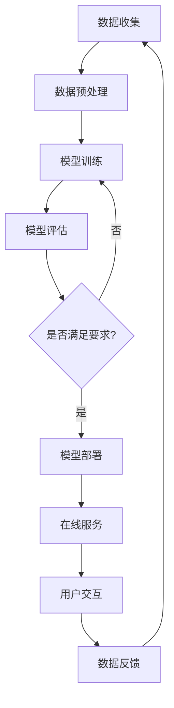

                 

## AI 大模型创业：如何利用未来优势？

> 关键词：大模型、创业、未来优势、AI、商业化、技术创新

## 1. 背景介绍

当前，人工智能（AI）正在各行各业掀起一场革命，其中大模型（Large Language Models）是AI领域最具前景的方向之一。大模型是指具有数十亿甚至数千亿参数的模型，它们可以理解和生成人类语言，并展示出惊人的学习和推理能力。然而，大模型的商业化和创业之路并非一帆风顺，本文将探讨如何利用大模型的未来优势，成功开展AI创业。

## 2. 核心概念与联系

### 2.1 大模型的定义与特点

大模型是指具有数十亿甚至数千亿参数的模型，它们通过学习大量文本数据，掌握了人类语言的复杂结构和规则。大模型的特点包括：

- **理解能力**：大模型可以理解上下文，并根据上下文生成相关的回答或文本。
- **推理能力**：大模型可以进行推理和推断，回答复杂的问题，并生成创造性的文本。
- **泛化能力**：大模型可以在未见过的数据上表现出色，展示出强大的泛化能力。

### 2.2 大模型与创业的联系

大模型的强大能力为创业提供了新的机遇，它们可以帮助企业提高效率、改善客户体验，并开发出全新的产品和服务。然而，大模型的商业化之路也面临着挑战，包括模型训练成本高、数据安全和隐私问题、模型解释性差等。

### 2.3 核心概念 Mermaid 流程图



## 3. 核心算法原理 & 具体操作步骤

### 3.1 算法原理概述

大模型的核心算法是Transformer模型，它基于自注意力机制（Self-Attention）和位置编码（Positional Encoding）工作。Transformer模型可以并行处理输入序列，并捕捉到序列中任意位置的依赖关系。

### 3.2 算法步骤详解

1. **数据预处理**：收集大量文本数据，并对其进行清洗、分词、向量化等预处理。
2. **模型训练**：使用预处理后的数据训练Transformer模型，优化模型参数，以最小化预测误差。
3. **模型评估**：评估模型在验证集上的表现，并调整模型参数以提高性能。
4. **模型部署**：将训练好的模型部署到生产环境，为用户提供在线服务。
5. **用户交互**：用户通过自然语言与模型进行交互，输入问题或指令，模型生成相应的回答或文本。
6. **数据反馈**：收集用户交互数据，并将其用于模型的进一步训练和优化。

### 3.3 算法优缺点

**优点**：

- 可以并行处理输入序列，提高训练和推理效率。
- 可以捕捉到序列中任意位置的依赖关系，提高模型的理解和推理能力。

**缺点**：

- 训练成本高，需要大量的计算资源和数据。
- 训练过程复杂，需要调整多个超参数。
- 模型解释性差，难以理解模型的决策过程。

### 3.4 算法应用领域

大模型的应用领域包括自然语言处理（NLP）、机器翻译、对话系统、文本生成等。此外，大模型还可以应用于其他领域，如图像和视频理解、生物信息学等。

## 4. 数学模型和公式 & 详细讲解 & 举例说明

### 4.1 数学模型构建

大模型的数学模型是基于Transformer模型构建的。Transformer模型的关键组件是自注意力机制和位置编码。

### 4.2 公式推导过程

**自注意力机制**：

给定输入序列$\mathbf{X} \in \mathbb{R}^{n \times d}$，其中$n$是序列长度，$d$是嵌入维度。自注意力机制首先对输入序列进行线性变换，得到查询（Query）、键（Key）和值（Value）矩阵：

$$\mathbf{Q} = \mathbf{XW}^Q, \quad \mathbf{K} = \mathbf{XW}^K, \quad \mathbf{V} = \mathbf{XW}^V$$

其中$\mathbf{W}^Q, \mathbf{W}^K, \mathbf{W}^V \in \mathbb{R}^{d \times d}$是学习参数。然后，自注意力机制计算注意力分数：

$$\mathbf{Attention}(\mathbf{Q}, \mathbf{K}, \mathbf{V}) = \text{softmax}\left(\frac{\mathbf{Q}\mathbf{K}^\top}{\sqrt{d}}\right)\mathbf{V}$$

**位置编码**：

位置编码是Transformer模型中唯一的位置信息，它是通过对输入序列添加周期性信号实现的。位置编码的公式为：

$$\mathbf{PE}_{pos, 2i} = \sin\left(\frac{pos}{10000^{2i/d}}\right)$$
$$\mathbf{PE}_{pos, 2i+1} = \cos\left(\frac{pos}{10000^{2i/d}}\right)$$

其中$pos$是位置索引，$i$是嵌入维度的索引。

### 4.3 案例分析与讲解

例如，假设我们要构建一个大模型来回答客户的问题。我们首先收集大量的文本数据，并对其进行预处理。然后，我们使用Transformer模型来训练大模型，并对其进行评估和调优。一旦模型训练完成，我们就可以将其部署到生产环境中，为客户提供在线服务。客户可以通过自然语言与模型进行交互，输入问题，模型生成相应的回答。我们可以收集用户交互数据，并将其用于模型的进一步训练和优化。

## 5. 项目实践：代码实例和详细解释说明

### 5.1 开发环境搭建

要构建大模型，我们需要一个强大的开发环境。我们推荐使用Python作为编程语言，并使用PyTorch或TensorFlow作为深度学习框架。此外，我们还需要安装Transformers库，它提供了预训练的大模型和训练工具。

### 5.2 源代码详细实现

以下是大模型训练的伪代码：

```python
import torch
from transformers import AutoTokenizer, AutoModelForSeq2SeqLM, Trainer, TrainingArguments

# 加载预训练模型和分词器
model_name = "t5-base"
tokenizer = AutoTokenizer.from_pretrained(model_name)
model = AutoModelForSeq2SeqLM.from_pretrained(model_name)

# 加载数据
train_dataset = load_dataset("path/to/train_data")
val_dataset = load_dataset("path/to/val_data")

# 定义训练参数
training_args = TrainingArguments(
    output_dir="./results",
    num_train_epochs=3,
    per_device_train_batch_size=16,
    per_device_eval_batch_size=64,
    warmup_steps=500,
    weight_decay=0.01,
    logging_dir="./logs",
)

# 定义训练器
trainer = Trainer(
    model=model,
    args=training_args,
    train_dataset=train_dataset,
    eval_dataset=val_dataset,
)

# 训练模型
trainer.train()

# 保存模型
model.save_pretrained("./saved_model")
```

### 5.3 代码解读与分析

在上述代码中，我们首先加载预训练的大模型和分词器。然后，我们加载训练数据和验证数据。我们定义了训练参数，包括训练 epoch 数、批处理大小、学习率调整步骤等。我们使用 Trainer 类来训练模型，并指定训练数据集和验证数据集。最后，我们保存训练好的模型。

### 5.4 运行结果展示

训练好的大模型可以用于生成文本或回答问题。以下是一个示例：

```python
# 加载保存的模型和分词器
model = AutoModelForSeq2SeqLM.from_pretrained("./saved_model")
tokenizer = AutoTokenizer.from_pretrained("./saved_model")

# 生成文本
input_text = "Translate to French: How are you?"
input_ids = tokenizer.encode(input_text, return_tensors="pt")
output_ids = model.generate(input_ids, max_length=50)
output_text = tokenizer.decode(output_ids[0], skip_special_tokens=True)
print(output_text)  # "Comment ça va?"
```

## 6. 实际应用场景

### 6.1 客户服务

大模型可以用于构建智能客户服务系统，帮助客户快速找到解决方案或获取信息。例如，大模型可以回答客户的问题，提供产品说明或指南，并帮助客户解决技术问题。

### 6.2 内容创作

大模型可以用于自动生成文本，如新闻文章、博客帖子或社交媒体帖子。例如，大模型可以根据关键词或主题生成文章，或根据用户输入生成创意文本。

### 6.3 教育

大模型可以用于构建智能教学系统，帮助学生学习新的主题或提高学习效果。例如，大模型可以生成个性化的学习计划，提供互动式的练习和测试，并提供个性化的反馈和指导。

### 6.4 未来应用展望

未来，大模型将会变得更加强大和智能，它们将能够理解和生成更复杂的文本，并展示出更强大的推理和学习能力。大模型还将与其他技术结合，如物联网、虚拟现实和增强现实，为我们带来全新的体验和应用。

## 7. 工具和资源推荐

### 7.1 学习资源推荐

- **课程**：斯坦福大学的“深度学习”课程（CS224n）和“自然语言处理”课程（CS224u）是学习大模型的好资源。
- **书籍**：“Attention is All You Need”论文和“Natural Language Processing with Python”书籍是学习大模型的好资源。
- **在线资源**：Hugging Face 的 Transformers 文档和论坛是学习大模型的好资源。

### 7.2 开发工具推荐

- **开发环境**：Anaconda 是一个强大的开发环境，它提供了Python和其他科学计算工具的集成。
- **深度学习框架**：PyTorch 和 TensorFlow 是流行的深度学习框架，它们都支持大模型的训练和部署。
- **大模型库**：Transformers 是一个流行的大模型库，它提供了预训练的大模型和训练工具。

### 7.3 相关论文推荐

- **Transformer 模型**：“Attention is All You Need”论文介绍了Transformer模型的原理和应用。
- **大模型**：“Language Models are Few-Shot Learners”论文介绍了大模型的泛化能力和应用。
- **大模型商业化**：“The Business of AI”报告提供了大模型商业化的见解和建议。

## 8. 总结：未来发展趋势与挑战

### 8.1 研究成果总结

本文介绍了大模型的原理、应用和商业化之路。我们讨论了大模型的核心算法和数学模型，并提供了项目实践的代码示例。我们还讨论了大模型的实际应用场景和未来发展趋势。

### 8.2 未来发展趋势

未来，大模型将会变得更加强大和智能，它们将能够理解和生成更复杂的文本，并展示出更强大的推理和学习能力。大模型还将与其他技术结合，为我们带来全新的体验和应用。

### 8.3 面临的挑战

然而，大模型的商业化之路也面临着挑战，包括模型训练成本高、数据安全和隐私问题、模型解释性差等。此外，大模型的发展还需要解决伦理和社会问题，如偏见和歧视等。

### 8.4 研究展望

未来的研究将关注大模型的解释性、泛化能力和商业化。我们需要开发新的方法来提高大模型的解释性，并使其能够在未见过的数据上表现出色。我们还需要开发新的商业模式和策略，以实现大模型的商业化。

## 9. 附录：常见问题与解答

**Q1：大模型需要多少计算资源？**

A1：大模型需要大量的计算资源，包括GPU和TPU。例如，训练一个具有数十亿参数的大模型需要数百个GPU或数千个TPU。

**Q2：大模型需要多少数据？**

A2：大模型需要大量的数据来训练。例如，训练一个具有数十亿参数的大模型需要数千万到数十亿个文本示例。

**Q3：大模型的商业化之路是什么？**

A3：大模型的商业化之路包括模型训练、模型部署、用户交互和数据反馈。我们需要开发新的商业模式和策略，以实现大模型的商业化。

**Q4：大模型面临的挑战是什么？**

A4：大模型面临的挑战包括模型训练成本高、数据安全和隐私问题、模型解释性差等。此外，大模型的发展还需要解决伦理和社会问题，如偏见和歧视等。

**Q5：未来的研究方向是什么？**

A5：未来的研究将关注大模型的解释性、泛化能力和商业化。我们需要开发新的方法来提高大模型的解释性，并使其能够在未见过的数据上表现出色。我们还需要开发新的商业模式和策略，以实现大模型的商业化。

## 作者：禅与计算机程序设计艺术 / Zen and the Art of Computer Programming

