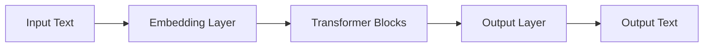

                 

## AI 大模型创业：如何利用管理优势？

> 关键词：大模型、创业、管理优势、AI 算法、数据处理、商业模式、风险管理

## 1. 背景介绍

随着人工智能（AI）技术的飞速发展，大模型（Large Language Models）已成为AI领域的热点之一。这些模型通过处理大量数据，学习并生成人类语言，展现出强大的理解和生成能力。然而，开发和部署大模型需要大量资源，对创业公司来说，如何利用管理优势是成功的关键。

## 2. 核心概念与联系

### 2.1 大模型原理

大模型是一种 transformer 结构的模型，它使用自注意力机制（Self-Attention Mechanism）来处理输入序列。如下图所示，大模型接受输入文本，并生成相应的输出文本。



### 2.2 管理优势

管理优势指的是创业公司在组织结构、决策流程、资源配置等方面的优势。这些优势有助于创业公司快速响应市场需求，灵活调整战略，并高效利用资源。

## 3. 核心算法原理 & 具体操作步骤

### 3.1 算法原理概述

大模型的核心是transformer结构，它由多个transformer块组成。每个transformer块包含多头自注意力机制和前向网络（Feed-Forward Network）。自注意力机制允许模型在处理输入序列时考虑到序列中的其他位置，而前向网络则为模型提供了非线性变换能力。

### 3.2 算法步骤详解

1. **输入文本预处理**：将输入文本转换为模型可以接受的格式，通常是 token IDs。
2. **Embedding**：将 token IDs 映射到高维空间，生成 embedding 向量。
3. **Transformer Blocks**：将 embedding 向量输入到 transformer 块中，进行自注意力机制和前向网络操作。
4. **输出文本生成**：将 transformer 块的输出通过输出层生成文本。

### 3.3 算法优缺点

**优点**：大模型可以理解和生成人类语言，展现出强大的理解和生成能力。它们可以应用于各种 NLP 任务，如文本生成、翻译、问答等。

**缺点**：大模型需要大量的计算资源和数据，训练和部署成本高。它们也容易受到数据偏见和过拟合的影响。

### 3.4 算法应用领域

大模型的应用领域包括文本生成、翻译、问答、搜索引擎、虚拟助手等。它们还可以用于生成代码、设计音乐等创造性任务。

## 4. 数学模型和公式 & 详细讲解 & 举例说明

### 4.1 数学模型构建

大模型的数学模型可以表示为：

$$P(\theta) = \prod_{i=1}^{N} P(x_i | x_{<i}, \theta)$$

其中，$x_i$ 是输入序列中的第 $i$ 个 token，$N$ 是序列长度，$\theta$ 是模型参数。

### 4.2 公式推导过程

大模型使用链式法则来计算输出分布。对于每个 token，$P(x_i | x_{<i}, \theta)$ 可以表示为：

$$P(x_i | x_{<i}, \theta) = \text{softmax}(Wx_i + b)$$

其中，$W$ 和 $b$ 是模型参数，$x_i$ 是 token 的 embedding 向量。

### 4.3 案例分析与讲解

例如，假设我们要生成一个句子 "The cat sat on the mat"。模型首先生成 "The"，然后根据 "The" 生成 "cat"，依次类推。模型的目标是最大化生成句子的概率。

## 5. 项目实践：代码实例和详细解释说明

### 5.1 开发环境搭建

大模型的开发需要一个强大的 GPU 环境，如 NVIDIA A100。我们使用 PyTorch 进行模型开发，并使用 Hugging Face 的 transformers 库。

### 5.2 源代码详细实现

以下是大模型的简单实现代码：

```python
import torch
from transformers import AutoModelForCausalLM, AutoTokenizer

model = AutoModelForCausalLM.from_pretrained("bigscience/bloom")
tokenizer = AutoTokenizer.from_pretrained("bigscience/bloom")

inputs = tokenizer("The cat sat on the", return_tensors="pt")
outputs = model(**inputs, labels=inputs["input_ids"])
loss = outputs.loss
```

### 5.3 代码解读与分析

这段代码加载了 bloom 模型，并对输入文本 "The cat sat on the" 进行了预测。模型的输出是一个 loss 值，表示模型预测的文本与真实文本的差异。

### 5.4 运行结果展示

运行这段代码后，模型会生成下一个 token，即 "mat"。我们可以通过调整模型参数，改变生成文本的概率分布，从而生成不同的文本。

## 6. 实际应用场景

### 6.1 当前应用

大模型已经应用于各种 NLP 任务，如文本生成、翻译、问答等。它们还可以用于生成代码、设计音乐等创造性任务。

### 6.2 未来应用展望

未来，大模型有望应用于更多领域，如医疗、金融等。它们还可以与其他 AI 技术结合，如计算机视觉，实现更复杂的任务。

## 7. 工具和资源推荐

### 7.1 学习资源推荐

- "Attention is All You Need" 论文：<https://arxiv.org/abs/1706.03762>
- Hugging Face transformers 库：<https://huggingface.co/transformers/>

### 7.2 开发工具推荐

- PyTorch：<https://pytorch.org/>
- NVIDIA A100 GPU：<https://www.nvidia.com/en-us/data-center/a100/>

### 7.3 相关论文推荐

- "Language Models are Few-Shot Learners"：<https://arxiv.org/abs/2005.14165>
- "Emergent Abilities of Large Language Models"：<https://arxiv.org/abs/2206.11763>

## 8. 总结：未来发展趋势与挑战

### 8.1 研究成果总结

大模型在 NLP 任务上取得了显著成果，展现出强大的理解和生成能力。

### 8.2 未来发展趋势

未来，大模型有望应用于更多领域，并与其他 AI 技术结合，实现更复杂的任务。模型的规模也有望进一步扩大，从而提高模型的能力。

### 8.3 面临的挑战

大模型面临的挑战包括数据偏见、过拟合、计算资源需求等。如何解决这些挑战，是未来研究的方向之一。

### 8.4 研究展望

未来的研究方向包括模型压缩、模型解释、模型安全等。如何使大模型更加可解释、可控，是一个重要的研究方向。

## 9. 附录：常见问题与解答

**Q：大模型需要多少计算资源？**

**A：大模型需要大量的 GPU 资源。例如，训练 bloom-560M 模型需要 16 个 NVIDIA A100 GPU。**

**Q：大模型的数据偏见如何解决？**

**A：数据偏见是大模型的一个主要挑战。解决方法包括数据增强、对抗训练、模型微调等。**

**Q：大模型的过拟合如何解决？**

**A：过拟合是大模型的另一个挑战。解决方法包括数据增强、正则化、早停等。**

## 作者：禅与计算机程序设计艺术 / Zen and the Art of Computer Programming

