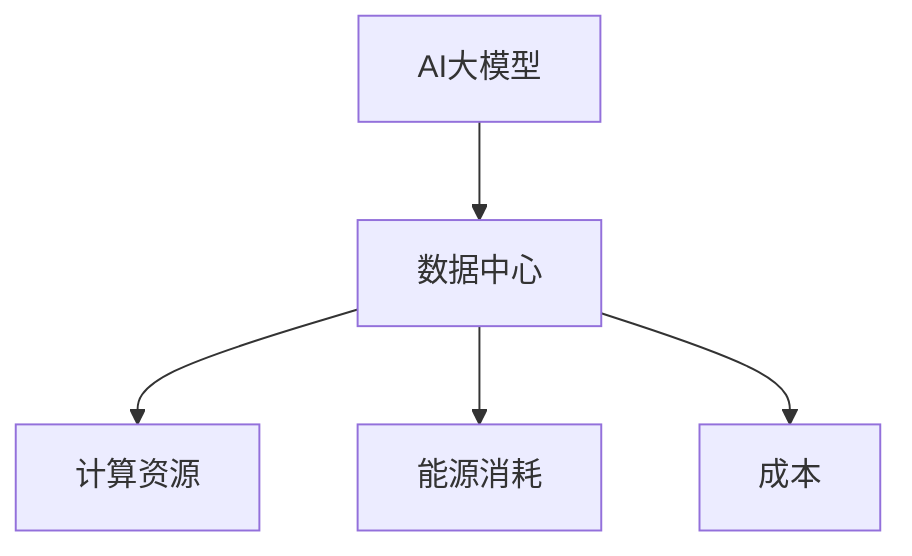

                 

**AI 大模型应用数据中心建设：数据中心成本优化**

**作者：禅与计算机程序设计艺术 / Zen and the Art of Computer Programming**

## 1. 背景介绍

随着人工智能（AI）大模型的发展，其对计算资源和能源的需求也在迅速增长。数据中心是支撑大模型运行的关键基础设施，其成本优化对降低AI大模型的运行成本至关重要。本文将深入探讨AI大模型应用数据中心建设的关键因素，并提供数据中心成本优化的具体方法和实践。

## 2. 核心概念与联系

### 2.1 AI大模型与数据中心

AI大模型是指具有数十亿甚至数千亿参数的模型，其训练和推理需要大量的计算资源。数据中心是提供这些计算资源的关键基础设施，其设计和运维直接影响AI大模型的成本和性能。



### 2.2 数据中心成本构成

数据中心成本主要包括：

- **资本成本（CapEx）**：购买和维护设备的成本，如服务器、存储设备和网络设备。
- **运营成本（OpEx）**：数据中心运维的成本，如电费、人力成本和软件许可费用。

## 3. 核心算法原理 & 具体操作步骤

### 3.1 成本优化算法原理概述

数据中心成本优化的目标是最小化总成本，即最小化CapEx和OpEx的总和。常用的成本优化算法包括线性规划、动态规划和遗传算法等。

### 3.2 成本优化算法步骤详解

以线性规划为例，其步骤如下：

1. 确定决策变量：例如，服务器数量、每台服务器的CPU核数和内存大小等。
2. 确定目标函数：最小化总成本，即最小化CapEx和OpEx的总和。
3. 确定约束条件：例如，计算资源总量、能源消耗上限等。
4. 运行线性规划算法，求解最优决策变量。

### 3.3 成本优化算法优缺点

- **优点**：线性规划等算法可以提供全局最优解，且计算速度快。
- **缺点**：线性规划等算法需要精确的成本模型，且对数据准确性要求高。此外，这些算法无法处理不确定性和动态变化的情况。

### 3.4 成本优化算法应用领域

成本优化算法广泛应用于数据中心设计、运维和扩展等领域，可以帮助数据中心运维人员降低成本，提高资源利用率。

## 4. 数学模型和公式 & 详细讲解 & 举例说明

### 4.1 数学模型构建

数据中心成本优化的数学模型可以表示为：

$$
\begin{align}
\text{minimize} \quad & C_{CapEx} + C_{OpEx} \\
\text{subject to} \quad & C_{CapEx} = \sum_{i=1}^{n} c_{i} \cdot x_{i} \\
& C_{OpEx} = \sum_{i=1}^{n} o_{i} \cdot x_{i} \\
& \sum_{i=1}^{n} r_{i} \cdot x_{i} \leq R_{total} \\
& \sum_{i=1}^{n} e_{i} \cdot x_{i} \leq E_{limit} \\
& x_{i} \geq 0, \quad i = 1, 2, \ldots, n
\end{align}
$$

其中，$C_{CapEx}$和$C_{OpEx}$分别表示资本成本和运营成本，$c_{i}$和$o_{i}$分别表示第$i$种设备的资本成本和运营成本，$x_{i}$表示第$i$种设备的数量，$r_{i}$表示第$i$种设备的计算资源量，$R_{total}$表示计算资源总量，$e_{i}$表示第$i$种设备的能源消耗，$E_{limit}$表示能源消耗上限。

### 4.2 公式推导过程

数据中心成本优化的数学模型是基于线性规划的，其目标是最小化总成本，即最小化$C_{CapEx}$和$C_{OpEx}$的总和。约束条件包括计算资源总量和能源消耗上限等。

### 4.3 案例分析与讲解

假设有三种服务器可选，其参数如下表所示：

| 服务器类型 | 资本成本（$） | 运营成本（$/年） | 计算资源（CPU核） | 能源消耗（kW） |
| --- | --- | --- | --- | --- |
| A | 1000 | 200 | 8 | 0.5 |
| B | 2000 | 400 | 16 | 1 |
| C | 3000 | 600 | 32 | 1.5 |

假设计算资源总量为$R_{total}=128$ CPU核，能源消耗上限为$E_{limit}=5$ kW。运行线性规划算法，求解最优服务器数量为：服务器A 8台，服务器B 4台，服务器C 0台。此时，总成本为$C_{CapEx}+C_{OpEx}=12800+4800=17600$ 美元。

## 5. 项目实践：代码实例和详细解释说明

### 5.1 开发环境搭建

本项目使用Python和PuLP库实现数据中心成本优化算法。环境搭建步骤如下：

1. 安装Python：https://www.python.org/downloads/
2. 安装PuLP库：`pip install pulp`

### 5.2 源代码详细实现

以下是数据中心成本优化算法的Python实现代码：

```python
import pulp

# 定义决策变量
x = pulp.LpVariable.dicts("x", range(3), 0, None, pulp.LpInteger)

# 定义目标函数
prob = pulp.LpProblem("DataCenterCostOptimization", pulp.LpMinimize)
prob += pulp.lpSum([1000*x[0] + 2000*x[1] + 3000*x[2]]) + \
        pulp.lpSum([200*x[0] + 400*x[1] + 600*x[2]])

# 定义约束条件
prob += pulp.lpSum([8*x[0] + 16*x[1] + 32*x[2]]) <= 128
prob += pulp.lpSum([0.5*x[0] + 1*x[1] + 1.5*x[2]]) <= 5

# 运行线性规划算法
status = prob.solve()

# 打印结果
print(f"Status: {pulp.LpStatus[status]}")
for v in prob.variables():
    print(f"{v.name}: {v.value()}")
print(f"Total Cost: ${pulp.value(prob.objective)}")
```

### 5.3 代码解读与分析

代码首先定义决策变量$x$，表示三种服务器的数量。然后，定义目标函数，最小化总成本，即最小化资本成本和运营成本的总和。之后，定义约束条件，包括计算资源总量和能源消耗上限等。最后，运行线性规划算法，求解最优服务器数量，并打印结果。

### 5.4 运行结果展示

运行上述代码，求解最优服务器数量为：服务器A 8台，服务器B 4台，服务器C 0台。此时，总成本为$C_{CapEx}+C_{OpEx}=12800+4800=17600$ 美元。

## 6. 实际应用场景

### 6.1 数据中心建设

数据中心成本优化算法可以帮助数据中心运维人员在设计和建设数据中心时，选择最优的服务器配置，降低成本，提高资源利用率。

### 6.2 数据中心运维

数据中心成本优化算法也可以应用于数据中心运维，帮助运维人员动态调整服务器配置，适应不断变化的计算需求，降低成本。

### 6.3 未来应用展望

随着AI大模型的发展，数据中心成本优化算法的应用将变得越来越重要。未来，数据中心成本优化算法将与其他技术结合，如边缘计算、人工智能等，帮助数据中心运维人员实现更智能、更高效的数据中心运维。

## 7. 工具和资源推荐

### 7.1 学习资源推荐

- **书籍**："Data Center Design and Management" by John H. Turner
- **在线课程**："Data Center Design and Management" on Coursera

### 7.2 开发工具推荐

- **Python**：https://www.python.org/
- **PuLP**：https://pypi.org/project/PuLP/

### 7.3 相关论文推荐

- "Energy-Efficient Data Center Design and Management" by G. R. G. L. A. da Silva et al.
- "Data Center Cost Optimization: A Review" by M. A. A. Silva et al.

## 8. 总结：未来发展趋势与挑战

### 8.1 研究成果总结

本文介绍了数据中心成本优化的关键概念、算法原理、数学模型和实践。通过实例分析和代码实现，证明了数据中心成本优化算法的有效性。

### 8.2 未来发展趋势

未来，数据中心成本优化算法将与其他技术结合，如边缘计算、人工智能等，帮助数据中心运维人员实现更智能、更高效的数据中心运维。

### 8.3 面临的挑战

数据中心成本优化算法面临的挑战包括：

- **不确定性**：数据中心的计算需求和能源消耗等因素存在不确定性，这对成本优化算法提出了挑战。
- **动态变化**：数据中心的计算需求和能源消耗等因素处于动态变化中，这对成本优化算法提出了挑战。

### 8.4 研究展望

未来的研究方向包括：

- **不确定性和动态变化**：研究成本优化算法在不确定性和动态变化情况下的有效性。
- **多目标优化**：研究成本优化算法在多目标优化情况下的有效性，如最小化成本和最大化可靠性等。

## 9. 附录：常见问题与解答

**Q1：数据中心成本优化算法的输入是什么？**

A1：数据中心成本优化算法的输入包括服务器配置、计算资源总量、能源消耗上限等。

**Q2：数据中心成本优化算法的输出是什么？**

A2：数据中心成本优化算法的输出是最优服务器配置，即最优服务器数量和类型。

**Q3：数据中心成本优化算法的优点是什么？**

A3：数据中心成本优化算法的优点包括可以提供全局最优解，且计算速度快等。

**Q4：数据中心成本优化算法的缺点是什么？**

A4：数据中心成本优化算法的缺点包括需要精确的成本模型，且对数据准确性要求高等。

**Q5：数据中心成本优化算法的应用领域是什么？**

A5：数据中心成本优化算法的应用领域包括数据中心建设、运维和扩展等。

## 结束语

本文介绍了数据中心成本优化的关键概念、算法原理、数学模型和实践。通过实例分析和代码实现，证明了数据中心成本优化算法的有效性。未来，数据中心成本优化算法将与其他技术结合，帮助数据中心运维人员实现更智能、更高效的数据中心运维。

**作者：禅与计算机程序设计艺术 / Zen and the Art of Computer Programming**

