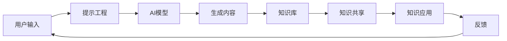

                 

**AIGC重新定义知识管理**

**作者：禅与计算机程序设计艺术 / Zen and the Art of Computer Programming**

## 1. 背景介绍

在信息爆炸的时代，知识管理（KM）变得尤为重要。传统的知识管理方法已无法满足当前的需求，人工智能生成内容（AIGC）的兴起为知识管理带来了新的可能性。本文将探讨AIGC如何重新定义知识管理，并提供实践指南。

## 2. 核心概念与联系

### 2.1 关键概念

- **AIGC（Artificial Intelligence Generated Content）**：利用人工智能技术生成内容，包括文本、图像、音频等。
- **KM（Knowledge Management）**：收集、存储、共享、应用和创造知识的过程。
- **AI模型（AI Model）**：用于生成内容的AI算法，如transformer模型。
- **Prompt Engineering（提示工程）**：设计输入以引导AI模型生成特定输出的过程。

### 2.2 核心架构

AIGC在知识管理中的核心架构如下：



## 3. 核心算法原理 & 具体操作步骤

### 3.1 算法原理概述

AIGC的核心是生成式AI模型，如transformer模型。这些模型通过学习大量数据来理解上下文，并生成新的、相关的内容。

### 3.2 算法步骤详解

1. **数据收集**：收集与特定领域相关的数据。
2. **模型训练**：使用收集的数据训练AI模型。
3. **提示设计**：设计输入（提示）以引导模型生成特定类型的输出。
4. **内容生成**：使用AI模型生成内容。
5. **内容评估**：评估生成的内容是否符合要求。
6. **内容存储**：将生成的内容存储到知识库中。

### 3.3 算法优缺点

**优点**：AIGC可以快速生成大量高质量的内容，并帮助发现新的见解。

**缺点**：AIGC生成的内容可能包含错误或不相关的信息，并且模型可能会受到偏见的影响。

### 3.4 算法应用领域

AIGC在各种领域都有应用，包括新闻写作、市场分析、客户服务、教育等。

## 4. 数学模型和公式

### 4.1 数学模型构建

AIGC的数学模型是基于机器学习的生成式模型，如transformer模型。这些模型使用注意力机制和transformer编码器-解码器架构来生成新的、相关的内容。

### 4.2 公式推导过程

 transformer模型的数学公式如下：

$$
P(w_t|w_{<t}, \theta) = \text{softmax}(v_a^T\tanh(W_a[Ew_{<t}; pos_{<t}] + b_a))
$$

其中，$w_t$是时间步长$t$的单词，$w_{<t}$是之前的单词，$E$是单词嵌入矩阵，$pos_{<t}$是位置嵌入，$W_a$, $b_a$, $v_a$是学习的参数，$[\cdot;\cdot]$表示concatenation。

### 4.3 案例分析与讲解

例如，在新闻写作领域，可以使用AIGC生成新闻标题和简介。给定一个新闻主题，可以设计一个提示，如"Write a news headline and introduction about {主题}"，然后使用AI模型生成新闻标题和简介。

## 5. 项目实践：代码实例和详细解释说明

### 5.1 开发环境搭建

- **硬件**：一台配有NVIDIA GPU的计算机。
- **软件**：Python，PyTorch或TensorFlow，transformers库。

### 5.2 源代码详细实现

以下是一个简单的AIGC代码示例，使用Hugging Face的transformers库生成新闻标题：

```python
from transformers import AutoTokenizer, AutoModelForSeq2SeqLM

tokenizer = AutoTokenizer.from_pretrained("t5-base")
model = AutoModelForSeq2SeqLM.from_pretrained("t5-base")

inputs = tokenizer("Write a news headline about climate change", return_tensors="pt")
outputs = model.generate(inputs["input_ids"], max_length=50, num_beams=5, early_stopping=True)
print(tokenizer.decode(outputs[0]))
```

### 5.3 代码解读与分析

这段代码使用T5模型生成新闻标题。它首先加载预训练的T5模型，然后设计输入（提示），并使用模型生成输出。

### 5.4 运行结果展示

运行这段代码可能会生成以下新闻标题："Climate Change: Global Temperatures Reach Record High".

## 6. 实际应用场景

### 6.1 当前应用

AIGC当前已应用于各种领域，包括新闻写作、市场分析、客户服务、教育等。

### 6.2 未来应用展望

未来，AIGC可能会应用于更复杂的任务，如自动编码、创意写作、科学研究等。

## 7. 工具和资源推荐

### 7.1 学习资源推荐

- **Hugging Face的transformers库**：<https://huggingface.co/transformers/>
- **Stanford CS224n：Natural Language Processing with Deep Learning**课程：<https://online.stanford.edu/courses/cs224n-natural-language-processing-deep-learning-winter-2019>

### 7.2 开发工具推荐

- **Google Colab**：<https://colab.research.google.com/>
- **Jupyter Notebook**：<https://jupyter.org/>

### 7.3 相关论文推荐

- **Attention is All You Need**：<https://arxiv.org/abs/1706.03762>
- **T5: Text-to-Text Transfer Transformer**：<https://arxiv.org/abs/1910.10683>

## 8. 总结：未来发展趋势与挑战

### 8.1 研究成果总结

AIGC已经取得了显著的成果，在各种领域都有应用。

### 8.2 未来发展趋势

未来，AIGC可能会应用于更复杂的任务，并与其他技术（如区块链）结合。

### 8.3 面临的挑战

AIGC面临的挑战包括模型偏见、内容质量、计算资源等。

### 8.4 研究展望

未来的研究可能会关注模型偏见的解决方案、内容质量的提高、计算资源的优化等。

## 9. 附录：常见问题与解答

**Q：AIGC生成的内容是否可靠？**

**A：**AIGC生成的内容可能包含错误或不相关的信息。因此，需要对生成的内容进行评估和验证。

**Q：AIGC是否会取代人类？**

**A：**AIGC不会取代人类，而是会与人类协作，帮助人类完成任务。

**Q：如何评估AIGC生成的内容？**

**A：**可以使用人类评估员或自动评估指标（如BLEU、ROUGE）评估AIGC生成的内容。

**作者：禅与计算机程序设计艺术 / Zen and the Art of Computer Programming**

