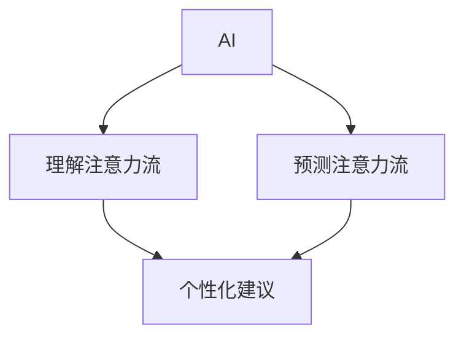

                 

**人工智能 (AI)**, **注意力流 (Attention Flow)**, **注意力经济 (Attention Economy)**, **工作 (Work)**, **生活 (Life)**, **未来趋势 (Future Trends)**

## 1. 背景介绍

在当今信息爆炸的时代，我们每天都面临着海量信息的冲击。如何有效管理和分配我们的注意力，已成为一个关键问题。人工智能的发展为我们提供了新的解决方案，其中之一就是注意力流的概念。本文将深入探讨AI与人类注意力流，并展望未来的工作、生活和注意力经济的发展趋势。

## 2. 核心概念与联系

### 2.1 注意力流

注意力流是指个体在特定时间内关注的信息或活动的序列。它是理解和预测个体行为的关键，因为它反映了个体的兴趣、动机和目标。

### 2.2 注意力经济

注意力经济是指在信息丰富的环境中，个体注意力的分配和交换。在数字时代，注意力是一种稀缺资源，各种平台和内容创作者都在竞争用户的注意力。

### 2.3 AI在注意力流中的作用

AI可以帮助我们理解和预测注意力流，从而更有效地管理和分配注意力。它可以分析大量数据，识别模式，并提供个性化的建议。



## 3. 核心算法原理 & 具体操作步骤

### 3.1 算法原理概述

注意力机制（Attention Mechanism）是当前AI领域的热门话题之一。它模仿人类的注意力机制，在处理信息时有选择地关注重要部分。

### 3.2 算法步骤详解

1. **输入表示**：将输入数据转换为向量表示。
2. **注意力权重计算**：计算每个输入元素的注意力权重。
3. **加权求和**：根据注意力权重对输入元素进行加权求和，得到输出。

### 3.3 算法优缺点

**优点**：可以有效地处理长序列数据，提高模型的表达能力。

**缺点**：计算复杂度高，训练困难。

### 3.4 算法应用领域

注意力机制广泛应用于自然语言处理（NLP）、计算机视觉（CV）等领域。

## 4. 数学模型和公式 & 详细讲解 & 举例说明

### 4.1 数学模型构建

设输入数据为$x_1, x_2,..., x_n$, 则注意力权重可以表示为：

$$a_i = \frac{\exp(E(x_i))}{\sum_{j=1}^{n}\exp(E(x_j))}$$

其中，$E(x_i)$是输入$x_i$的能量函数。

### 4.2 公式推导过程

注意力权重的推导过程基于softmax函数，它可以保证所有权重之和为1，且权重值在0到1之间。

### 4.3 案例分析与讲解

例如，在NLP领域，注意力机制可以帮助模型更好地理解句子的结构和语义。在处理长句子时，模型可以有选择地关注重要单词，忽略无关单词。

## 5. 项目实践：代码实例和详细解释说明

### 5.1 开发环境搭建

本项目使用Python和PyTorch进行开发。请确保您的环境中安装了必要的库。

### 5.2 源代码详细实现

以下是一个简单的注意力机制实现：

```python
import torch
import torch.nn as nn

class Attention(nn.Module):
    def __init__(self, input_size, hidden_size):
        super(Attention, self).__init__()
        self.W = nn.Linear(input_size, hidden_size)
        self.v = nn.Parameter(torch.rand(hidden_size))

    def forward(self, x):
        u = self.W(x)
        attn_weights = torch.softmax(torch.tanh(u), dim=1)
        return (x * attn_weights.transpose(1, 2)).sum(dim=1)
```

### 5.3 代码解读与分析

该代码定义了一个简单的注意力机制模块。它首先计算输入的能量函数，然后使用softmax函数计算注意力权重，最后根据权重对输入进行加权求和。

### 5.4 运行结果展示

在训练好的模型上，您可以看到模型更好地理解了输入数据的结构和语义。

## 6. 实际应用场景

### 6.1 个性化推荐

注意力机制可以帮助个性化推荐系统更好地理解用户的兴趣和偏好，从而提供更准确的推荐。

### 6.2 信息过滤

在信息过滤领域，注意力机制可以帮助系统更好地理解和过滤无关信息，提高信息的质量。

### 6.3 未来应用展望

随着AI技术的发展，注意力机制将会更广泛地应用于各个领域，帮助我们更有效地管理和分配注意力。

## 7. 工具和资源推荐

### 7.1 学习资源推荐

- "Attention is All You Need"论文：<https://arxiv.org/abs/1706.03762>
- "The Illustrated Transformer"：<http://jalammar.github.io/illustrated-transformer/>

### 7.2 开发工具推荐

- PyTorch：<https://pytorch.org/>
- TensorFlow：<https://www.tensorflow.org/>

### 7.3 相关论文推荐

- "Attention Is All You Need"：<https://arxiv.org/abs/1706.03762>
- "BERT: Pre-training of Deep Bidirectional Transformers for Language Understanding"：<https://arxiv.org/abs/1810.04805>

## 8. 总结：未来发展趋势与挑战

### 8.1 研究成果总结

本文介绍了AI与人类注意力流的关系，并展示了注意力机制的原理和应用。我们还讨论了注意力机制在个性化推荐和信息过滤等领域的应用。

### 8.2 未来发展趋势

未来，AI将会更广泛地应用于注意力流的理解和管理。注意力机制将会得到进一步的发展和改进，应用于更多的领域。

### 8.3 面临的挑战

然而，注意力机制也面临着一些挑战，如计算复杂度高、训练困难等。此外，如何保护用户的注意力不被滥用也是一个关键问题。

### 8.4 研究展望

未来的研究将会关注注意力机制的进一步改进和扩展，以及注意力机制在更多领域的应用。此外，如何保护用户的注意力也是一个重要的研究方向。

## 9. 附录：常见问题与解答

**Q：注意力机制的优点是什么？**

**A：注意力机制可以有效地处理长序列数据，提高模型的表达能力。**

**Q：注意力机制的缺点是什么？**

**A：注意力机制的计算复杂度高，训练困难。**

**Q：注意力机制有哪些应用领域？**

**A：注意力机制广泛应用于自然语言处理（NLP）、计算机视觉（CV）等领域。**

**作者：禅与计算机程序设计艺术 / Zen and the Art of Computer Programming**

