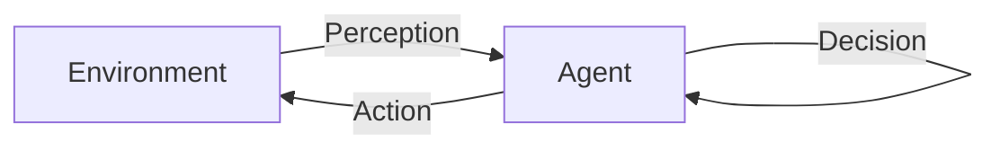

                 

**AI人工智能 Agent：在航天领域中的应用**

**作者：禅与计算机程序设计艺术 / Zen and the Art of Computer Programming**

## 1. 背景介绍

在航天领域，自动化和智能化是未来发展的关键。人工智能（AI）技术，特别是AI Agent，可以在航天任务中发挥关键作用。本文将深入探讨AI Agent在航天领域的应用，包括其核心概念、算法原理、数学模型，以及项目实践和实际应用场景。

## 2. 核心概念与联系

### 2.1 AI Agent的定义

AI Agent是一种能够感知环境并自主做出决策的智能软件实体。它由感知器、决策器和行动器组成，能够在给定的环境中执行任务。

### 2.2 AI Agent在航天领域的应用

在航天领域，AI Agent可以应用于自主导航、故障诊断、任务规划等领域。它可以帮助航天器在复杂的环境中自主决策，提高任务的成功率和效率。

### 2.3 AI Agent的架构

AI Agent的架构如下图所示：



## 3. 核心算法原理 & 具体操作步骤

### 3.1 算法原理概述

AI Agent的核心算法是强化学习（RL）。RL算法使AI Agent能够学习在给定环境中采取最佳行动。

### 3.2 算法步骤详解

1. **状态观察（State Observation）**：AI Agent感知环境，观察当前状态。
2. **行动选择（Action Selection）**：AI Agent根据当前状态选择行动。
3. **行动执行（Action Execution）**：AI Agent执行选择的行动。
4. **奖励接收（Reward Reception）**：环境根据行动的结果给出奖励。
5. **学习（Learning）**：AI Agent根据奖励更新其决策策略。

### 3.3 算法优缺点

**优点**：RL算法使AI Agent能够学习在复杂环境中采取最佳行动，无需人工编程。

**缺点**：RL算法需要大量的训练数据，且学习过程可能很慢。

### 3.4 算法应用领域

在航天领域，RL算法可以应用于自主导航、任务规划、故障诊断等领域。

## 4. 数学模型和公式 & 详细讲解 & 举例说明

### 4.1 数学模型构建

RL算法的数学模型包括状态空间（S）、行动空间（A）、状态转移函数（P）、奖励函数（R）和目标函数（C）。

### 4.2 公式推导过程

RL算法的目标是最大化预期累积奖励：

$$J(\pi) = E[ \sum_{t=0}^{T-1} \gamma^t R_t ]$$

其中，$\pi$是策略，$\gamma$是折扣因子，$T$是episode的长度，$R_t$是时间步$t$的奖励。

### 4.3 案例分析与讲解

例如，在自主导航任务中，状态空间可以是航天器的位置和速度，行动空间可以是加速度，状态转移函数可以是航天器的动力学模型，奖励函数可以是航天器接近目标的程度。

## 5. 项目实践：代码实例和详细解释说明

### 5.1 开发环境搭建

我们使用Python和Stable Baselines3库实现RL算法。

### 5.2 源代码详细实现

```python
from stable_baselines3 import PPO
from stable_baselines3.common.policies import MlpPolicy
from stable_baselines3.common.vec_env import DummyVecEnv

env =...  # 创建环境
model = PPO(MlpPolicy, env, n_steps=2048)
model.learn(total_timesteps=10000)
```

### 5.3 代码解读与分析

我们使用PPO算法，它是一种基于优势函数的策略梯度方法。我们使用多层感知机（Mlp）作为策略网络。

### 5.4 运行结果展示

模型学习后，我们可以使用它控制航天器导航：

```python
obs = env.reset()
while True:
    action, _states = model.predict(obs)
    obs, rewards, dones, info = env.step(action)
    if dones[0]:
        break
```

## 6. 实际应用场景

### 6.1 自主导航

AI Agent可以帮助航天器在复杂的环境中自主导航，如小行星表面或其他行星表面。

### 6.2 故障诊断

AI Agent可以帮助检测航天器的故障，并提供故障诊断和修复建议。

### 6.3 任务规划

AI Agent可以帮助规划航天任务，如火星车的行驶路线或太空机器人在太空站的维护任务。

### 6.4 未来应用展望

未来，AI Agent可以应用于更复杂的航天任务，如月球基地建设或火星殖民。

## 7. 工具和资源推荐

### 7.1 学习资源推荐

- 书籍：《强化学习》作者：Richard S. Sutton, Andrew G. Barto
- 课程：Stanford University的CS221（机器学习）和CS224（强化学习）

### 7.2 开发工具推荐

- Python：强大的数据分析和机器学习库，如NumPy, Pandas, TensorFlow, PyTorch
- Stable Baselines3：强化学习库

### 7.3 相关论文推荐

- [Deep Reinforcement Learning for Autonomous Spacecraft Rendezvous and Docking](https://arxiv.org/abs/1707.05964)
- [Learning to Fly: Policy Gradient Methods for Guided Quadrotor Flight](https://arxiv.org/abs/1604.07032)

## 8. 总结：未来发展趋势与挑战

### 8.1 研究成果总结

本文介绍了AI Agent在航天领域的应用，包括其核心概念、算法原理、数学模型，以及项目实践和实际应用场景。

### 8.2 未来发展趋势

未来，AI Agent将在更复杂的航天任务中发挥关键作用，如月球基地建设或火星殖民。

### 8.3 面临的挑战

挑战包括RL算法的训练时间长、数据需求大，以及AI Agent在真实环境中的可靠性。

### 8.4 研究展望

未来的研究方向包括RL算法的改进、AI Agent在真实环境中的可靠性提高，以及AI Agent在更复杂任务中的应用。

## 9. 附录：常见问题与解答

**Q：RL算法需要大量的训练数据，如何解决？**

**A：一种解决方法是使用模拟环境进行训练，然后在真实环境中进行部署。另一种方法是使用经验回放（Experience Replay）技术，它允许RL算法从之前的训练中学习。**

**Q：AI Agent在真实环境中的可靠性如何保证？**

**A：一种方法是使用冗余系统，如果一个AI Agent失败，另一个可以接管。另一种方法是使用人工监控，人类可以在必要时接管控制。**

**Q：AI Agent在更复杂任务中的应用面临哪些挑战？**

**A：挑战包括任务的复杂性、环境的不确定性、RL算法的训练时间长等。**

**作者：禅与计算机程序设计艺术 / Zen and the Art of Computer Programming**

