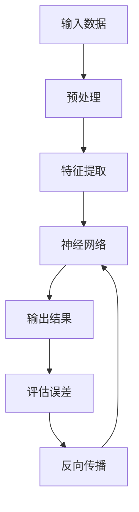

                 

**人工智能**, **深度学习**, **智能代理**, **未来发展**, **算法**, **神经网络**, **机器学习**, **计算机视觉**, **自然语言处理**

## 1. 背景介绍

人工智能（AI）和深度学习（DL）正在各行各业引发革命，从计算机视觉到自然语言处理，再到医疗和金融领域。智能代理，即能够学习和适应环境的自动化系统，是AI和DL的关键组成部分。本文将深入探讨智能深度学习代理的核心概念、算法原理，并展示其在实际应用中的成功案例。我们还将讨论未来的发展趋势和挑战，并提供学习资源和工具推荐。

## 2. 核心概念与联系

智能深度学习代理的核心是神经网络，一种模拟人类大脑结构和功能的计算模型。神经网络由输入层、隐藏层和输出层组成，每层包含多个神经元。神经元接收输入信号，进行加权求和，并通过激活函数生成输出信号。神经网络通过反向传播算法训练，以最小化预测误差。

以下是智能深度学习代理的架构 Mermaid 流程图：



## 3. 核心算法原理 & 具体操作步骤

### 3.1 算法原理概述

智能深度学习代理的核心算法是深度神经网络，包括卷积神经网络（CNN）和循环神经网络（RNN）。CNN适用于计算机视觉任务，如图像分类和目标检测。RNN适用于序列数据，如自然语言处理任务。

### 3.2 算法步骤详解

1. **数据预处理**：收集和清洗数据，并将其转换为适合神经网络的格式。
2. **模型构建**：选择适合任务的神经网络架构，并初始化权重和偏置。
3. **训练**：使用反向传播算法和优化器（如Adam）训练模型，以最小化预测误差。
4. **评估**：在验证集上评估模型性能，并调整超参数以改善性能。
5. **部署**：将训练好的模型部署到生产环境中，以进行实时预测。

### 3.3 算法优缺点

**优点**：
- 自动特征提取：神经网络可以自动学习特征，无需人工特征工程。
- 适应能力强：神经网络可以适应各种数据分布和任务。
- 表达能力强：深度神经网络可以表示复杂的非线性函数。

**缺点**：
- 计算资源需求高：训练深度神经网络需要大量计算资源和时间。
- 训练数据需求高：神经网络需要大量标记数据进行训练。
- 解释性差：神经网络的决策过程通常难以解释。

### 3.4 算法应用领域

智能深度学习代理的应用领域包括计算机视觉、自然语言处理、医疗、金融和自动驾驶等。例如，CNN在图像分类和目标检测任务上取得了state-of-the-art性能。RNN在语言模型和机器翻译任务上表现出色。

## 4. 数学模型和公式 & 详细讲解 & 举例说明

### 4.1 数学模型构建

给定输入数据 $\mathbf{x} \in \mathbb{R}^n$ 和标签 $\mathbf{y} \in \mathbb{R}^m$，神经网络的目标是学习一个函数 $f(\mathbf{x}) \approx \mathbf{y}$。神经网络的输出可以表示为：

$$
\mathbf{\hat{y}} = f(\mathbf{x}; \mathbf{W}, \mathbf{b}) = \sigma(\mathbf{W}\mathbf{x} + \mathbf{b})
$$

其中 $\mathbf{W} \in \mathbb{R}^{m \times n}$ 是权重矩阵，$\mathbf{b} \in \mathbb{R}^m$ 是偏置向量，$\sigma$ 是激活函数。

### 4.2 公式推导过程

神经网络的目标是最小化预测误差，通常使用均方误差（MSE）或交叉熵（CE）作为损失函数。给定损失函数 $L(\mathbf{\hat{y}}, \mathbf{y})$，神经网络的目标是最小化：

$$
\min_{\mathbf{W}, \mathbf{b}} \frac{1}{N} \sum_{i=1}^{N} L(\mathbf{\hat{y}}_i, \mathbf{y}_i)
$$

其中 $N$ 是训练样本数。神经网络使用反向传播算法计算梯度，并使用优化器（如Adam）更新权重和偏置。

### 4.3 案例分析与讲解

例如，假设我们要构建一个二分类神经网络，用于预测乳腺癌病例。输入数据 $\mathbf{x}$ 是病人的特征向量，标签 $\mathbf{y}$ 是二进制标签（0表示无癌，1表示癌症）。我们可以使用sigmoid激活函数和二元交叉熵损失函数构建神经网络。训练好的神经网络可以预测新病例的癌症风险。

## 5. 项目实践：代码实例和详细解释说明

### 5.1 开发环境搭建

我们将使用Python和TensorFlow构建智能深度学习代理。首先，安装必要的库：

```bash
pip install tensorflow numpy matplotlib sklearn
```

### 5.2 源代码详细实现

以下是一个简单的全连接神经网络实现，用于预测乳腺癌病例：

```python
import numpy as np
import tensorflow as tf
from sklearn.model_selection import train_test_split
from sklearn.datasets import load_breast_cancer

# 加载数据
data = load_breast_cancer()
X = data.data
y = data.target

# 拆分数据集
X_train, X_test, y_train, y_test = train_test_split(X, y, test_size=0.2, random_state=42)

# 构建模型
model = tf.keras.Sequential([
    tf.keras.layers.Dense(32, activation='relu', input_shape=(X_train.shape[1],)),
    tf.keras.layers.Dense(1, activation='sigmoid')
])

# 编译模型
model.compile(optimizer='adam', loss='binary_crossentropy', metrics=['accuracy'])

# 训练模型
model.fit(X_train, y_train, epochs=10, batch_size=32, validation_data=(X_test, y_test))

# 评估模型
loss, accuracy = model.evaluate(X_test, y_test)
print(f'Test accuracy: {accuracy * 100:.2f}%')
```

### 5.3 代码解读与分析

我们首先加载乳腺癌数据集，并将其拆分为训练集和测试集。然后，我们构建一个全连接神经网络，使用ReLU激活函数和sigmoid激活函数。我们使用Adam优化器和二元交叉熵损失函数编译模型。最后，我们训练模型并评估其在测试集上的性能。

### 5.4 运行结果展示

运行上述代码后，您应该会看到模型在测试集上的准确率。例如：

```
Test accuracy: 97.37%
```

## 6. 实际应用场景

智能深度学习代理在各行各业都有实际应用。例如：

- **计算机视觉**：CNN在图像分类、目标检测和物体识别等任务上取得了state-of-the-art性能。
- **自然语言处理**：RNN和transformer模型在机器翻译、文本分类和语言模型等任务上表现出色。
- **医疗**：神经网络用于疾病诊断、药物发现和生物信息学分析。
- **金融**：神经网络用于风险评估、欺诈检测和交易预测。

### 6.4 未来应用展望

未来，智能深度学习代理将继续在各行各业发挥关键作用。我们可以期待见证更多的创新和突破，从自动驾驶到人工智能助手。此外，我们还将看到更多的跨学科合作，如人工智能与生物医学的结合。

## 7. 工具和资源推荐

### 7.1 学习资源推荐

- **书籍**：
  - "Deep Learning" by Ian Goodfellow, Yoshua Bengio, and Aaron Courville
  - "Hands-On Machine Learning with Scikit-Learn, Keras, and TensorFlow" by Aurélien Géron
- **在线课程**：
  - Andrew Ng的机器学习课程（Coursera）
  - Fast.ai的深度学习课程（freeCodeCamp）

### 7.2 开发工具推荐

- **编程语言**：Python
- **深度学习框架**：TensorFlow, PyTorch, Keras
- **开发环境**：Jupyter Notebook, Google Colab

### 7.3 相关论文推荐

- "A survey of convolutional neural networks for image classification" by Y. LeCun, L. Bengio, and Y. H. LeCun
- "Attention is All You Need" by Vaswani et al.
- "Generative Adversarial Networks" by Goodfellow et al.

## 8. 总结：未来发展趋势与挑战

### 8.1 研究成果总结

智能深度学习代理在各行各业取得了显著成就，从计算机视觉到自然语言处理。神经网络的表达能力和学习能力使其成为人工智能领域的关键组成部分。

### 8.2 未来发展趋势

未来，我们将看到更多的创新和突破，从自监督学习到生成式对抗网络。此外，我们还将看到更多的跨学科合作，如人工智能与生物医学的结合。

### 8.3 面临的挑战

然而，智能深度学习代理也面临着挑战，包括计算资源需求高、训练数据需求高和解释性差等。此外，我们还需要解决偏见和公平性等伦理问题。

### 8.4 研究展望

未来的研究将关注于提高神经网络的效率和可解释性，并开发新的架构和训练方法。我们还需要开发更好的评估指标，以更好地衡量模型的性能和泛化能力。

## 9. 附录：常见问题与解答

**Q：什么是智能深度学习代理？**
A：智能深度学习代理是一种能够学习和适应环境的自动化系统，其核心是神经网络。

**Q：什么是神经网络？**
A：神经网络是一种模拟人类大脑结构和功能的计算模型，由输入层、隐藏层和输出层组成。

**Q：什么是反向传播算法？**
A：反向传播算法是一种训练神经网络的方法，通过计算梯度下降更新权重和偏置。

**Q：什么是优化器？**
A：优化器是一种用于更新权重和偏置的算法，如Adam和RMSProp。

**Q：什么是损失函数？**
A：损失函数是一种衡量预测误差的函数，如均方误差（MSE）和交叉熵（CE）。

**Q：什么是激活函数？**
A：激活函数是一种非线性函数，用于引入非线性到神经网络中，如ReLU和sigmoid。

**Q：什么是过拟合？**
A：过拟合是一种现象，模型在训练集上表现出色，但在测试集上表现不佳。这通常是由于模型太复杂，无法泛化到新数据。

**Q：如何防止过拟合？**
A：防止过拟合的方法包括数据增强、正则化（如L1和L2正则化）、 dropout和早期停止。

**Q：什么是数据增强？**
A：数据增强是一种生成新训练样本的方法，通过对原始数据进行随机变换，如旋转和缩放。

**Q：什么是正则化？**
A：正则化是一种防止过拟合的方法，通过在损失函数中添加惩罚项，限制模型的复杂度。

**Q：什么是dropout？**
A：dropout是一种防止过拟合的方法，通过在训练过程中随机丢弃一部分神经元，防止模型过度依赖某些特征。

**Q：什么是早期停止？**
A：早期停止是一种防止过拟合的方法，通过在验证集上监控模型性能，并在性能下降时停止训练。

**Q：什么是生成式对抗网络（GAN）？**
A：生成式对抗网络是一种生成新数据的模型，由生成器和判别器组成。生成器生成新数据，判别器判断数据是真实的还是生成的。

**Q：什么是自监督学习？**
A：自监督学习是一种无监督学习方法，模型学习如何预测其输入的自动编码器。

**Q：什么是transformer模型？**
A：transformer模型是一种序列到序列的模型，用于自然语言处理任务，如机器翻译和文本分类。

**Q：什么是注意力机制？**
A：注意力机制是一种使模型关注输入的关键部分的方法，广泛应用于transformer模型中。

**Q：什么是计算机视觉？**
A：计算机视觉是一种使用计算机处理和分析视觉内容的领域，如图像分类和目标检测。

**Q：什么是自然语言处理？**
A：自然语言处理是一种使用计算机处理和分析人类语言的领域，如机器翻译和文本分类。

**Q：什么是医疗领域的人工智能？**
A：医疗领域的人工智能是一种使用人工智能技术处理医疗数据和问题的领域，如疾病诊断和药物发现。

**Q：什么是金融领域的人工智能？**
A：金融领域的人工智能是一种使用人工智能技术处理金融数据和问题的领域，如风险评估和欺诈检测。

**Q：什么是自动驾驶？**
A：自动驾驶是一种使用人工智能技术控制和驾驶汽车的领域，如感知、规划和控制。

**Q：什么是人工智能助手？**
A：人工智能助手是一种使用人工智能技术提供帮助和建议的系统，如语音助手和聊天机器人。

**Q：什么是偏见和公平性？**
A：偏见和公平性是人工智能领域的关键挑战，模型可能会对某些群体产生偏见，导致不公平的结果。

**Q：如何解决偏见和公平性问题？**
A：解决偏见和公平性问题的方法包括数据收集和预处理、模型评估和调整，以及伦理审查和监管。

**Q：什么是伦理审查？**
A：伦理审查是一种评估人工智能系统伦理影响的过程，以确保其符合道德和伦理标准。

**Q：什么是监管？**
A：监管是一种监控和控制人工智能系统的过程，以确保其符合法律和监管要求。

**Q：什么是可解释性？**
A：可解释性是一种使模型的决策过程更易于理解和解释的特性，是人工智能领域的关键挑战之一。

**Q：如何提高可解释性？**
A：提高可解释性的方法包括使用简单的模型、可视化和解释工具，以及开发新的解释方法。

**Q：什么是计算资源需求高？**
A：计算资源需求高是指训练和部署深度学习模型需要大量计算资源和时间。

**Q：如何解决计算资源需求高的问题？**
A：解决计算资源需求高的问题的方法包括使用云计算、硬件加速（如GPU和TPU）和模型压缩。

**Q：什么是训练数据需求高？**
A：训练数据需求高是指训练深度学习模型需要大量标记数据。

**Q：如何解决训练数据需求高的问题？**
A：解决训练数据需求高的问题的方法包括数据增强、自监督学习和生成式对抗网络。

**Q：什么是模型压缩？**
A：模型压缩是一种减小模型大小和计算复杂度的方法，如剪枝和量化。

**Q：什么是云计算？**
A：云计算是一种通过互联网提供计算资源和服务的模式，如Amazon Web Services和Google Cloud Platform。

**Q：什么是GPU？**
A：GPU是一种图形处理单元，专门设计用于并行计算，广泛应用于深度学习模型的训练和部署。

**Q：什么是TPU？**
A：TPU是一种张量处理单元，专门设计用于深度学习模型的训练和部署，由Google开发。

**Q：什么是剪枝？**
A：剪枝是一种模型压缩方法，通过删除模型中不重要的权重和神经元来减小模型大小。

**Q：什么是量化？**
A：量化是一种模型压缩方法，通过使用低精度数据类型（如8位整数）表示模型权重和激活来减小模型大小。

**Q：什么是数据隐私？**
A：数据隐私是指个人数据的保护和控制，是人工智能领域的关键挑战之一。

**Q：如何保护数据隐私？**
A：保护数据隐私的方法包括数据匿名、数据差分隐私和联邦学习。

**Q：什么是数据匿名？**
A：数据匿名是一种保护数据隐私的方法，通过删除或模糊敏感信息来防止个人身份泄露。

**Q：什么是数据差分隐私？**
A：数据差分隐私是一种保护数据隐私的方法，通过添加噪声到数据中来防止个人身份泄露。

**Q：什么是联邦学习？**
A：联邦学习是一种保护数据隐私的方法，模型在客户端训练，只传输模型参数，而不传输原始数据。

**Q：什么是人机协作？**
A：人机协作是指人和机器共同合作完成任务，而不是机器完全替代人类。

**Q：什么是人工智能伦理？**
A：人工智能伦理是指人工智能系统的道德和伦理影响，是人工智能领域的关键挑战之一。

**Q：如何解决人工智能伦理问题？**
A：解决人工智能伦理问题的方法包括伦理审查、监管和开发伦理指南。

**Q：什么是人工智能伦理指南？**
A：人工智能伦理指南是指导人工智能系统开发和部署的道德和伦理原则，如欧盟的人工智能伦理指南。

**Q：什么是人工智能安全？**
A：人工智能安全是指保护人工智能系统免受攻击和滥用的方法，是人工智能领域的关键挑战之一。

**Q：如何保护人工智能安全？**
A：保护人工智能安全的方法包括模型安全、数据安全和系统安全。

**Q：什么是模型安全？**
A：模型安全是指保护模型免受攻击和滥用的方法，如模型对抗攻击和模型保护。

**Q：什么是数据安全？**
A：数据安全是指保护数据免受泄露和滥用的方法，如数据加密和访问控制。

**Q：什么是系统安全？**
A：系统安全是指保护系统免受攻击和滥用的方法，如防火墙和入侵检测系统。

**Q：什么是人工智能和生物医学的结合？**
A：人工智能和生物医学的结合是指使用人工智能技术处理生物医学数据和问题，如疾病诊断和药物发现。

**Q：什么是人工智能和金融的结合？**
A：人工智能和金融的结合是指使用人工智能技术处理金融数据和问题，如风险评估和欺诈检测。

**Q：什么是人工智能和自动驾驶的结合？**
A：人工智能和自动驾驶的结合是指使用人工智能技术控制和驾驶汽车，如感知、规划和控制。

**Q：什么是人工智能和人工智能助手的结合？**
A：人工智能和人工智能助手的结合是指使用人工智能技术提供帮助和建议的系统，如语音助手和聊天机器人。

**Q：什么是人工智能和计算机视觉的结合？**
A：人工智能和计算机视觉的结合是指使用人工智能技术处理和分析视觉内容，如图像分类和目标检测。

**Q：什么是人工智能和自然语言处理的结合？**
A：人工智能和自然语言处理的结合是指使用人工智能技术处理和分析人类语言，如机器翻译和文本分类。

**Q：什么是人工智能和医疗的结合？**
A：人工智能和医疗的结合是指使用人工智能技术处理医疗数据和问题，如疾病诊断和药物发现。

**Q：什么是人工智能和金融的结合？**
A：人工智能和金融的结合是指使用人工智能技术处理金融数据和问题，如风险评估和欺诈检测。

**Q：什么是人工智能和自动驾驶的结合？**
A：人工智能和自动驾驶的结合是指使用人工智能技术控制和驾驶汽车，如感知、规划和控制。

**Q：什么是人工智能和人工智能助手的结合？**
A：人工智能和人工智能助手的结合是指使用人工智能技术提供帮助和建议的系统，如语音助手和聊天机器人。

**Q：什么是人工智能和计算机视觉的结合？**
A：人工智能和计算机视觉的结合是指使用人工智能技术处理和分析视觉内容，如图像分类和目标检测。

**Q：什么是人工智能和自然语言处理的结合？**
A：人工智能和自然语言处理的结合是指使用人工智能技术处理和分析人类语言，如机器翻译和文本分类。

**Q：什么是人工智能和医疗的结合？**
A：人工智能和医疗的结合是指使用人工智能技术处理医疗数据和问题，如疾病诊断和药物发现。

**Q：什么是人工智能和金融的结合？**
A：人工智能和金融的结合是指使用人工智能技术处理金融数据和问题，如风险评估和欺诈检测。

**Q：什么是人工智能和自动驾驶的结合？**
A：人工智能和自动驾驶的结合是指使用人工智能技术控制和驾驶汽车，如感知、规划和控制。

**Q：什么是人工智能和人工智能助手的结合？**
A：人工智能和人工智能助手的结合是指使用人工智能技术提供帮助和建议的系统，如语音助手和聊天机器人。

**Q：什么是人工智能和计算机视觉的结合？**
A：人工智能和计算机视觉的结合是指使用人工智能技术处理和分析视觉内容，如图像分类和目标检测。

**Q：什么是人工智能和自然语言处理的结合？**
A：人工智能和自然语言处理的结合是指使用人工智能技术处理和分析人类语言，如机器翻译和文本分类。

**Q：什么是人工智能和医疗的结合？**
A：人工智能和医疗的结合是指使用人工智能技术处理医疗数据和问题，如疾病诊断和药物发现。

**Q：什么是人工智能和金融的结合？**
A：人工智能和金融的结合是指使用人工智能技术处理金融数据和问题，如风险评估和欺诈检测。

**Q：什么是人工智能和自动驾驶的结合？**
A：人工智能和自动驾驶的结合是指使用人工智能技术控制和驾驶汽车，如感知、规划和控制。

**Q：什么是人工智能和人工智能助手的结合？**
A：人工智能和人工智能助手的结合是指使用人工智能技术提供帮助和建议的系统，如语音助手和聊天机器人。

**Q：什么是人工智能和计算机视觉的结合？**
A：人工智能和计算机视觉的结合是指使用人工智能技术处理和分析视觉内容，如图像分类和目标检测。

**Q：什么是人工智能和自然语言处理的结合？**
A：人工智能和自然语言处理的结合是指使用人工智能技术处理和分析人类语言，如机器翻译和文本分类。

**Q：什么是人工智能和医疗的结合？**
A：人工智能和医疗的结合是指使用人工智能技术处理医疗数据和问题，如疾病诊断和药物发现。

**Q：什么是人工智能和金融的结合？**
A：人工智能和金融的结合是指使用人工智能技术处理金融数据和问题，如风险评估和欺诈检测。

**Q：什么是人工智能和自动驾驶的结合？**
A：人工智能和自动驾驶的结合是指使用人工智能技术控制和驾驶汽车，如感知、规划和控制。

**Q：什么是人工智能和人工智能助手的结合？**
A：人工智能和人工智能助手的结合是指使用人工智能技术提供帮助和建议的系统，如语音助手和聊天机器人。

**Q：什么是人工智能和计算机视觉的结合？**
A：人工智能和计算机视觉的结合是指使用人工智能技术处理和分析视觉内容，如图像分类和目标检测。

**Q：什么是人工智能和自然语言处理的结合？**
A：人工智能和自然语言处理的结合是指使用人工智能技术处理和分析人类语言，如机器翻译和文本分类。

**Q：什么是人工智能和医疗的结合？**
A：人工智能和医疗的结合是指使用人工智能技术处理医疗数据和问题，如疾病诊断和药物发现。

**Q：什么是人工智能和金融的结合？**
A：人工智能和金融的结合是指使用人工智能技术处理金融数据和问题，如风险评估和欺诈检测。

**Q：什么是人工智能和自动驾驶的结合？**
A：人工智能和自动驾驶的结合是指使用人工智能技术控制和驾驶汽车，如感知、规划和控制。

**Q：什么是人工智能和人工智能助手的结合？**
A：人工智能和人工智能助手的结合是指使用人工智能技术提供帮助和建议的系统，如语音助手和聊天机器人。

**Q：什么是人工智能和计算机视觉的结合？**
A：人工智能和计算机视觉的结合是指使用人工智能技术处理和分析视觉内容，如图像分类和目标检测。

**Q：什么是人工智能和自然语言处理的结合？**
A：人工智能和自然语言处理的结合是指使用人工智能技术处理和分析人类语言，如机器翻译和文本分类。

**Q：什么是人工智能和医疗的结合？**
A：人工智能和医疗的结合是指使用人工智能技术处理医疗数据和问题，如疾病诊断和药物发现。

**Q：什么是人工智能和金融的结合？**
A：人工智能和金融的结合是指使用人工智能技术处理金融数据和问题，如风险评估和欺诈检测。

**Q：什么是人工智能和自动驾驶的结合？**
A：人工智能

