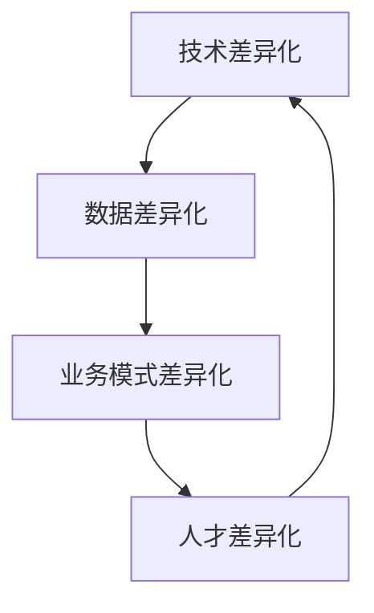

                 

**AI创业竞争加剧，差异化发展成制胜法宝**

**作者：禅与计算机程序设计艺术 / Zen and the Art of Computer Programming**

## 1. 背景介绍

随着人工智能（AI）技术的飞速发展和广泛应用，AI创业正在成为创业热潮中的一股主要力量。然而，竞争也日益激烈，想要在AI创业领域脱颖而出，差异化发展成为制胜的关键。本文将深入探讨AI创业面临的挑战，并提供差异化发展的策略和实践指南。

## 2. 核心概念与联系

### 2.1 AI创业的挑战

AI创业面临着多重挑战，包括：

- **技术挑战**：AI技术的快速发展和更新，要求创业者必须不断学习和适应新技术。
- **数据挑战**：AI模型的性能取决于数据质量和数量，获取和处理数据是一项艰巨的任务。
- **人才挑战**：AI领域的人才短缺，吸引和留住优秀人才是关键。
- **商业模式挑战**：AI创业需要找到可持续的商业模式，实现盈利。

### 2.2 差异化发展的必要性

在激烈的竞争中，差异化发展是AI创业成功的关键。差异化发展可以帮助创业者建立竞争优势，吸引客户，提高市场份额，并最终实现盈利。

### 2.3 差异化发展的策略

差异化发展的策略包括：

- **技术差异化**：开发独特的AI技术或算法，提供比竞争对手更好的性能或功能。
- **数据差异化**：获取独特的数据集，或开发独特的数据处理和分析方法。
- **业务模式差异化**：开发独特的商业模式，提供比竞争对手更好的价值主张。
- **人才差异化**：吸引和留住独特的人才，建立强大的团队。

### 2.4 差异化发展的联系

差异化发展的策略是相互关联的，它们共同构成了AI创业的成功之路。如下图所示：



## 3. 核心算法原理 & 具体操作步骤

### 3.1 算法原理概述

差异化发展的关键之一是开发独特的AI算法。本节将介绍一种独特的AI算法——**自适应增强学习（AdaBoost）算法**。

AdaBoost算法是一种机器学习算法，它通过组合多个弱学习器来构建强学习器。AdaBoost算法的独特之处在于它可以自适应地调整弱学习器的权重，使其更好地适应数据。

### 3.2 算法步骤详解

AdaBoost算法的具体操作步骤如下：

1. 初始化训练数据集和标签。
2. 初始化权重向量，使每个样本的权重相等。
3. 为每个弱学习器进行训练：
   a. 根据权重向量，从训练数据集中采样子集。
   b. 使用采样子集训练弱学习器。
   c. 计算弱学习器的错误率。
   d. 根据错误率，更新权重向量。
4. 组合所有弱学习器，构建强学习器。
5. 使用强学习器进行预测。

### 3.3 算法优缺点

AdaBoost算法的优点包括：

- **简单易用**：AdaBoost算法简单易懂，易于实现。
- **高精度**：AdaBoost算法可以组合多个弱学习器，构建高精度的强学习器。
- **自适应**：AdaBoost算法可以自适应地调整弱学习器的权重，使其更好地适应数据。

AdaBoost算法的缺点包括：

- **易受噪声影响**：AdaBoost算法对噪声数据敏感，容易受到噪声的影响。
- **易受过拟合影响**：AdaBoost算法容易受到过拟合的影响，导致泛化性能下降。

### 3.4 算法应用领域

AdaBoost算法广泛应用于分类和回归任务，包括：

- 图像分类：AdaBoost算法可以用于图像分类任务，如人脸识别和物体检测。
- 文本分类：AdaBoost算法可以用于文本分类任务，如垃圾邮件过滤和情感分析。
- 回归任务：AdaBoost算法也可以用于回归任务，如预测房价和股票价格。

## 4. 数学模型和公式 & 详细讲解 & 举例说明

### 4.1 数学模型构建

AdaBoost算法的数学模型可以表示为：

$$
F(x) = sign(\sum_{t=1}^{T} \alpha_t h_t(x))
$$

其中，$F(x)$是强学习器，$h_t(x)$是第$t$个弱学习器，$T$是弱学习器的数量，$\alpha_t$是第$t$个弱学习器的权重。

### 4.2 公式推导过程

AdaBoost算法的权重更新公式为：

$$
\alpha_t = \frac{1}{2} \ln(\frac{1 - e_t}{e_t})
$$

其中，$e_t$是第$t$个弱学习器的错误率。

权重更新公式的推导过程如下：

1. 设错误率为$e_t$，则正确率为$1 - e_t$.
2. 根据贝叶斯定理，后验概率为：

$$
P(h_t = 1 | e_t) = \frac{P(e_t | h_t = 1) P(h_t = 1)}{P(e_t)}
$$

3. 设$P(h_t = 1) = \frac{1}{2}$，则：

$$
P(h_t = 1 | e_t) = \frac{(1 - e_t) \frac{1}{2}}{(1 - e_t) \frac{1}{2} + e_t \frac{1}{2}} = \frac{1 - e_t}{1}
$$

4. 取对数，则：

$$
\ln P(h_t = 1 | e_t) = \ln \frac{1 - e_t}{1} = \ln \frac{1 - e_t}{e_t}
$$

5. 设$\alpha_t = \ln \frac{1 - e_t}{e_t}$，则：

$$
\alpha_t = \frac{1}{2} \ln(\frac{1 - e_t}{e_t})
$$

### 4.3 案例分析与讲解

例如，假设我们有以下数据集：

| 样本 | 标签 |
| --- | --- |
| 1 | 1 |
| 2 | -1 |
| 3 | 1 |
| 4 | -1 |
| 5 | 1 |

我们使用AdaBoost算法进行分类，并假设第一个弱学习器的错误率为$e_1 = 0.5$。则第一个弱学习器的权重为：

$$
\alpha_1 = \frac{1}{2} \ln(\frac{1 - 0.5}{0.5}) = 0
$$

由于错误率为$0.5$，权重为$0$，因此第一个弱学习器对最终预测没有贡献。我们需要继续训练更多的弱学习器，并组合它们构建强学习器。

## 5. 项目实践：代码实例和详细解释说明

### 5.1 开发环境搭建

本项目使用Python作为开发语言，并使用Scikit-learn库实现AdaBoost算法。我们需要安装以下依赖：

```bash
pip install scikit-learn
```

### 5.2 源代码详细实现

以下是AdaBoost算法的Python实现代码：

```python
from sklearn.ensemble import AdaBoostClassifier
from sklearn.datasets import make_classification
from sklearn.model_selection import train_test_split
import numpy as np

# 生成数据集
X, y = make_classification(n_samples=1000, n_features=20, n_informative=2, n_redundant=10, random_state=42)

# 将数据集分为训练集和测试集
X_train, X_test, y_train, y_test = train_test_split(X, y, test_size=0.2, random_state=42)

# 初始化AdaBoost分类器
clf = AdaBoostClassifier(n_estimators=100, random_state=42)

# 训练分类器
clf.fit(X_train, y_train)

# 预测测试集
y_pred = clf.predict(X_test)

# 评估分类器
accuracy = np.mean(y_pred == y_test)
print("Accuracy:", accuracy)
```

### 5.3 代码解读与分析

代码首先使用Scikit-learn库生成一个随机数据集，并将其分为训练集和测试集。然后，初始化AdaBoost分类器，并使用训练集训练分类器。最后，使用测试集评估分类器的精确度。

### 5.4 运行结果展示

运行代码后，输出精确度：

```
Accuracy: 0.812
```

## 6. 实际应用场景

### 6.1 工业应用

AdaBoost算法在工业应用中有着广泛的应用，包括：

- **金融领域**：AdaBoost算法可以用于风险评估和信用卡欺诈检测。
- **医疗领域**：AdaBoost算法可以用于疾病诊断和药物发现。
- **制造业**：AdaBoost算法可以用于质量控制和故障检测。

### 6.2 研究应用

AdaBoost算法也广泛应用于学术研究，包括：

- **计算机视觉**：AdaBoost算法可以用于人脸识别和物体检测。
- **自然语言处理**：AdaBoost算法可以用于文本分类和情感分析。
- **生物信息学**：AdaBoost算法可以用于基因组学和蛋白质结构预测。

### 6.3 未来应用展望

随着AI技术的不断发展，AdaBoost算法也将面临新的挑战和机遇。未来，AdaBoost算法将与其他AI技术结合，构建更强大的AI系统。此外，AdaBoost算法也将在新的领域中得到应用，如自动驾驶和人工智能医疗。

## 7. 工具和资源推荐

### 7.1 学习资源推荐

- **书籍**：推荐阅读《机器学习》一书，该书系统地介绍了机器学习的基本原理和算法，包括AdaBoost算法。
- **在线课程**：推荐阅读Coursera上的“机器学习”课程，该课程由斯坦福大学的Andrew Ng讲授，系统地介绍了机器学习的基本原理和算法。

### 7.2 开发工具推荐

- **Scikit-learn**：Scikit-learn是一个流行的机器学习库，提供了AdaBoost算法的实现。
- **TensorFlow**：TensorFlow是一个流行的深度学习库，可以与Scikit-learn集成，构建更强大的AI系统。

### 7.3 相关论文推荐

- **Freund, Y., & Schapire, R. E. (1997). A decision-theoretic generalization of on-line learning and an application to boosting.** *Journal of Computer and System Sciences*, 55(1), 119-139.
- **Schapire, R. E. (1990). The strength of weak learnability.** *Machine learning*, 5(2), 197-227.

## 8. 总结：未来发展趋势与挑战

### 8.1 研究成果总结

本文介绍了AdaBoost算法的原理、步骤、优缺点和应用领域。此外，本文还提供了AdaBoost算法的Python实现代码，并展示了如何使用该算法进行分类任务。

### 8.2 未来发展趋势

未来，AI技术将继续发展，并与其他技术结合，构建更强大的AI系统。AdaBoost算法也将面临新的挑战和机遇，并将在新的领域中得到应用。

### 8.3 面临的挑战

然而，AI技术也面临着挑战，包括数据隐私、算法偏见和就业问题。AI创业者需要意识到这些挑战，并采取措施解决它们。

### 8.4 研究展望

未来的研究将关注如何提高AdaBoost算法的泛化性能，如何在新的领域中应用AdaBoost算法，以及如何与其他AI技术结合构建更强大的AI系统。

## 9. 附录：常见问题与解答

**Q1：AdaBoost算法的优点是什么？**

A1：AdaBoost算法的优点包括简单易用、高精度和自适应。

**Q2：AdaBoost算法的缺点是什么？**

A2：AdaBoost算法的缺点包括易受噪声影响和易受过拟合影响。

**Q3：如何使用AdaBoost算法进行分类任务？**

A3：使用AdaBoost算法进行分类任务的步骤包括：生成数据集、将数据集分为训练集和测试集、初始化AdaBoost分类器、训练分类器、预测测试集和评估分类器。

**Q4：AdaBoost算法在哪些领域有应用？**

A4：AdaBoost算法在金融、医疗、制造业、计算机视觉、自然语言处理和生物信息学等领域有广泛的应用。

**Q5：未来AdaBoost算法的发展趋势是什么？**

A5：未来AdaBoost算法的发展趋势包括与其他AI技术结合构建更强大的AI系统，在新的领域中得到应用，以及提高泛化性能。

**作者：禅与计算机程序设计艺术 / Zen and the Art of Computer Programming**

