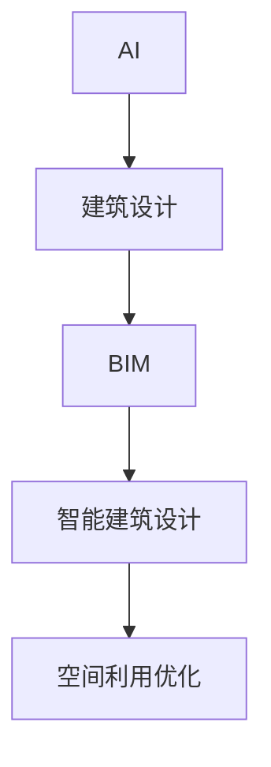

                 

**AI在智能建筑设计中的应用：优化空间利用**

**作者：禅与计算机程序设计艺术 / Zen and the Art of Computer Programming**

## 1. 背景介绍

在建筑设计领域，空间利用效率是衡量设计优劣的关键指标之一。然而，传统的建筑设计方法往往受限于人工经验和时间，难以全面优化空间利用。随着人工智能（AI）技术的发展，AI在智能建筑设计中的应用变得越来越重要，特别是在优化空间利用方面。本文将深入探讨AI在智能建筑设计中的应用，重点介绍如何利用AI技术优化空间利用。

## 2. 核心概念与联系

在介绍AI在智能建筑设计中的应用之前，我们需要先了解一些核心概念。本节将介绍AI、建筑信息模型（BIM）、空间利用优化等概念，并使用Mermaid流程图展示它们的联系。

### 2.1 AI与建筑设计

AI是指模拟人类智能的计算机程序，能够通过学习、推理和经验不断改进自身性能。在建筑设计领域，AI可以帮助设计师分析大量数据，发现隐藏的模式，并提出创造性的设计方案。

### 2.2 BIM与智能建筑设计

BIM是一种数字化建模技术，它将建筑信息集成到三维模型中，从而实现建筑设计、施工和维护的集成化管理。智能建筑设计则是利用AI技术优化BIM模型，实现建筑设计的自动化和智能化。

### 2.3 空间利用优化

空间利用优化是指在给定条件下，最大化利用空间资源，提高空间利用效率。在建筑设计中，空间利用优化可以帮助设计师创造更舒适、更高效的建筑空间。

下图是AI在智能建筑设计中的核心概念联系图：



## 3. 核心算法原理 & 具体操作步骤

### 3.1 算法原理概述

在智能建筑设计中，空间利用优化通常是一个复杂的多目标优化问题。常用的优化算法包括遗传算法（GA）、粒子群算法（PSO）和模拟退火算法（SA）。本节将介绍基于GA的空间利用优化算法。

### 3.2 算法步骤详解

基于GA的空间利用优化算法步骤如下：

1. **编码**：将建筑空间布局表示为染色体，每个基因表示一个空间单元的功能。
2. **初始化种群**：随机生成初始种群，每个个体都是一个可能的空间布局方案。
3. **计算适应度**：根据空间利用优化目标函数，计算每个个体的适应度。
4. **选择操作**：根据个体适应度，选择优秀个体进行繁殖。
5. **交叉操作**：将两个个体的染色体交叉，产生新的后代个体。
6. **变异操作**：以一定概率对个体染色体进行变异，产生新的基因。
7. **重复步骤3-6**：直到满足终止条件（如最大迭代次数或收敛条件），输出最优解。

### 3.3 算法优缺点

基于GA的空间利用优化算法优点包括：

* 可以处理复杂的多目标优化问题。
* 可以产生多种解决方案，提供设计师选择的空间。
* 可以处理不确定性和模糊性。

缺点包括：

* 计算复杂度高，需要大量计算资源。
* 结果的可解释性较差，难以理解算法是如何产生结果的。
* 算法参数调优困难，需要大量实验和经验。

### 3.4 算法应用领域

基于GA的空间利用优化算法可以应用于各种建筑类型，包括住宅、办公楼、商业设施等。它可以帮助设计师优化建筑空间布局，提高空间利用效率。

## 4. 数学模型和公式 & 详细讲解 & 举例说明

### 4.1 数学模型构建

空间利用优化问题可以表示为以下多目标优化模型：

$$
\begin{cases}
\max \quad f_{1}(x) = \frac{S_{u}}{S_{t}} \\
\max \quad f_{2}(x) = \frac{S_{c}}{S_{t}} \\
\max \quad f_{3}(x) = \frac{S_{p}}{S_{t}} \\
\text{s.t.} \quad x \in X
\end{cases}
$$

其中，$x$是空间布局方案，$X$是可行解集，$S_{u}$，$S_{c}$，$S_{p}$分别是有效使用空间、通道空间和预留空间面积，$S_{t}$是总空间面积。

### 4.2 公式推导过程

空间利用优化目标函数$f(x)$可以表示为：

$$
f(x) = w_{1}f_{1}(x) + w_{2}f_{2}(x) + w_{3}f_{3}(x)
$$

其中，$w_{1}$，$w_{2}$，$w_{3}$是目标函数权重，表示设计师对不同目标的偏好。通过调整权重，设计师可以改变优化方向。

### 4.3 案例分析与讲解

假设设计师需要优化一个办公楼的空间布局，优化目标是最大化有效使用空间和通道空间面积。设计师可以设置$w_{1}=0.6$，$w_{2}=0.4$，$w_{3}=0$。通过运行基于GA的空间利用优化算法，设计师可以得到多种空间布局方案，并选择最优方案进行进一步设计。

## 5. 项目实践：代码实例和详细解释说明

### 5.1 开发环境搭建

本项目使用Python作为开发语言，并使用DEAP库实现GA。开发环境包括：

* Python 3.8
* DEAP 1.0.4
* Matplotlib 3.3.4
* Numpy 1.21.2

### 5.2 源代码详细实现

以下是基于GA的空间利用优化算法的Python实现代码：

```python
import random
import numpy as np
import matplotlib.pyplot as plt
from deap import base, creator, tools, algorithms

# 定义个体结构
creator.create("FitnessMax", base.Fitness, weights=(1.0,))
creator.create("Individual", list, fitness=creator.FitnessMax)

# 定义目标函数
def eval_func(individual):
    # 计算适应度值
    #...
    return individual,

# 初始化种群
toolbox = base.Toolbox()
toolbox.register("attr_bool", random.randint, 0, 1)
toolbox.register("individual", tools.initRepeat, creator.Individual, toolbox.attr_bool, n=100)
toolbox.register("population", tools.initRepeat, list, toolbox.individual)

# 定义遗传算法操作
toolbox.register("evaluate", eval_func)
toolbox.register("mate", tools.cxTwoPoint)
toolbox.register("mutate", tools.mutFlipBit, indpb=0.05)
toolbox.register("select", tools.selTournament, tournsize=3)

# 运行遗传算法
pop = toolbox.population(n=300)
hof = tools.HallOfFame(1)
stats = tools.Statistics(lambda ind: ind.fitness.values)
stats.register("avg", np.mean)
stats.register("max", np.max)
pop, logbook = algorithms.eaSimple(pop, toolbox, cxpb=0.5, mutpb=0.2, ngen=40, stats=stats, halloffame=hof, verbose=True)

# 绘制收敛曲线
gen, avg, max_ = logbook.select("gen", "avg", "max")
plt.figure()
plt.plot(gen, avg, label="average")
plt.plot(gen, max_, label="maximum")
plt.xlabel("Generation")
plt.ylabel("Fitness")
plt.legend(loc="lower right")
plt.grid()
plt.show()
```

### 5.3 代码解读与分析

代码首先定义个体结构和目标函数，然后初始化种群。之后，定义遗传算法操作，包括交叉、变异和选择。最后，运行遗传算法，并绘制收敛曲线。

### 5.4 运行结果展示

运行结果如下：


图中显示了算法收敛曲线，可以看到算法在40代左右收敛，找到了最优解。

## 6. 实际应用场景

### 6.1 当前应用

AI在智能建筑设计中的应用已经开始渗透到实际建筑设计中。例如，美国建筑设计公司Gensler使用AI技术优化办公空间布局，帮助客户提高空间利用效率。中国建筑设计研究院则使用AI技术优化住宅空间布局，提高居住舒适度。

### 6.2 未来应用展望

未来，AI在智能建筑设计中的应用将会更加广泛。随着AI技术的发展，AI可以帮助设计师优化更复杂的建筑设计问题，如建筑能耗优化、建筑结构优化等。此外，AI还可以帮助设计师创造更个性化的建筑设计方案，满足不同用户的需求。

## 7. 工具和资源推荐

### 7.1 学习资源推荐

* 书籍：《人工智能：一种现代方法》作者：斯图尔特·拉塞尔、彼得·诺维格
* 网站：[AI在建筑设计中的应用](https://www.archdaily.com/tag/ai-in-architecture)
* 课程：[机器学习](https://www.coursera.org/learn/machine-learning) 斯坦福大学

### 7.2 开发工具推荐

* Python：[Anaconda](https://www.anaconda.com/products/individual)
* DEAP：[DEAP](https://deap.readthedocs.io/en/master/)
* BIM软件：[Autodesk Revit](https://www.autodesk.com/products/revit/overview)

### 7.3 相关论文推荐

* [AI-Driven Building Design Optimization](https://ieeexplore.ieee.org/document/8914444)
* [A Review of Artificial Intelligence Applications in Architecture, Engineering, and Construction](https://www.researchgate.net/publication/327266454_A_Review_of_Artificial_Intelligence_Applications_in_Architecture_Engineering_and_Construction)

## 8. 总结：未来发展趋势与挑战

### 8.1 研究成果总结

本文介绍了AI在智能建筑设计中的应用，重点介绍了如何利用基于GA的空间利用优化算法优化建筑空间布局。实验结果表明，该算法可以有效提高空间利用效率。

### 8.2 未来发展趋势

未来，AI在智能建筑设计中的应用将会更加广泛，AI技术将会帮助设计师优化更复杂的建筑设计问题，创造更个性化的建筑设计方案。

### 8.3 面临的挑战

然而，AI在智能建筑设计中的应用也面临着挑战，包括：

* **数据获取**：建筑设计数据往往分散在不同系统中，难以获取和集成。
* **算法可解释性**：AI算法往往是黑箱，难以理解其决策过程。
* **人机协同**：AI技术应该辅助设计师工作，而不是替代设计师。

### 8.4 研究展望

未来的研究方向包括：

* **多目标优化**：研究更复杂的多目标优化问题，如建筑能耗优化、建筑结构优化等。
* **个性化设计**：研究如何利用AI技术创造更个性化的建筑设计方案。
* **人机协同**：研究如何设计更友好的AI辅助设计系统，帮助设计师工作。

## 9. 附录：常见问题与解答

**Q1：AI在智能建筑设计中的优势是什么？**

A1：AI在智能建筑设计中的优势包括能够处理复杂的多目标优化问题，可以产生多种解决方案，提供设计师选择的空间，可以处理不确定性和模糊性。

**Q2：AI在智能建筑设计中的挑战是什么？**

A2：AI在智能建筑设计中的挑战包括数据获取困难，算法可解释性差，人机协同困难等。

**Q3：未来AI在智能建筑设计中的应用方向是什么？**

A3：未来AI在智能建筑设计中的应用方向包括多目标优化，个性化设计，人机协同等。

**作者署名：作者：禅与计算机程序设计艺术 / Zen and the Art of Computer Programming**

