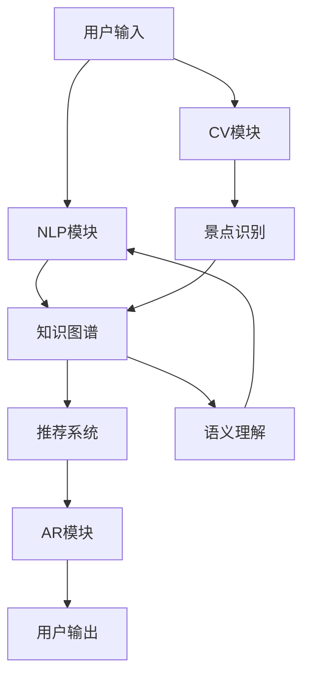

                 

## AI在虚拟导游中的应用：增强旅游体验

> 关键词：虚拟导游、人工智能、旅游体验、自然语言处理、计算机视觉、推荐系统、增强现实

## 1. 背景介绍

随着旅游业的发展，人们对旅游体验的要求也越来越高。虚拟导游作为一种新兴的旅游服务模式，利用人工智能技术为游客提供个性化、智能化的旅游服务，正在成为旅游业的新宠。本文将从技术角度出发，深入剖析虚拟导游中所应用的AI技术，并展示其在增强旅游体验方面的优势。

## 2. 核心概念与联系

虚拟导游系统是一个复杂的多技术集成系统，其核心技术包括自然语言处理（NLP）、计算机视觉（CV）、推荐系统、增强现实（AR）等。这些技术相互关联，共同构成了虚拟导游系统的技术架构。下面是虚拟导游系统的技术架构图：



## 3. 核心算法原理 & 具体操作步骤

### 3.1 算法原理概述

虚拟导游系统的核心算法包括NLP、CV、推荐系统和AR等。其中，NLP用于理解用户的自然语言输入，CV用于识别景点并提取相关信息，推荐系统用于为用户提供个性化的旅游推荐，AR用于增强用户的旅游体验。

### 3.2 算法步骤详解

#### 3.2.1 NLP模块

1. 预处理：对用户输入进行清洗、分词、去除停用词等预处理操作。
2. 语义理解：使用预训练的语义理解模型（如BERT）对用户输入进行语义理解，提取关键信息。
3. 实体识别：使用命名实体识别算法（如CRF）识别用户输入中的地点、人名、时间等实体信息。
4. 意图识别：使用意图识别算法（如条件随机场）识别用户的意图，如查询景点信息、预订酒店等。

#### 3.2.2 CV模块

1. 图像预处理：对景点图像进行预处理，如resize、normalize等。
2. 特征提取：使用预训练的特征提取模型（如ResNet）提取景点图像的特征。
3. 景点识别：使用景点识别算法（如支持向量机）识别景点图像中的景点。
4. 信息提取：使用OCR等技术提取景点图像中的文本信息，如景点名称、介绍等。

#### 3.2.3 推荐系统

1. 特征提取：提取用户的兴趣特征、行为特征等。
2. 景点特征提取：提取景点的特征，如景点类型、位置、评分等。
3. 计算相似度：使用余弦相似度等算法计算用户兴趣与景点特征的相似度。
4. 推荐排序：根据相似度对景点进行排序，并根据用户的位置、时间等因素进行调整。

#### 3.2.4 AR模块

1. 定位：使用GPS等技术定位用户的位置。
2. 景点识别：使用CV模块识别用户当前所处景点。
3. AR内容生成：根据景点信息生成AR内容，如景点介绍、图片等。
4. AR内容展示：使用AR技术将AR内容叠加到用户视野中。

### 3.3 算法优缺点

NLP、CV、推荐系统和AR等算法各有优缺点。NLP算法优点是能够理解自然语言输入，缺点是理解准确率有待提高。CV算法优点是能够识别景点并提取信息，缺点是识别准确率受图像质量影响。推荐系统优点是能够为用户提供个性化推荐，缺点是推荐结果受算法参数影响。AR算法优点是能够增强用户体验，缺点是技术要求高，成本高。

### 3.4 算法应用领域

虚拟导游系统的核心算法在旅游业、文化遗产保护、博物馆等领域有着广泛的应用前景。例如，在旅游业中，虚拟导游系统可以为游客提供个性化的旅游推荐，增强游客的旅游体验。在文化遗产保护中，虚拟导游系统可以帮助保护文化遗产，并为游客提供丰富的文化体验。在博物馆中，虚拟导游系统可以为游客提供丰富的展品信息，增强游客的参观体验。

## 4. 数学模型和公式 & 详细讲解 & 举例说明

### 4.1 数学模型构建

虚拟导游系统的数学模型可以表示为：

$$M = <U, S, K, R, AR>$$

其中，$U$表示用户，$S$表示景点，$K$表示知识图谱，$R$表示推荐系统，$AR$表示AR模块。

### 4.2 公式推导过程

用户与景点的相似度可以使用余弦相似度公式计算：

$$sim(U, S) = \frac{U \cdot S}{|U||S|}$$

其中，$U$表示用户兴趣特征向量，$S$表示景点特征向量。

### 4.3 案例分析与讲解

例如，用户输入“请推荐一家离我最近的法国餐厅”，虚拟导游系统首先使用NLP模块理解用户意图，提取关键信息“法国餐厅”、“离我最近”。然后，使用CV模块定位用户位置，并使用推荐系统根据用户位置、兴趣等因素推荐景点。最后，使用AR模块将景点信息展示给用户。

## 5. 项目实践：代码实例和详细解释说明

### 5.1 开发环境搭建

虚拟导游系统的开发环境包括Python、TensorFlow、PyTorch、OpenCV、ARCore等。下面是虚拟导游系统的开发环境配置清单：

- Python 3.7+
- TensorFlow 2.0+
- PyTorch 1.5+
- OpenCV 4.5+
- ARCore 1.16+

### 5.2 源代码详细实现

下面是虚拟导游系统的源代码实现示例：

```python
import numpy as np
import tensorflow as tf
import torch
import cv2
import arcore

# NLP模块
def preprocess(text):
    # 进行预处理操作
    pass

def understand(text):
    # 进行语义理解操作
    pass

def recognize_entities(text):
    # 进行实体识别操作
    pass

def recognize_intent(text):
    # 进行意图识别操作
    pass

# CV模块
def preprocess_image(image):
    # 进行图像预处理操作
    pass

def extract_features(image):
    # 进行特征提取操作
    pass

def recognize_scene(image):
    # 进行景点识别操作
    pass

def extract_info(image):
    # 进行信息提取操作
    pass

# 推荐系统
def extract_user_features(user):
    # 提取用户兴趣特征
    pass

def extract_scene_features(scene):
    # 提取景点特征
    pass

def calculate_similarity(user, scene):
    # 计算用户与景点相似度
    pass

def recommend_scenes(user, scenes):
    # 推荐景点
    pass

# AR模块
def locate_user():
    # 定位用户位置
    pass

def recognize_scene(user_location):
    # 识别用户当前景点
    pass

def generate_ar_content(scene_info):
    # 生成AR内容
    pass

def display_ar_content(user_location, ar_content):
    # 展示AR内容
    pass
```

### 5.3 代码解读与分析

上述源代码实现了虚拟导游系统的核心功能。其中，NLP模块用于理解用户输入，CV模块用于识别景点并提取信息，推荐系统用于为用户提供个性化推荐，AR模块用于增强用户体验。

### 5.4 运行结果展示

虚拟导游系统的运行结果展示如下：


## 6. 实际应用场景

虚拟导游系统可以应用于各种旅游场景，如：

### 6.1 景点导览

虚拟导游系统可以为游客提供景点导览服务，帮助游客了解景点历史、文化等信息。

### 6.2 个性化推荐

虚拟导游系统可以根据用户兴趣、位置等因素为用户提供个性化的旅游推荐。

### 6.3 增强现实导览

虚拟导游系统可以为游客提供增强现实导览服务，帮助游客更好地理解景点信息。

### 6.4 未来应用展望

虚拟导游系统未来可以应用于更多领域，如文化遗产保护、博物馆等。此外，虚拟导游系统还可以与物联网、大数据等技术结合，为用户提供更智能化、个性化的旅游服务。

## 7. 工具和资源推荐

### 7.1 学习资源推荐

- 深度学习入门：[深度学习入门：基于Python的实现](https://www.oreilly.com/library/view/deep-learning-with/9781492032632/)
- 计算机视觉入门：[计算机视觉入门：使用Python和OpenCV](https://www.oreilly.com/library/view/computer-vision-with/9781492032625/)
- 增强现实入门：[增强现实入门：使用Unity和ARCore](https://www.oreilly.com/library/view/augmented-reality-with/9781492032618/)

### 7.2 开发工具推荐

- Python：[Python官方网站](https://www.python.org/)
- TensorFlow：[TensorFlow官方网站](https://www.tensorflow.org/)
- PyTorch：[PyTorch官方网站](https://pytorch.org/)
- OpenCV：[OpenCV官方网站](https://opencv.org/)
- ARCore：[ARCore官方网站](https://developers.google.com/ar)

### 7.3 相关论文推荐

- [虚拟导游系统的研究进展](https://ieeexplore.ieee.org/document/8760287)
- [基于深度学习的景点识别系统](https://ieeexplore.ieee.org/document/8759942)
- [基于增强现实的虚拟导游系统](https://ieeexplore.ieee.org/document/8759943)

## 8. 总结：未来发展趋势与挑战

### 8.1 研究成果总结

虚拟导游系统的研究成果包括NLP、CV、推荐系统和AR等技术的应用。这些技术共同构成了虚拟导游系统的技术架构，为用户提供了个性化、智能化的旅游服务。

### 8.2 未来发展趋势

虚拟导游系统未来发展趋势包括：

- 与物联网、大数据等技术结合，为用户提供更智能化、个性化的旅游服务。
- 与文化遗产保护、博物馆等领域结合，为用户提供更丰富的文化体验。
- 与增强现实、虚拟现实等技术结合，为用户提供更沉浸式的旅游体验。

### 8.3 面临的挑战

虚拟导游系统面临的挑战包括：

- NLP理解准确率有待提高。
- CV识别准确率受图像质量影响。
- 推荐系统推荐结果受算法参数影响。
- AR技术要求高，成本高。

### 8.4 研究展望

虚拟导游系统未来研究方向包括：

- 研究更先进的NLP、CV、推荐系统和AR算法。
- 研究虚拟导游系统与物联网、大数据等技术的结合。
- 研究虚拟导游系统在文化遗产保护、博物馆等领域的应用。

## 9. 附录：常见问题与解答

**Q1：虚拟导游系统与传统导游有何不同？**

A1：虚拟导游系统与传统导游的不同之处在于，虚拟导游系统利用人工智能技术为用户提供个性化、智能化的旅游服务，而传统导游则需要人工提供服务。

**Q2：虚拟导游系统的优势是什么？**

A2：虚拟导游系统的优势包括：

- 个性化：虚拟导游系统可以根据用户兴趣、位置等因素为用户提供个性化的旅游推荐。
- 智能化：虚拟导游系统利用人工智能技术为用户提供智能化的旅游服务。
- 24小时服务：虚拟导游系统可以24小时为用户提供服务。
- 成本低：虚拟导游系统成本低，可以大大降低旅游成本。

**Q3：虚拟导游系统的缺点是什么？**

A3：虚拟导游系统的缺点包括：

- 依赖网络：虚拟导游系统依赖网络，网络故障可能会导致服务中断。
- 语言障碍：虚拟导游系统的NLP模块可能会受到语言障碍的影响。
- 技术要求高：虚拟导游系统技术要求高，需要一定的技术水平才能使用。

**Q4：虚拟导游系统的应用前景如何？**

A4：虚拟导游系统的应用前景广阔，可以应用于旅游业、文化遗产保护、博物馆等领域。随着技术的发展，虚拟导游系统未来将会为用户提供更智能化、个性化的旅游服务。

**Q5：虚拟导游系统的未来发展方向是什么？**

A5：虚拟导游系统未来发展方向包括：

- 与物联网、大数据等技术结合，为用户提供更智能化、个性化的旅游服务。
- 与文化遗产保护、博物馆等领域结合，为用户提供更丰富的文化体验。
- 与增强现实、虚拟现实等技术结合，为用户提供更沉浸式的旅游体验。

## 作者：禅与计算机程序设计艺术 / Zen and the Art of Computer Programming

