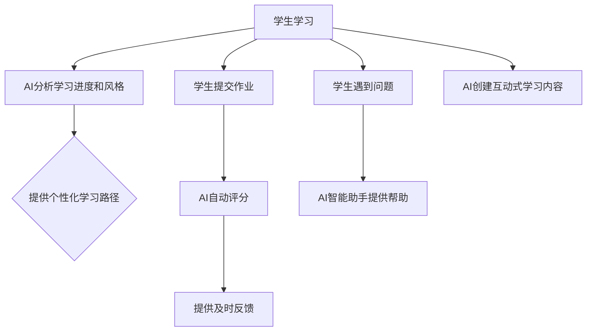

                 

**AI驱动的创新：人类计算在教育中的价值**

**作者：禅与计算机程序设计艺术 / Zen and the Art of Computer Programming**

## 1. 背景介绍

人工智能（AI）的发展正在各行各业引发革命，教育也不例外。AI在教育中的应用，从个性化学习路径到自动评分，再到智能助手，都在改变着我们传统的教育方式。然而，在讨论AI在教育中的作用时，我们不能忽略人类计算的价值。人类计算，指的是人类独有的认知和推理能力。本文将探讨AI如何驱动教育创新，以及人类计算在其中的价值。

## 2. 核心概念与联系

### 2.1 AI在教育中的作用

AI在教育中的作用可以总结为以下几点：

- **个性化学习**：AI可以分析学生的学习进度和风格，提供个性化的学习路径。
- **自动评分**：AI可以评分，减轻教师的负担，并提供更及时的反馈。
- **智能助手**：AI可以提供24/7的学习支持，帮助学生解决问题。
- **内容创建**：AI可以帮助创建互动式学习内容，提高学生的参与度。

### 2.2 Mermaid流程图



### 2.3 人类计算的价值

人类计算的价值在教育中体现为：

- **创造力**：人类独有的创造力是AI无法替代的。
- **批判性思维**：人类可以质疑、分析、评估信息，这是AI目前无法做到的。
- **情感理解**：人类可以理解和表达情感，这是AI目前无法做到的。
- **道德判断**：人类可以做出道德判断，这是AI目前无法做到的。

## 3. 核心算法原理 & 具体操作步骤

### 3.1 算法原理概述

AI在教育中的应用涉及多种算法，包括机器学习算法（如决策树、神经网络）、自然语言处理算法（如文本分类、语义理解）和推荐算法（如协同过滤、内容过滤）。

### 3.2 算法步骤详解

以个性化学习路径为例，算法步骤如下：

1. **数据收集**：收集学生的学习数据，包括学习进度、学习风格、学习成果等。
2. **特征提取**：从数据中提取特征，如学习进度、学习时间、学习难度等。
3. **模型训练**：使用机器学习算法（如决策树、神经网络）训练模型，预测学生的学习路径。
4. **路径生成**：根据预测结果，生成个性化的学习路径。
5. **路径评估**：评估学习路径的有效性，并根据需要调整模型。

### 3.3 算法优缺点

优点包括：

- **个性化**：AI可以提供个性化的学习路径，提高学习效果。
- **高效**：AI可以自动评分和提供帮助，减轻教师的负担。

缺点包括：

- **数据依赖**：AI的有效性取决于数据的质量和量。
- **解释性**：AI的决策过程通常是“黑箱”的，难以解释。

### 3.4 算法应用领域

AI在教育中的应用领域包括：

- **K-12教育**：个性化学习路径、自动评分、智能助手等。
- **高等教育**：个性化学习路径、内容创建、智能助手等。
- **职业培训**：个性化学习路径、内容创建、智能助手等。

## 4. 数学模型和公式 & 详细讲解 & 举例说明

### 4.1 数学模型构建

个性化学习路径的数学模型可以表示为：

$$P(s) = f(D(s), M(s))$$

其中，$P(s)$表示学生$s$的学习路径，$D(s)$表示学生$s$的学习数据，$M(s)$表示学习路径生成模型，$f$表示模型的映射函数。

### 4.2 公式推导过程

推导过程如下：

1. 定义学习数据集$D = \{D(s_1), D(s_2),..., D(s_n)\}$, 其中$D(s_i)$表示学生$s_i$的学习数据。
2. 定义学习路径集$P = \{P(s_1), P(s_2),..., P(s_n)\}$, 其中$P(s_i)$表示学生$s_i$的学习路径。
3. 定义学习路径生成模型$M = \{M(s_1), M(s_2),..., M(s_n)\}$, 其中$M(s_i)$表示学生$s_i$的学习路径生成模型。
4. 定义映射函数$f: D \times M \rightarrow P$, 其中$f(D(s), M(s)) = P(s)$。
5. 使用机器学习算法（如决策树、神经网络）训练模型$M$, 使得$P$与$D$的关系最接近$f(D, M)$。

### 4.3 案例分析与讲解

例如，假设我们有以下数据：

- 学生$s_1$的学习数据$D(s_1) = \{学习进度=50\%, 学习风格=视频, 学习成果=B\}$
- 学习路径集$P = \{P(s_1), P(s_2),..., P(s_n)\}$, 其中$P(s_i)$表示学生$s_i$的学习路径。
- 学习路径生成模型$M = \{M(s_1), M(s_2),..., M(s_n)\}$, 其中$M(s_i)$表示学生$s_i$的学习路径生成模型。
- 定义映射函数$f: D \times M \rightarrow P$, 其中$f(D(s), M(s)) = P(s)$。
- 使用机器学习算法（如决策树、神经网络）训练模型$M$, 使得$P$与$D$的关系最接近$f(D, M)$。

## 5. 项目实践：代码实例和详细解释说明

### 5.1 开发环境搭建

本项目使用Python作为编程语言，并使用以下库：

- **Pandas**：数据处理
- **Scikit-learn**：机器学习
- **Matplotlib**：可视化

### 5.2 源代码详细实现

以下是个性化学习路径生成算法的伪代码：

```python
import pandas as pd
from sklearn.tree import DecisionTreeClassifier

# 读取学习数据
data = pd.read_csv('learning_data.csv')

# 提取特征
features = ['学习进度', '学习风格', '学习成果']

# 训练模型
model = DecisionTreeClassifier()
model.fit(data[features], data['学习路径'])

# 生成学习路径
def generate_path(learning_progress, learning_style, learning_outcome):
    path = model.predict([[learning_progress, learning_style, learning_outcome]])
    return path

# 测试
print(generate_path(50, '视频', 'B'))
```

### 5.3 代码解读与分析

代码首先读取学习数据，然后提取特征。之后，使用决策树算法训练模型。生成学习路径的函数使用训练好的模型预测学习路径。

### 5.4 运行结果展示

运行结果为预测的学习路径。

## 6. 实际应用场景

### 6.1 当前应用

AI在教育中的应用已经开始渗透到各个领域，从K-12教育到高等教育，从个性化学习路径到智能助手。

### 6.2 未来应用展望

未来，AI在教育中的应用将会更加广泛，包括：

- **智能内容创建**：AI可以帮助创建更丰富、更互动的学习内容。
- **虚拟现实（VR）和增强现实（AR）**：AI可以结合VR和AR，提供更生动的学习体验。
- **人工智能伦理教育**：AI可以帮助学生理解AI的伦理和道德问题。

## 7. 工具和资源推荐

### 7.1 学习资源推荐

- ** Coursera**：提供AI在教育中的应用的在线课程。
- **Udacity**：提供AI和机器学习的在线课程。
- **YouTube**：提供大量的AI和机器学习视频教程。

### 7.2 开发工具推荐

- **Python**：广泛用于AI和机器学习。
- **TensorFlow**：用于构建和训练神经网络。
- **PyTorch**：用于构建和训练神经网络。

### 7.3 相关论文推荐

- **Siemens, P. G. (2013). Educational data mining. Foundations and Trends® in Web Science, 7(1), 1-144.**
- **Holmes, W., Bialik, M., & Fadel, C. (2019). Artificial intelligence in education: Promises and implications for teaching and learning. Center for Curriculum Redesign.**

## 8. 总结：未来发展趋势与挑战

### 8.1 研究成果总结

本文总结了AI在教育中的作用，介绍了个性化学习路径的算法原理，并提供了代码实例。

### 8.2 未来发展趋势

AI在教育中的应用将会更加广泛，包括智能内容创建、VR和AR、人工智能伦理教育等。

### 8.3 面临的挑战

挑战包括数据隐私、数字鸿沟、AI伦理等。

### 8.4 研究展望

未来的研究可以关注AI伦理、AI在教育中的长期影响等。

## 9. 附录：常见问题与解答

**Q：AI会取代教师吗？**

**A：**AI不会取代教师，而是会改变教师的角色。教师的角色将更多地转向指导和支持学生的学习。

**Q：AI在教育中的应用是否公平？**

**A：**AI在教育中的应用需要考虑公平性问题。例如，个性化学习路径需要确保每个学生都有相同的学习机会。

**Q：AI在教育中的应用是否安全？**

**A：**AI在教育中的应用需要考虑数据隐私和安全问题。例如，学习数据需要得到学生和家长的同意，并需要保护学生的隐私。

**作者：禅与计算机程序设计艺术 / Zen and the Art of Computer Programming**

