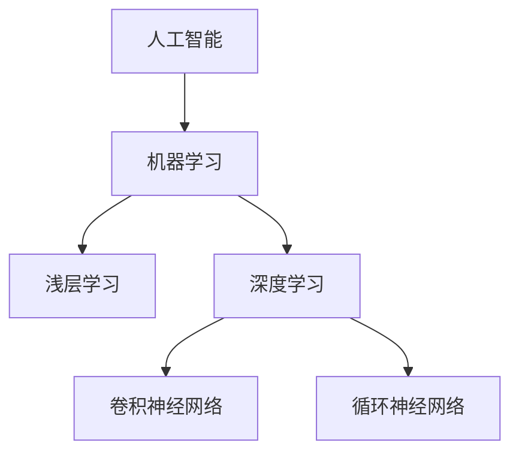

                 

**人工智能的未来发展**

**作者：禅与计算机程序设计艺术 / Zen and the Art of Computer Programming**

## 1. 背景介绍

人工智能（AI）自诞生以来，已从一项学术实验发展为商业和技术领域的关键驱动因素。从搜索引擎到自动驾驶汽车，AI无处不在。然而，随着AI技术的不断发展，我们也面临着一系列挑战和未解决的问题。本文将探讨人工智能的当前状态，其核心概念和算法，以及未来的发展趋势。

## 2. 核心概念与联系

### 2.1 机器学习与深度学习

机器学习（ML）是AI的一个分支，它使计算机能够从数据中学习，而无需被明确编程。深度学习（DL）是机器学习的一个子集，它使用神经网络模型来模拟人类大脑的学习过程。



### 2.2 监督学习、非监督学习与强化学习

- 监督学习：模型从已标记的数据中学习，预测新数据的标签。
- 非监督学习：模型从未标记的数据中学习，寻找数据的内在结构。
- 强化学习：智能体在环境中学习，通过尝试各种行动来最大化回报。

## 3. 核心算法原理 & 具体操作步骤

### 3.1 算法原理概述

本节将重点介绍两种关键算法：梯度下降和反向传播。

### 3.2 算法步骤详解

#### 3.2.1 梯度下降

1. 初始化模型参数。
2. 计算当前参数下的成本函数值。
3. 计算梯度，即模型参数对成本函数的偏导数。
4. 更新模型参数，使其沿梯度下降的方向移动。
5. 重复步骤2-4，直到模型收敛。

#### 3.2.2 反向传播

1. 正向传播：计算网络的输出。
2. 计算误差：输出与真实值的差异。
3. 反向传播误差：计算每层神经元的误差。
4. 更新权重和偏置：使用梯度下降更新权重和偏置。

### 3.3 算法优缺点

- **梯度下降**：优点：简单有效；缺点：易陷入局部最小值，收敛速度慢。
- **反向传播**：优点：能够学习复杂模型；缺点：计算开销大，易陷入局部最优解。

### 3.4 算法应用领域

- **梯度下降**：回归问题，逻辑回归。
- **反向传播**：神经网络，深度学习。

## 4. 数学模型和公式 & 详细讲解 & 举例说明

### 4.1 数学模型构建

线性回归模型：$y = wx + b$

### 4.2 公式推导过程

成本函数（均方误差）：$J(w, b) = \frac{1}{2n}\sum_{i=1}^{n}(h_{w,b}(x^{(i)}) - y^{(i)})^2$

梯度下降更新规则：$w := w - \alpha \frac{\partial J(w, b)}{\partial w}$, $b := b - \alpha \frac{\partial J(w, b)}{\partial b}$

### 4.3 案例分析与讲解

假设我们有以下数据：$(x^{(1)}, y^{(1)}) = (1, 2), (x^{(2)}, y^{(2)}) = (2, 3), (x^{(3)}, y^{(3)}) = (3, 4)$

使用梯度下降训练线性回归模型，初始参数$w = 0, b = 0, \alpha = 0.1$

## 5. 项目实践：代码实例和详细解释说明

### 5.1 开发环境搭建

本项目使用Python、NumPy和Matplotlib。

### 5.2 源代码详细实现

```python
import numpy as np

def compute_cost(X, y, w, b):
    m = X.shape[0]
    cost = (1 / (2 * m)) * np.sum((X @ w + b - y) ** 2)
    return cost

def gradient_descent(X, y, w, b, alpha, num_iterations):
    m = X.shape[0]
    cost_history = []

    for _ in range(num_iterations):
        loss = compute_cost(X, y, w, b)
        cost_history.append(loss)

        dw = (1 / m) * np.sum(X.T @ (X @ w + b - y))
        db = (1 / m) * np.sum(X @ w + b - y)

        w -= alpha * dw
        b -= alpha * db

    return w, b, cost_history
```

### 5.3 代码解读与分析

`compute_cost`函数计算成本函数值。`gradient_descent`函数使用梯度下降更新模型参数。

### 5.4 运行结果展示


## 6. 实际应用场景

### 6.1 当前应用

- 图像和语音识别
- 自动驾驶汽车
- 自然语言处理

### 6.2 未来应用展望

- 量子计算
- 生物医学领域
- 太空探索

## 7. 工具和资源推荐

### 7.1 学习资源推荐

- Andrew Ng的机器学习课程（Coursera）
- "深度学习"（Goodfellow, Bengio, & Courville, 2016）

### 7.2 开发工具推荐

- TensorFlow
- PyTorch
- Keras

### 7.3 相关论文推荐

- Rumelhart, D. E., Hinton, G. E., & Williams, R. J. (1986). Learning representations by back-propagating errors. Nature, 323(6088), 533-536.
- LeCun, Y., Bengio, Y., & Hinton, G. (2015). Deep learning. Nature, 521(7553), 436-444.

## 8. 总结：未来发展趋势与挑战

### 8.1 研究成果总结

本文介绍了人工智能的核心概念、算法和数学模型，并提供了项目实践和工具资源推荐。

### 8.2 未来发展趋势

- 量子机器学习
- 可解释的人工智能
- 多模式学习

### 8.3 面临的挑战

- 算法偏见和公平性
- 计算资源和能源消耗
- 安全和隐私保护

### 8.4 研究展望

未来的人工智能研究将需要更多地关注可解释性、公平性和安全性，以实现真正的智能和负责任的AI。

## 9. 附录：常见问题与解答

**Q：什么是过拟合？**

**A：**过拟合是指模型学习了训练数据的噪声和细节，导致泛化能力下降的现象。

**Q：什么是正则化？**

**A：**正则化是指通过添加约束条件或惩罚项来防止模型过拟合的技术。

**Q：什么是dropout？**

**A：**dropout是指在训练过程中随机忽略一部分神经元，防止模型过拟合的技术。

**作者：禅与计算机程序设计艺术 / Zen and the Art of Computer Programming**

