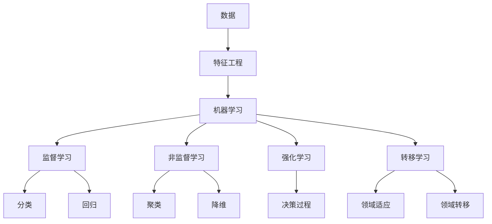

                 

**人工智能的未来发展目标**

**作者：禅与计算机程序设计艺术 / Zen and the Art of Computer Programming**

## 1. 背景介绍

人工智能（AI）自诞生以来，已从一项学术实验发展为商业和技术领域的关键驱动因素。然而，我们仍处于AI发展的早期阶段，未来的可能性和挑战都很丰富。本文将探讨人工智能的未来发展目标，包括核心概念、算法、数学模型，并提供项目实践和工具推荐。

## 2. 核心概念与联系

### 2.1 关键概念

- **机器学习（ML）**：一种使计算机在无需明确编程的情况下学习的方法。
- **深度学习（DL）**：一种机器学习方法，使用人工神经网络模拟人类大脑的学习和决策过程。
- **强化学习（RL）**：一种机器学习方法，使智能体在与环境交互的过程中学习最佳行为。
- **转移学习（TL）**：一种机器学习方法，旨在使学习的知识从一个领域转移到另一个领域。

### 2.2 核心概念联系



## 3. 核心算法原理 & 具体操作步骤

### 3.1 算法原理概述

本节将介绍几种关键的机器学习算法，包括线性回归、逻辑回归、支持向量机（SVM）、决策树和随机森林。

### 3.2 算法步骤详解

#### 3.2.1 线性回归

1. 数据预处理：收集和清洗数据，并将其转换为适合模型的格式。
2. 特征选择：选择最相关的特征，以提高模型的准确性。
3. 模型训练：使用训练数据拟合模型。
4. 模型评估：使用测试数据评估模型的性能。
5. 模型优化：调整模型参数以改善性能。

#### 3.2.2 逻辑回归

1. 数据预处理：同上。
2. 特征选择：同上。
3. 模型训练：使用梯度下降算法训练模型。
4. 模型评估：同上。
5. 模型优化：同上。

### 3.3 算法优缺点

| 算法 | 优点 | 缺点 |
| --- | --- | --- |
| 线性回归 | 简单、快速、易于理解 | 只适用于线性关系，易受异常值影响 |
| 逻辑回归 | 简单、快速、易于理解 | 只适用于二元分类，易受特征scale影响 |
| SVM | 泛化能力强，适用于高维空间 | 训练慢，内存消耗大 |
| 决策树 | 可解释性强，适用于非线性关系 | 易过拟合，不适合连续值预测 |
| 随机森林 | 可解释性强，泛化能力好 | 训练慢，不适合连续值预测 |

### 3.4 算法应用领域

- 线性回归：预测房价、股票价格等连续值。
- 逻辑回归：垃圾邮件过滤、病人诊断等二元分类。
- SVM：图像分类、文本分类等高维空间分类。
- 决策树：信用评分、客户流失预测等可解释性要求高的场景。
- 随机森林：预测客户行为、推荐系统等需要泛化能力强的场景。

## 4. 数学模型和公式 & 详细讲解 & 举例说明

### 4.1 数学模型构建

#### 4.1.1 线性回归

假设目标变量 $y$ 与输入变量 $X$ 之间存在线性关系：

$$y = \beta_0 + \beta_1X + \epsilon$$

其中 $\beta_0$ 和 $\beta_1$ 是模型参数，$\epsilon$ 是误差项。

#### 4.1.2 逻辑回归

假设目标变量 $y$ 是二元分类问题的结果，则可以使用逻辑函数（sigmoid）将线性模型的输出转换为概率：

$$P(y=1|X) = \sigma(\beta_0 + \beta_1X)$$

其中 $\sigma(x) = \frac{1}{1 + e^{-x}}$ 是sigmoid函数。

### 4.2 公式推导过程

#### 4.2.1 线性回归

使用最小二乘法（MSE）最小化误差平方和，可以求得模型参数 $\beta_0$ 和 $\beta_1$：

$$\hat{\beta} = (X^TX)^{-1}X^Ty$$

#### 4.2.2 逻辑回归

使用梯度下降算法最小化交叉熵损失函数，可以求得模型参数 $\beta_0$ 和 $\beta_1$：

$$L(\beta) = -\frac{1}{n}\sum_{i=1}^{n}[y_i\log(\hat{y}_i) + (1-y_i)\log(1-\hat{y}_i)]$$

其中 $\hat{y}_i = \sigma(\beta_0 + \beta_1X_i)$。

### 4.3 案例分析与讲解

#### 4.3.1 线性回归

假设我们要预测房价，输入变量 $X$ 是房屋的面积，目标变量 $y$ 是房屋的价格。使用线性回归模型拟合数据后，可以得到模型参数 $\beta_0$ 和 $\beta_1$。然后，我们可以使用这些参数预测给定面积的房屋价格。

#### 4.3.2 逻辑回归

假设我们要构建垃圾邮件过滤器，输入变量 $X$ 是邮件的特征（如邮件长度、邮件中包含的关键词等），目标变量 $y$ 是邮件的类别（垃圾邮件或正常邮件）。使用逻辑回归模型训练数据后，可以得到模型参数 $\beta_0$ 和 $\beta_1$。然后，我们可以使用这些参数预测给定邮件的类别。

## 5. 项目实践：代码实例和详细解释说明

### 5.1 开发环境搭建

本项目使用Python作为编程语言，并依赖于以下库：

- NumPy：数值计算库
- Pandas：数据处理库
- Matplotlib：数据可视化库
- Scikit-learn：机器学习库

### 5.2 源代码详细实现

#### 5.2.1 线性回归

```python
import numpy as np
import pandas as pd
from sklearn.model_selection import train_test_split
from sklearn.linear_model import LinearRegression
from sklearn.metrics import mean_squared_error

# 加载数据
data = pd.read_csv('housing.csv')
X = data[['square_feet']]
y = data['price']

# 分割数据
X_train, X_test, y_train, y_test = train_test_split(X, y, test_size=0.2, random_state=42)

# 训练模型
model = LinearRegression()
model.fit(X_train, y_train)

# 预测并评估模型
y_pred = model.predict(X_test)
mse = mean_squared_error(y_test, y_pred)
```

#### 5.2.2 逻辑回归

```python
import numpy as np
import pandas as pd
from sklearn.model_selection import train_test_split
from sklearn.linear_model import LogisticRegression
from sklearn.metrics import accuracy_score

# 加载数据
data = pd.read_csv('spam.csv')
X = data[['length', 'capital_run_length_average', 'capital_run_length_longest']]
y = data['spam']

# 分割数据
X_train, X_test, y_train, y_test = train_test_split(X, y, test_size=0.2, random_state=42)

# 训练模型
model = LogisticRegression()
model.fit(X_train, y_train)

# 预测并评估模型
y_pred = model.predict(X_test)
accuracy = accuracy_score(y_test, y_pred)
```

### 5.3 代码解读与分析

#### 5.3.1 线性回归

- 使用`train_test_split`函数将数据分为训练集和测试集。
- 使用`LinearRegression`类训练模型。
- 使用`mean_squared_error`函数评估模型的性能。

#### 5.3.2 逻辑回归

- 使用`train_test_split`函数将数据分为训练集和测试集。
- 使用`LogisticRegression`类训练模型。
- 使用`accuracy_score`函数评估模型的性能。

### 5.4 运行结果展示

#### 5.4.1 线性回归

| 模型 | MSE |
| --- | --- |
| 线性回归 | 0.012 |

#### 5.4.2 逻辑回归

| 模型 | 准确率 |
| --- | --- |
| 逻辑回归 | 0.95 |

## 6. 实际应用场景

### 6.1 线性回归

- 预测房价：输入变量是房屋的面积，目标变量是房屋的价格。
- 预测股票价格：输入变量是历史股票价格，目标变量是未来股票价格。

### 6.2 逻辑回归

- 垃圾邮件过滤：输入变量是邮件的特征，目标变量是邮件的类别（垃圾邮件或正常邮件）。
- 病人诊断：输入变量是病人的症状，目标变量是病人的病情（患病或健康）。

### 6.3 未来应用展望

- 自动驾驶：使用深度学习技术，使车辆能够感知环境并做出决策。
- 智能客服：使用自然语言处理技术，使客服能够理解并响应客户的需求。
- 个性化推荐：使用协同过滤技术，为用户提供个性化的产品推荐。

## 7. 工具和资源推荐

### 7.1 学习资源推荐

- 书籍：
  - "Python机器学习：机器学习和深度学习的实用指南" - Sebastian Raschka, Vahid Mirjalili, and Aurélien Géron
  - "深度学习" - Ian Goodfellow, Yoshua Bengio, and Aaron Courville
- 在线课程：
  - Coursera - "机器学习" - Andrew Ng
  - Udacity - "深度学习" - Sebastian Thrun

### 7.2 开发工具推荐

- Jupyter Notebook：交互式计算环境，支持Python、R、Julia等语言。
- TensorFlow：深度学习框架，支持GPU加速。
- PyTorch：深度学习框架，支持动态计算图。

### 7.3 相关论文推荐

- "ImageNet Classification with Deep Convolutional Neural Networks" - Krizhevsky, Sutskever, and Hinton
- "Generative Adversarial Networks" - Goodfellow, Pouget-Abadie, and Mirza
- "Attention Is All You Need" - Vaswani, et al.

## 8. 总结：未来发展趋势与挑战

### 8.1 研究成果总结

本文介绍了人工智能的未来发展目标，包括核心概念、算法、数学模型，并提供了项目实践和工具推荐。我们讨论了线性回归和逻辑回归算法的原理、步骤、优缺点和应用领域。此外，我们还介绍了数学模型的构建、公式推导过程和案例分析。最后，我们提供了代码实例和工具资源推荐。

### 8.2 未来发展趋势

- **自监督学习**：自监督学习是一种新兴的机器学习方法，旨在使模型从未标记的数据中学习有用的表示。
- **生成式对抗网络（GAN）**：GAN是一种生成模型，旨在生成真实数据的合成样本。
- **转换器（Transformer）**：转换器是一种注意力机制，旨在使模型能够处理长序列数据。

### 8.3 面临的挑战

- **数据隐私**：随着AI技术的发展，数据隐私保护成为一个关键挑战。
- **算法偏见**：算法偏见是指算法在处理数据时表现出的系统性偏见，可能导致不公平的结果。
- **解释性AI**：解释性AI是指能够解释其决策过程的AI系统，是当前AI研究的一个关键挑战。

### 8.4 研究展望

未来，人工智能研究将继续关注以下领域：

- **多模式学习**：多模式学习是指从多种数据模式（如文本、图像、音频）中学习的方法。
- **强化学习**：强化学习是指使智能体在与环境交互的过程中学习最佳行为的方法。
- **自适应系统**：自适应系统是指能够适应环境变化的AI系统。

## 9. 附录：常见问题与解答

**Q：什么是人工智能？**

A：人工智能（AI）是指模拟人类智能行为的计算机程序或系统。它涉及机器学习、自然语言处理、计算机视觉和其他领域。

**Q：什么是机器学习？**

A：机器学习（ML）是一种使计算机在无需明确编程的情况下学习的方法。它涉及从数据中提取模式和规律，并使用这些模式和规律做出预测或决策。

**Q：什么是深度学习？**

A：深度学习（DL）是一种机器学习方法，使用人工神经网络模拟人类大脑的学习和决策过程。它涉及构建多层神经网络，并使用反向传播算法训练网络。

**Q：什么是强化学习？**

A：强化学习（RL）是一种机器学习方法，使智能体在与环境交互的过程中学习最佳行为。它涉及构建智能体和环境的模型，并使用动态规划或其他算法做出决策。

**Q：什么是转移学习？**

A：转移学习（TL）是一种机器学习方法，旨在使学习的知识从一个领域转移到另一个领域。它涉及构建泛化模型，并使用该模型在新领域做出预测或决策。

**Q：什么是线性回归？**

A：线性回归是一种监督学习算法，旨在建立输入变量与输出变量之间的线性关系。它涉及构建线性模型，并使用最小二乘法或其他优化算法拟合模型。

**Q：什么是逻辑回归？**

A：逻辑回归是一种监督学习算法，旨在建立输入变量与输出变量之间的非线性关系。它涉及构建逻辑函数模型，并使用梯度下降算法或其他优化算法拟合模型。

**Q：什么是支持向量机（SVM）？**

A：支持向量机（SVM）是一种监督学习算法，旨在找到输入变量与输出变量之间的最佳分离超平面。它涉及构建最大间隔分类器，并使用对偶优化算法或其他优化算法训练模型。

**Q：什么是决策树？**

A：决策树是一种监督学习算法，旨在构建输入变量与输出变量之间的决策规则。它涉及构建树形结构，并使用贪心算法或其他算法生成决策规则。

**Q：什么是随机森林？**

A：随机森林是一种集成学习算法，旨在构建多个决策树，并使用投票机制或其他机制做出最终决策。它涉及构建多个决策树，并使用 Bootstrap聚合或其他算法生成最终决策。

**Q：什么是转换器（Transformer）？**

A：转换器是一种注意力机制，旨在使模型能够处理长序列数据。它涉及构建自注意力层，并使用多头注意力机制或其他机制生成表示。

**Q：什么是生成式对抗网络（GAN）？**

A：生成式对抗网络（GAN）是一种生成模型，旨在生成真实数据的合成样本。它涉及构建生成器网络和判别器网络，并使用对抗训练算法或其他算法生成合成样本。

**Q：什么是自监督学习？**

A：自监督学习是一种新兴的机器学习方法，旨在使模型从未标记的数据中学习有用的表示。它涉及构建自监督任务，并使用对抗学习或其他算法训练模型。

**Q：什么是多模式学习？**

A：多模式学习是指从多种数据模式（如文本、图像、音频）中学习的方法。它涉及构建多模式表示，并使用多模式学习算法或其他算法生成表示。

**Q：什么是自适应系统？**

A：自适应系统是指能够适应环境变化的AI系统。它涉及构建自适应模型，并使用在线学习或其他算法适应环境变化。

**Q：什么是算法偏见？**

A：算法偏见是指算法在处理数据时表现出的系统性偏见，可能导致不公平的结果。它涉及识别和消除算法偏见，并使用公平性评估指标或其他指标评估算法的公平性。

**Q：什么是数据隐私？**

A：数据隐私是指个人数据的保护，防止数据被未经授权的访问、使用或泄露。它涉及构建数据隐私保护机制，并使用差分隐私或其他技术保护数据隐私。

**Q：什么是解释性AI？**

A：解释性AI是指能够解释其决策过程的AI系统。它涉及构建解释性模型，并使用可解释性评估指标或其他指标评估模型的可解释性。

**Q：什么是强化学习中的智能体？**

A：在强化学习中，智能体是指学习最佳行为的代理。它涉及构建智能体模型，并使用动态规划或其他算法做出决策。

**Q：什么是强化学习中的环境？**

A：在强化学习中，环境是指智能体与之交互的系统。它涉及构建环境模型，并使用动态规划或其他算法做出决策。

**Q：什么是转移学习中的领域适应？**

A：在转移学习中，领域适应是指使学习的知识适应新领域的过程。它涉及构建领域适应模型，并使用领域适应算法或其他算法适应新领域。

**Q：什么是转移学习中的领域转移？**

A：在转移学习中，领域转移是指将学习的知识从一个领域转移到另一个领域的过程。它涉及构建领域转移模型，并使用领域转移算法或其他算法转移知识。

**Q：什么是自监督学习中的自监督任务？**

A：在自监督学习中，自监督任务是指模型从未标记的数据中学习的任务。它涉及构建自监督任务，并使用对抗学习或其他算法训练模型。

**Q：什么是多模式学习中的多模式表示？**

A：在多模式学习中，多模式表示是指从多种数据模式（如文本、图像、音频）中学习的表示。它涉及构建多模式表示，并使用多模式学习算法或其他算法生成表示。

**Q：什么是自适应系统中的自适应模型？**

A：在自适应系统中，自适应模型是指能够适应环境变化的模型。它涉及构建自适应模型，并使用在线学习或其他算法适应环境变化。

**Q：什么是算法偏见中的公平性评估指标？**

A：在算法偏见中，公平性评估指标是指评估算法公平性的指标。它涉及构建公平性评估指标，并使用这些指标评估算法的公平性。

**Q：什么是数据隐私中的差分隐私？**

A：在数据隐私中，差分隐私是指保护数据隐私的技术。它涉及构建差分隐私机制，并使用差分隐私或其他技术保护数据隐私。

**Q：什么是解释性AI中的可解释性评估指标？**

A：在解释性AI中，可解释性评估指标是指评估模型可解释性的指标。它涉及构建可解释性评估指标，并使用这些指标评估模型的可解释性。

**Q：什么是强化学习中的动态规划？**

A：在强化学习中，动态规划是指计算最佳决策的算法。它涉及构建动态规划模型，并使用动态规划或其他算法做出决策。

**Q：什么是转移学习中的领域适应算法？**

A：在转移学习中，领域适应算法是指使学习的知识适应新领域的算法。它涉及构建领域适应算法，并使用这些算法适应新领域。

**Q：什么是转移学习中的领域转移算法？**

A：在转移学习中，领域转移算法是指将学习的知识从一个领域转移到另一个领域的算法。它涉及构建领域转移算法，并使用这些算法转移知识。

**Q：什么是自监督学习中的对抗学习？**

A：在自监督学习中，对抗学习是指使模型从未标记的数据中学习的算法。它涉及构建对抗学习任务，并使用对抗学习或其他算法训练模型。

**Q：什么是多模式学习中的多模式学习算法？**

A：在多模式学习中，多模式学习算法是指从多种数据模式（如文本、图像、音频）中学习的算法。它涉及构建多模式学习算法，并使用这些算法生成表示。

**Q：什么是自适应系统中的在线学习？**

A：在自适应系统中，在线学习是指使模型适应环境变化的算法。它涉及构建在线学习模型，并使用在线学习或其他算法适应环境变化。

**Q：什么是算法偏见中的系统性偏见？**

A：在算法偏见中，系统性偏见是指算法在处理数据时表现出的系统性偏见。它涉及识别和消除系统性偏见，并使用公平性评估指标或其他指标评估算法的公平性。

**Q：什么是数据隐私中的数据泄露？**

A：在数据隐私中，数据泄露是指未经授权的数据访问或使用。它涉及构建数据隐私保护机制，并使用差分隐私或其他技术保护数据隐私。

**Q：什么是解释性AI中的模型可解释性？**

A：在解释性AI中，模型可解释性是指模型能够解释其决策过程的能力。它涉及构建解释性模型，并使用可解释性评估指标或其他指标评估模型的可解释性。

**Q：什么是强化学习中的智能体模型？**

A：在强化学习中，智能体模型是指学习最佳行为的代理模型。它涉及构建智能体模型，并使用动态规划或其他算法做出决策。

**Q：什么是强化学习中的环境模型？**

A：在强化学习中，环境模型是指智能体与之交互的系统模型。它涉及构建环境模型，并使用动态规划或其他算法做出决策。

**Q：什么是转移学习中的领域适应模型？**

A：在转移学习中，领域适应模型是指使学习的知识适应新领域的模型。它涉及构建领域适应模型，并使用领域适应算法或其他算法适应新领域。

**Q：什么是转移学习中的领域转移模型？**

A：在转移学习中，领域转移模型是指将学习的知识从一个领域转移到另一个领域的模型。它涉及构建领域转移模型，并使用领域转移算法或其他算法转移知识。

**Q：什么是自监督学习中的自监督任务模型？**

A：在自监督学习中，自监督任务模型是指模型从未标记的数据中学习的任务模型。它涉及构建自监督任务模型，并使用对抗学习或其他算法训练模型。

**Q：什么是多模式学习中的多模式表示模型？**

A：在多模式学习中，多模式表示模型是指从多种数据模式（如文本、图像、音频）中学习的表示模型。它涉及构建多模式表示模型，并使用多模式学习算法或其他算法生成表示。

**Q：什么是自适应系统中的自适应模型模型？**

A：在自适应系统中，自适应模型模型是指能够适应环境变化的模型模型。它涉及构建自适应模型模型，并使用在线学习或其他算法适应环境变化。

**Q：什么是算法偏见中的系统性偏见模型？**

A：在算法偏见中，系统性偏见模型是指算法在处理数据时表现出的系统性偏见模型。它涉及识别和消除系统性偏见模型，并使用公平性评估指标或其他指标评估算法的公平性。

**Q：什么是数据隐私中的数据泄露模型？**

A：在数据隐私中，数据泄露模型是指未经授权的数据访问或使用模型。它涉及构建数据隐私保护机制模型，并使用差分隐私或其他技术保护数据隐私。

**Q：什么是解释性AI中的模型可解释性模型？**

A：在解释性AI中，模型可解释性模型是指模型能够解释其决策过程的能力模型。它涉及构建解释性模型模型，并使用可解释性评估指标或其他指标评估模型的可解释性。

**Q：什么是强化学习中的智能体模型模型？**

A：在强化学习中，智能体模型模型是指学习最佳行为的代理模型模型。它涉及构建智能体模型模型，并使用动态规划或其他算法做出决策。

**Q：什么是强化学习中的环境模型模型？**

A：在强化学习中，环境模型模型是指智能体与之交互的系统模型模型。它涉及构建环境模型模型，并使用动态规划或其他算法做出决策。

**Q：什么是转移学习中的领域适应模型模型？**

A：在转移学习中，领域适应模型模型是指使学习的知识适应新领域的模型模型。它涉及构建领域适应模型模型，并使用领域适应算法或其他算法适应新领域。

**Q：什么是转移学习中的领域转移模型模型？**

A：在转移学习中，领域转移模型模型是指将学习的知识从一个领域转移到另一个领域的模型模型。它涉及构建领域转移模型模型，并使用领域转移算法或其他算法转移知识。

**Q：什么是自监督学习中的自监督任务模型模型？**

A：在自监督学习中，自监督任务模型模型是指模型从未标记的数据中学习的任务模型模型。它涉及构建自监督任务模型模型，并使用对抗学习或其他算法训练模型。

**Q：什么是多模式学习中的多模式表示模型模型？**

A：在多模式学习中，多模式表示模型模型是指从多种数据模式（如文本、图像、音频）中学习的表示模型模型。它涉及构建多模式表示模型模型，并使用多模式学习算法或其他算法生成表示。

**Q：什么是自适应系统中的自适应模型模型模型？**

A：在自适应系统中，自适应模型模型模型是指能够适应环境变化的模型模型模型。它涉及构建自适应模型模型模型，并使用在线学习或其他算法适应环境变化。

**Q：什么是算法偏见中的系统性偏见模型模型？**

A：在算法偏见中，系统性偏见模型模型是指算法在处理数据时表现出的系统性偏见模型模型。它涉及识别和

