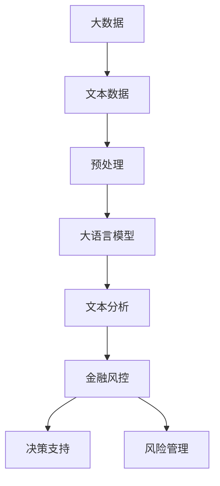

                 

**大语言模型（LLM）在智能金融风控中的潜在贡献**

## 1. 背景介绍

金融风控是金融机构的核心业务之一，旨在识别、评估和管理金融风险。随着金融行业的数字化转型，大数据和人工智能技术在金融风控领域的应用日益增多。本文将探讨大语言模型（LLM）在智能金融风控中的潜在贡献，包括其核心概念、算法原理、数学模型、项目实践，以及未来应用展望。

## 2. 核心概念与联系

### 2.1 大语言模型（LLM）简介

大语言模型（LLM）是一种深度学习模型，旨在理解和生成人类语言。LLM通过学习大量文本数据来建立语言统计模型，能够理解上下文、生成人类可读的文本，并回答问题。

### 2.2 LLM在金融风控中的应用

LLM在金融风控中的应用包括但不限于：

- **文本分析**：分析新闻、社交媒体和其他非结构化数据，识别潜在的金融风险。
- **欺诈检测**：分析交易描述和其他文本数据，识别可疑交易。
- **信用评分**：分析借款人申请表和其他文本数据，预测信用风险。

### 2.3 核心概念架构图



## 3. 核心算法原理 & 具体操作步骤

### 3.1 算法原理概述

LLM的核心是Transformer模型，它使用自注意力机制来处理输入序列。LLM通过在训练过程中学习大量文本数据，建立语言统计模型，从而理解上下文和生成人类可读的文本。

### 3.2 算法步骤详解

1. **数据预处理**：清洗、标记化和向量化文本数据。
2. **模型训练**：使用预处理后的数据训练LLM模型。
3. **文本分析**：使用训练好的模型分析金融文本数据。
4. **风险评估**：根据文本分析结果评估金融风险。

### 3.3 算法优缺点

**优点**：

- 理解上下文，能够生成人类可读的文本。
- 可以处理非结构化数据，如新闻和社交媒体文本。

**缺点**：

- 训练和推理开销大。
- 可能受到训练数据的偏见影响。

### 3.4 算法应用领域

LLM在金融风控中的应用领域包括但不限于：

- 银行业：信用评分、欺诈检测和风险管理。
- 保险业：风险评估和理赔处理。
- 证券业：市场预测和风险管理。

## 4. 数学模型和公式 & 详细讲解 & 举例说明

### 4.1 数学模型构建

LLM的数学模型基于Transformer架构，使用自注意力机制处理输入序列。输入文本被表示为词嵌入向量，然后通过多个Transformer块进行处理。每个Transformer块包含多头自注意力子层和前馈神经网络子层。

### 4.2 公式推导过程

Transformer块的数学模型可以表示为：

$$h_{i} = \text{FFN}(h_{i-1}) + \text{MSA}(h_{i-1})$$

其中：

- $h_{i}$ 是第 $i$ 个Transformer块的输出。
- $\text{FFN}$ 是前馈神经网络子层。
- $\text{MSA}$ 是多头自注意力子层。

### 4.3 案例分析与讲解

例如，在信用评分中，LLM可以分析借款人申请表中的文本数据，预测信用风险。输入文本被表示为词嵌入向量，然后通过多个Transformer块进行处理。最后，模型输出信用评分结果。

## 5. 项目实践：代码实例和详细解释说明

### 5.1 开发环境搭建

- Python 3.8+
- PyTorch 1.8+
- Transformers library 4.5+

### 5.2 源代码详细实现

```python
from transformers import AutoTokenizer, AutoModelForSequenceClassification

# Load pre-trained model and tokenizer
model = AutoModelForSequenceClassification.from_pretrained("bert-base-uncased")
tokenizer = AutoTokenizer.from_pretrained("bert-base-uncased")

# Preprocess input text
inputs = tokenizer("Your input text here", return_tensors="pt")

# Make prediction
outputs = model(**inputs)
logits = outputs.logits
```

### 5.3 代码解读与分析

- 使用Transformers库加载预训练的BERT模型。
- 使用Tokenizer对输入文本进行预处理。
- 使用模型进行预测，输出logits。

### 5.4 运行结果展示

预测结果可以通过softmax函数转换为概率，并选择最高概率的类别作为最终预测结果。

## 6. 实际应用场景

### 6.1 当前应用

LLM已经在金融行业得到广泛应用，例如：

- **信用评分**：分析借款人申请表中的文本数据，预测信用风险。
- **欺诈检测**：分析交易描述和其他文本数据，识别可疑交易。

### 6.2 未来应用展望

LLM在金融风控中的未来应用包括：

- **市场预测**：分析新闻和社交媒体文本，预测金融市场走势。
- **风险管理**：分析内部文本数据，识别和管理内部风险。

## 7. 工具和资源推荐

### 7.1 学习资源推荐

- "Attention is All You Need" 论文：<https://arxiv.org/abs/1706.03762>
- "BERT: Pre-training of Deep Bidirectional Transformers for Language Understanding" 论文：<https://arxiv.org/abs/1810.04805>

### 7.2 开发工具推荐

- Transformers library：<https://huggingface.co/transformers/>
- PyTorch：<https://pytorch.org/>

### 7.3 相关论文推荐

- "Financial Text Analysis with BERT"：<https://arxiv.org/abs/1908.01187>
- "Credit Risk Assessment using BERT"：<https://arxiv.org/abs/2004.05828>

## 8. 总结：未来发展趋势与挑战

### 8.1 研究成果总结

本文介绍了LLM在智能金融风控中的潜在贡献，包括其核心概念、算法原理、数学模型、项目实践，以及未来应用展望。

### 8.2 未来发展趋势

LLM在金融风控中的应用将继续增长，未来趋势包括：

- **更大的模型**：开发更大的LLM模型，以提高性能和理解能力。
- **多模式学习**：结合文本和结构化数据，提高风险评估准确性。

### 8.3 面临的挑战

LLM在金融风控中的应用面临的挑战包括：

- **计算资源**：大规模LLM模型需要大量计算资源。
- **偏见**：LLM可能受到训练数据的偏见影响。

### 8.4 研究展望

未来的研究方向包括：

- **解释性AI**：开发可解释的LLM模型，以帮助金融从业者理解模型决策。
- **联邦学习**：开发联邦学习方法，以保护金融机构的数据隐私。

## 9. 附录：常见问题与解答

**Q：LLM需要大量计算资源吗？**

**A：**是的，大规模LLM模型需要大量计算资源。然而，开发更小、更高效的模型可以缓解这一挑战。

**Q：LLM可能受到偏见影响吗？**

**A：**是的，LLM可能受到训练数据的偏见影响。开发更公平的数据收集和预处理方法可以缓解这一挑战。

## 作者：禅与计算机程序设计艺术 / Zen and the Art of Computer Programming

**版权声明**：本文版权归作者所有，欢迎转载，但请注明出处及作者信息。

** License **：除特别声明外，本文采用 [CC BY-NC-ND 4.0](https://creativecommons.org/licenses/by-nc-nd/4.0/) 协议授权。

