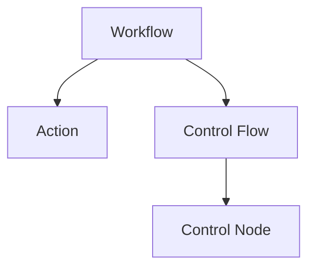
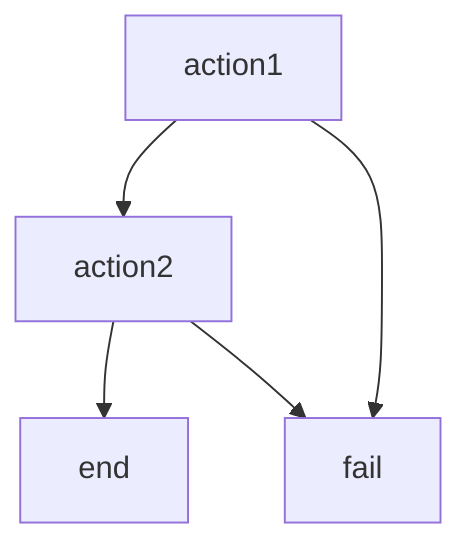

                 

**Oozie工作流调度原理与代码实例讲解**

**作者：禅与计算机程序设计艺术 / Zen and the Art of Computer Programming**

## 1. 背景介绍

Apache Oozie是一个用于调度Hadoop作业的工作流管理系统。它允许用户定义和调度复杂的数据处理工作流，这些工作流可以包含MapReduce作业、Pig作业、Hive作�业、Sqoop作业等。Oozie提供了一个简单的XML语言来定义工作流，并支持条件判断、循环、子工作流等高级功能。本文将详细介绍Oozie工作流调度的原理，并提供代码实例进行讲解。

## 2. 核心概念与联系

### 2.1 核心概念

- **Workflow（工作流）**：Oozie中最重要的概念，它定义了一个数据处理任务的流程，可以包含多个作业。
- **Action（作业）**：工作流中的最小单位，可以是MapReduce作业、Pig作业、Hive作业等。
- **Control Flow（控制流）**：定义作业之间的执行顺序，可以是sequential（顺序）、fork/join（分支/合并）等。
- **Control Node（控制节点）**：定义控制流的节点，可以是start（开始）、end（结束）、decision（判断）等。

### 2.2 核心概念联系

Oozie工作流的核心概念如下图所示：



## 3. 核心算法原理 & 具体操作步骤

### 3.1 算法原理概述

Oozie工作流调度算法的核心原理是基于有向无环图（Directed Acyclic Graph，DAG）来表示工作流，并使用拓扑排序算法来确定作业的执行顺序。Oozie首先解析工作流定义，构建DAG，然后使用拓扑排序算法生成作业执行顺序。在执行过程中，Oozie会监控作业的状态，并根据控制流调整执行顺序。

### 3.2 算法步骤详解

1. 解析工作流定义，构建DAG。
2. 使用拓扑排序算法生成作业执行顺序。
3. 执行作业，监控作业状态。
4. 根据控制流调整执行顺序。

### 3.3 算法优缺点

**优点：**

- 可以定义复杂的数据处理工作流。
- 支持条件判断、循环、子工作流等高级功能。
- 可以动态调整作业执行顺序。

**缺点：**

- DAG构建和拓扑排序的时间复杂度为O(V+E)，其中V是顶点数（作业数），E是边数（控制流数）。
- 当工作流非常复杂时，调度过程可能会变得复杂和难以理解。

### 3.4 算法应用领域

Oozie工作流调度算法主要应用于大数据处理领域，可以用于定义和调度MapReduce、Pig、Hive等作业的工作流。此外，Oozie还可以应用于其他需要调度复杂任务的领域，如机器学习、数据挖掘等。

## 4. 数学模型和公式 & 详细讲解 & 举例说明

### 4.1 数学模型构建

Oozie工作流调度的数学模型可以表示为一个有向无环图G=(V, E)，其中V是作业集合，E是控制流集合。每个作业vi∈V有两个属性：执行时间ti和前驱作业集合Pi。控制流eij∈E表示作业vi的前驱作业。

### 4.2 公式推导过程

给定工作流定义，构建DAG的过程如下：

1. 创建一个空的DAG G=(V, E)。
2. 解析工作流定义，为每个作业创建一个顶点vi∈V，并记录其执行时间ti和前驱作业集合Pi。
3. 为每个控制流创建一条边eij∈E，连接作业vi的前驱作业。

### 4.3 案例分析与讲解

例如，考虑以下工作流定义：

```xml
<workflow name="example" xmlns="uri:oozie:workflow:0.2">
  <start to="action1"/>
  <action name="action1">
    <map-reduce>
      <job-tracker>jobtracker</job-tracker>
      <name-node>namenode</name-node>
      <prepare>
        <delete path="output"/>
      </prepare>
      <configuration>
        <property>
          <name>mapred.job.queue.name</name>
          <value>default</value>
        </property>
      </configuration>
      <map>map1</map>
      <reduce>reduce1</reduce>
    </map-reduce>
    <ok to="action2"/>
    <error to="fail"/>
  </action>
  <action name="action2">
    <map-reduce>
     ...
    </map-reduce>
    <ok to="end"/>
    <error to="fail"/>
  </action>
  <kill name="fail">
    <message>Action failed, error message: ${wf:errorMessage(wf:lastErrorNode())}</message>
  </kill>
  <end name="end"/>
</workflow>
```

构建的DAG如下图所示：



## 5. 项目实践：代码实例和详细解释说明

### 5.1 开发环境搭建

本实例假设您已经安装了Apache Hadoop和Apache Oozie。您可以在[Apache Oozie官方网站](https://oozie.apache.org/)找到安装说明。

### 5.2 源代码详细实现

以下是一个简单的Oozie工作流定义示例，定义了两个MapReduce作业，第一个作业的输出是第二个作业的输入。

```xml
<workflow name="example" xmlns="uri:oozie:workflow:0.2">
  <start to="action1"/>
  <action name="action1">
    <map-reduce>
     ...
    </map-reduce>
    <ok to="action2"/>
    <error to="fail"/>
  </action>
  <action name="action2">
    <map-reduce>
     ...
      <input-type>TEXT</input-type>
      <input-path>${wf:actionData('action1')['nameNodeOutputPath']}</input-path>
     ...
    </map-reduce>
    <ok to="end"/>
    <error to="fail"/>
  </action>
  <kill name="fail">
    <message>Action failed, error message: ${wf:errorMessage(wf:lastErrorNode())}</message>
  </kill>
  <end name="end"/>
</workflow>
```

### 5.3 代码解读与分析

- `<start>`元素定义了工作流的开始节点。
- `<action>`元素定义了一个作业，可以是MapReduce、Pig、Hive等。
- `<map-reduce>`元素定义了MapReduce作业的配置。
- `<ok>`和`<error>`元素定义了作业执行成功和失败后的控制流。
- `${wf:actionData('action1')['nameNodeOutputPath']}`是一个EL表达式，用于获取前一个作业的输出路径。

### 5.4 运行结果展示

您可以使用Oozie命令行工具提交工作流：

```bash
oozie job -config example.xml -run
```

然后，您可以使用Oozie web UI或命令行工具查看工作流的执行状态。

## 6. 实际应用场景

Oozie工作流调度可以应用于各种大数据处理场景，如数据采集、数据清洗、数据转换、数据分析等。例如，在数据采集场景中，Oozie可以定义一个工作流，将数据从各种来源采集到Hadoop文件系统，然后触发数据清洗和转换作业。在数据分析场景中，Oozie可以定义一个工作流，将数据从Hadoop文件系统导入数据仓库，然后触发数据分析作业。

### 6.1 未来应用展望

随着大数据处理领域的不断发展，Oozie工作流调度将会越来越重要。未来，Oozie可能会支持更多的作业类型，如Spark作业、Flink作业等。此外，Oozie还可能会支持更复杂的控制流，如条件循环、并行分支等。

## 7. 工具和资源推荐

### 7.1 学习资源推荐

- [Apache Oozie官方文档](https://oozie.apache.org/docs/4.2.0/)
- [Apache Oozie用户指南](https://oozie.apache.org/docs/4.2.0/DG_BuildingWorkflows.html)
- [Apache Oozie开发指南](https://oozie.apache.org/docs/4.2.0/DG_DevelopingWorkflows.html)

### 7.2 开发工具推荐

- [Apache Ambari](https://ambari.apache.org/): 一款用于部署和管理Hadoop集群的工具，内置Oozie管理界面。
- [Apache Hue](https://gethue.com/): 一款用于Hadoop集群的Web UI，内置Oozie工作流编辑器。

### 7.3 相关论文推荐

- [Oozie: A Workflow Scheduler System for Hadoop](https://www.usenix.org/system/files/login/articles/login_summer11_07_roubtsov.pdf)
- [Oozie: A Workflow Scheduler for Hadoop](https://www.slideshare.net/arunmurthy/oozie-a-workflow-scheduler-for-hadoop)

## 8. 总结：未来发展趋势与挑战

### 8.1 研究成果总结

本文详细介绍了Oozie工作流调度的原理，并提供了代码实例进行讲解。我们介绍了Oozie的核心概念、算法原理、数学模型和公式，并分析了其优缺点和应用领域。此外，我们还提供了项目实践部分，介绍了如何使用Oozie定义和调度工作流。

### 8.2 未来发展趋势

随着大数据处理领域的不断发展，Oozie工作流调度将会越来越重要。未来，Oozie可能会支持更多的作业类型，如Spark作业、Flink作业等。此外，Oozie还可能会支持更复杂的控制流，如条件循环、并行分支等。

### 8.3 面临的挑战

然而，Oozie也面临着一些挑战。首先，Oozie的调度算法时间复杂度为O(V+E)，当工作流非常复杂时，调度过程可能会变得复杂和难以理解。其次，Oozie的工作流定义使用XML语言，这可能会导致定义过程复杂和易出错。最后，Oozie的可扩展性和高可用性是一个挑战，需要不断优化和改进。

### 8.4 研究展望

未来，我们将继续研究Oozie工作流调度的优化算法，以提高其调度效率和可扩展性。我们还将研究Oozie的可视化工具，以便用户可以更直观地定义和监控工作流。此外，我们还将研究Oozie的高可用性解决方案，以提高其稳定性和可靠性。

## 9. 附录：常见问题与解答

**Q1：Oozie支持哪些作业类型？**

A1：Oozie支持MapReduce作业、Pig作业、Hive作业、Sqoop作业等。

**Q2：如何定义Oozie工作流？**

A2：Oozie工作流定义使用XML语言，您可以在[Apache Oozie官方文档](https://oozie.apache.org/docs/4.2.0/)找到详细说明。

**Q3：如何提交Oozie工作流？**

A3：您可以使用Oozie命令行工具或Oozie web UI提交工作流。

**Q4：如何监控Oozie工作流？**

A4：您可以使用Oozie web UI或Oozie命令行工具监控工作流的执行状态。

**Q5：如何处理Oozie工作流失败？**

A5：您可以在工作流定义中定义失败处理逻辑，如重试、通知等。您也可以使用Oozie的kill元素来定义失败处理逻辑。

**Q6：如何优化Oozie工作流调度？**

A6：您可以优化工作流定义、调整Oozie配置参数、使用Oozie的高级功能（如条件判断、循环、子工作流等）等。

**Q7：如何提高Oozie的可扩展性和高可用性？**

A7：您可以优化Oozie配置参数、使用Oozie的高可用性功能（如集群模式、故障转移等）、部署Oozie到分布式集群等。

**Q8：如何学习Oozie？**

A8：您可以阅读[Apache Oozie官方文档](https://oozie.apache.org/docs/4.2.0/)、[Apache Oozie用户指南](https://oozie.apache.org/docs/4.2.0/DG_BuildingWorkflows.html)和[Apache Oozie开发指南](https://oozie.apache.org/docs/4.2.0/DG_DevelopingWorkflows.html)，并参考相关论文和项目实践。

**Q9：如何获取帮助？**

A9：您可以在[Apache Oozie用户邮件列表](https://oozie.apache.org/mailing_lists.html)或[Apache Oozie StackOverflow标签](https://stackoverflow.com/questions/tagged/apache-oozie)获取帮助。

**Q10：如何贡献Oozie？**

A10：您可以在[Apache Oozie贡献指南](https://oozie.apache.org/contributing.html)找到贡献Oozie的详细说明。

## 结束语

本文详细介绍了Oozie工作流调度的原理，并提供了代码实例进行讲解。我们介绍了Oozie的核心概念、算法原理、数学模型和公式，并分析了其优缺点和应用领域。此外，我们还提供了项目实践部分，介绍了如何使用Oozie定义和调度工作流。我们希望本文能够帮助读者更好地理解Oozie工作流调度，并应用Oozie定义和调度复杂的数据处理工作流。

**作者：禅与计算机程序设计艺术 / Zen and the Art of Computer Programming**

