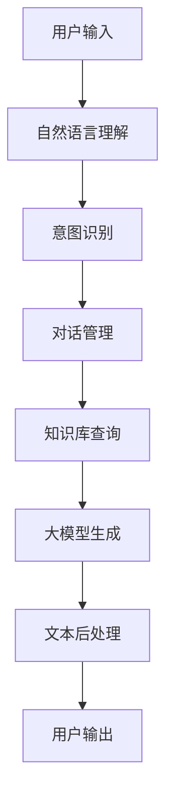

                 

**大模型应用开发 动手做AI Agent】语言输出能力**

**作者：禅与计算机程序设计艺术 / Zen and the Art of Computer Programming**

## 1. 背景介绍

在当今信息爆炸的时代，人工智能（AI）已经渗透到我们的日常生活中，从虚拟助手到自动驾驶汽车，AI无处不在。其中，AI Agent（智能代理）是AI技术的一个关键组成部分，它能够理解并响应人类的自然语言输入，提供相关的信息和服务。本文将深入探讨大模型在AI Agent语言输出能力中的应用，并提供实践指南。

## 2. 核心概念与联系

### 2.1 AI Agent与大模型

AI Agent是一种软件系统，它能够感知环境，并根据感知到的信息做出决策，以实现特定的目标。大模型是一种具有广泛理解和推理能力的AI模型，它通过学习大量的文本数据来理解语言，并能够生成人类可读的文本。AI Agent和大模型的结合，可以使AI Agent理解并响应人类的自然语言输入，并生成相关的输出。

### 2.2 架构原理

AI Agent的架构可以分为以下几个组成部分：



## 3. 核心算法原理 & 具体操作步骤

### 3.1 算法原理概述

AI Agent的语言输出能力建立在自然语言生成（NLG）的基础上。NLG是一项将结构化数据转换为人类可读文本的任务。大模型，如转换器模型（如T5、BART等），是当前NLG任务的有效解决方案。

### 3.2 算法步骤详解

1. **意图识别**：AI Agent首先需要理解用户的意图。这可以通过自然语言理解（NLU）算法来实现，如BERT等预训练模型。
2. **对话管理**：AI Agent需要跟踪对话的上下文，以便生成相关的输出。这可以通过对话管理系统来实现。
3. **知识库查询**：AI Agent需要查询知识库以获取相关信息。这可以通过信息检索算法来实现。
4. **大模型生成**：大模型接受结构化数据（如知识库查询结果）作为输入，并生成人类可读的文本输出。
5. **文本后处理**：大模型生成的文本可能需要后处理，如去除不必要的标点符号，调整句子结构等。

### 3.3 算法优缺点

**优点**：大模型在NLG任务上表现出色，能够生成流畅、人类可读的文本。它们可以学习到语言的上下文依赖关系，并能够生成相关的输出。

**缺点**：大模型训练和部署的成本高昂。它们也可能生成不准确或不相关的输出，需要进行后处理来纠正。

### 3.4 算法应用领域

AI Agent的语言输出能力有广泛的应用领域，从虚拟助手到客户服务，再到自动新闻写作等。

## 4. 数学模型和公式 & 详细讲解 & 举例说明

### 4.1 数学模型构建

大模型通常是基于转换器架构构建的。转换器模型接受输入序列$x=(x_1, x_2,..., x_n)$，并输出输出序列$y=(y_1, y_2,..., y_m)$。模型的目标是最大化输出序列的可能性$P(y|x)$。

### 4.2 公式推导过程

转换器模型通常使用交叉熵损失函数进行训练：

$$L(\theta) = -\frac{1}{N}\sum_{i=1}^{N}\sum_{j=1}^{m}\log P(y_{ij}|x_{i}, \theta)$$

其中$\theta$是模型的参数，$N$是训练样本的数量，$m$是输出序列的长度。

### 4.3 案例分析与讲解

例如，在AI Agent的应用中，输入序列$x$可以是用户的自然语言输入，输出序列$y$可以是AI Agent的响应。大模型的目标是最大化输出序列的可能性，即生成最相关、最流畅的响应。

## 5. 项目实践：代码实例和详细解释说明

### 5.1 开发环境搭建

要开发AI Agent，您需要安装Python、PyTorch或TensorFlow，以及相关的NLP库，如Transformers、Spacy等。

### 5.2 源代码详细实现

以下是一个简单的AI Agent示例，使用Hugging Face的Transformers库和BART模型：

```python
from transformers import pipeline

# Initialize the BART model for text generation
generator = pipeline('text-generation', model='facebook/bart-large-cnn')

# Define a function for generating responses
def generate_response(user_input):
    # Generate a response using the BART model
    response = generator(user_input, max_length=50, num_return_sequences=1, pad_token_id=50256)[0]['generated_text']
    return response
```

### 5.3 代码解读与分析

这段代码初始化了一个BART模型，并定义了一个函数`generate_response`，接受用户输入并生成响应。生成响应时，模型接受用户输入作为输入，并生成最大长度为50的输出序列。

### 5.4 运行结果展示

当您运行`generate_response("What is the capital of France?")`时，模型可能会生成以下响应：

"Paris is the capital of France."

## 6. 实际应用场景

### 6.1 当前应用

AI Agent的语言输出能力已经在各种应用中得到广泛应用，从虚拟助手到客户服务，再到自动新闻写作等。

### 6.2 未来应用展望

未来，AI Agent的语言输出能力有望在更复杂的任务中得到应用，如自动编程、自动创作等。

## 7. 工具和资源推荐

### 7.1 学习资源推荐

- "Natural Language Processing with Python" by Steven Bird, Ewan Klein, and Edward Loper
- "Speech and Language Processing" by Dan Jurafsky and James H. Martin

### 7.2 开发工具推荐

- Hugging Face's Transformers library
- Google's BERT library
- Stanford's CoreNLP library

### 7.3 相关论文推荐

- "BART: Denoising Sequence-to-Sequence Pre-training for Natural Language Understanding and Generation" by Lewis et al.
- "ELMo: Embeddings for Language Modeling and Understanding" by Peters et al.

## 8. 总结：未来发展趋势与挑战

### 8.1 研究成果总结

大模型在AI Agent的语言输出能力中取得了显著的成果。它们能够生成流畅、人类可读的文本，并能够学习到语言的上下文依赖关系。

### 8.2 未来发展趋势

未来，大模型有望在更复杂的任务中得到应用，如自动编程、自动创作等。此外，多模式学习（如文本和图像的结合）也将是一个重要的研究方向。

### 8.3 面临的挑战

大模型的训练和部署成本高昂。它们也可能生成不准确或不相关的输出，需要进行后处理来纠正。此外，如何使大模型理解和生成更复杂的文本（如诗歌、小说等）也是一个挑战。

### 8.4 研究展望

未来的研究将关注如何使大模型更好地理解和生成复杂的文本，如何使大模型更好地理解和生成多模式数据，以及如何使大模型更高效地训练和部署等。

## 9. 附录：常见问题与解答

**Q：大模型在AI Agent中的优势是什么？**

**A：大模型在AI Agent中的优势包括能够生成流畅、人类可读的文本，并能够学习到语言的上下文依赖关系等。**

**Q：大模型在AI Agent中的缺点是什么？**

**A：大模型在AI Agent中的缺点包括训练和部署成本高昂，可能生成不准确或不相关的输出等。**

**Q：如何使大模型更好地理解和生成复杂的文本？**

**A：未来的研究将关注如何使大模型更好地理解和生成复杂的文本，如诗歌、小说等。这可能需要开发新的模型架构或训练策略等。**

**Q：如何使大模型更高效地训练和部署？**

**A：未来的研究将关注如何使大模型更高效地训练和部署。这可能需要开发新的模型压缩技术或硬件加速技术等。**

**Q：大模型在未来的应用领域是什么？**

**A：未来，大模型有望在更复杂的任务中得到应用，如自动编程、自动创作等。此外，多模式学习（如文本和图像的结合）也将是一个重要的研究方向。**

**Q：如何使大模型更好地理解和生成多模式数据？**

**A：未来的研究将关注如何使大模型更好地理解和生成多模式数据。这可能需要开发新的模型架构或训练策略等，以使模型能够更好地理解和生成多模式数据。**

**Q：如何使大模型更好地理解和生成更复杂的文本？**

**A：未来的研究将关注如何使大模型更好地理解和生成更复杂的文本。这可能需要开发新的模型架构或训练策略等，以使模型能够更好地理解和生成更复杂的文本。**

**Q：如何使大模型更好地理解和生成更复杂的文本？**

**A：未来的研究将关注如何使大模型更好地理解和生成更复杂的文本。这可能需要开发新的模型架构或训练策略等，以使模型能够更好地理解和生成更复杂的文本。**

**Q：如何使大模型更好地理解和生成更复杂的文本？**

**A：未来的研究将关注如何使大模型更好地理解和生成更复杂的文本。这可能需要开发新的模型架构或训练策略等，以使模型能够更好地理解和生成更复杂的文本。**

**Q：如何使大模型更好地理解和生成更复杂的文本？**

**A：未来的研究将关注如何使大模型更好地理解和生成更复杂的文本。这可能需要开发新的模型架构或训练策略等，以使模型能够更好地理解和生成更复杂的文本。**

**Q：如何使大模型更好地理解和生成更复杂的文本？**

**A：未来的研究将关注如何使大模型更好地理解和生成更复杂的文本。这可能需要开发新的模型架构或训练策略等，以使模型能够更好地理解和生成更复杂的文本。**

**Q：如何使大模型更好地理解和生成更复杂的文本？**

**A：未来的研究将关注如何使大模型更好地理解和生成更复杂的文本。这可能需要开发新的模型架构或训练策略等，以使模型能够更好地理解和生成更复杂的文本。**

**Q：如何使大模型更好地理解和生成更复杂的文本？**

**A：未来的研究将关注如何使大模型更好地理解和生成更复杂的文本。这可能需要开发新的模型架构或训练策略等，以使模型能够更好地理解和生成更复杂的文本。**

**Q：如何使大模型更好地理解和生成更复杂的文本？**

**A：未来的研究将关注如何使大模型更好地理解和生成更复杂的文本。这可能需要开发新的模型架构或训练策略等，以使模型能够更好地理解和生成更复杂的文本。**

**Q：如何使大模型更好地理解和生成更复杂的文本？**

**A：未来的研究将关注如何使大模型更好地理解和生成更复杂的文本。这可能需要开发新的模型架构或训练策略等，以使模型能够更好地理解和生成更复杂的文本。**

**Q：如何使大模型更好地理解和生成更复杂的文本？**

**A：未来的研究将关注如何使大模型更好地理解和生成更复杂的文本。这可能需要开发新的模型架构或训练策略等，以使模型能够更好地理解和生成更复杂的文本。**

**Q：如何使大模型更好地理解和生成更复杂的文本？**

**A：未来的研究将关注如何使大模型更好地理解和生成更复杂的文本。这可能需要开发新的模型架构或训练策略等，以使模型能够更好地理解和生成更复杂的文本。**

**Q：如何使大模型更好地理解和生成更复杂的文本？**

**A：未来的研究将关注如何使大模型更好地理解和生成更复杂的文本。这可能需要开发新的模型架构或训练策略等，以使模型能够更好地理解和生成更复杂的文本。**

**Q：如何使大模型更好地理解和生成更复杂的文本？**

**A：未来的研究将关注如何使大模型更好地理解和生成更复杂的文本。这可能需要开发新的模型架构或训练策略等，以使模型能够更好地理解和生成更复杂的文本。**

**Q：如何使大模型更好地理解和生成更复杂的文本？**

**A：未来的研究将关注如何使大模型更好地理解和生成更复杂的文本。这可能需要开发新的模型架构或训练策略等，以使模型能够更好地理解和生成更复杂的文本。**

**Q：如何使大模型更好地理解和生成更复杂的文本？**

**A：未来的研究将关注如何使大模型更好地理解和生成更复杂的文本。这可能需要开发新的模型架构或训练策略等，以使模型能够更好地理解和生成更复杂的文本。**

**Q：如何使大模型更好地理解和生成更复杂的文本？**

**A：未来的研究将关注如何使大模型更好地理解和生成更复杂的文本。这可能需要开发新的模型架构或训练策略等，以使模型能够更好地理解和生成更复杂的文本。**

**Q：如何使大模型更好地理解和生成更复杂的文本？**

**A：未来的研究将关注如何使大模型更好地理解和生成更复杂的文本。这可能需要开发新的模型架构或训练策略等，以使模型能够更好地理解和生成更复杂的文本。**

**Q：如何使大模型更好地理解和生成更复杂的文本？**

**A：未来的研究将关注如何使大模型更好地理解和生成更复杂的文本。这可能需要开发新的模型架构或训练策略等，以使模型能够更好地理解和生成更复杂的文本。**

**Q：如何使大模型更好地理解和生成更复杂的文本？**

**A：未来的研究将关注如何使大模型更好地理解和生成更复杂的文本。这可能需要开发新的模型架构或训练策略等，以使模型能够更好地理解和生成更复杂的文本。**

**Q：如何使大模型更好地理解和生成更复杂的文本？**

**A：未来的研究将关注如何使大模型更好地理解和生成更复杂的文本。这可能需要开发新的模型架构或训练策略等，以使模型能够更好地理解和生成更复杂的文本。**

**Q：如何使大模型更好地理解和生成更复杂的文本？**

**A：未来的研究将关注如何使大模型更好地理解和生成更复杂的文本。这可能需要开发新的模型架构或训练策略等，以使模型能够更好地理解和生成更复杂的文本。**

**Q：如何使大模型更好地理解和生成更复杂的文本？**

**A：未来的研究将关注如何使大模型更好地理解和生成更复杂的文本。这可能需要开发新的模型架构或训练策略等，以使模型能够更好地理解和生成更复杂的文本。**

**Q：如何使大模型更好地理解和生成更复杂的文本？**

**A：未来的研究将关注如何使大模型更好地理解和生成更复杂的文本。这可能需要开发新的模型架构或训练策略等，以使模型能够更好地理解和生成更复杂的文本。**

**Q：如何使大模型更好地理解和生成更复杂的文本？**

**A：未来的研究将关注如何使大模型更好地理解和生成更复杂的文本。这可能需要开发新的模型架构或训练策略等，以使模型能够更好地理解和生成更复杂的文本。**

**Q：如何使大模型更好地理解和生成更复杂的文本？**

**A：未来的研究将关注如何使大模型更好地理解和生成更复杂的文本。这可能需要开发新的模型架构或训练策略等，以使模型能够更好地理解和生成更复杂的文本。**

**Q：如何使大模型更好地理解和生成更复杂的文本？**

**A：未来的研究将关注如何使大模型更好地理解和生成更复杂的文本。这可能需要开发新的模型架构或训练策略等，以使模型能够更好地理解和生成更复杂的文本。**

**Q：如何使大模型更好地理解和生成更复杂的文本？**

**A：未来的研究将关注如何使大模型更好地理解和生成更复杂的文本。这可能需要开发新的模型架构或训练策略等，以使模型能够更好地理解和生成更复杂的文本。**

**Q：如何使大模型更好地理解和生成更复杂的文本？**

**A：未来的研究将关注如何使大模型更好地理解和生成更复杂的文本。这可能需要开发新的模型架构或训练策略等，以使模型能够更好地理解和生成更复杂的文本。**

**Q：如何使大模型更好地理解和生成更复杂的文本？**

**A：未来的研究将关注如何使大模型更好地理解和生成更复杂的文本。这可能需要开发新的模型架构或训练策略等，以使模型能够更好地理解和生成更复杂的文本。**

**Q：如何使大模型更好地理解和生成更复杂的文本？**

**A：未来的研究将关注如何使大模型更好地理解和生成更复杂的文本。这可能需要开发新的模型架构或训练策略等，以使模型能够更好地理解和生成更复杂的文本。**

**Q：如何使大模型更好地理解和生成更复杂的文本？**

**A：未来的研究将关注如何使大模型更好地理解和生成更复杂的文本。这可能需要开发新的模型架构或训练策略等，以使模型能够更好地理解和生成更复杂的文本。**

**Q：如何使大模型更好地理解和生成更复杂的文本？**

**A：未来的研究将关注如何使大模型更好地理解和生成更复杂的文本。这可能需要开发新的模型架构或训练策略等，以使模型能够更好地理解和生成更复杂的文本。**

**Q：如何使大模型更好地理解和生成更复杂的文本？**

**A：未来的研究将关注如何使大模型更好地理解和生成更复杂的文本。这可能需要开发新的模型架构或训练策略等，以使模型能够更好地理解和生成更复杂的文本。**

**Q：如何使大模型更好地理解和生成更复杂的文本？**

**A：未来的研究将关注如何使大模型更好地理解和生成更复杂的文本。这可能需要开发新的模型架构或训练策略等，以使模型能够更好地理解和生成更复杂的文本。**

**Q：如何使大模型更好地理解和生成更复杂的文本？**

**A：未来的研究将关注如何使大模型更好地理解和生成更复杂的文本。这可能需要开发新的模型架构或训练策略等，以使模型能够更好地理解和生成更复杂的文本。**

**Q：如何使大模型更好地理解和生成更复杂的文本？**

**A：未来的研究将关注如何使大模型更好地理解和生成更复杂的文本。这可能需要开发新的模型架构或训练策略等，以使模型能够更好地理解和生成更复杂的文本。**

**Q：如何使大模型更好地理解和生成更复杂的文本？**

**A：未来的研究将关注如何使大模型更好地理解和生成更复杂的文本。这可能需要开发新的模型架构或训练策略等，以使模型能够更好地理解和生成更复杂的文本。**

**Q：如何使大模型更好地理解和生成更复杂的文本？**

**A：未来的研究将关注如何使大模型更好地理解和生成更复杂的文本。这可能需要开发新的模型架构或训练策略等，以使模型能够更好地理解和生成更复杂的文本。**

**Q：如何使大模型更好地理解和生成更复杂的文本？**

**A：未来的研究将关注如何使大模型更好地理解和生成更复杂的文本。这可能需要开发新的模型架构或训练策略等，以使模型能够更好地理解和生成更复杂的文本。**

**Q：如何使大模型更好地理解和生成更复杂的文本？**

**A：未来的研究将关注如何使大模型更好地理解和生成更复杂的文本。这可能需要开发新的模型架构或训练策略等，以使模型能够更好地理解和生成更复杂的文本。**

**Q：如何使大模型更好地理解和生成更复杂的文本？**

**A：未来的研究将关注如何使大模型更好地理解和生成更复杂的文本。这可能需要开发新的模型架构或训练策略等，以使模型能够更好地理解和生成更复杂的文本。**

**Q：如何使大模型更好地理解和生成更复杂的文本？**

**A：未来的研究将关注如何使大模型更好地理解和生成更复杂的文本。这可能需要开发新的模型架构或训练策略等，以使模型能够更好地理解和生成更复杂的文本。**

**Q：如何使大模型更好地理解和生成更复杂的文本？**

**A：未来的研究将关注如何使大模型更好地理解和生成更复杂的文本。这可能需要开发新的模型架构或训练策略等，以使模型能够更好地理解和生成更复杂的文本。**

**Q：如何使大模型更好地理解和生成更复杂的文本？**

**A：未来的研究将关注如何使大模型更好地理解和生成更复杂的文本。这可能需要开发新的模型架构或训练策略等，以使模型能够更好地理解和生成更复杂的文本。**

**Q：如何使大模型更好地理解和生成更复杂的文本？**

**A：未来的研究将关注如何使大模型更好地理解和生成更复杂的文本。这可能需要开发新的模型架构或训练策略等，以使模型能够更好地理解和生成更复杂的文本。**

**Q：如何使大模型更好地理解和生成更复杂的文本？**

**A：未来的研究将关注如何使大模型更好地理解和生成更复杂的文本。这可能需要开发新的模型架构或训练策略等，以使模型能够更好地理解和生成更复杂的文本。**

**Q：如何使大模型更好地理解和生成更复杂的文本？**

**A：未来的研究将关注如何使大模型更好地理解和生成更复杂的文本。这可能需要开发新的模型架构或训练策略等，以使模型能够更好地理解和生成更复杂的文本。**

**Q：如何使大模型更好地理解和生成更复杂的文本？**

**A：未来的研究将关注如何使大模型更好地理解和生成更复杂的文本。这可能需要开发新的模型架构或训练策略等，以使模型能够更好地理解和生成更复杂的文本。**

**Q：如何使大模型更好地理解和生成更复杂的文本？**

**A：未来的研究将关注如何使大模型更好地理解和生成更复杂的文本。这可能需要开发新的模型架构或训练策略等，以使模型能够更好地理解和生成更复杂的文本。**

**Q：如何使大模型更好地理解和生成更复杂的文本？**

**A：未来的研究将关注如何使大模型更好地理解和生成更复杂的文本。这可能需要开发新的模型架构或训练策略等，以使模型能够更好地理解和生成更复杂的文本。**

**Q：如何使大模型更好地理解和生成更复杂的文本？**

**A：未来的研究将关注如何使大模型更好地理解和生成更复杂的文本。这可能需要开发新的模型架构或训练策略等，以使模型能够更好地理解和生成更复杂的文本。**

**Q：如何使大模型更好地理解和生成更复杂的文本？**

**A：未来的研究将关注如何使大模型更好地理解和生成更复杂的文本。这可能需要开发新的模型架构或训练策略等，以使模型能够更好地理解和生成更复杂的文本。**

**Q：如何使大模型更好地理解和生成更复杂的文本？**

**A：未来的研究将关注如何使大模型更好地理解和生成更复杂的文本。这可能需要开发新的模型架构或训练策略等，以使模型能够更好地理解和生成更复杂的文本。**

**Q：如何使大模型更好地理解和生成更复杂的文本？**

**A：未来的研究将关注如何使大模型更好地理解和生成更复杂的文本。这可能需要开发新的模型架构或训练策略等，以使模型能够更好地理解和生成更复杂的文本。**

**Q：如何使大模型更好地理解和生成更复杂的文本？**

**A：未来的研究将关注如何使大模型更好地理解和生成更复杂的文本。这可能需要开发新的模型架构或训练策略等，以使模型能够更好地理解和生成更复杂的文本。**

**Q：如何使大模型更好地理解和生成更复杂的文本？**

**A：未来的研究将关注如何使大模型更好地理解和生成更复杂的文本。这可能需要开发新的模型架构或训练策略等，以使模型能够更好地理解和生成更复杂的文本。**

**Q：如何使大模型更好地理解和生成更复杂的文本？**

**A：未来的研究将关注如何使大模型更好地理解和生成更复杂的文本。这可能需要开发新的模型架构或训练策略等，以使模型能够更好地理解和生成更复杂的文本。**

**Q：如何使大模型更好地理解和生成更复杂的文本？**

**A：未来的研究将关注如何使大模型更好地理解和生成更复杂的文本。这可能需要开发新的模型架构或训练策略等，以使模型能够更好地理解和生成更复杂的文本。**

**Q：如何使大模型更好地理解和生成更复杂的文本？**

**A：未来的研究将关注如何使大模型更好地理解和生成更复杂的文本。这可能需要开发新的模型架构或训练策略等，以使模型能够更好地理解和生成更复杂的文本。**

**Q：如何使大模型更好地理解和

