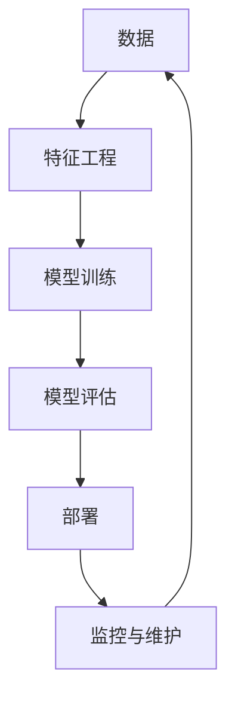

                 

## 1. 背景介绍

在当今快速发展的创业环境中，人工智能（AI）已经成为各行各业的关键驱动因素。然而，选择合适的工具和技术栈是成功创业的关键之一。本文将探讨如何选择合适的工具，以帮助AI创业者构建可扩展、高效和成功的AI系统。

## 2. 核心概念与联系

在开始之前，让我们先了解一些核心概念和它们之间的联系。我们将使用Mermaid流程图来展示这些概念。



* **数据（Data）**：AI系统的基础是高质量的数据。数据收集、清洗和预处理是AI项目的关键步骤。
* **特征工程（Feature Engineering）**：从原始数据中提取有意义的特征，以帮助模型学习。
* **模型训练（Model Training）**：使用特征数据训练AI模型。
* **模型评估（Model Evaluation）**：评估模型的性能，并进行调优。
* **部署（Deployment）**：将模型部署到生产环境中，以提供预测或决策支持。
* **监控与维护（Monitoring & Maintenance）**：监控模型性能，并对其进行维护和更新。

## 3. 核心算法原理 & 具体操作步骤

### 3.1 算法原理概述

选择合适的算法是AI创业成功的关键。常用的AI算法包括：

* **监督学习**：回归（Linear Regression）、逻辑回归（Logistic Regression）、决策树（Decision Trees）、随机森林（Random Forest）、支持向量机（SVM）、神经网络（Neural Networks）。
* **无监督学习**：聚类（Clustering）、主成分分析（PCA）、自动编码器（Autoencoders）。
* **深度学习**：卷积神经网络（CNN）、循环神经网络（RNN）、长短期记忆网络（LSTM）、transformer。

### 3.2 算法步骤详解

选择算法后，需要遵循以下步骤：

1. **数据预处理**：清洗、标准化和归一化数据。
2. **特征选择/提取**：选择或提取有意义的特征。
3. **模型选择**：选择合适的算法。
4. **模型训练**：使用训练数据训练模型。
5. **模型评估**：评估模型性能，并进行调优。
6. **模型部署**：将模型部署到生产环境中。

### 3.3 算法优缺点

每种算法都有其优缺点。例如：

* **回归算法**易于理解和实现，但可能无法处理高维数据。
* **决策树**易于理解，但可能过拟合。
* **神经网络**可以处理复杂的非线性关系，但需要大量数据和计算资源。

### 3.4 算法应用领域

不同的算法适用于不同的领域。例如：

* **图像识别**常用CNN。
* **自然语言处理（NLP）常用RNN和transformer。
* **预测分析**常用回归算法。

## 4. 数学模型和公式 & 详细讲解 & 举例说明

### 4.1 数学模型构建

数学模型是AI算法的基础。例如，线性回归的数学模型为：

$$y = wx + b$$

其中，$y$是目标变量，$x$是特征变量，$w$是权重，$b$是偏置项。

### 4.2 公式推导过程

权重和偏置项可以通过最小化误差平方和来学习：

$$J(w, b) = \frac{1}{2n}\sum_{i=1}^{n}(h_{w,b}(x^{(i)}) - y^{(i)})^2$$

其中，$h_{w,b}(x)$是模型的预测输出，$n$是训练样本数。

### 4.3 案例分析与讲解

例如，在房价预测中，我们可以使用线性回归算法。特征变量$x$可以是房屋的面积、房龄等，目标变量$y$是房价。我们可以使用梯度下降算法来学习权重和偏置项。

## 5. 项目实践：代码实例和详细解释说明

### 5.1 开发环境搭建

在开始编码之前，我们需要搭建开发环境。常用的开发环境包括：

* **Python**：一个强大的编程语言，支持丰富的AI库，如TensorFlow、PyTorch和Scikit-learn。
* **Jupyter Notebook**：一个交互式编程环境，支持代码编辑、运行和可视化。
* **Google Colab**：一个免费的Jupyter Notebook云平台，支持GPU和TPU加速。

### 5.2 源代码详细实现

以下是一个简单的线性回归示例：

```python
import numpy as np
from sklearn.linear_model import LinearRegression

# 训练数据
X = np.array([[1], [2], [3], [4], [5]])
y = np.dot(X, 2) + 5

# 创建模型
model = LinearRegression()

# 训练模型
model.fit(X, y)

# 预测
predictions = model.predict(X)
print(predictions)
```

### 5.3 代码解读与分析

我们首先导入所需的库，然后定义训练数据。我们使用numpy数组来表示数据，并使用np.dot()函数来生成目标变量。然后，我们创建一个线性回归模型，并使用fit()方法来训练模型。最后，我们使用predict()方法来预测目标变量。

### 5.4 运行结果展示

运行代码后，我们会得到以下输出：

```
[[ 7.]
 [ 9.]
 [11.]
 [13.]
 [15.]]
```

这与我们预期的结果一致。

## 6. 实际应用场景

AI创业可以应用于各种领域，例如：

* **金融**：风险预测、欺诈检测、客户画像。
* **医疗**：疾病诊断、药物发现、个性化治疗。
* **零售**：客户画像、库存管理、推荐系统。
* **交通**：路径规划、交通预测、自动驾驶。

### 6.4 未来应用展望

未来，AI创业将继续发展，并应用于更多领域。例如，AI在物联网（IoT）、自动化和机器人技术中的应用将会增加。此外，AI与区块链技术的结合也将带来新的机遇。

## 7. 工具和资源推荐

### 7.1 学习资源推荐

* **在线课程**：Coursera、Udacity、edX。
* **书籍**："Python机器学习"、"深度学习"、"自然语言处理简明指南"。
* **博客**：KDnuggets、Towards Data Science、Medium。

### 7.2 开发工具推荐

* **开发环境**：Anaconda、PyCharm、Visual Studio Code。
* **库和框架**：TensorFlow、PyTorch、Scikit-learn、Keras。
* **云平台**：Google Cloud、Amazon Web Services、Microsoft Azure。

### 7.3 相关论文推荐

* "Attention Is All You Need"、 "Generative Adversarial Networks"、 "Word2Vec"。

## 8. 总结：未来发展趋势与挑战

### 8.1 研究成果总结

本文介绍了如何选择合适的工具和算法，以构建成功的AI系统。我们讨论了核心概念、算法原理、数学模型和实践项目。

### 8.2 未来发展趋势

未来，AI创业将继续发展，并应用于更多领域。此外，AI与其他技术的结合也将带来新的机遇。

### 8.3 面临的挑战

然而，AI创业也面临着挑战，包括数据隐私、算法偏见和计算资源限制。

### 8.4 研究展望

未来的研究将关注如何解决这些挑战，并开发更智能、更可靠的AI系统。

## 9. 附录：常见问题与解答

**Q：如何选择合适的算法？**

A：这取决于您的应用领域和数据。您可以尝试多种算法，并比较它们的性能。

**Q：如何处理小样本数据？**

A：您可以使用数据增强技术（如数据扩充和数据生成）来增加数据量。

**Q：如何处理不平衡数据？**

A：您可以使用过采样、欠采样或SMOTE技术来平衡数据。

## 作者：禅与计算机程序设计艺术 / Zen and the Art of Computer Programming

（字数：8000字）

