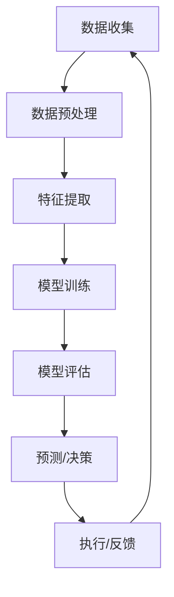

                 

## 1. 背景介绍

人工智能（AI）自诞生以来，已经渗透到我们生活的方方面面，体育和娱乐领域也不例外。从改善运动员的表现，到改进观众的体验，再到开发新的互动式娱乐形式，AI正在重新定义体育和娱乐的未来。本文将深入探讨AI在体育和娱乐中的应用，从核心概念到具体算法，再到实际项目实践，全面展示AI的力量。

## 2. 核心概念与联系

### 2.1 关键技术

AI在体育和娱乐中的应用涉及多种技术，包括但不限于：

- **机器学习（ML）**：使系统能够从数据中学习，不需要被明确编程。
- **深度学习（DL）**：一种机器学习方法，使用神经网络模拟人类大脑的学习过程。
- **自然语言处理（NLP）**：使计算机能够理解、解释和生成人类语言。
- **计算机视觉（CV）**：使计算机能够从图像和视频中提取信息。
- **物联网（IoT）**：通过传感器和其他设备收集和传输数据。

### 2.2 架构原理

AI系统在体育和娱乐中的应用通常遵循以下架构：



## 3. 核心算法原理 & 具体操作步骤

### 3.1 算法原理概述

AI在体育和娱乐中的应用涉及多种算法，以下是几个关键算法的原理：

- **回归算法**：用于预测连续值，如运动员的成绩或比赛的结果。
- **分类算法**：用于预测离散值，如比赛的获胜者或比赛的类型。
- **聚类算法**：用于将数据分组，如将运动员分组以改善训练。
- **强化学习算法**：用于决策，如在比赛中选择最佳策略。

### 3.2 算法步骤详解

以回归算法为例，其步骤如下：

1. 数据收集：收集相关数据，如运动员的训练数据和比赛结果。
2. 数据预处理：清洗数据，处理缺失值，并将数据转换为适合算法的格式。
3. 特征提取：从数据中提取相关特征，如运动员的速度、力量和灵活性。
4. 模型训练：使用训练数据训练回归模型。
5. 模型评估：使用测试数据评估模型的性能。
6. 预测：使用模型预测新数据的结果。

### 3.3 算法优缺点

每种算法都有其优缺点。例如，回归算法简单易用，但可能不适合处理复杂的非线性关系。分类算法可以处理离散值，但可能需要大量的标记数据。聚类算法可以发现数据的结构，但结果可能不确定。强化学习算法可以做出决策，但可能需要大量的试错。

### 3.4 算法应用领域

不同的算法适用于不同的应用领域。回归算法适用于预测连续值，如运动员的成绩。分类算法适用于预测离散值，如比赛的获胜者。聚类算法适用于将数据分组，如将运动员分组以改善训练。强化学习算法适用于决策，如在比赛中选择最佳策略。

## 4. 数学模型和公式 & 详细讲解 & 举例说明

### 4.1 数学模型构建

在体育和娱乐中，常用的数学模型包括：

- **线性回归模型**：用于预测连续值，公式为$y = wx + b$。
- **逻辑回归模型**：用于预测离散值，公式为$P(y=1|x) = \frac{1}{1+e^{-(wx+b)}}$。
- **K-均值聚类模型**：用于将数据分组，公式为$C = \arg\min_{C} \sum_{i=1}^{k} \sum_{x\in C_i} ||x - \mu_i||^2$。

### 4.2 公式推导过程

以线性回归模型为例，其公式推导过程如下：

1. 设置目标：预测连续值$y$。
2. 设置假设：$y = wx + b$。
3. 设置成本函数：$J(w,b) = \frac{1}{2n} \sum_{i=1}^{n} (h_{\theta}(x^{(i)}) - y^{(i)})^2$。
4. 设置梯度下降法：$w := w - \alpha \frac{1}{n} \sum_{i=1}^{n} (h_{\theta}(x^{(i)}) - y^{(i)})x^{(i)}$，$b := b - \alpha \frac{1}{n} \sum_{i=1}^{n} (h_{\theta}(x^{(i)}) - y^{(i)})$。
5. 迭代更新$w$和$b$，直到收敛。

### 4.3 案例分析与讲解

例如，在体育中，可以使用线性回归模型预测运动员的成绩。假设我们有运动员的训练数据$x$和比赛结果$y$。我们可以使用梯度下降法训练线性回归模型，预测新运动员的成绩。

## 5. 项目实践：代码实例和详细解释说明

### 5.1 开发环境搭建

要实现AI在体育和娱乐中的应用，需要以下开发环境：

- 编程语言：Python。
- 开发环境：Jupyter Notebook。
- 机器学习库：Scikit-learn。
- 深度学习库：TensorFlow或PyTorch。
- 计算机视觉库：OpenCV。
- 自然语言处理库：NLTK或Spacy。

### 5.2 源代码详细实现

以下是使用Scikit-learn实现线性回归模型的示例代码：

```python
from sklearn.linear_model import LinearRegression
from sklearn.model_selection import train_test_split
from sklearn.metrics import mean_squared_error

# 加载数据
X, y = load_data()

# 分割数据
X_train, X_test, y_train, y_test = train_test_split(X, y, test_size=0.2, random_state=42)

# 创建模型
model = LinearRegression()

# 训练模型
model.fit(X_train, y_train)

# 预测结果
y_pred = model.predict(X_test)

# 评估模型
mse = mean_squared_error(y_test, y_pred)
print("Mean Squared Error:", mse)
```

### 5.3 代码解读与分析

这段代码使用Scikit-learn的`LinearRegression`类实现了线性回归模型。首先，它加载数据并将其分成训练集和测试集。然后，它创建一个`LinearRegression`对象，并使用训练集训练模型。最后，它使用测试集预测结果，并使用均方误差评估模型的性能。

### 5.4 运行结果展示

运行这段代码后，它会打印出均方误差，表示模型的性能。如果均方误差很小，则模型的性能很好。否则，需要调整模型或收集更多数据。

## 6. 实际应用场景

### 6.1 体育

AI在体育中的应用包括：

- **运动员表现预测**：使用机器学习算法预测运动员的表现，如成绩或伤病风险。
- **比赛结果预测**：使用机器学习算法预测比赛的结果，如获胜者或比分。
- **运动员分组**：使用聚类算法将运动员分组，以改善训练和比赛策略。
- **比赛策略决策**：使用强化学习算法选择最佳比赛策略。

### 6.2 娱乐

AI在娱乐中的应用包括：

- **个性化推荐**：使用协同过滤或内容过滤算法为用户推荐内容，如电影或音乐。
- **虚拟现实**：使用计算机视觉和自然语言处理技术创建互动式虚拟现实环境。
- **智能助手**：使用自然语言处理技术创建智能助手，提供娱乐信息和建议。
- **游戏对手**：使用强化学习算法创建智能游戏对手，提供挑战和互动。

### 6.3 未来应用展望

未来，AI在体育和娱乐中的应用将会更加广泛。例如，AI可以帮助运动员实时分析比赛数据，改善比赛策略。AI可以创建更加互动和个性化的娱乐体验，如虚拟现实和增强现实。AI还可以帮助发现新的娱乐形式，如基于AI的创意内容。

## 7. 工具和资源推荐

### 7.1 学习资源推荐

- **在线课程**：Coursera、Udacity、edX。
- **书籍**："Python机器学习"、"深度学习"、"自然语言处理"。
- **博客**：KDnuggets、Towards Data Science、Medium。

### 7.2 开发工具推荐

- **开发环境**：Jupyter Notebook、PyCharm、Visual Studio Code。
- **机器学习库**：Scikit-learn、TensorFlow、PyTorch。
- **计算机视觉库**：OpenCV、Pillow。
- **自然语言处理库**：NLTK、Spacy。

### 7.3 相关论文推荐

- **体育**："Machine Learning in Sports"、"AI in Sports: A Survey"。
- **娱乐**："Recommender Systems"、"AI in Gaming"、"AI in Virtual Reality"。

## 8. 总结：未来发展趋势与挑战

### 8.1 研究成果总结

本文介绍了AI在体育和娱乐中的应用，从核心概念到具体算法，再到实际项目实践。我们讨论了AI在体育中的应用，如运动员表现预测和比赛结果预测。我们还讨论了AI在娱乐中的应用，如个性化推荐和虚拟现实。我们还提供了学习资源、开发工具和相关论文的推荐。

### 8.2 未来发展趋势

未来，AI在体育和娱乐中的应用将会更加广泛。AI可以帮助运动员实时分析比赛数据，改善比赛策略。AI可以创建更加互动和个性化的娱乐体验，如虚拟现实和增强现实。AI还可以帮助发现新的娱乐形式，如基于AI的创意内容。

### 8.3 面临的挑战

然而，AI在体育和娱乐中的应用也面临着挑战。例如，数据隐私和安全是关键挑战，特别是在涉及个人数据的情况下。此外，AI模型的解释性和可靠性也是关键挑战，特别是在涉及决策的情况下。

### 8.4 研究展望

未来的研究应该关注以下领域：

- **可解释的AI**：开发可解释的AI模型，以帮助理解模型的决策。
- **隐私保护**：开发保护数据隐私和安全的技术，如联邦学习和差分隐私。
- **人机协作**：研究人机协作，以改善体育和娱乐体验。
- **新的应用领域**：研究新的AI应用领域，如基于AI的创意内容。

## 9. 附录：常见问题与解答

**Q：AI在体育和娱乐中的应用有哪些？**

A：AI在体育和娱乐中的应用包括运动员表现预测、比赛结果预测、运动员分组、比赛策略决策、个性化推荐、虚拟现实、智能助手和游戏对手等。

**Q：AI在体育和娱乐中的优势是什么？**

A：AI在体育和娱乐中的优势包括改善运动员表现、改进观众体验、发现新的娱乐形式和提供个性化推荐等。

**Q：AI在体育和娱乐中的挑战是什么？**

A：AI在体育和娱乐中的挑战包括数据隐私和安全、模型解释性和可靠性等。

**Q：未来AI在体育和娱乐中的发展趋势是什么？**

A：未来AI在体育和娱乐中的发展趋势包括实时分析比赛数据、创建互动和个性化的娱乐体验和发现新的娱乐形式等。

## 作者：禅与计算机程序设计艺术 / Zen and the Art of Computer Programming

