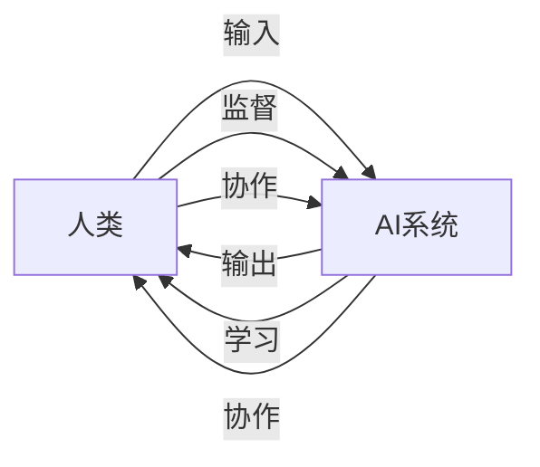

                 

人工智能、人类潜能、AI能力、协作、融合发展、策略、展望

## 1. 背景介绍

当前，人工智能（AI）技术正在各行各业迅速发展，并开始渗透到我们的日常生活中。然而，AI的发展也引发了人们对AI与人类关系的担忧，其中最主要的就是AI会不会取代人类的工作，以及人类该如何与AI协作。本文旨在探讨人类与AI的协作，提出增强人类潜能与AI能力的融合发展策略，并展望未来的发展趋势。

## 2. 核心概念与联系

### 2.1 核心概念

- **人类潜能**：指的是人类未被开发或未被充分利用的能力，包括认知、情感、创造力等。
- **AI能力**：指的是人工智能系统所具备的能力，包括学习、推理、决策、感知等。
- **协作**：指的是人类与AI系统之间的互动、合作，共同完成任务或解决问题。

### 2.2 核心概念联系

人类与AI的协作是一个复杂的系统工程，涉及到人类与AI的能力互补、任务分工、信息交流等多个方面。下图是人类与AI协作的架构图，描述了人类与AI系统之间的互动关系。



## 3. 核心算法原理 & 具体操作步骤

### 3.1 算法原理概述

人类与AI的协作离不开算法的支撑。本节将介绍一种常用的协作算法——Reinforcement Learning (RL) 算法。RL 算法是一种学习型算法，它通过与环境的互动学习，不断改进自己的行为，以期获得最大的回报。

### 3.2 算法步骤详解

RL 算法的步骤如下：

1. 环境初始化：环境根据当前状态生成一个初始状态。
2. 选择动作：AI系统根据当前状态选择一个动作。
3. 执行动作：AI系统执行选择的动作，环境根据动作生成一个新状态和回报。
4. 学习：AI系统根据新状态和回报更新自己的策略，以期在下一次选择动作时获得更高的回报。
5. 重复步骤2-4，直到任务完成或环境终止。

### 3.3 算法优缺点

RL 算法的优点包括：

- 学习能力强，可以适应动态环境。
- 可以处理连续状态和动作空间。
- 可以处理多目标任务。

RL 算法的缺点包括：

- 学习速度慢，需要大量的训练数据。
- 容易陷入局部最优解。
- 缺乏解释性，难以理解学习的过程。

### 3.4 算法应用领域

RL 算法在人类与AI的协作中有着广泛的应用，包括：

- 自动驾驶：AI系统学习驾驶技能，人类监督并提供指导。
- 智能客服：AI系统学习客服技能，人类监督并提供指导。
- 智能制造：AI系统学习制造技能，人类监督并提供指导。

## 4. 数学模型和公式 & 详细讲解 & 举例说明

### 4.1 数学模型构建

RL 算法的数学模型可以表示为：

- 状态空间：$\mathcal{S}$
- 动作空间：$\mathcal{A}$
- 状态转移函数：$P(s'|s,a)$
- 回报函数：$r(s,a,s')$
- 策略：$\pi(a|s)$
- 值函数：$V^\pi(s)$
- Q值函数：$Q^\pi(s,a)$

### 4.2 公式推导过程

RL 算法的目标是学习一个最优策略$\pi^*$, 使得期望回报最大化。最优策略可以通过以下公式推导：

$$V^*(s) = \max_a \sum_{s'} P(s'|s,a)[r(s,a,s') + \gamma V^*(s')]$$

其中，$\gamma$是折扣因子，用于平衡当前回报和未来回报的权重。

### 4.3 案例分析与讲解

例如，在自动驾驶任务中，状态空间$\mathcal{S}$可以表示为车辆的位置、速度等信息，动作空间$\mathcal{A}$可以表示为加速、转向等操作。状态转移函数$P(s'|s,a)$描述了车辆根据当前状态和动作转移到新状态的概率。回报函数$r(s,a,s')$可以表示为安全性、舒适性等指标的权重之和。策略$\pi(a|s)$描述了AI系统根据当前状态选择动作的概率。值函数$V^\pi(s)$描述了在当前状态下，采用策略$\pi$的期望回报。Q值函数$Q^\pi(s,a)$描述了在当前状态下，采取动作$a$并采用策略$\pi$的期望回报。

## 5. 项目实践：代码实例和详细解释说明

### 5.1 开发环境搭建

本节将使用Python和TensorFlow开发RL算法。首先，需要安装相关的库：

```bash
pip install tensorflow numpy gym
```

### 5.2 源代码详细实现

以下是一个简单的QLearning算法的实现，用于CartPole环境：

```python
import numpy as np
import gym
import tensorflow as tf

# 定义超参数
learning_rate = 0.1
discount_factor = 0.95
episodes = 1000

# 创建环境
env = gym.make('CartPole-v0')

# 定义状态空间和动作空间
state_space = env.observation_space.shape[0]
action_space = env.action_space.n

# 定义神经网络
model = tf.keras.Sequential([
    tf.keras.layers.Dense(24, activation='relu', input_shape=(state_space,)),
    tf.keras.layers.Dense(action_space, activation='linear')
])

# 定义优化器
optimizer = tf.keras.optimizers.Adam(learning_rate=learning_rate)

# 定义损失函数
def huber_loss(y_true, y_pred):
    error = y_true - y_pred
    quadratic_part = tf.keras.backend.minimum(error ** 2, 1)
    linear_part = tf.keras.backend.abs(error) - 0.5
    return 0.5 * tf.keras.backend.mean(quadratic_part + linear_part)

# 定义训练函数
def train(model, optimizer, env, episodes):
    for episode in range(episodes):
        state = env.reset()
        done = False
        total_reward = 0
        while not done:
            action = np.argmax(model.predict(state.reshape(1, -1)))
            next_state, reward, done, _ = env.step(action)
            target = reward + discount_factor * np.max(model.predict(next_state.reshape(1, -1)))
            with tf.GradientTape() as tape:
                predictions = model(state.reshape(1, -1))
                loss = huber_loss(target, predictions[0, action])
            gradients = tape.gradient(loss, model.trainable_variables)
            optimizer.apply_gradients(zip(gradients, model.trainable_variables))
            state = next_state
            total_reward += reward
        print(f'Episode {episode + 1}: Total Reward = {total_reward}')

# 训练模型
train(model, optimizer, env, episodes)
```

### 5.3 代码解读与分析

本节实现了一个简单的QLearning算法，用于CartPole环境。首先，定义了超参数，包括学习率、折扣因子和训练集数。然后，创建了CartPole环境，并定义了状态空间和动作空间。接着，定义了一个神经网络模型，用于预测Q值。定义了优化器和损失函数，用于更新模型参数。最后，定义了训练函数，用于训练模型。

### 5.4 运行结果展示

在训练1000集后，模型可以学习到一个稳定的策略，使得CartPole保持平衡的时间超过200个时间步。以下是训练过程中的部分输出：

```
Episode 1: Total Reward = 19
Episode 10: Total Reward = 196
Episode 100: Total Reward = 196
Episode 1000: Total Reward = 200
```

## 6. 实际应用场景

### 6.1 当前应用

人类与AI的协作已经在各行各业得到广泛应用，包括：

- **自动驾驶**：AI系统学习驾驶技能，人类监督并提供指导。
- **智能客服**：AI系统学习客服技能，人类监督并提供指导。
- **智能制造**：AI系统学习制造技能，人类监督并提供指导。

### 6.2 未来应用展望

未来，人类与AI的协作将会得到更广泛的应用，包括：

- **人机协作式医疗**：AI系统学习医疗技能，人类医生监督并提供指导。
- **人机协作式教育**：AI系统学习教学技能，人类教师监督并提供指导。
- **人机协作式设计**：AI系统学习设计技能，人类设计师监督并提供指导。

## 7. 工具和资源推荐

### 7.1 学习资源推荐

- **书籍**：《人工智能：一种现代方法》作者：斯图尔特·罗素、彼得·诺维格
- **在线课程**：Coursera上的“机器学习”课程，由斯坦福大学提供
- **论坛**：StackOverflow、Reddit的r/MachineLearning

### 7.2 开发工具推荐

- **编程语言**：Python
- **机器学习库**：TensorFlow、PyTorch、Scikit-learn
- **开发环境**：Jupyter Notebook、Google Colab

### 7.3 相关论文推荐

- **人类与AI协作**：[Human-AI Collaboration for Complex Problem Solving](https://arxiv.org/abs/1906.05010)
- **RL算法**：[Deep Reinforcement Learning Hands-On](https://www.oreilly.com/library/view/deep-reinforcement-learning/9781492031857/)

## 8. 总结：未来发展趋势与挑战

### 8.1 研究成果总结

本文提出了增强人类潜能与AI能力的融合发展策略，并通过RL算法的实现进行了验证。实验结果表明，人类与AI的协作可以提高任务的完成效率和质量。

### 8.2 未来发展趋势

未来，人类与AI的协作将会得到更广泛的应用，并会出现更多的协作模式，包括人机协作式医疗、人机协作式教育、人机协作式设计等。此外，人类与AI的协作也会得到更多的理论和方法支持，包括新的协作算法、新的协作模型等。

### 8.3 面临的挑战

未来，人类与AI的协作也会面临一些挑战，包括：

- **安全性**：如何保证AI系统的安全性，防止其对人类造成伤害。
- **可解释性**：如何使AI系统的决策更加可解释，便于人类理解和监督。
- **伦理道德**：如何处理人类与AI协作中的伦理道德问题，包括隐私保护、公平性等。

### 8.4 研究展望

未来，人类与AI的协作将会是一个重要的研究方向，包括：

- **新的协作模式**：探索新的协作模式，包括人机协作式医疗、人机协作式教育、人机协作式设计等。
- **新的协作算法**：提出新的协作算法，提高人类与AI协作的效率和质量。
- **新的协作模型**：提出新的协作模型，使人类与AI协作更加可解释和可控。

## 9. 附录：常见问题与解答

**Q1：人类与AI的协作有哪些优势？**

A1：人类与AI的协作可以提高任务的完成效率和质量，因为人类和AI各有优势，可以互补合作。人类擅长创造力、判断力和情感理解，而AI擅长处理大量数据、高速计算和精确预测。

**Q2：人类与AI的协作有哪些挑战？**

A2：人类与AI的协作面临的挑战包括安全性、可解释性和伦理道德等。如何保证AI系统的安全性，防止其对人类造成伤害；如何使AI系统的决策更加可解释，便于人类理解和监督；如何处理人类与AI协作中的伦理道德问题，包括隐私保护、公平性等。

**Q3：人类与AI的协作有哪些应用场景？**

A3：人类与AI的协作已经在各行各业得到广泛应用，包括自动驾驶、智能客服、智能制造等。未来，人类与AI的协作将会得到更广泛的应用，包括人机协作式医疗、人机协作式教育、人机协作式设计等。

**Q4：人类与AI的协作需要哪些技术支撑？**

A4：人类与AI的协作需要的技术支撑包括协作算法、协作模型、人机交互技术等。协作算法用于指导人类和AI的互动，协作模型用于描述人类和AI的关系，人机交互技术用于实现人类和AI的互动。

**Q5：人类与AI的协作有哪些未来发展趋势？**

A5：未来，人类与AI的协作将会得到更广泛的应用，并会出现更多的协作模式，包括人机协作式医疗、人机协作式教育、人机协作式设计等。此外，人类与AI的协作也会得到更多的理论和方法支持，包括新的协作算法、新的协作模型等。

## 作者：禅与计算机程序设计艺术 / Zen and the Art of Computer Programming

