# Python深度学习实践：手把手教你利用YOLO进行对象检测

## 1. 背景介绍

### 1.1 问题的由来

随着深度学习技术的不断发展，计算机视觉领域取得了令人瞩目的成果。其中，目标检测作为计算机视觉的核心任务之一，在安防监控、无人驾驶、智能交通、医疗诊断等多个领域都有着广泛的应用。目标检测旨在从图像或视频中检测出其中的目标，并标注出其位置和类别。

近年来，基于深度学习的目标检测算法层出不穷，其中YOLO（You Only Look Once）算法以其速度快、精度高、易于实现等优势，成为了目标检测领域的佼佼者。本文将手把手教你利用Python进行YOLO目标检测实践，让你轻松入门并掌握这项强大的技术。

### 1.2 研究现状

目标检测技术经历了从传统方法到深度学习方法的演变。早期目标检测方法主要基于手工特征和机器学习算法，如Haar特征、SVM、R-CNN等。这些方法在特定任务上取得了不错的效果，但存在计算复杂度高、实时性差等缺点。

随着深度学习技术的发展，基于深度学习的目标检测方法逐渐成为主流。代表性的算法有Faster R-CNN、YOLO、SSD等。其中，YOLO算法以其速度快、精度高、易于实现等优点，成为了目标检测领域的热点。

### 1.3 研究意义

YOLO算法在目标检测领域具有很高的实用价值，主要体现在以下几个方面：

1. **速度快**：YOLO算法采用了单个网络进行检测，避免了传统方法中目标检测和分类分离的步骤，从而大大提高了检测速度。
2. **精度高**：YOLO算法通过多尺度特征融合，能够更好地检测不同尺度的目标，在多个数据集上取得了与Faster R-CNN等算法相当甚至更好的检测精度。
3. **易于实现**：YOLO算法结构简单，代码实现方便，易于在个人电脑上运行和调试。

### 1.4 本文结构

本文将分为以下几个部分：

1. 介绍目标检测和YOLO算法的基本概念。
2. 讲解YOLO算法的原理和实现步骤。
3. 展示如何使用Python和YOLOv5库进行目标检测实践。
4. 分析YOLO算法的实际应用场景和未来发展趋势。

## 2. 核心概念与联系

### 2.1 目标检测

目标检测是指从图像或视频中检测出其中的目标，并标注出其位置和类别。目标检测任务通常包含以下步骤：

1. **特征提取**：从输入图像中提取特征，用于描述目标的外观和属性。
2. **目标分类**：对提取到的特征进行分类，判断目标的类别。
3. **位置回归**：根据特征信息，预测目标在图像中的位置（边界框）。

### 2.2 YOLO算法

YOLO（You Only Look Once）是一种单阶段目标检测算法，由Joseph Redmon等人在2015年提出。YOLO算法将目标检测任务视为一个回归问题，通过一个神经网络直接预测目标的类别和位置。

YOLO算法的主要特点如下：

1. **单阶段检测**：YOLO算法在单个网络中同时完成目标检测和分类任务，避免了传统方法中目标检测和分类分离的步骤，从而提高了检测速度。
2. **多尺度特征融合**：YOLO算法使用不同尺度的特征图进行检测，能够更好地检测不同尺度的目标。
3. **锚框（Anchors）**：YOLO算法使用锚框来预测目标的边界框，每个锚框对应一个预定义的位置和尺寸，能够有效地提高检测精度。

## 3. 核心算法原理 & 具体操作步骤

### 3.1 算法原理概述

YOLO算法的核心思想是将输入图像划分为多个网格（grid cells），每个网格负责检测该区域的物体。每个网格输出多个边界框（bounding boxes），并预测边界框的中心位置、宽度和高度，以及目标的类别概率。

YOLO算法的步骤如下：

1. **数据预处理**：将输入图像缩放到固定的尺寸，并将其划分为多个网格。
2. **特征提取**：使用卷积神经网络提取图像特征。
3. **预测**：将特征图输入到YOLO模型，输出预测结果，包括边界框、置信度、类别概率等。
4. **后处理**：对预测结果进行解码和NMS处理，得到最终的检测结果。

### 3.2 算法步骤详解

下面以YOLOv5为例，介绍YOLO算法的具体实现步骤。

1. **导入库**：

```python
import torch
from torch.utils.data import DataLoader
from datasets import ImageFolder
from utils.datasets import CreateDataset
from utils.utils import *
from utils.model import attempt_load
from utils.general import check_img_size, non_max_suppression, scale_coords
```

2. **加载模型**：

```python
device = torch.device('cuda' if torch.cuda.is_available() else 'cpu')
model = attempt_load('yolov5s.pt', map_location=device)  # 加载预训练模型
model.to(device).eval()
```

3. **创建数据集**：

```python
dataset = CreateDataset('data/images', img_size=640)
dataloader = DataLoader(dataset, batch_size=2, shuffle=False)
```

4. **模型推理**：

```python
for path, img, im0s, vid_cap in dataloader:
    img = torch.from_numpy(img).to(device)
    img = img.float()  # uint8 to fp16/32
    img /= 255.0  # 归一化
    if img.ndimension() == 3:
        img = img.unsqueeze(0)

    pred = model(img, augment=False)[0]

    # 解码预测结果
    pred = non_max_suppression(pred, 0.4, 0.5, classes=None, agnostic=False)

    for i, det in enumerate(pred):  # 遍历每个图像
        p, s, im0 = path[i], '', im0s[i]

        s += '%gx%g ' % img.shape[2:]  # 打印图像尺寸
        if len(det):
            # 将预测结果转换为边界框坐标
            det[:, :4] = scale_coords(img.shape[2:], det[:, :4], im0.shape).round()

            # 打印检测结果
            for *xyxy, conf, cls in reversed(det):
                label = f'{names[int(cls)]} {conf:.2f}'
                print(label, xyxy)

        # 显示图像
        plot_one_box(det[:, :4], im0, label=label, color=(0, 255, 0), line_thickness=3)
        cv2.imshow(s, im0)
        cv2.waitKey(0)
```

5. **保存预测结果**：

```python
result_path = 'results'
if not os.path.exists(result_path):
    os.makedirs(result_path)
cv2.imwrite(os.path.join(result_path, f'{path.stem}.jpg'), im0)
```

### 3.3 算法优缺点

YOLO算法具有以下优点：

1. **速度快**：YOLO算法采用单阶段检测，避免了传统方法中目标检测和分类分离的步骤，从而大大提高了检测速度。
2. **精度高**：YOLO算法通过多尺度特征融合，能够更好地检测不同尺度的目标，在多个数据集上取得了与Faster R-CNN等算法相当甚至更好的检测精度。
3. **易于实现**：YOLO算法结构简单，代码实现方便，易于在个人电脑上运行和调试。

YOLO算法也存在以下缺点：

1. **对小目标的检测精度较低**：由于YOLO算法的检测窗口相对固定，对于小目标的检测精度较低。
2. **对遮挡目标的检测效果不佳**：当目标之间存在遮挡时，YOLO算法的检测效果可能会受到影响。

## 4. 数学模型和公式 & 详细讲解 & 举例说明

### 4.1 数学模型构建

YOLO算法采用卷积神经网络（CNN）作为特征提取器，并使用锚框（Anchors）来预测目标的边界框。

假设输入图像大小为 $W \times H$，网格大小为 $S \times S$，则每个网格输出 $5 \times (C+4)$ 个预测值，其中 $C$ 为类别数量。

每个预测值表示为：

$$
\begin{align*}
\hat{c}_i &= \hat{p}(x_i, y_i) \
\hat{b}_x &= \hat{w}_x(x_i, y_i) \
\hat{b}_y &= \hat{w}_y(x_i, y_i) \
\hat{b}_h &= \hat{w}_h(x_i, y_i) \
\hat{b}_w &= \hat{w}_w(x_i, y_i)
\end{align*}
$$

其中：

- $\hat{c}_i$ 表示目标类别概率。
- $\hat{b}_x, \hat{b}_y, \hat{b}_h, \hat{b}_w$ 分别表示预测边界框的中心坐标、高度和宽度。
- $x_i, y_i$ 表示锚框的坐标。
- $\hat{p}, \hat{w}_x, \hat{w}_y, \hat{w}_h, \hat{w}_w$ 分别表示概率预测函数、边界框参数预测函数。

### 4.2 公式推导过程

YOLO算法的公式推导过程较为复杂，涉及卷积神经网络、锚框、损失函数等多个方面。此处不再赘述，有兴趣的读者可以参考相关论文。

### 4.3 案例分析与讲解

以YOLOv5为例，我们分析其数学模型和公式：

1. **卷积神经网络**：YOLOv5采用CSPDarknet53作为特征提取器，其结构如图所示。

```mermaid
graph LR
A[Conv] --> B[Darknet53]
B --> C[Conv]
C --> D[Darknet53]
D --> E[Conv]
E --> F[Darknet53]
F --> G[Conv]
G --> H[Darknet53]
H --> I[Conv]
I --> J[Conv]
J --> K[Darknet53]
K --> L[Conv]
L --> M[Darknet53]
M --> N[Conv]
N --> O[Conv]
O --> P[Darknet53]
P --> Q[Conv]
Q --> R[Darknet53]
R --> S[Conv]
S --> T[Conv]
T --> U[Darknet53]
U --> V[Conv]
V --> W[Conv]
W --> X[Darknet53]
X --> Y[Conv]
Y --> Z[Conv]
Z --> A
```



2. **锚框**：YOLOv5使用K-means聚类算法对PASCAL VOC数据集进行聚类，得到不同尺度和宽高的锚框。

3. **损失函数**：YOLOv5使用交叉熵损失函数来计算预测值和真实值之间的差异。

### 4.4 常见问题解答

**Q1：YOLO算法的检测速度为什么比Faster R-CNN快？**

A：YOLO算法采用单阶段检测，避免了传统方法中目标检测和分类分离的步骤，从而减少了计算量，提高了检测速度。

**Q2：如何提高YOLO算法的检测精度？**

A：可以尝试以下方法：
1. 使用更强大的网络结构，如YOLOv5、YOLOv6等。
2. 使用更多高质量的标注数据。
3. 使用更合适的锚框参数。

**Q3：YOLO算法能否检测出小目标和遮挡目标？**

A：YOLO算法对小目标和遮挡目标的检测效果较差。可以通过以下方法进行改进：
1. 使用更小的输入图像尺寸。
2. 使用更小的锚框参数。
3. 结合其他检测算法，如Faster R-CNN等。

## 5. 项目实践：代码实例和详细解释说明

### 5.1 开发环境搭建

在进行YOLO目标检测实践前，我们需要准备好开发环境。以下是使用Python进行YOLOv5开发的环境配置流程：

1. 安装Anaconda：从官网下载并安装Anaconda，用于创建独立的Python环境。

2. 创建并激活虚拟环境：

```bash
conda create -n yolo-env python=3.8
conda activate yolo-env
```

3. 安装PyTorch：根据CUDA版本，从官网获取对应的安装命令。例如：

```bash
conda install pytorch torchvision torchaudio cudatoolkit=11.1 -c pytorch -c conda-forge
```

4. 安装YOLOv5库：

```bash
pip install torchcv
```

5. 安装其他工具包：

```bash
pip install numpy pandas scikit-learn matplotlib tqdm opencv-python
```

完成上述步骤后，即可在`yolo-env`环境中开始YOLO目标检测实践。

### 5.2 源代码详细实现

下面我们以使用YOLOv5对图像进行目标检测为例，给出Python代码实现。

```python
import torch
from torch.utils.data import DataLoader
from datasets import ImageFolder
from utils.datasets import CreateDataset
from utils.utils import *
from utils.model import attempt_load
from utils.general import check_img_size, non_max_suppression, scale_coords
import cv2
import os

# 加载模型
device = torch.device('cuda' if torch.cuda.is_available() else 'cpu')
model = attempt_load('yolov5s.pt', map_location=device)
model.to(device).eval()

# 创建数据集
dataset = CreateDataset('data/images', img_size=640)
dataloader = DataLoader(dataset, batch_size=2, shuffle=False)

# 模型推理
for path, img, im0s, vid_cap in dataloader:
    img = torch.from_numpy(img).to(device)
    img = img.float()  # uint8 to fp16/32
    img /= 255.0  # 归一化
    if img.ndimension() == 3:
        img = img.unsqueeze(0)

    pred = model(img, augment=False)[0]

    # 解码预测结果
    pred = non_max_suppression(pred, 0.4, 0.5, classes=None, agnostic=False)

    for i, det in enumerate(pred):  # 遍历每个图像
        p, s, im0 = path[i], '', im0s[i]

        s += '%gx%g ' % img.shape[2:]  # 打印图像尺寸
        if len(det):
            # 将预测结果转换为边界框坐标
            det[:, :4] = scale_coords(img.shape[2:], det[:, :4], im0.shape).round()

            # 打印检测结果
            for *xyxy, conf, cls in reversed(det):
                label = f'{names[int(cls)]} {conf:.2f}'
                print(label, xyxy)

        # 显示图像
        plot_one_box(det[:, :4], im0, label=label, color=(0, 255, 0), line_thickness=3)
        cv2.imshow(s, im0)
        cv2.waitKey(0)
```

### 5.3 代码解读与分析

1. **导入库**：导入必要的库，包括PyTorch、YOLOv5库、OpenCV等。

2. **加载模型**：使用`attempt_load`函数加载预训练模型。

3. **创建数据集**：使用`CreateDataset`函数创建数据集。

4. **模型推理**：将图像输入模型进行推理，并解码预测结果。

5. **后处理**：对解码后的预测结果进行NMS处理，得到最终的检测结果。

6. **显示图像**：使用OpenCV显示图像和检测结果。

### 5.4 运行结果展示

假设我们有一张包含猫和狗的图像，使用YOLOv5进行目标检测后的结果如图所示：

```
cat 0.98 (210, 120, 280, 280)
dog 0.85 (50, 50, 300, 300)
```

可以看到，YOLOv5成功检测出了图像中的猫和狗，并给出了其类别概率和位置。

## 6. 实际应用场景

YOLO算法在目标检测领域具有广泛的应用，以下列举一些常见的应用场景：

1. **安防监控**：在公共安全领域，YOLO算法可以用于实时监控视频，检测出异常行为，如打架、偷窃等，从而提高安防水平。
2. **无人驾驶**：在自动驾驶领域，YOLO算法可以用于检测道路上的行人、车辆、交通标志等，为自动驾驶系统提供实时感知信息。
3. **智能交通**：YOLO算法可以用于检测交通违法行为，如逆行、闯红灯等，从而提高交通管理水平。
4. **医疗诊断**：在医疗领域，YOLO算法可以用于检测医学图像中的病变区域，辅助医生进行诊断。
5. **工业检测**：在工业生产领域，YOLO算法可以用于检测产品缺陷，提高生产质量。

## 7. 工具和资源推荐

### 7.1 学习资源推荐

1. 《YOLOv5: An Open and Efficient Object Detection Framework》：YOLOv5官方论文，详细介绍了YOLOv5算法的原理和实现。
2. 《目标检测：从R-CNN到YOLOv5》：这本书全面介绍了目标检测领域的历史发展、经典算法和YOLOv5算法。
3. YOLOv5官方文档：YOLOv5官方文档提供了详细的API文档和样例代码，是学习和使用YOLOv5的必备资料。
4. PyTorch官方文档：PyTorch官方文档提供了丰富的PyTorch教程和示例，是学习和使用PyTorch的权威指南。

### 7.2 开发工具推荐

1. PyTorch：PyTorch是一个开源的深度学习框架，具有灵活的动态计算图和丰富的API，是进行目标检测开发的首选框架。
2. OpenCV：OpenCV是一个开源的计算机视觉库，提供了丰富的图像处理和计算机视觉算法，是进行目标检测图像预处理和后处理的利器。
3. NumPy：NumPy是一个开源的Python库，提供了高效的数组运算和科学计算功能，是进行目标检测数据处理的基础。
4. Matplotlib：Matplotlib是一个开源的数据可视化库，可以用于绘制目标检测结果和可视化模型性能。

### 7.3 相关论文推荐

1. YOLO: Real-Time Object Detection with Deep Neural Networks：YOLOv1官方论文，详细介绍了YOLOv1算法的原理和实现。
2. YOLO9000: Better, Faster, Stronger：YOLOv2官方论文，介绍了YOLOv2算法的改进和性能提升。
3. YOLOv3: An Incremental Improvement：YOLOv3官方论文，详细介绍了YOLOv3算法的改进和性能提升。
4. YOLOv4: Optimal Speed and Accuracy of Object Detection：YOLOv4官方论文，介绍了YOLOv4算法的改进和性能提升。

### 7.4 其他资源推荐

1. GitHub：GitHub上有很多优秀的YOLOv5开源项目，可以参考和学习。
2. Stack Overflow：Stack Overflow上有大量的目标检测相关问题和答案，可以解决你在学习和使用YOLOv5过程中遇到的问题。
3. 论文阅读网站：如arXiv.org、CVPR、ICCV等，可以了解最新的目标检测研究进展。

## 8. 总结：未来发展趋势与挑战

### 8.1 研究成果总结

本文详细介绍了YOLO算法的原理、实现步骤和应用场景，并通过Python代码实例展示了如何利用YOLO进行目标检测实践。YOLO算法作为一种高效、易用的目标检测算法，在多个领域都得到了广泛应用。

### 8.2 未来发展趋势

未来，YOLO算法可能的发展趋势包括：

1. **模型轻量化**：为了适应移动设备和嵌入式系统，YOLO算法将朝着更轻量化的方向发展。
2. **多模态融合**：将YOLO算法与其他模态信息（如图像、视频、音频等）进行融合，实现更全面的目标检测。
3. **自适应锚框**：根据不同的任务和数据集，自适应地调整锚框参数，提高检测精度。

### 8.3 面临的挑战

YOLO算法在发展过程中也面临着以下挑战：

1. **小目标和遮挡目标检测**：如何提高YOLO算法对小目标和遮挡目标的检测精度，是当前的一个重要研究方向。
2. **泛化能力**：如何提高YOLO算法在不同数据集和场景下的泛化能力，是另一个重要的研究方向。
3. **可解释性**：如何提高YOLO算法的可解释性，使其更加透明和可靠，是未来研究的重要方向。

### 8.4 研究展望

随着深度学习技术的不断发展，YOLO算法将会在以下几个方面得到进一步的发展：

1. **模型轻量化**：通过模型压缩、量化等手段，使YOLO算法更加轻量化，适应移动设备和嵌入式系统。
2. **多模态融合**：将YOLO算法与其他模态信息进行融合，实现更全面的目标检测。
3. **自适应锚框**：根据不同的任务和数据集，自适应地调整锚框参数，提高检测精度。
4. **可解释性**：通过可视化、解释性推理等方法，提高YOLO算法的可解释性。

相信在不久的将来，YOLO算法将会在更多领域发挥重要作用，为人类带来更多便利。

## 9. 附录：常见问题与解答

**Q1：YOLO算法能否检测出透明物体？**

A：YOLO算法在检测透明物体方面存在困难，因为透明物体的颜色和形状与背景相似，难以区分。可以通过以下方法进行改进：
1. 使用更深的网络结构，提高模型的表达能力。
2. 使用更多的训练数据，增强模型的鲁棒性。
3. 结合其他传感器，如深度相机，提供更多信息。

**Q2：YOLO算法如何处理遮挡目标？**

A：YOLO算法在处理遮挡目标时，可能会出现漏检、误检等问题。可以通过以下方法进行改进：
1. 使用更复杂的网络结构，提高模型的表达能力。
2. 使用数据增强技术，增加训练数据的多样性。
3. 考虑遮挡关系，设计专门的训练数据集。

**Q3：YOLO算法在目标检测任务中是否具有优势？**

A：YOLO算法在目标检测任务中具有以下优势：
1. 速度快：YOLO算法采用单阶段检测，避免了传统方法中目标检测和分类分离的步骤，从而提高了检测速度。
2. 精度高：YOLO算法通过多尺度特征融合，能够更好地检测不同尺度的目标。
3. 易于实现：YOLO算法结构简单，代码实现方便，易于在个人电脑上运行和调试。

**Q4：如何选择合适的YOLO模型？**

A：选择合适的YOLO模型主要考虑以下因素：
1. 任务需求：根据任务需求选择适合的网络结构和超参数。
2. 计算资源：根据计算资源限制选择合适的模型大小和复杂度。
3. 性能指标：根据性能指标（如速度、精度等）选择最优的模型。

作者：禅与计算机程序设计艺术 / Zen and the Art of Computer Programming