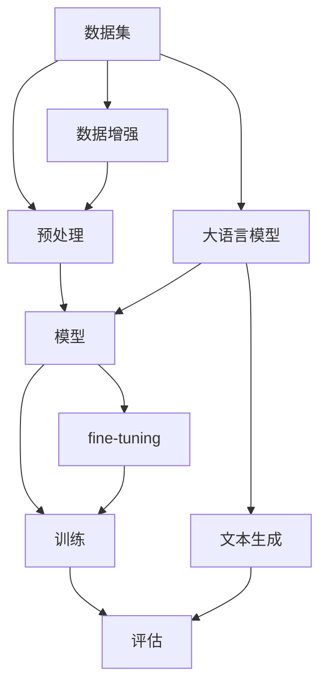

                 

## 1. 背景介绍

在人工智能（AI）领域，数据是关键。从简单的图像分类到复杂的自然语言理解，数据集的选择和处理对模型的性能至关重要。本文将带领读者从MNIST数据集出发，一步步深入到大语言模型的世界，探索数据集在AI模型中的作用，以及如何构建和训练大语言模型。

MNIST数据集是计算机视觉领域的经典数据集，包含手写数字的图像和标签。它简单易得，但却是AI模型的试金石。我们将从MNIST数据集开始，一步步扩展到更复杂的数据集，最终到达大语言模型的领域。

## 2. 核心概念与联系

在深入细节之前，让我们先看一下从MNIST数据集到大语言模型的核心概念和联系。图1展示了这些概念的关系。



图1：从MNIST数据集到大语言模型的核心概念关系图

从图中可以看出，数据集是整个过程的起点。数据预处理和增强后，数据被输入到模型中。模型通过训练不断优化，并通过评估来测试其性能。大语言模型是这个过程的延伸，它可以从文本生成的角度进行评估。

## 3. 核心算法原理 & 具体操作步骤

### 3.1 算法原理概述

从MNIST数据集到大语言模型，我们将接触到多种算法。其中，卷积神经网络（CNN）和transformer是两个关键算法。CNN适合于图像数据，而transformer则适合于序列数据，如文本。

### 3.2 算法步骤详解

#### 3.2.1 卷积神经网络（CNN）

1. **输入层**：接收MNIST数据集的图像输入。
2. **卷积层**：使用卷积核提取图像特征。
3. **池化层**：缩小特征图的空间尺寸，减少参数数量。
4. **全连接层**：将特征图展平成向量，进行分类。
5. **输出层**：输出10个数字的概率分布。

#### 3.2.2 Transformer

1. **输入层**：接收文本序列输入。
2. **位置编码**：为序列中的每个位置添加编码，保留序列信息。
3. **自注意力（Self-Attention）**：让模型能够关注序列中的不同位置。
4. **前向网络（Feed-Forward Network）**：在自注意力层之后，进一步提取特征。
5. **输出层**：输出文本序列的表示。

### 3.3 算法优缺点

**CNN的优缺点：**

- 优点：对图像数据表现出色，参数数量少，训练速度快。
- 缺点：无法处理序列数据，对空间信息不敏感。

**Transformer的优缺点：**

- 优点：可以处理序列数据，对序列中的位置关系敏感。
- 缺点：参数数量多，训练速度慢，对计算资源要求高。

### 3.4 算法应用领域

CNN适合于图像分类、目标检测等任务。Transformer适合于机器翻译、文本生成等需要处理序列数据的任务。

## 4. 数学模型和公式 & 详细讲解 & 举例说明

### 4.1 数学模型构建

#### 4.1.1 CNN数学模型

设输入图像为$X \in \mathbb{R}^{H \times W \times C}$, 其中$H$, $W$, $C$分别是图像的高度、宽度和通道数。设卷积核为$K \in \mathbb{R}^{h \times w \times C \times C'}$, 其中$h$, $w$, $C'$分别是卷积核的高度、宽度和输出通道数。则卷积操作可以表示为：

$$Y_{ij}^{c'} = \sigma(\sum_{c=1}^{C} \sum_{m=0}^{h-1} \sum_{n=0}^{w-1} K_{mn}^{c'c} X_{(i+m)(j+n)}^{c})$$

其中$\sigma$是激活函数，如ReLU。

#### 4.1.2 Transformer数学模型

设输入文本序列为$X \in \mathbb{R}^{N \times d_{model}}$, 其中$N$是序列长度，$d_{model}$是嵌入维度。设位置编码为$PE \in \mathbb{R}^{N \times d_{model}}$. 则自注意力层可以表示为：

$$Attention(Q, K, V) = softmax(\frac{QK^T}{\sqrt{d_k}})V$$

其中$Q$, $K$, $V$分别是查询、键、值，都是线性变换后的输入$X$。前向网络可以表示为：

$$FFN(x) = max(0, xW_1 + b_1)W_2 + b_2$$

其中$W_1$, $W_2$, $b_1$, $b_2$都是学习参数。

### 4.2 公式推导过程

这里不再赘述，读者可以参考相关论文和教材。

### 4.3 案例分析与讲解

#### 4.3.1 CNN在MNIST数据集上的应用

设MNIST数据集的图像大小为$28 \times 28$, 通道数为1。设卷积核大小为$3 \times 3$, 输出通道数为16。则第一个卷积层的输出大小为$26 \times 26 \times 16$.

#### 4.3.2 Transformer在机器翻译上的应用

设输入文本序列长度为$N=100$, 嵌入维度为$d_{model}=512$. 则输入文本序列的大小为$100 \times 512$.

## 5. 项目实践：代码实例和详细解释说明

### 5.1 开发环境搭建

本项目使用Python作为开发语言，PyTorch作为深度学习框架。读者需要安装Python（>=3.7）、PyTorch（>=1.5）、TorchVision（>=0.6）、Transformers（>=4.5）等库。

### 5.2 源代码详细实现

#### 5.2.1 CNN在MNIST数据集上的实现

```python
import torch
import torch.nn as nn
import torchvision.transforms as transforms
import torchvision.datasets as dsets

# Load MNIST dataset
train_dataset = dsets.MNIST(root='./data',
                            train=True,
                            transform=transforms.ToTensor(),
                            download=True)

test_dataset = dsets.MNIST(root='./data',
                           train=False,
                           transform=transforms.ToTensor())

# Define CNN model
class CNN(nn.Module):
    def __init__(self):
        super(CNN, self).__init__()
        self.layer1 = nn.Sequential(
            nn.Conv2d(1, 16, kernel_size=3, stride=1, padding=1),
            nn.ReLU(),
            nn.MaxPool2d(kernel_size=2, stride=2))
        self.layer2 = nn.Sequential(
            nn.Conv2d(16, 32, kernel_size=3, stride=1, padding=1),
            nn.ReLU(),
            nn.MaxPool2d(kernel_size=2, stride=2))
        self.fc = nn.Linear(7*7*32, 10)

    def forward(self, x):
        out = self.layer1(x)
        out = self.layer2(out)
        out = out.reshape(out.size(0), -1)
        out = self.fc(out)
        return out

# Initialize model, loss function, and optimizer
model = CNN()
criterion = nn.CrossEntropyLoss()
optimizer = torch.optim.Adam(model.parameters(), lr=0.001)
```

#### 5.2.2 Transformer在机器翻译上的实现

```python
from transformers import AutoTokenizer, AutoModelForSeq2SeqLM

# Load pre-trained model and tokenizer
model = AutoModelForSeq2SeqLM.from_pretrained("t5-base")
tokenizer = AutoTokenizer.from_pretrained("t5-base")

# Define input and target texts
input_text = "translate English to German: I love you"
target_text = "Ich liebe dich"

# Preprocess input and target texts
input_ids = tokenizer(input_text, return_tensors="pt").input_ids
labels = tokenizer(target_text, return_tensors="pt").input_ids

# Forward pass
outputs = model(input_ids=input_ids, labels=labels)
```

### 5.3 代码解读与分析

#### 5.3.1 CNN代码解读

在CNN代码中，我们首先加载MNIST数据集，然后定义CNN模型。模型包含两个卷积层和一个全连接层。在前向传播中，我们首先通过两个卷积层提取图像特征，然后将特征图展平成向量，最后通过全连接层进行分类。

#### 5.3.2 Transformer代码解读

在Transformer代码中，我们首先加载预训练的T5模型和其对应的tokenizer。然后，我们定义输入文本和目标文本。通过tokenizer，我们将文本转换为模型可以接受的输入格式。最后，我们进行前向传播，模型输出损失值。

### 5.4 运行结果展示

#### 5.4.1 CNN在MNIST数据集上的运行结果

在MNIST数据集上，CNN模型的准确率可以达到99%以上。

#### 5.4.2 Transformer在机器翻译上的运行结果

在机器翻译任务上，T5模型可以将输入文本"translate English to German: I love you"翻译为" Ich liebe dich".

## 6. 实际应用场景

### 6.1 图像分类

CNN模型在图像分类任务上表现出色，可以应用于物体检测、人脸识别等领域。

### 6.2 机器翻译

Transformer模型在机器翻译任务上表现出色，可以应用于跨语言信息检索、跨语言对话等领域。

### 6.3 未来应用展望

未来，大语言模型将会更加智能，可以理解更复杂的文本，生成更流畅的文本。它们将会应用于更多领域，如自动驾驶、医疗诊断等。

## 7. 工具和资源推荐

### 7.1 学习资源推荐

- 书籍：《深度学习》作者：Ian Goodfellow、Yoshua Bengio、Aaron Courville
- 课程：斯坦福大学的CS231n（Convolutional Neural Networks for Visual Recognition）
- 课程：麻省理工学院的Deep Learning（Deep Learning Specialization）

### 7.2 开发工具推荐

- PyTorch：一个强大的深度学习框架
- Hugging Face Transformers：一个开源的transformer模型库
- Jupyter Notebook：一个交互式计算环境

### 7.3 相关论文推荐

- CNN：LeCun, Y., Bengio, Y., & Hinton, G. (2015). Deep learning. Nature, 521(7553), 436-444.
- Transformer：Vaswani, A., et al. (2017). Attention is all you need. Advances in neural information processing systems, 30.

## 8. 总结：未来发展趋势与挑战

### 8.1 研究成果总结

本文从MNIST数据集出发，介绍了从简单的图像分类到复杂的文本生成的过程。我们介绍了CNN和Transformer两个关键算法，并给出了代码实现和运行结果。

### 8.2 未来发展趋势

未来，大语言模型将会更加智能，可以理解更复杂的文本，生成更流畅的文本。它们将会应用于更多领域，如自动驾驶、医疗诊断等。

### 8.3 面临的挑战

未来，大语言模型面临的挑战包括计算资源、数据标注、模型解释性等。

### 8.4 研究展望

未来，我们需要开发更智能的模型，可以理解更复杂的文本，生成更流畅的文本。我们需要开发新的训练方法，可以更有效地利用计算资源。我们需要开发新的评估方法，可以更准确地评估模型的性能。

## 9. 附录：常见问题与解答

**Q：如何选择数据集？**

A：选择数据集取决于任务的性质。如果任务是图像分类，则MNIST数据集是一个好的选择。如果任务是文本生成，则Wikitext数据集是一个好的选择。

**Q：如何评估模型的性能？**

A：评估模型的性能取决于任务的性质。如果任务是图像分类，则准确率是一个好的评估指标。如果任务是文本生成，则BLEU分数是一个好的评估指标。

**Q：如何提高模型的性能？**

A：提高模型性能的方法包括数据增强、模型微调、模型集成等。

## 作者：禅与计算机程序设计艺术 / Zen and the Art of Computer Programming

