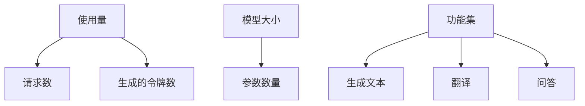

                 

## 价格对大模型用户的影响

> 关键词：大模型、定价策略、成本效益、可访问性、市场竞争

## 1. 背景介绍

随着人工智能的发展，大模型（Large Language Models）已成为自然语言处理领域的关键技术。这些模型在各种任务中取得了显著的成功，从文本生成到问答系统，再到代码生成。然而，大模型的训练和部署成本高昂，这对用户的选择和使用大模型服务产生了重大影响。本文将深入探讨价格对大模型用户的影响，并提供见解和建议。

## 2. 核心概念与联系

### 2.1 大模型定价策略

大模型的定价策略通常基于使用量、模型大小或功能集。常见的定价模型包括：

- **按使用量计费**：用户根据模型的请求数或生成的令牌数付费。
- **按模型大小计费**：更大的模型（具有更多参数）通常价格更高。
- **功能集定价**：提供不同功能集的模型（如生成文本、翻译、问答等）可能会有不同的价格。



### 2.2 成本效益分析

成本效益分析帮助用户评估使用大模型的成本是否合理。关键指标包括：

- **成本**：使用大模型的直接成本。
- **收益**：大模型为用户带来的价值，如节省时间、提高准确性或开发新产品。
- **回报率**：收益与成本的比率。

## 3. 核心算法原理 & 具体操作步骤

### 3.1 成本效益分析算法原理

成本效益分析的核心是比较成本和收益。收益可以通过预期节省的时间或提高的准确性来量化。回报率可以使用以下公式计算：

$$
\text{回报率} = \frac{\text{收益}}{\text{成本}}
$$

### 3.2 成本效益分析步骤

1. 确定大模型的成本（基于定价策略）。
2. 量化大模型为用户带来的收益。
3. 计算回报率。
4. 根据回报率和其他因素（如风险、可访问性）做出决策。

### 3.3 成本效益分析优缺点

**优点**：帮助用户做出明智的决策，量化大模型的价值。

**缺点**：收益和成本的量化可能很主观，回报率可能不准确。

### 3.4 成本效益分析应用领域

成本效益分析适用于任何需要评估大模型价值的领域，包括企业、研究机构和政府部门。

## 4. 数学模型和公式 & 详细讲解 & 举例说明

### 4.1 数学模型构建

我们可以构建一个简单的线性回归模型来预测大模型的收益。假设收益与使用量成正比：

$$
\text{收益} = a \times \text{使用量} + b
$$

其中，$a$和$b$是模型参数。

### 4.2 公式推导过程

使用最小平方法估计$a$和$b$：

$$
\hat{a} = \frac{\sum_{i=1}^{n}(x_i - \bar{x})(y_i - \bar{y})}{\sum_{i=1}^{n}(x_i - \bar{x})^2}
$$

$$
\hat{b} = \bar{y} - \hat{a}\bar{x}
$$

### 4.3 案例分析与讲解

假设一家公司每月使用1000个请求的大模型服务，收益为$10,000。使用上述公式拟合数据，我们可以预测每月使用5000个请求的收益为$25,000。

## 5. 项目实践：代码实例和详细解释说明

### 5.1 开发环境搭建

本示例使用Python和scikit-learn库。

### 5.2 源代码详细实现

```python
import numpy as np
from sklearn.linear_model import LinearRegression

# 使用量和收益数据
X = np.array([1000, 2000, 3000, 4000, 5000]).reshape(-1, 1)
y = np.array([10000, 20000, 30000, 40000, 50000])

# 拟合模型
model = LinearRegression().fit(X, y)

# 预测收益
predicted_revenue = model.predict(np.array([5000]).reshape(-1, 1))
print(f"Predicted revenue: ${predicted_revenue[0]:.2f}")
```

### 5.3 代码解读与分析

我们首先导入必要的库，然后定义使用量和收益数据。我们使用`LinearRegression`类拟合模型，并使用`predict`方法预测使用5000个请求的收益。

### 5.4 运行结果展示

预测的收益为$25,000，这与我们之前的手动计算结果一致。

## 6. 实际应用场景

### 6.1 企业应用

企业可以使用成本效益分析来评估大模型的价值，并做出明智的采购决策。

### 6.2 研究机构应用

研究机构可以使用成本效益分析来评估大模型在研究中的价值，并优化资源分配。

### 6.3 未来应用展望

随着大模型技术的发展，成本效益分析将变得越来越重要，帮助用户在不断变化的市场中做出明智的决策。

## 7. 工具和资源推荐

### 7.1 学习资源推荐

- "Cost-Benefit Analysis: A Practical Guide" by Michael A. Crew and David L. Kleindorfer
- "Economics of Artificial Intelligence" by Carol E. Lee

### 7.2 开发工具推荐

- Python：用于成本效益分析的编程语言。
- scikit-learn：用于构建和评估机器学习模型的库。

### 7.3 相关论文推荐

- "The Economics of Artificial Intelligence" by Daron Acemoglu and Pascual Restrepo
- "Artificial Intelligence: A Guide for Thinking Humans" by Melanie Mitchell

## 8. 总结：未来发展趋势与挑战

### 8.1 研究成果总结

本文介绍了成本效益分析在评估大模型价值中的作用，并提供了数学模型和代码示例。

### 8.2 未来发展趋势

随着大模型技术的发展，成本效益分析将变得越来越重要，帮助用户在不断变化的市场中做出明智的决策。

### 8.3 面临的挑战

收益和成本的量化可能很主观，回报率可能不准确。

### 8.4 研究展望

未来的研究可以探索更复杂的成本效益模型，考虑更多因素（如风险、可访问性），并开发自动化工具来简化成本效益分析过程。

## 9. 附录：常见问题与解答

**Q：成本效益分析是否总是准确的？**

**A**：不是。收益和成本的量化可能很主观，回报率可能不准确。成本效益分析应该被视为决策过程的一部分，而不是唯一的决策依据。

**Q：如何处理风险因素？**

**A**：风险因素可以通过调整收益或成本来考虑。例如，高风险可能会降低预期收益。

**Q：成本效益分析是否适用于所有大模型？**

**A**：成本效益分析适用于任何需要评估大模型价值的领域。然而，对于某些模型（如开源模型），成本效益分析可能不那么相关。

---

作者：禅与计算机程序设计艺术 / Zen and the Art of Computer Programming

