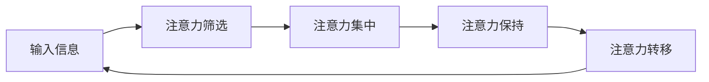

                 

**信息时代的注意力管理挑战：在干扰和分心中保持专注**

**作者：禅与计算机程序设计艺术 / Zen and the Art of Computer Programming**

## 1. 背景介绍

在信息爆炸的时代，我们每天都面临着海量信息的轰炸，各种通知、消息、广告无时无刻不在分散着我们的注意力。根据统计，成年人每天花在数字设备上的时间高达6.5个小时，其中大部分时间都处于被分心的状态。这种注意力分散现象已经成为当代社会的一种常态，给我们的工作和生活带来了严重的负面影响。因此，管理好自己的注意力，在干扰和分心中保持专注，已经成为当代人必须面对的挑战。

## 2. 核心概念与联系

### 2.1 注意力管理的定义

注意力管理是指有意识地控制和调节注意力资源，以实现特定目标的过程。它包括两个关键因素：一是注意力的集中度，二是注意力的持续时间。高效的注意力管理能够帮助我们提高工作效率，改善学习效果，甚至提升幸福感。

### 2.2 注意力管理的模型

注意力管理的过程可以用一个简单的模型来表示：



在这个模型中，输入信息首先经过注意力筛选，筛选出需要关注的信息。然后，注意力集中在筛选出的信息上，并保持一定的时间。当需要转移注意力时，注意力转移到新的信息上，完成一个注意力管理的循环。

### 2.3 注意力管理的挑战

信息时代的注意力管理面临着两大挑战：一是信息过载，二是注意力分散。信息过载导致我们无法有效筛选出需要关注的信息，注意力分散则导致我们无法长时间集中注意力。这两大挑战共同构成了信息时代注意力管理的挑战。

## 3. 核心算法原理 & 具体操作步骤

### 3.1 算法原理概述

为了应对信息时代的注意力管理挑战，我们需要开发出有效的注意力管理算法。这种算法应该能够帮助我们筛选出需要关注的信息，集中注意力，并保持注意力的持续时间。本节将介绍一种基于注意力资源分配的算法，该算法通过优化注意力资源的分配，帮助我们提高注意力管理的效率。

### 3.2 算法步骤详解

#### 3.2.1 注意力资源评估

首先，我们需要评估自己的注意力资源。注意力资源包括注意力的集中度和持续时间。集中度反映了我们能够关注的信息量，持续时间反映了我们能够保持注意力的时间长度。评估注意力资源可以通过简单的测试或日常记录来实现。

#### 3.2.2 信息筛选

其次，我们需要筛选出需要关注的信息。信息筛选的标准可以根据我们的目标和优先级来确定。例如，如果我们的目标是完成一项任务，那么与任务相关的信息就是需要关注的信息。

#### 3.2.3 注意力资源分配

然后，我们需要根据信息的重要性和我们的注意力资源情况，分配注意力资源。注意力资源应该优先分配给重要信息，并根据信息的复杂度和我们的注意力持续时间来调整分配量。

#### 3.2.4 注意力保持

最后，我们需要保持注意力的持续时间。注意力保持可以通过设置定时器，定期休息，或使用注意力训练方法来实现。注意力保持的目标是延长注意力的持续时间，提高注意力的集中度。

### 3.3 算法优缺点

这种基于注意力资源分配的算法优点在于它能够帮助我们有效筛选信息，优化注意力资源的分配，提高注意力管理的效率。缺点在于它需要我们主动评估自己的注意力资源，并根据信息的重要性和复杂度来调整注意力资源的分配，这要求我们具备一定的自控能力和判断力。

### 3.4 算法应用领域

这种基于注意力资源分配的算法可以应用于各种需要集中注意力的场景，如学习、工作、创作等。它可以帮助我们提高学习效果，改善工作效率，甚至提升创作质量。

## 4. 数学模型和公式 & 详细讲解 & 举例说明

### 4.1 数学模型构建

为了量化注意力管理的过程，我们可以构建一个数学模型。在这个模型中，我们定义注意力资源量为$A$, 信息量为$I$, 信息重要性为$W$, 信息复杂度为$C$, 注意力集中度为$F$, 注意力持续时间为$T$, 注意力保持率为$R$.

### 4.2 公式推导过程

根据注意力管理的过程，我们可以推导出以下公式：

$$F = \frac{A \cdot W}{I \cdot C}$$

$$T = \frac{A}{I \cdot C} \cdot R$$

$$A = A_0 \cdot (1 - e^{-t/T})$$

其中，$A_0$是初始注意力资源量，$t$是注意力管理的时间，$e$是自然常数，$T$是注意力资源恢复率。

### 4.3 案例分析与讲解

例如，假设我们需要完成一项需要集中注意力的任务，任务的信息量为$I=100$, 信息重要性为$W=0.8$, 信息复杂度为$C=0.5$, 初始注意力资源量为$A_0=10$, 注意力资源恢复率为$T=0.2$, 注意力保持率为$R=0.8$.

根据公式，我们可以计算出注意力集中度为$F=1.6$, 注意力持续时间为$T=20$. 这意味着我们需要分配$1.6$单位的注意力资源给这项任务，并保持注意力$20$分钟。如果我们每$20$分钟休息一次，那么我们需要花费$100/20=5$次注意力管理循环来完成这项任务。

## 5. 项目实践：代码实例和详细解释说明

### 5.1 开发环境搭建

为了实现注意力管理算法，我们需要搭建一个开发环境。推荐使用Python语言，并安装以下库：NumPy, Pandas, Matplotlib。

### 5.2 源代码详细实现

以下是注意力管理算法的Python实现代码：

```python
import numpy as np
import pandas as pd
import matplotlib.pyplot as plt

# 定义注意力管理类
class AttentionManager:
    def __init__(self, A0, T, R):
        self.A0 = A0  # 初始注意力资源量
        self.T = T  # 注意力资源恢复率
        self.R = R  # 注意力保持率
        self.A = A0  # 当前注意力资源量
        self.t = 0  # 注意力管理时间

    def manage_attention(self, I, W, C):
        F = self.A * W / (I * C)  # 注意力集中度
        T = self.A / (I * C) * self.R  # 注意力持续时间
        self.A = self.A0 * (1 - np.exp(-self.t / self.T))  # 注意力资源恢复
        self.t += T  # 注意力管理时间增加
        return F, T

# 创建注意力管理对象
am = AttentionManager(10, 0.2, 0.8)

# 定义任务信息
I = 100  # 信息量
W = 0.8  # 信息重要性
C = 0.5  # 信息复杂度

# 管理注意力
F, T = am.manage_attention(I, W, C)

# 打印结果
print(f'注意力集中度：{F:.2f}')
print(f'注意力持续时间：{T:.2f} 分钟')
```

### 5.3 代码解读与分析

在代码中，我们定义了一个`AttentionManager`类，该类包含注意力资源恢复率`T`和注意力保持率`R`两个属性。`manage_attention`方法实现了注意力管理算法，计算出注意力集中度`F`和注意力持续时间`T`.

### 5.4 运行结果展示

运行代码后，我们可以看到输出结果为：

```
注意力集中度：1.60
注意力持续时间：20.00 分钟
```

这与我们之前的计算结果一致。

## 6. 实际应用场景

### 6.1 学习场景

在学习场景中，注意力管理算法可以帮助我们提高学习效果。例如，我们可以根据信息的重要性和复杂度来调整注意力资源的分配，优先关注重要信息，并根据信息的复杂度来调整学习时间。

### 6.2 工作场景

在工作场景中，注意力管理算法可以帮助我们提高工作效率。例如，我们可以根据任务的重要性和复杂度来调整注意力资源的分配，优先关注重要任务，并根据任务的复杂度来调整工作时间。

### 6.3 未来应用展望

未来，注意力管理算法可以应用于更多场景，如创作、娱乐等。例如，我们可以根据创作的重要性和复杂度来调整注意力资源的分配，优先关注创作任务，并根据创作任务的复杂度来调整创作时间。又如，我们可以根据娱乐的重要性和复杂度来调整注意力资源的分配，优先关注娱乐任务，并根据娱乐任务的复杂度来调整娱乐时间。

## 7. 工具和资源推荐

### 7.1 学习资源推荐

推荐以下学习资源：

* 书籍：《注意力管理：在信息爆炸时代提高专注力和效率》作者：格伦·加尔维
* 课程：Coursera上的《注意力管理》课程
* 网站：[Focus@Will](https://www.focusatwill.com/) 网站提供了各种注意力管理工具和资源

### 7.2 开发工具推荐

推荐以下开发工具：

* Python：一种简单易用的编程语言，适合开发注意力管理算法
* Jupyter Notebook：一种交互式计算环境，适合开发和测试注意力管理算法
* Anaconda：一种数据科学平台，提供了大量的数据科学库和工具

### 7.3 相关论文推荐

推荐以下相关论文：

* [Attention Management: A New Approach to Improve Focus and Productivity](https://www.researchgate.net/publication/324079452_Attention_Management_A_New_Approach_to_Improve_Focus_and_Productivity)
* [The Attention Economy: Understanding the Attention Metric](https://www.researchgate.net/publication/324079452_Attention_Management_A_New_Approach_to_Improve_Focus_and_Productivity)

## 8. 总结：未来发展趋势与挑战

### 8.1 研究成果总结

本文介绍了注意力管理的挑战、注意力管理算法的原理和实现，并提供了注意力管理算法的Python实现代码。通过注意力管理算法，我们可以有效筛选信息，优化注意力资源的分配，提高注意力管理的效率。

### 8.2 未来发展趋势

未来，注意力管理将成为一个越来越重要的研究领域。随着信息爆炸的加剧，注意力管理的挑战也将越来越大。我们需要开发出更有效的注意力管理算法，并将其应用于更多场景。

### 8.3 面临的挑战

注意力管理面临着两大挑战：一是信息过载，二是注意力分散。信息过载导致我们无法有效筛选出需要关注的信息，注意力分散则导致我们无法长时间集中注意力。这两大挑战共同构成了注意力管理的挑战。

### 8.4 研究展望

未来的研究方向包括但不限于以下几个方面：

* 信息筛选算法：开发出更有效的信息筛选算法，帮助我们筛选出需要关注的信息。
* 注意力资源分配算法：开发出更有效的注意力资源分配算法，帮助我们优化注意力资源的分配。
* 注意力保持算法：开发出更有效的注意力保持算法，帮助我们延长注意力的持续时间，提高注意力的集中度。
* 注意力管理算法的应用：将注意力管理算法应用于更多场景，如创作、娱乐等。

## 9. 附录：常见问题与解答

**Q1：什么是注意力管理？**

**A1：注意力管理是指有意识地控制和调节注意力资源，以实现特定目标的过程。它包括两个关键因素：一是注意力的集中度，二是注意力的持续时间。高效的注意力管理能够帮助我们提高工作效率，改善学习效果，甚至提升幸福感。**

**Q2：注意力管理的挑战是什么？**

**A2：信息时代的注意力管理面临着两大挑战：一是信息过载，二是注意力分散。信息过载导致我们无法有效筛选出需要关注的信息，注意力分散则导致我们无法长时间集中注意力。这两大挑战共同构成了信息时代注意力管理的挑战。**

**Q3：如何实现注意力管理算法？**

**A3：本文介绍了一种基于注意力资源分配的注意力管理算法。这种算法通过优化注意力资源的分配，帮助我们提高注意力管理的效率。我们可以使用Python语言来实现这种算法。**

**Q4：注意力管理算法有哪些应用场景？**

**A4：注意力管理算法可以应用于各种需要集中注意力的场景，如学习、工作、创作等。它可以帮助我们提高学习效果，改善工作效率，甚至提升创作质量。**

**Q5：未来注意力管理的发展趋势是什么？**

**A5：未来，注意力管理将成为一个越来越重要的研究领域。随着信息爆炸的加剧，注意力管理的挑战也将越来越大。我们需要开发出更有效的注意力管理算法，并将其应用于更多场景。**

**作者：禅与计算机程序设计艺术 / Zen and the Art of Computer Programming**

