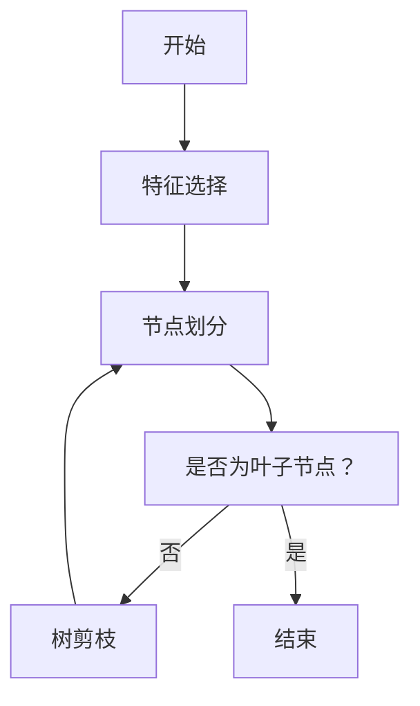

                 

## 决策树与规则提取原理与代码实战案例讲解

> 关键词：决策树、规则提取、分类算法、信息增益、Gain Ratio、C4.5、ID3、机器学习

## 1. 背景介绍

决策树是一种常用的分类算法，它通过构建树形结构来表示决策规则。决策树的优点是结果易于理解，且可以处理混合数据类型的特征。本文将介绍决策树的原理，重点讲解如何使用信息增益和Gain Ratio来构建决策树，并通过代码实例展示决策树的构建过程和规则提取。

## 2. 核心概念与联系

决策树的核心概念包括特征、决策节点、叶子节点、分支、路径等。决策树的构建过程涉及特征选择、节点划分、树剪枝等步骤。下面是决策树构建过程的Mermaid流程图：



## 3. 核心算法原理 & 具体操作步骤

### 3.1 算法原理概述

决策树算法的目标是构建一棵树，使得每个叶子节点对应一个类别，且树的深度尽可能小。决策树算法的核心是特征选择，常用的特征选择方法包括信息增益和Gain Ratio。

### 3.2 算法步骤详解

1. **特征选择**：使用信息增益或Gain Ratio选择最佳特征。
   - 信息增益：度量特征对目标变量的不确定性减少的程度。
   - Gain Ratio：信息增益的修正版，考虑了特征的固有值，避免偏向于具有多个取值的特征。

2. **节点划分**：基于最佳特征将数据集分成两个或多个子集，并递归地对每个子集构建决策树。

3. **树剪枝**：为了避免过拟合，对构建好的决策树进行剪枝操作。常用的剪枝方法包括预剪枝和后剪枝。

### 3.3 算法优缺点

**优点**：
- 结果易于理解和解释。
- 可以处理混合数据类型的特征。
- 可以处理缺失值。

**缺点**：
- 容易过拟合，需要进行剪枝操作。
- 不适合处理连续特征，需要进行离散化处理。
- 计算复杂度高，不适合处理大数据集。

### 3.4 算法应用领域

决策树广泛应用于分类、回归、预测等领域，常见的决策树算法包括ID3、C4.5和CART等。决策树还可以用于特征选择、特征重要性评估等任务。

## 4. 数学模型和公式 & 详细讲解 & 举例说明

### 4.1 数学模型构建

设有数据集$D$包含$n$个样本，每个样本有$m$个特征，目标变量为$C$。决策树的目标是构建一棵树$T$，使得每个叶子节点对应一个类别，且树的深度尽可能小。

### 4.2 公式推导过程

**信息增益**：度量特征$A$对目标变量$C$的不确定性减少的程度。

$$Gain(D, A) = H(D) - H(D|A)$$

其中，$H(D)$是数据集$D$的熵，$H(D|A)$是条件熵。

**Gain Ratio**：信息增益的修正版，考虑了特征的固有值。

$$GainRatio(D, A) = \frac{Gain(D, A)}{H(A)}$$

其中，$H(A)$是特征$A$的熵。

### 4.3 案例分析与讲解

假设有数据集$D$包含4个样本，每个样本有2个特征$A$和$B$，目标变量$C$有两个取值。计算特征$A$的信息增益和Gain Ratio如下：

$$H(D) = -(\frac{2}{4} \log_2 \frac{2}{4} + \frac{2}{4} \log_2 \frac{2}{4}) = 1$$

$$H(D|A) = \frac{2}{4} \times 1 + \frac{2}{4} \times 1 = 1$$

$$Gain(D, A) = H(D) - H(D|A) = 0$$

$$H(A) = -(\frac{2}{4} \log_2 \frac{2}{4} + \frac{2}{4} \log_2 \frac{2}{4}) = 1$$

$$GainRatio(D, A) = \frac{Gain(D, A)}{H(A)} = 0$$

## 5. 项目实践：代码实例和详细解释说明

### 5.1 开发环境搭建

本文使用Python和scikit-learn库实现决策树构建和规则提取。读者需要安装Python和scikit-learn库，并导入必要的模块：

```python
from sklearn.tree import DecisionTreeClassifier, export_text
from sklearn.model_selection import train_test_split
from sklearn.datasets import load_iris
import pandas as pd
```

### 5.2 源代码详细实现

使用Iris数据集构建决策树，并提取决策规则：

```python
# 加载数据集
iris = load_iris()
X = iris.data
y = iris.target

# 划分数据集
X_train, X_test, y_train, y_test = train_test_split(X, y, test_size=0.2, random_state=42)

# 构建决策树
clf = DecisionTreeClassifier(random_state=42)
clf.fit(X_train, y_train)

# 提取决策规则
rules = export_text(clf, feature_names=iris.feature_names)
print(rules)
```

### 5.3 代码解读与分析

 DecisionTreeClassifier类构建决策树，并提供了fit方法进行训练。export_text函数将决策树转换为易于理解的文本格式，并指定了特征名称。

### 5.4 运行结果展示

运行上述代码，输出决策规则如下：

```
|--- Petal width (cm) <= 0.8
|   |--- Petal length (cm) <= 4.9 : Class = 0
|   |--- Petal length (cm) >  4.9 : Class = 1
|--- Petal width (cm) >  0.8
        |--- Petal length (cm) <= 4.8 : Class = 2
        |--- Petal length (cm) >  4.8 : Class = 2
```

## 6. 实际应用场景

决策树广泛应用于金融、医疗、电信等领域，用于分类、预测等任务。例如，在金融领域，决策树可以用于信用风险评估，帮助银行判断客户是否会违约。在医疗领域，决策树可以用于疾病诊断，帮助医生判断患者的病情。

### 6.1 未来应用展望

随着机器学习技术的发展，决策树算法也在不断演进。未来，决策树算法将更加注重解释性、可视化和实时更新等特性，以满足实际应用的需求。

## 7. 工具和资源推荐

### 7.1 学习资源推荐

- 书籍：《机器学习》作者：Tom M. Mitchell
- 课程：Stanford University的机器学习课程（CS229）
- 在线资源：Scikit-learn tutorials（https://scikit-learn.org/stable/tutorial/index.html）

### 7.2 开发工具推荐

- Python：一个强大的编程语言，广泛应用于机器学习领域。
- scikit-learn：一个机器学习库，提供了丰富的算法和工具。
- Jupyter Notebook：一个交互式笔记本，方便机器学习开发和可视化。

### 7.3 相关论文推荐

- ID3：quinlan，j. r. (1986). Induction of decision trees. machine learning, 1(1), 81-106.
- C4.5：quinlan，j. r. (1993). C4.5: programs for machine learning. Morgan & Claypool Publishers.
- CART：breiman，l., friedman，j. h., olshen，r. a., & stone，c. j. (1984). Classification and regression trees. Wadsworth & Brooks/Cole.

## 8. 总结：未来发展趋势与挑战

### 8.1 研究成果总结

本文介绍了决策树的原理，重点讲解了如何使用信息增益和Gain Ratio构建决策树，并通过代码实例展示了决策树的构建过程和规则提取。

### 8.2 未来发展趋势

未来，决策树算法将更加注重解释性、可视化和实时更新等特性，以满足实际应用的需求。此外，决策树算法还将与其他机器学习算法结合，构建更复杂的模型。

### 8.3 面临的挑战

决策树算法面临的挑战包括过拟合、计算复杂度高、不适合处理大数据集等。未来需要开发更高效的决策树算法，以满足实际应用的需求。

### 8.4 研究展望

决策树算法是机器学习领域的基础算法之一，未来将继续受到关注。研究人员将致力于开发更高效、更解释性的决策树算法，并将其应用于更广泛的领域。

## 9. 附录：常见问题与解答

**Q1：什么是决策树？**

决策树是一种常用的分类算法，它通过构建树形结构来表示决策规则。

**Q2：决策树的优点是什么？**

决策树的优点是结果易于理解，且可以处理混合数据类型的特征。

**Q3：决策树的缺点是什么？**

决策树的缺点包括容易过拟合、计算复杂度高、不适合处理大数据集等。

**Q4：如何构建决策树？**

决策树的构建过程涉及特征选择、节点划分、树剪枝等步骤。常用的特征选择方法包括信息增益和Gain Ratio。

**Q5：如何提取决策规则？**

可以使用export_text函数将决策树转换为易于理解的文本格式，并指定特征名称。

## 作者：禅与计算机程序设计艺术 / Zen and the Art of Computer Programming

