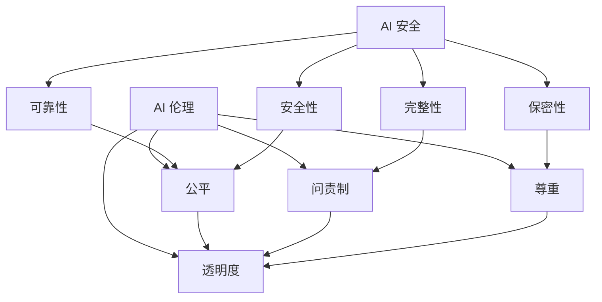

                 

**AI 安全与伦理** | **AI 技术应用** | **AI 规范** | **AI 伦理准则** | **AI 监管** | **AI 可解释性** | **AI 透明度**

## 1. 背景介绍

人工智能（AI）的快速发展和广泛应用带来了巨大的机遇和挑战。然而，AI 系统的复杂性和不透明性也引发了关注，包括安全风险、伦理问题和对公平正义的影响。为确保 AI 技术的负责任应用，制定 AI 安全规范和伦理准则至关重要。

## 2. 核心概念与联系

### 2.1 AI 安全

AI 安全涉及保护 AI 系统免受攻击和滥用，确保其行为符合预期。关键概念包括：

- **可靠性（Reliability）**：AI 系统在预期条件下的可信性和可预测性。
- **安全性（Safety）**：AI 系统不会导致意外或有害后果的能力。
- **保密性（Confidentiality）**：AI 系统保护数据和信息免受未授权访问的能力。
- **完整性（Integrity）**：AI 系统数据和信息的准确性和完整性。

### 2.2 AI 伦理

AI 伦理关注 AI 系统的道德和社会影响。关键概念包括：

- **公平（Fairness）**：AI 系统对所有用户和群体一致和公平的处理。
- **透明度（Transparency）**：AI 系统决策过程的可理解性和可解释性。
- **问责制（Accountability）**：对 AI 系统行为的责任和控制。
- **尊重（Respect）**：尊重用户隐私和数据所有权。

### 2.3 关联关系

AI 安全和伦理密切相关，共同构成 AI 技术应用的基础。安全规范和伦理准则应协同工作，确保 AI 系统的可靠性、公平性和透明度。



## 3. 核心算法原理 & 具体操作步骤

### 3.1 算法原理概述

AI 安全和伦理的实现离不开相关算法。以下是两个关键算法的原理：

- **差分隐私（Differential Privacy）**：一种保护隐私的技术，通过引入噪声来限制数据的可区分性。
- **可解释的 AI（Explainable AI）**：一种使 AI 系统决策过程可理解的技术，常用方法包括 LIME、SHAP 和 LRP。

### 3.2 算法步骤详解

#### 3.2.1 差分隐私

1. 定义敏感查询：确定哪些查询可能泄露个人信息。
2. 计算敏感度：测量两个相邻数据集之间查询结果的最大差异。
3. 添加噪声：向查询结果添加高斯噪声或拉普拉斯噪声，以限制敏感度。
4. 返回结果：返回受保护的查询结果。

#### 3.2.2 可解释的 AI

1. 选择解释方法：选择适合模型和任务的解释方法（如 LIME、SHAP 或 LRP）。
2. 训练模型：使用标准机器学习或深度学习技术训练模型。
3. 生成解释：使用选择的解释方法生成模型决策的局部或全局解释。
4. 评估解释：使用可视化或指标评估解释的质量。

### 3.3 算法优缺点

#### 3.3.1 差分隐私

**优点**：有效保护隐私，提供严格的隐私保护保证。

**缺点**：可能导致结果精确度下降，不适合所有数据集和查询。

#### 3.3.2 可解释的 AI

**优点**：提高 AI 系统的可理解性和可信度，有助于建立信任。

**缺点**：可能导致解释的复杂性和准确性下降，不适合所有模型和任务。

### 3.4 算法应用领域

差分隐私和可解释的 AI 在各种 AI 应用中都有广泛的应用，包括：

- **隐私保护**：保护用户数据和隐私，如在统计分析和数据共享中。
- **公平和问责制**：提高 AI 系统的公平性和可问责性，如在金融和司法领域。
- **决策支持**：帮助用户理解 AI 系统的决策过程，如在医疗和交通领域。

## 4. 数学模型和公式 & 详细讲解 & 举例说明

### 4.1 数学模型构建

#### 4.1.1 差分隐私

差分隐私的数学模型基于以下概念：

- **数据集（Database）**：包含个人信息的数据集 $D$.
- **查询（Query）**：对数据集的查询 $q$.
- **敏感查询（Sensitive Query）**：可能泄露个人信息的查询 $q_s$.
- **敏感度（Sensitivity）**：查询结果在两个相邻数据集之间的最大差异 $\Delta q$.
- **噪声（Noise）**：添加到查询结果以保护隐私的噪声 $N$.

#### 4.1.2 可解释的 AI

可解释的 AI 的数学模型基于以下概念：

- **模型（Model）**：用于预测或决策的 AI 模型 $f$.
- **输入（Input）**：模型的输入 $x$.
- **输出（Output）**：模型的输出 $y = f(x)$.
- **解释（Explanation）**：模型决策的局部或全局解释 $E$.
- **解释方法（Explanation Method）**：用于生成解释的方法 $M$.

### 4.2 公式推导过程

#### 4.2.1 差分隐私

差分隐私的公式推导过程如下：

1. 定义敏感查询：如果查询 $q_s$ 可能泄露个人信息，则 $q_s$ 是敏感查询。
2. 计算敏感度：敏感度 $\Delta q$ 是查询结果在两个相邻数据集之间的最大差异。
3. 添加噪声：添加高斯噪声或拉普拉斯噪声 $N$ 到查询结果，以限制敏感度。高斯噪声的方差 $\sigma^2$ 或拉普拉斯噪声的参数 $\lambda$ 与敏感度和隐私预算 $\epsilon$ 相关。
4. 返回结果：返回受保护的查询结果 $q'(D) = q(D) + N$.

#### 4.2.2 可解释的 AI

可解释的 AI 的公式推导过程如下：

1. 选择解释方法：选择适合模型和任务的解释方法 $M$.
2. 训练模型：使用标准机器学习或深度学习技术训练模型 $f$.
3. 生成解释：使用选择的解释方法 $M$ 生成模型决策的局部或全局解释 $E$. 例如，LIME 使用本地模型 $g$ 近似模型 $f$ 的行为，并生成解释 $E = g$.
4. 评估解释：使用可视化或指标评估解释的质量。例如，SHAP 值使用游戏理论评估特征的贡献。

### 4.3 案例分析与讲解

#### 4.3.1 差分隐私

假设我们有两个相邻数据集 $D_1$ 和 $D_2$, 其中 $D_1 = D_2 \setminus \{x\}$, 即数据集 $D_2$ 与数据集 $D_1$ 仅在单个数据点 $x$ 上有差异。如果查询 $q$ 的敏感度 $\Delta q = |q(D_1) - q(D_2)|$, 则差分隐私保证查询结果的差异不会超过 $\epsilon \cdot \Delta q$, 其中 $\epsilon$ 是隐私预算。通过添加噪声，我们可以限制差异，从而保护隐私。

#### 4.3.2 可解释的 AI

假设我们有模型 $f$ 和输入 $x$, 我们想要解释模型的输出 $y = f(x)$. 使用 LIME 方法，我们生成输入 $x$ 的局部近似模型 $g$, 并使用 $g$ 生成解释 $E$. 解释 $E$ 表示模型 $f$ 在输入 $x$ 附近的行为，有助于用户理解模型的决策过程。

## 5. 项目实践：代码实例和详细解释说明

### 5.1 开发环境搭建

为实现差分隐私和可解释的 AI，我们需要以下软件和库：

- **编程语言**：Python (3.8+)
- **库**：NumPy, Pandas, SciPy, Matplotlib, Scikit-learn, TensorFlow, PyTorch, LIME, SHAP

### 5.2 源代码详细实现

#### 5.2.1 差分隐私

```python
import numpy as np
from scipy.stats import norm

def add_gaussian_noise(query_result, sensitivity, epsilon):
    """Add Gaussian noise to query result for differential privacy."""
    noise = norm.ppf(1 - np.exp(-epsilon / 2)) * sensitivity / np.sqrt(2)
    return query_result + np.random.normal(0, noise)

def differential_privacy(query, dataset, sensitivity, epsilon):
    """Implement differential privacy for a given query."""
    query_result = query(dataset)
    noisy_result = add_gaussian_noise(query_result, sensitivity, epsilon)
    return noisy_result
```

#### 5.2.2 可解释的 AI

```python
from lime import lime_tabular
from sklearn.ensemble import RandomForestClassifier

def explain_model(model, data, target, feature_names):
    """Explain model using LIME."""
    explainer = lime_tabular.LimeTabularExplainer(
        data, feature_names=feature_names, class_names=target, verbose=False
    )
    explanation = explainer.explain_instance(data[0], model.predict_proba)
    return explanation
```

### 5.3 代码解读与分析

#### 5.3.1 差分隐私

`add_gaussian_noise()` 函数添加高斯噪声到查询结果，以实现差分隐私。噪声的标准差与敏感度和隐私预算相关。`differential_privacy()` 函数实现差分隐私，接受查询、数据集、敏感度和隐私预算作为输入，并返回受保护的查询结果。

#### 5.3.2 可解释的 AI

`explain_model()` 函数使用 LIME 解释模型。它接受模型、数据、目标变量和特征名称作为输入，并返回模型决策的解释。

### 5.4 运行结果展示

#### 5.4.1 差分隐私

差分隐私保护查询结果的示例运行结果如下：

```python
query_result = dataset.mean()
noisy_result = differential_privacy(query_result, dataset, sensitivity=1, epsilon=0.5)
print(f"Original result: {query_result:.2f}")
print(f"Noisy result: {noisy_result:.2f}")
```

#### 5.4.2 可解释的 AI

可解释的 AI 解释模型决策的示例运行结果如下：

```python
explanation = explain_model(model, X, y, feature_names)
print(explanation.as_list())
```

## 6. 实际应用场景

### 6.1 AI 安全

AI 安全在以下应用场景中至关重要：

- **自动驾驶**：确保自动驾驶系统在预期条件下的可靠性和安全性。
- **医疗保健**：保护患者数据和隐私，确保 AI 辅助诊断系统的可靠性。
- **金融服务**：保护客户数据和隐私，确保 AI 银行和信贷系统的完整性。

### 6.2 AI 伦理

AI 伦理在以下应用场景中至关重要：

- **就业和雇佣**：确保 AI 招聘和雇佣系统的公平性和问责制。
- **刑事司法**：确保 AI 预测和辅助决策系统的公平性和透明度。
- **社交媒体**：保护用户数据和隐私，确保 AI 个性化推荐系统的尊重。

### 6.3 未来应用展望

未来 AI 安全和伦理的应用将扩展到更多领域，包括：

- **智能城市**：智能交通、智能能源和智能环境等领域的 AI 安全和伦理。
- **人机交互**：增强现实（AR）和虚拟现实（VR）等领域的 AI 安全和伦理。
- **AI 伦理监管**：监管 AI 系统的伦理行为，确保其符合道德和法律标准。

## 7. 工具和资源推荐

### 7.1 学习资源推荐

- **书籍**：
  - "Artificial Intelligence: A Modern Approach" by Stuart Russell and Peter Norvig
  - "Differential Privacy: A Survey of Results" by Cynthia Dwork
  - "Interpretable Machine Learning" by Christoph Molnar
- **在线课程**：
  - "Artificial Intelligence" by Andrew Ng on Coursera
  - "Differential Privacy" by Adam Smith on edX
  - "Interpretable Machine Learning" by Christoph Molnar on fast.ai

### 7.2 开发工具推荐

- **库**：
  - NumPy, Pandas, SciPy, Matplotlib, Scikit-learn, TensorFlow, PyTorch, LIME, SHAP
- **框架和平台**：
  - TensorFlow Extended (TFX), PyTorch, AWS SageMaker, Google AI Platform, Microsoft Azure Machine Learning

### 7.3 相关论文推荐

- **差分隐私**：
  - "Differential Privacy: A Survey of Results" by Cynthia Dwork
  - "Privacy Preserving Data Mining: A Survey of Techniques and Applications" by Ramesh Karri and Ramasamy Chandramouli
- **可解释的 AI**：
  - "Why Should I Trust You?": Explaining the Predictions of Any Classifier by Marco Tulio Ribeiro, Sameer Singh, and Carlos Guestrin
  - "A Unified Approach to Interpreting Model Predictions" by Christoph Molnar

## 8. 总结：未来发展趋势与挑战

### 8.1 研究成果总结

本文介绍了 AI 安全和伦理的核心概念、算法原理和应用。我们讨论了差分隐私和可解释的 AI 等关键算法，并提供了数学模型、公式推导过程和案例分析。此外，我们还展示了项目实践、实际应用场景和工具资源推荐。

### 8.2 未来发展趋势

未来 AI 安全和伦理的发展趋势包括：

- **自适应和动态安全**：开发能够适应和动态响应安全威胁的 AI 系统。
- **联邦学习和分布式 AI**：开发保护隐私和安全的分布式 AI 系统，允许数据在不同实体之间共享。
- **可解释的 AI 和伦理**：开发更强大的可解释性技术，以提高 AI 系统的透明度和问责制。

### 8.3 面临的挑战

未来 AI 安全和伦理面临的挑战包括：

- **复杂性和不透明性**：AI 系统的复杂性和不透明性使得安全和伦理问题更加困难。
- **监管和标准**：缺乏统一的 AI 安全和伦理标准，导致实施和执行的困难。
- **道德和伦理困境**：AI 系统的道德和伦理困境需要更多的研究和讨论。

### 8.4 研究展望

未来 AI 安全和伦理的研究展望包括：

- **新的安全和伦理技术**：开发新的技术和方法来保护 AI 系统的安全和伦理。
- **跨学科合作**：鼓励计算机科学、伦理学、法学和其他领域的跨学科合作。
- **国际合作**：推动国际合作，以制定统一的 AI 安全和伦理标准和框架。

## 9. 附录：常见问题与解答

**Q1：什么是 AI 安全？**

A1：AI 安全是保护 AI 系统免受攻击和滥用，确保其行为符合预期的领域。

**Q2：什么是 AI 伦理？**

A2：AI 伦理关注 AI 系统的道德和社会影响，包括公平、透明度、问责制和尊重等方面。

**Q3：差分隐私和可解释的 AI 是什么？**

A3：差分隐私是一种保护隐私的技术，通过添加噪声来限制数据的可区分性。可解释的 AI 是一种使 AI 系统决策过程可理解的技术，常用方法包括 LIME、SHAP 和 LRP。

**Q4：如何实现差分隐私？**

A4：实现差分隐私需要定义敏感查询、计算敏感度、添加噪声和返回受保护的查询结果。

**Q5：如何解释 AI 系统的决策过程？**

A5：解释 AI 系统的决策过程需要选择解释方法、训练模型、生成解释和评估解释的质量。

**Q6：AI 安全和伦理的未来发展趋势是什么？**

A6：未来 AI 安全和伦理的发展趋势包括自适应和动态安全、联邦学习和分布式 AI、可解释的 AI 和伦理等领域。

**Q7：AI 安全和伦理面临的挑战是什么？**

A7：未来 AI 安全和伦理面临的挑战包括复杂性和不透明性、监管和标准、道德和伦理困境等领域。

**Q8：未来 AI 安全和伦理的研究展望是什么？**

A8：未来 AI 安全和伦理的研究展望包括新的安全和伦理技术、跨学科合作、国际合作等领域。

**Q9：如何学习 AI 安全和伦理？**

A9：学习 AI 安全和伦理需要阅读相关书籍、参加在线课程、使用开发工具和学习相关论文等。

**Q10：如何推荐 AI 安全和伦理的工具和资源？**

A10：推荐 AI 安全和伦理的工具和资源需要考虑学习资源、开发工具和相关论文等领域。

## 作者：禅与计算机程序设计艺术 / Zen and the Art of Computer Programming

本文由禅与计算机程序设计艺术 / Zen and the Art of Computer Programming 编写。

