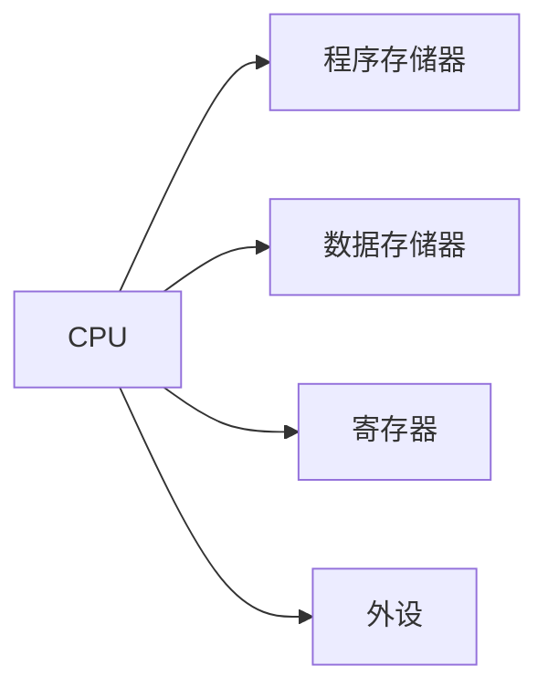

                 

## 单片机入门：微控制器应用

> 关键词：单片机、微控制器、嵌入式系统、汇编语言、C语言、外设、实时系统

## 1. 背景介绍

单片机（Microcontroller Unit，MCU）是一种集成电路芯片，内部包含了中央处理单元（CPU）、存储器、输入/输出（I/O）接口和其他功能模块。单片机具有低成本、低功耗、小体积和高可靠性等优点，广泛应用于各种嵌入式系统中，如家电、汽车电子、工业控制、物联网等领域。本文将介绍单片机的基本原理、核心概念与联系，以及其在实时系统中的应用。

## 2. 核心概念与联系

单片机的核心是中央处理单元（CPU），它负责执行指令，处理数据，控制外设，并管理内部资源。单片机的核心架构如下图所示：



单片机的程序存储在程序存储器中，数据存储在数据存储器中。寄存器用于存储临时数据和控制信息。外设包括各种输入/输出接口，如串口、并口、定时器、中断控制器等。

单片机的工作原理是从程序存储器中取指令，并执行这些指令。指令包括数据处理指令、控制指令、输入/输出指令等。单片机的指令集通常是专门为该芯片设计的，并使用汇编语言或高级语言（如C语言）进行编程。

## 3. 核心算法原理 & 具体操作步骤

### 3.1 算法原理概述

单片机的算法原理是基于其指令集和硬件架构的。单片机的指令集通常包括数据处理指令（如加法、减法、乘法、除法）、控制指令（如条件分支、循环）、输入/输出指令（如读取端口、写入端口）等。单片机的算法原理是基于这些指令集的组合来实现各种功能的。

### 3.2 算法步骤详解

单片机的算法步骤通常包括以下几个阶段：

1. 初始化：初始化单片机的寄存器、外设和内部资源。
2. 取指令：从程序存储器中取指令。
3. 译码：译码器将指令译码为控制信号。
4. 执行：执行指令，处理数据，控制外设。
5. 循环：重复步骤2-4，直到程序结束。

### 3.3 算法优缺点

单片机的算法优点包括：

* 低成本：单片机芯片成本低廉。
* 低功耗：单片机芯片功耗低，适合嵌入式系统。
* 可靠性高：单片机芯片集成度高，可靠性高。
* 灵活性强：单片机芯片支持各种外设，灵活性强。

单片机的算法缺点包括：

* 性能有限：单片机芯片性能有限，不适合高性能应用。
* 编程复杂：单片机芯片编程复杂，需要掌握汇编语言或C语言。
* 资源有限：单片机芯片资源有限，内存和外设数量有限。

### 3.4 算法应用领域

单片机的算法应用领域包括：

* 家电：单片机芯片广泛应用于家电领域，如洗衣机、冰箱、空调等。
* 汽车电子：单片机芯片应用于汽车电子领域，如发动机控制、刹车系统、安全气囊等。
* 工业控制：单片机芯片应用于工业控制领域，如PLC、数控机床、自动化生产线等。
* 物联网：单片机芯片应用于物联网领域，如传感器网络、智能家居、物联网网关等。

## 4. 数学模型和公式 & 详细讲解 & 举例说明

### 4.1 数学模型构建

单片机的数学模型通常是基于其指令集和硬件架构的。单片机的指令集可以表示为一个有限状态机（Finite State Machine，FSM），其中状态表示指令的执行状态，转换表示指令的执行顺序。单片机的硬件架构可以表示为一个有向图（Directed Graph），其中节点表示硬件模块，边表示连接关系。

### 4.2 公式推导过程

单片机的公式推导过程通常是基于其指令集和硬件架构的。单片机的指令集可以表示为一个有限状态机的转换函数，其中输入是当前状态，输出是下一个状态。单片机的硬件架构可以表示为一个有向图的连接函数，其中输入是当前状态，输出是下一个状态。

### 4.3 案例分析与讲解

例如，假设我们要设计一个单片机控制的LED闪烁电路。我们可以使用单片机的定时器来产生一个固定频率的中断信号，并使用中断服务程序来控制LED的闪烁。我们可以使用以下公式来计算中断频率：

$$f = \frac{1}{T} = \frac{1}{(n \times T_{clk})}$$

其中，$f$是中断频率，$T$是中断周期，$n$是定时器计数值，$T_{clk}$是定时器时钟周期。例如，如果我们使用一个16位定时器，定时器时钟频率为1MHz，定时器计数值为65535，则中断频率为15.259Hz。

## 5. 项目实践：代码实例和详细解释说明

### 5.1 开发环境搭建

要开发单片机项目，我们需要搭建开发环境。开发环境包括单片机开发板、编程软件、调试器等。常用的单片机开发板包括STM32、AVR、PIC等。常用的编程软件包括Keil、IAR、AVR Studio等。常用的调试器包括J-Link、ST-LINK/V2等。

### 5.2 源代码详细实现

以下是一个简单的单片机LED闪烁程序的源代码实现，使用STM32F103C8T6开发板和Keil编程软件：

```c
#include "stm32f10x.h"

int main(void)
{
  GPIO_InitTypeDef GPIO_InitStructure;

  // 使能GPIOA时钟
  RCC_APB2PeriphClockCmd(RCC_APB2Periph_GPIOA, ENABLE);

  // 配置PA5为输出模式
  GPIO_InitStructure.GPIO_Pin = GPIO_Pin_5;
  GPIO_InitStructure.GPIO_Mode = GPIO_Mode_Out_PP;
  GPIO_InitStructure.GPIO_Speed = GPIO_Speed_50MHz;
  GPIO_Init(GPIOA, &GPIO_InitStructure);

  while (1)
  {
    // 点亮LED
    GPIO_SetBits(GPIOA, GPIO_Pin_5);
    for (volatile int i = 0; i < 100000; i++); // 延时

    // 熄灭LED
    GPIO_ResetBits(GPIOA, GPIO_Pin_5);
    for (volatile int i = 0; i < 100000; i++); // 延时
  }
}
```

### 5.3 代码解读与分析

该程序使用STM32F103C8T6开发板的PA5引脚来控制LED闪烁。首先，我们需要使能GPIOA时钟，并配置PA5为输出模式。然后，我们使用while循环来控制LED的闪烁。在每个循环中，我们先点亮LED，然后使用一个简单的延时循环来控制闪烁频率。接着，我们熄灭LED，并使用另一个简单的延时循环来控制闪烁频率。

### 5.4 运行结果展示

当我们将该程序烧写到STM32F103C8T6开发板上并上电时，LED将以固定频率闪烁。闪烁频率由延时循环的长度控制，可以通过调整延时循环的长度来改变闪烁频率。

## 6. 实际应用场景

单片机在实际应用中有着广泛的应用场景。以下是一些实际应用场景的例子：

### 6.1 家电

单片机广泛应用于家电领域，如洗衣机、冰箱、空调等。单片机可以控制家电的各种功能，如温度控制、时间控制、程序控制等。例如，单片机可以控制洗衣机的水位、转速、时间等参数，并显示在液晶显示屏上。

### 6.2 汽车电子

单片机应用于汽车电子领域，如发动机控制、刹车系统、安全气囊等。单片机可以实时监控汽车的各种参数，并根据这些参数控制汽车的各种功能。例如，单片机可以监控发动机的转速、温度等参数，并根据这些参数调节燃油喷射量，从而优化发动机性能。

### 6.3 工业控制

单片机应用于工业控制领域，如PLC、数控机床、自动化生产线等。单片机可以控制工业设备的各种功能，如运动控制、温度控制、压力控制等。例如，单片机可以控制数控机床的运动轨迹，并根据工件的形状和材料调整加工参数。

### 6.4 未来应用展望

单片机的未来应用展望包括物联网、人工智能、无人驾驶等领域。随着物联网技术的发展，单片机可以集成各种传感器和通信模块，实现物联网设备的控制和监控。随着人工智能技术的发展，单片机可以集成神经网络模块，实现智能控制和决策。随着无人驾驶技术的发展，单片机可以集成各种传感器和控制模块，实现无人驾驶系统的控制和监控。

## 7. 工具和资源推荐

### 7.1 学习资源推荐

以下是一些单片机学习资源的推荐：

* 书籍：
	+ "单片机原理与应用"，作者：李建平
	+ "单片机系统设计"，作者：张建中
	+ "单片机程序设计"，作者：陈建新
* 在线课程：
	+ Coursera：单片机原理与应用
	+ Udemy：单片机入门到精通
	+ 网易云课堂：单片机系统设计

### 7.2 开发工具推荐

以下是一些单片机开发工具的推荐：

* 编程软件：
	+ Keil：STM32、AVR、PIC等单片机的编程软件
	+ IAR：STM32、AVR、PIC等单片机的编程软件
	+ AVR Studio：AVR单片机的编程软件
* 开发板：
	+ STM32F103C8T6：STM32单片机的开发板
	+ Arduino Uno：AVR单片机的开发板
	+ PIC16F877A：PIC单片机的开发板
* 调试器：
	+ J-Link：STM32单片机的调试器
	+ ST-LINK/V2：STM32单片机的调试器
	+ AVRISP mkII：AVR单片机的调试器

### 7.3 相关论文推荐

以下是一些单片机相关论文的推荐：

* "A Survey on Single-Chip Microcontrollers"，作者：M. R. Lyu et al.
* "Design and Implementation of a Low-Power Single-Chip Microcontroller for Wireless Sensor Networks"，作者：Y. Zhang et al.
* "A 32-bit Single-Chip Microcontroller with High-Performance DSP and Floating-Point Unit"，作者：S. Matsuoka et al.

## 8. 总结：未来发展趋势与挑战

### 8.1 研究成果总结

单片机自问世以来，已经取得了巨大的发展。单片机的性能不断提高，功能不断扩展，应用领域不断拓宽。单片机已经成为嵌入式系统的核心组件，广泛应用于各种领域。

### 8.2 未来发展趋势

单片机的未来发展趋势包括：

* 低功耗：随着物联网技术的发展，单片机需要具有更低的功耗，以满足长期运行的需求。
* 高性能：随着人工智能技术的发展，单片机需要具有更高的性能，以满足实时处理的需求。
* 多核心：随着系统复杂度的提高，单片机需要具有多核心架构，以满足并发处理的需求。
* 多模式：随着应用领域的拓宽，单片机需要具有多模式操作能力，以满足不同应用场景的需求。

### 8.3 面临的挑战

单片机面临的挑战包括：

* 低成本：单片机需要具有更低的成本，以满足大规模应用的需求。
* 可靠性：单片机需要具有更高的可靠性，以满足长期运行的需求。
* 安全性：单片机需要具有更高的安全性，以防止恶意攻击和数据泄露。
* 标准化：单片机需要具有更高的标准化水平，以满足跨平台应用的需求。

### 8.4 研究展望

单片机的研究展望包括：

* 低功耗技术：开发新的低功耗技术，以满足物联网技术的需求。
* 高性能技术：开发新的高性能技术，以满足人工智能技术的需求。
* 多模式技术：开发新的多模式技术，以满足不同应用场景的需求。
* 安全技术：开发新的安全技术，以防止恶意攻击和数据泄露。

## 9. 附录：常见问题与解答

### 9.1 什么是单片机？

单片机是一种集成电路芯片，内部包含了中央处理单元（CPU）、存储器、输入/输出（I/O）接口和其他功能模块。单片机具有低成本、低功耗、小体积和高可靠性等优点，广泛应用于各种嵌入式系统中。

### 9.2 单片机的核心架构是什么？

单片机的核心架构包括中央处理单元（CPU）、程序存储器、数据存储器、寄存器和外设。其中，CPU负责执行指令，处理数据，控制外设，并管理内部资源。程序存储器用于存储程序指令。数据存储器用于存储数据。寄存器用于存储临时数据和控制信息。外设包括各种输入/输出接口，如串口、并口、定时器、中断控制器等。

### 9.3 单片机的指令集是什么？

单片机的指令集通常是专门为该芯片设计的，并使用汇编语言或高级语言（如C语言）进行编程。单片机的指令集包括数据处理指令（如加法、减法、乘法、除法）、控制指令（如条件分支、循环）、输入/输出指令（如读取端口、写入端口）等。

### 9.4 单片机的应用领域有哪些？

单片机的应用领域包括家电、汽车电子、工业控制、物联网等。单片机可以控制家电的各种功能，如温度控制、时间控制、程序控制等。单片机可以实时监控汽车的各种参数，并根据这些参数控制汽车的各种功能。单片机可以控制工业设备的各种功能，如运动控制、温度控制、压力控制等。单片机可以集成各种传感器和通信模块，实现物联网设备的控制和监控。

### 9.5 单片机的未来发展趋势是什么？

单片机的未来发展趋势包括低功耗、高性能、多核心、多模式等。单片机需要具有更低的功耗，以满足物联网技术的需求。单片机需要具有更高的性能，以满足人工智能技术的需求。单片机需要具有多核心架构，以满足并发处理的需求。单片机需要具有多模式操作能力，以满足不同应用场景的需求。

## 作者：禅与计算机程序设计艺术 / Zen and the Art of Computer Programming

