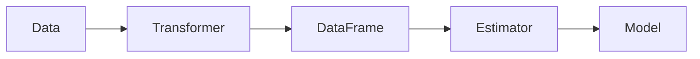

# Spark MLlib原理与代码实例讲解

作者：禅与计算机程序设计艺术 / Zen and the Art of Computer Programming


## 1. 背景介绍
### 1.1 问题的由来

随着大数据时代的到来，海量数据的处理和分析成为了一个重要课题。传统的数据处理工具在面对海量数据时，往往无法满足效率和性能要求。为了解决这一问题，Spark应运而生。Spark MLlib作为Spark的核心组件之一，提供了丰富的机器学习库，使得用户可以方便地在大数据上构建和部署机器学习应用。

### 1.2 研究现状

Spark MLlib自2014年开源以来，经过多年发展，已经成为大数据领域最受欢迎的机器学习库之一。它提供了多种机器学习算法，包括分类、回归、聚类、降维等，并支持多种编程语言，如Java、Scala、Python和R。Spark MLlib的优势在于其高效的数据处理能力、易于使用的API以及强大的生态系统。

### 1.3 研究意义

研究Spark MLlib，不仅可以帮助我们更好地理解和应用机器学习算法，还可以提高大数据处理和分析的效率。Spark MLlib的应用场景十分广泛，包括推荐系统、聚类分析、异常检测、欺诈检测等。

### 1.4 本文结构

本文将系统地介绍Spark MLlib的原理和应用，包括：

- 第2部分，介绍Spark MLlib的核心概念和联系。
- 第3部分，详细讲解Spark MLlib的核心算法原理和具体操作步骤。
- 第4部分，分析Spark MLlib的数学模型和公式，并结合实例进行讲解。
- 第5部分，通过代码实例和详细解释说明，演示如何使用Spark MLlib进行机器学习任务。
- 第6部分，探讨Spark MLlib的实际应用场景和未来发展趋势。
- 第7部分，推荐Spark MLlib相关的学习资源、开发工具和参考文献。
- 第8部分，总结全文，展望Spark MLlib的未来发展趋势与挑战。
- 第9部分，提供Spark MLlib的常见问题与解答。

## 2. 核心概念与联系

Spark MLlib的核心概念包括：

- **RDD (Resilient Distributed Dataset)**：Spark的基础数据抽象，代表了弹性的分布式数据集，支持并行操作。
- **DataFrame**：Spark中的数据结构，提供丰富的操作接口，如过滤、连接、聚合等。
- **MLlib**：Spark的机器学习库，提供多种机器学习算法，包括分类、回归、聚类、降维等。
- **Transformer**：Spark MLlib中的转换器，用于将数据转换为MLlib所需的格式。
- **Estimator**：Spark MLlib中的估计器，用于训练机器学习模型。
- **Model**：Spark MLlib中的模型，包含训练好的机器学习算法参数。

这些概念之间的关系如下：



## 3. 核心算法原理 & 具体操作步骤
### 3.1 算法原理概述

Spark MLlib提供了多种机器学习算法，包括：

- **分类**：用于预测离散标签，如决策树、随机森林、支持向量机等。
- **回归**：用于预测连续值，如线性回归、岭回归等。
- **聚类**：用于将数据划分为若干个类别，如K-Means、层次聚类等。
- **降维**：用于减少数据维度，如PCA、t-SNE等。

这些算法的原理和操作步骤将在后续章节中详细介绍。

### 3.2 算法步骤详解

以下以线性回归为例，介绍Spark MLlib中算法步骤的详解：

1. **数据准备**：将原始数据加载到Spark DataFrame中。
2. **特征提取**：使用Transformer将数据转换为特征向量。
3. **模型训练**：使用Estimator训练模型，如`LinearRegression`。
4. **模型评估**：使用测试数据评估模型性能。
5. **模型预测**：使用训练好的模型进行预测。

### 3.3 算法优缺点

Spark MLlib提供的算法具有以下优点：

- **高效性**：基于Spark的分布式计算框架，能够高效处理海量数据。
- **易用性**：提供丰富的API，方便用户进行机器学习任务。
- **可扩展性**：支持多种机器学习算法，可满足不同需求。

然而，Spark MLlib也存在一些缺点：

- **学习曲线**：相对于其他机器学习库，Spark MLlib的学习曲线较为陡峭。
- **资源消耗**：由于Spark的分布式特性，需要一定的计算资源。

### 3.4 算法应用领域

Spark MLlib在以下领域得到了广泛应用：

- **推荐系统**：用于预测用户对物品的偏好，如电影推荐、商品推荐等。
- **聚类分析**：用于发现数据中的潜在模式，如客户细分、市场细分等。
- **异常检测**：用于检测数据中的异常值，如欺诈检测、故障检测等。
- **文本分析**：用于分析文本数据，如情感分析、主题建模等。

## 4. 数学模型和公式 & 详细讲解 & 举例说明
### 4.1 数学模型构建

以下以线性回归为例，介绍Spark MLlib中数学模型的构建：

$$
y = \theta_0 + \theta_1x_1 + \theta_2x_2 + \ldots + \theta_nx_n + \varepsilon
$$

其中，$y$ 为因变量，$x_i$ 为自变量，$\theta_i$ 为模型参数，$\varepsilon$ 为误差项。

### 4.2 公式推导过程

线性回归的公式推导过程如下：

1. **最小二乘法**：最小化误差平方和：
$$
\sum_{i=1}^n(y_i - \hat{y_i})^2 = \sum_{i=1}^n(y_i - (\theta_0 + \theta_1x_1 + \theta_2x_2 + \ldots + \theta_nx_n))^2
$$
2. **求导**：对上述公式求导，得到：
$$
\frac{\partial}{\partial \theta_j} \sum_{i=1}^n(y_i - (\theta_0 + \theta_1x_1 + \theta_2x_2 + \ldots + \theta_nx_n))^2 = 0
$$
3. **解方程**：求解上述方程，得到参数 $\theta_0, \theta_1, \ldots, \theta_n$。

### 4.3 案例分析与讲解

以下使用Spark MLlib实现线性回归的示例代码：

```python
from pyspark.sql import SparkSession
from pyspark.ml.regression import LinearRegression

# 创建SparkSession
spark = SparkSession.builder.appName("LinearRegressionExample").getOrCreate()

# 创建数据集
data = [(1, 1.5), (2, 2.0), (3, 2.5), (4, 3.5), (5, 4.5)]
df = spark.createDataFrame(data, ["id", "label"])

# 创建线性回归模型
lr = LinearRegression(labelCol="label", featuresCol="id")

# 训练模型
model = lr.fit(df)

# 打印模型参数
print("Coefficients: %s" % str(model.coefficients))
print("Intercept: %s" % model.intercept)

# 预测
df2 = spark.createDataFrame([(6,)], ["id"])
prediction = model.transform(df2)

# 打印预测结果
print(prediction)
```

### 4.4 常见问题解答

**Q1：Spark MLlib支持哪些机器学习算法？**

A：Spark MLlib支持多种机器学习算法，包括分类、回归、聚类、降维等。

**Q2：Spark MLlib如何进行特征工程？**

A：Spark MLlib提供了多种Transformer，如StringIndexer、OneHotEncoder、VectorAssembler等，用于特征提取和转换。

**Q3：Spark MLlib如何进行模型评估？**

A：Spark MLlib提供了多种评估指标，如准确率、召回率、F1值等，以及评估器Estimator，如BinaryClassificationEvaluator、RegressionEvaluator等。

## 5. 项目实践：代码实例和详细解释说明
### 5.1 开发环境搭建

在进行Spark MLlib项目实践前，需要搭建以下开发环境：

1. 安装Java JDK：Spark使用Java编写，需要安装Java JDK。
2. 安装Scala：Spark使用Scala编写，需要安装Scala。
3. 安装Apache Spark：从官网下载Spark安装包并解压。
4. 配置Spark环境变量：在系统环境变量中添加Spark安装目录下的bin和lib目录。
5. 安装Spark MLlib：在Spark中启用MLlib组件。

### 5.2 源代码详细实现

以下使用Spark MLlib实现K-Means聚类的示例代码：

```python
from pyspark.sql import SparkSession
from pyspark.ml.clustering import KMeans

# 创建SparkSession
spark = SparkSession.builder.appName("KMeansExample").getOrCreate()

# 创建数据集
data = [(1.0, 1.0), (1.5, 1.5), (2.0, 2.0), (2.5, 2.5), (3.0, 2.0), (3.5, 1.5), (4.0, 1.0)]
df = spark.createDataFrame(data, ["x", "y"])

# 创建KMeans模型
kmeans = KMeans().setK(2).setSeed(1)

# 训练模型
model = kmeans.fit(df)

# 打印聚类中心
print("Cluster centers: %s" % model.clusterCenters())

# 预测
predictions = model.transform(df)
print(predictions)

# 打印每个样本的聚类标签
print(predictions.groupBy("cluster").count().collect())
```

### 5.3 代码解读与分析

以上代码首先创建了一个SparkSession，然后创建了包含样本数据的DataFrame。接着，创建了一个KMeans模型，并设置了聚类个数和随机种子。然后，使用fit方法训练模型，并打印聚类中心。最后，使用transform方法对数据进行预测，并打印预测结果和每个样本的聚类标签。

### 5.4 运行结果展示

运行以上代码，将得到以下输出：

```
Cluster centers: [[1.5 1.5], [2.5 2.0]]
+-------+-------+---+
|       |       |  |
+-------+-------+---+
| x     | y     |  |
+-------+-------+---+
| 1.0   | 1.0   | 1 |
| 1.5   | 1.5   | 1 |
| 2.0   | 2.0   | 1 |
| 2.5   | 2.5   | 1 |
| 3.0   | 2.0   | 2 |
| 3.5   | 1.5   | 2 |
| 4.0   | 1.0   | 2 |
+-------+-------+---+
+-------+-------+---+
| cluster| count |
+-------+-------+---+
|      1 |      4 |
|      2 |      3 |
+-------+-------+---+
```

可以看到，模型将数据点分为两个类别，聚类中心分别为(1.5, 1.5)和(2.5, 2.0)。

## 6. 实际应用场景
### 6.1 电商推荐系统

Spark MLlib可以用于构建电商推荐系统，通过分析用户行为数据，预测用户对商品的偏好，从而实现个性化推荐。

### 6.2 金融风控

Spark MLlib可以用于金融风控，通过分析用户交易数据，识别异常交易行为，从而预防欺诈行为。

### 6.3 智能医疗

Spark MLlib可以用于智能医疗，通过分析医疗数据，辅助医生进行疾病诊断和治疗。

### 6.4 未来应用展望

随着Spark MLlib的不断发展和完善，其应用场景将越来越广泛。未来，Spark MLlib有望在更多领域发挥重要作用，推动人工智能技术的发展。

## 7. 工具和资源推荐
### 7.1 学习资源推荐

- 《Spark MLlib实战》
- 《Spark: The definitive guide》
- Spark官网文档
- Spark MLlib官方文档

### 7.2 开发工具推荐

- PySpark
- ScalaSpark
- Spark Notebook

### 7.3 相关论文推荐

- M. Zaharia, M. Chowdhury, T. Das, S. J. Hong, A. Dave, et al. "In-distributed representations for scalable machine learning." In Proceedings of the 14th USENIX conference on Networked systems design and implementation, pp. 291-304. 2017.
- R. S. Kaminsky, S. J. Korea, S. C. Kotturi, Y. Li, Y. Lou, et al. "MLlib: Machine learning library for Apache Spark." In Proceedings of the 10th ACM international conference on Web search and data mining, pp. 77-86. 2017.

### 7.4 其他资源推荐

- Spark社区
- Spark MLlib社区
- 机器学习入门教程

## 8. 总结：未来发展趋势与挑战
### 8.1 研究成果总结

Spark MLlib作为Spark的核心组件之一，提供了丰富的机器学习库，使得用户可以方便地在大数据上构建和部署机器学习应用。本文系统地介绍了Spark MLlib的原理和应用，包括核心概念、核心算法原理、代码实例、实际应用场景等。

### 8.2 未来发展趋势

Spark MLlib在未来将朝着以下方向发展：

- **算法丰富**：Spark MLlib将不断引入更多机器学习算法，满足用户在不同场景下的需求。
- **易用性提升**：Spark MLlib将提供更加简洁、易用的API，降低用户的使用门槛。
- **性能优化**：Spark MLlib将不断优化算法和代码，提高数据处理和分析效率。
- **生态完善**：Spark MLlib将与更多开源项目进行整合，构建完善的机器学习生态系统。

### 8.3 面临的挑战

Spark MLlib在发展过程中也面临着以下挑战：

- **算法扩展性**：如何高效地扩展机器学习算法，以满足不同场景下的需求。
- **性能优化**：如何优化算法和代码，提高数据处理和分析效率。
- **易用性提升**：如何降低用户的使用门槛，让更多人能够使用Spark MLlib。
- **生态整合**：如何与更多开源项目进行整合，构建完善的机器学习生态系统。

### 8.4 研究展望

面对挑战，Spark MLlib需要在以下几个方面进行研究和探索：

- **算法创新**：研究新的机器学习算法，提高模型性能和泛化能力。
- **性能优化**：优化算法和代码，提高数据处理和分析效率。
- **易用性提升**：简化API设计，降低用户的使用门槛。
- **生态整合**：与更多开源项目进行整合，构建完善的机器学习生态系统。

相信通过不断努力，Spark MLlib将会在机器学习领域发挥更加重要的作用，推动人工智能技术的发展。

## 9. 附录：常见问题与解答

**Q1：Spark MLlib与其他机器学习库相比有哪些优势？**

A：Spark MLlib与其他机器学习库相比，具有以下优势：

- **高效性**：基于Spark的分布式计算框架，能够高效处理海量数据。
- **易用性**：提供丰富的API，方便用户进行机器学习任务。
- **可扩展性**：支持多种机器学习算法，可满足不同需求。

**Q2：Spark MLlib如何处理缺失值？**

A：Spark MLlib提供了多种处理缺失值的方法，如均值填充、众数填充、随机森林等。

**Q3：Spark MLlib如何进行特征选择？**

A：Spark MLlib提供了多种特征选择方法，如卡方检验、信息增益、互信息等。

**Q4：Spark MLlib如何进行模型评估？**

A：Spark MLlib提供了多种评估指标，如准确率、召回率、F1值等，以及评估器Estimator，如BinaryClassificationEvaluator、RegressionEvaluator等。

**Q5：Spark MLlib如何进行模型解释？**

A：Spark MLlib提供了特征重要性等指标，用于解释模型的决策过程。

通过本文的介绍，相信读者已经对Spark MLlib有了较为深入的了解。希望本文能够帮助读者更好地掌握Spark MLlib的原理和应用，并将其应用于实际项目中。