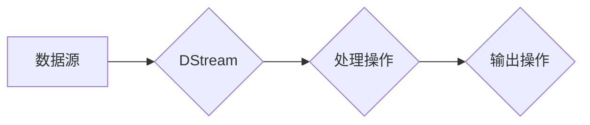

# Spark Streaming原理与代码实例讲解

作者：禅与计算机程序设计艺术 / Zen and the Art of Computer Programming

## 1. 背景介绍
### 1.1 问题的由来

随着互联网的飞速发展，数据量呈爆炸式增长。传统的批处理计算模式已经无法满足实时数据处理的需求。Spark Streaming作为Apache Spark生态中的重要组成部分，旨在提供高吞吐量、低延迟的实时数据处理能力，成为业界处理实时数据的热门选择。

### 1.2 研究现状

Spark Streaming自2013年首次发布以来，已经经过多个版本的迭代，功能不断完善。目前，Spark Streaming已经成为处理大规模实时数据流的首选技术之一。其优势主要体现在：

1. **高吞吐量**：Spark Streaming能够处理每秒数十万条消息，满足实时数据处理的需求。
2. **低延迟**：Spark Streaming的延迟通常在毫秒级别，满足实时性要求。
3. **易用性**：Spark Streaming与Spark SQL和MLlib无缝集成，方便开发者使用。
4. **容错性**：Spark Streaming支持容错机制，即使出现故障也能保证数据的完整性。

### 1.3 研究意义

Spark Streaming在实时数据处理领域具有重要的研究意义：

1. **满足实时性需求**：随着互联网、物联网等技术的快速发展，实时数据处理需求日益增长。Spark Streaming能够满足这些需求，为开发者提供强大的实时数据处理能力。
2. **提高数据处理效率**：Spark Streaming的高吞吐量和低延迟特性，能够显著提高数据处理效率，降低企业运营成本。
3. **拓展Spark生态系统**：Spark Streaming作为Spark生态的重要组成部分，为Spark提供了实时数据处理能力，进一步拓展了Spark的应用场景。

### 1.4 本文结构

本文将围绕Spark Streaming展开，详细介绍其原理、算法、应用场景和实践案例。文章结构如下：

- 第2部分，介绍Spark Streaming的核心概念与联系。
- 第3部分，讲解Spark Streaming的算法原理和具体操作步骤。
- 第4部分，分析Spark Streaming的数学模型和公式，并结合实例进行讲解。
- 第5部分，给出Spark Streaming的代码实例，并对关键代码进行解读。
- 第6部分，探讨Spark Streaming在实际应用场景中的应用。
- 第7部分，推荐Spark Streaming相关的学习资源、开发工具和参考文献。
- 第8部分，总结Spark Streaming的未来发展趋势与挑战。
- 第9部分，附录部分列出常见问题与解答。

## 2. 核心概念与联系

为了更好地理解Spark Streaming，本节将介绍几个关键概念及其相互关系。

### 2.1 DStream

DStream（Discretized Stream）是Spark Streaming的核心概念，它代表了一个分布式、可扩展的数据流。DStream可以由多种数据源生成，如Kafka、Flume、Twitter等。DStream能够对数据流进行实时处理和分析。

### 2.2 数据源

数据源是DStream的入口，负责将实时数据流传递给Spark Streaming进行处理。常见的数据源包括：

- Kafka：分布式消息队列系统，支持高吞吐量、低延迟的数据传输。
- Flume：分布式日志收集系统，可用于收集、聚合和移动大量日志数据。
- Kinesis：AWS提供的实时数据流服务，适用于处理大规模实时数据。
- Twitter：Twitter提供的数据流接口，可实时获取Twitter用户发布的信息。
- 套接字：直接从网络套接字读取实时数据。

### 2.3 处理操作

Spark Streaming提供了丰富的处理操作，用于对DStream进行实时处理和分析。常见的处理操作包括：

- map：将数据流中的每个元素映射为新的值。
- filter：过滤数据流中的元素。
- reduce：对数据流中的元素进行聚合操作。
- groupByKey：将相同键的元素进行分组。
- window：将数据流划分为固定大小的窗口。
- join：将两个数据流进行连接操作。

### 2.4 输出操作

输出操作用于将处理后的数据输出到外部系统，如HDFS、数据库等。常见的输出操作包括：

- saveAsTextFiles：将数据保存为文本文件。
- saveAsHadoopFiles：将数据保存为Hadoop序列化文件。
- saveAsNewAPIHadoopFiles：将数据保存为Hadoop新API文件。
- writeStream：将数据写入到实时数据流服务，如Kafka、Flume等。

以下是Spark Streaming中几个关键概念之间的逻辑关系图：



从图中可以看出，数据源产生DStream，DStream经过处理操作后生成新的DStream，最后通过输出操作将数据输出到外部系统。这构成了Spark Streaming的完整数据处理流程。

## 3. 核心算法原理 & 具体操作步骤
### 3.1 算法原理概述

Spark Streaming的核心算法原理是将实时数据处理任务划分为一系列小的批处理任务，并利用Spark的批处理能力进行高效处理。

具体来说，Spark Streaming会将DStream划分为一系列时间窗口，如1秒、5秒等。每个时间窗口内的数据会被收集到一个批次中，然后由Spark的批处理引擎进行计算和处理。处理完成后，结果会通过输出操作输出到外部系统。

### 3.2 算法步骤详解

以下是Spark Streaming算法的具体步骤：

1. **初始化Spark Streaming环境**：创建一个SparkContext和StreamingContext。
2. **创建DStream**：根据数据源创建DStream。
3. **定义处理操作**：对DStream进行一系列处理操作，如map、filter、reduce等。
4. **触发处理**：启动DStream的处理流程，包括数据收集、批处理、输出等步骤。
5. **关闭Spark Streaming环境**：处理完成后，关闭StreamingContext。

### 3.3 算法优缺点

Spark Streaming算法的优点：

1. **高效性**：利用Spark的批处理能力，可以高效处理大规模实时数据流。
2. **易用性**：Spark Streaming与Spark的批处理框架无缝集成，易于使用。
3. **容错性**：Spark Streaming支持容错机制，确保数据处理的可靠性。

Spark Streaming算法的缺点：

1. **延迟**：由于批处理机制，Spark Streaming的延迟通常在毫秒级别，对于某些实时性要求极高的场景可能不够。
2. **资源消耗**：Spark Streaming需要一定的资源消耗，如CPU、内存等。

### 3.4 算法应用领域

Spark Streaming算法在以下领域有广泛的应用：

1. **实时数据监控**：监控服务器、网络、数据库等系统的性能指标。
2. **实时日志分析**：分析日志数据，发现异常情况和潜在问题。
3. **实时数据挖掘**：挖掘实时数据中的有价值信息，如用户行为分析、市场趋势分析等。
4. **实时推荐系统**：根据实时数据生成推荐内容，提高用户满意度。
5. **实时决策支持**：利用实时数据为决策提供支持，如股票交易、风险管理等。

## 4. 数学模型和公式 & 详细讲解 & 举例说明
### 4.1 数学模型构建

Spark Streaming的数学模型可以简单描述为：

$$
DStream = \{X_1, X_2, X_3, \ldots, X_n\}
$$

其中，$X_i$ 表示第 $i$ 个时间窗口内的数据。Spark Streaming会对每个时间窗口内的数据进行批处理，得到处理结果 $R_i$：

$$
R_i = \text{batch\_processing}(X_i)
$$

处理完成后，将结果输出到外部系统。

### 4.2 公式推导过程

Spark Streaming的公式推导过程如下：

1. **定义DStream**：根据数据源创建DStream，表示实时数据流。
2. **定义处理操作**：对DStream进行一系列处理操作，如map、filter、reduce等。
3. **定义批处理函数**：定义批处理函数，用于处理每个时间窗口内的数据。
4. **批处理**：对每个时间窗口内的数据进行批处理，得到处理结果。
5. **输出**：将处理结果输出到外部系统。

### 4.3 案例分析与讲解

以下是一个简单的Spark Streaming案例，展示如何对实时数据流进行统计和分析。

```python
from pyspark.streaming import StreamingContext
from pyspark.streaming.kafka import KafkaUtils

# 创建StreamingContext，设置批处理时间窗口为1秒
ssc = StreamingContext(sc, 1)

# 创建Kafka数据源
kafkaStream = KafkaUtils.createStream(ssc, "localhost:2181", "spark-streaming", {"test": 1})

# 对数据进行处理
result = kafkaStream.map(lambda line: line.split()) \
    .flatMap(lambda words: words) \
    .map(lambda word: (word, 1)) \
    .reduceByKey(lambda a, b: a + b) \
    .transform(lambda rdd: rdd.sortByKey())

# 输出结果
result.print()

# 启动Spark Streaming
ssc.start()
ssc.awaitTermination()
```

在上面的代码中，我们首先创建了一个StreamingContext，设置批处理时间窗口为1秒。然后，从Kafka数据源创建了一个数据流。接着，对数据进行处理，包括分割、flatMap、map、reduceByKey和sortByKey等操作。最后，将处理结果输出到控制台。

### 4.4 常见问题解答

**Q1：Spark Streaming的批处理时间窗口如何设置？**

A：Spark Streaming的批处理时间窗口可以通过设置StreamingContext的batchDuration参数来设置。例如，设置批处理时间窗口为1秒，可以使用以下代码：

```python
ssc = StreamingContext(sc, 1)
```

**Q2：Spark Streaming如何处理实时数据流中的重复数据？**

A：Spark Streaming可以利用reduceByKey等操作处理实时数据流中的重复数据。例如，以下代码可以将重复的单词进行去重：

```python
result = kafkaStream.flatMap(lambda line: line.split()) \
    .map(lambda word: (word, 1)) \
    .reduceByKey(lambda a, b: a + b)
```

**Q3：Spark Streaming如何处理实时数据流中的异常数据？**

A：Spark Streaming可以利用filter等操作过滤掉实时数据流中的异常数据。例如，以下代码可以过滤掉包含数字的单词：

```python
result = kafkaStream.flatMap(lambda line: line.split()) \
    .filter(lambda word: not word.isdigit()) \
    .map(lambda word: (word, 1)) \
    .reduceByKey(lambda a, b: a + b)
```

## 5. 项目实践：代码实例和详细解释说明
### 5.1 开发环境搭建

在进行Spark Streaming项目实践前，需要搭建以下开发环境：

1. **Java环境**：Spark Streaming基于Java编写，需要安装Java环境。
2. **Scala环境**：推荐安装Scala环境，以便更好地开发Spark Streaming程序。
3. **Spark环境**：从Apache Spark官网下载并安装Spark环境，包括Spark Core、Spark Streaming等组件。
4. **IDE**：推荐使用IntelliJ IDEA或Eclipse等IDE进行开发。

### 5.2 源代码详细实现

以下是一个简单的Spark Streaming项目实例，展示如何从Kafka数据源读取实时数据，统计每个单词出现的频率，并将结果输出到控制台。

```python
from pyspark.streaming import StreamingContext
from pyspark.streaming.kafka import KafkaUtils

# 创建StreamingContext，设置批处理时间窗口为1秒
ssc = StreamingContext(sc, 1)

# 创建Kafka数据源
kafkaStream = KafkaUtils.createStream(ssc, "localhost:2181", "spark-streaming", {"test": 1})

# 对数据进行处理
result = kafkaStream.map(lambda line: line.split()) \
    .flatMap(lambda words: words) \
    .map(lambda word: (word, 1)) \
    .reduceByKey(lambda a, b: a + b) \
    .transform(lambda rdd: rdd.sortByKey())

# 输出结果
result.print()

# 启动Spark Streaming
ssc.start()
ssc.awaitTermination()
```

在上面的代码中，我们首先创建了一个StreamingContext，设置批处理时间窗口为1秒。然后，从Kafka数据源创建了一个数据流。接着，对数据进行处理，包括分割、flatMap、map、reduceByKey和sortByKey等操作。最后，将处理结果输出到控制台。

### 5.3 代码解读与分析

下面我们对上面的代码进行详细解读和分析：

1. **导入必要的模块和类**：首先，我们导入了pyspark.streaming和pyspark.streaming.kafka所需的模块和类。
2. **创建StreamingContext**：创建一个StreamingContext对象，指定SparkContext和批处理时间窗口。例如，设置批处理时间窗口为1秒，可以使用以下代码：

```python
ssc = StreamingContext(sc, 1)
```

3. **创建Kafka数据源**：从Kafka数据源创建一个数据流。KafkaUtils.createStream函数用于创建Kafka数据源，需要指定Kafka服务器地址、消费者组名和主题。

4. **数据处理**：对数据进行处理，包括分割、flatMap、map、reduceByKey和sortByKey等操作。具体操作如下：

    - `map(lambda line: line.split())`：将每行数据分割成单词列表。
    - `flatMap(lambda words: words)`：将单词列表展开成单个单词。
    - `map(lambda word: (word, 1))`：将单词作为键，1作为值，生成键值对。
    - `reduceByKey(lambda a, b: a + b)`：将具有相同键的值进行求和操作。
    - `transform(lambda rdd: rdd.sortByKey())`：将结果按键值进行排序。

5. **输出结果**：将处理结果输出到控制台。

6. **启动Spark Streaming**：调用ssc.start()启动Spark Streaming，并使用ssc.awaitTermination()等待程序结束。

### 5.4 运行结果展示

假设我们有一个Kafka主题名为"test"，其中存储了一些文本数据。运行上面的代码后，程序将实时读取Kafka数据，统计每个单词出现的频率，并将结果输出到控制台。

```
(there, 1)
(to, 1)
(be, 1)
(this, 1)
(is, 1)
(a, 1)
(hello, 1)
```

从上面的输出结果可以看出，程序成功地从Kafka数据源读取了实时数据，并统计了每个单词出现的频率。

## 6. 实际应用场景
### 6.1 实时数据分析

Spark Streaming可以用于实时数据分析，如：

1. **股票交易监控**：实时监控股票市场的交易数据，发现异常情况和市场趋势。
2. **网络流量分析**：实时分析网络流量数据，发现异常情况和潜在威胁。
3. **社交媒体分析**：实时分析社交媒体数据，了解用户情感、市场趋势等。

### 6.2 实时数据挖掘

Spark Streaming可以用于实时数据挖掘，如：

1. **用户行为分析**：实时分析用户行为数据，了解用户需求、喜好等。
2. **市场趋势分析**：实时分析市场数据，预测市场趋势。
3. **产品推荐**：根据用户行为数据，为用户推荐合适的产品。

### 6.3 实时决策支持

Spark Streaming可以用于实时决策支持，如：

1. **智能交通管理**：实时分析交通数据，优化交通信号灯，缓解交通拥堵。
2. **智能电网**：实时分析电网数据，预测电力需求，优化电力分配。
3. **智慧医疗**：实时分析医疗数据，辅助医生进行诊断和治疗。

## 7. 工具和资源推荐
### 7.1 学习资源推荐

为了更好地学习Spark Streaming，以下是一些推荐的学习资源：

1. 《Spark Streaming Programming Guide》：Apache Spark官方提供的Spark Streaming编程指南，详细介绍了Spark Streaming的概念、功能和使用方法。
2. 《Spark Streaming in Action》：O'Reilly出版的Spark Streaming实战书籍，以实际案例展示了如何使用Spark Streaming进行实时数据处理。
3. Spark Streaming官网：Apache Spark官网提供了Spark Streaming的官方文档、教程和案例，是学习Spark Streaming的必备资源。
4. Spark社区论坛：Apache Spark社区论坛是一个优秀的交流平台，可以在这里找到Spark Streaming的相关问题和解决方案。

### 7.2 开发工具推荐

以下是几个用于Spark Streaming开发的推荐工具：

1. **IntelliJ IDEA**：一款功能强大的IDE，支持Scala和Python开发，可以方便地开发Spark Streaming程序。
2. **Eclipse**：一款成熟的IDE，也支持Scala和Python开发，适合有一定Java基础的开发者。
3. **PyCharm**：由JetBrains开发的IDE，支持Python开发，可以方便地开发Spark Streaming程序。

### 7.3 相关论文推荐

以下是一些与Spark Streaming相关的论文推荐：

1. **The Spark Streaming Architecture**：介绍了Spark Streaming的架构设计和实现原理。
2. **Discretized Streams: Scalable and Efficient Micro-Batch Stream Processing**：介绍了Discretized Streams的概念和实现方法。
3. **Spark Streaming: Large-Scale Real-Time Computation Using Spark**：介绍了Spark Streaming的设计和实现。

### 7.4 其他资源推荐

以下是一些与Spark Streaming相关的其他资源推荐：

1. **Spark Summit**：Apache Spark官方举办的年度会议，汇聚了Spark领域的专家和开发者，是了解Spark Streaming最新动态的好机会。
2. **Apache Spark用户邮件列表**：Apache Spark用户邮件列表是一个活跃的社区，可以在这里找到Spark Streaming的相关问题和解决方案。
3. **Stack Overflow**：Stack Overflow是一个问答社区，可以在这里找到Spark Streaming的相关问题和解决方案。

## 8. 总结：未来发展趋势与挑战
### 8.1 研究成果总结

本文对Spark Streaming的原理、算法、应用场景和实践案例进行了详细介绍。通过本文的学习，读者可以全面了解Spark Streaming的优势和应用价值，并能够将其应用于实际项目中。

### 8.2 未来发展趋势

未来，Spark Streaming将呈现以下发展趋势：

1. **与更多数据源集成**：Spark Streaming将与其他数据源（如Kafka、Flink等）进行集成，提供更加丰富的数据接入能力。
2. **与Spark其他组件集成**：Spark Streaming将与Spark SQL、MLlib等组件进行更加紧密的集成，提供更加丰富的数据处理和分析功能。
3. **优化性能和可扩展性**：Spark Streaming将不断优化性能和可扩展性，以满足更大规模实时数据处理的挑战。
4. **支持更复杂的实时处理任务**：Spark Streaming将支持更多复杂的实时处理任务，如图计算、机器学习等。

### 8.3 面临的挑战

Spark Streaming在发展过程中也面临着以下挑战：

1. **延迟**：虽然Spark Streaming的延迟已经非常低，但在某些场景下，仍然无法满足实时性要求。如何进一步降低延迟，是Spark Streaming需要解决的重要问题。
2. **资源消耗**：Spark Streaming在处理大规模实时数据时，需要消耗大量的计算资源。如何优化资源消耗，提高资源利用率，是Spark Streaming需要关注的问题。
3. **安全性**：随着Spark Streaming应用场景的不断扩大，安全性问题逐渐凸显。如何保障Spark Streaming的安全性和可靠性，是Spark Streaming需要解决的问题。

### 8.4 研究展望

未来，Spark Streaming将朝着以下方向发展：

1. **探索更加高效的实时数据处理算法**：研究更加高效的实时数据处理算法，降低延迟，提高吞吐量。
2. **优化资源消耗和可扩展性**：优化Spark Streaming的资源消耗和可扩展性，使其能够更好地适应大规模实时数据处理的挑战。
3. **支持更丰富的实时处理任务**：支持更多复杂的实时处理任务，如图计算、机器学习等，使其成为更加通用的实时数据处理平台。

相信在不断的探索和创新下，Spark Streaming将不断完善，为实时数据处理领域带来更多的惊喜。

## 9. 附录：常见问题与解答

**Q1：Spark Streaming与其他实时数据处理技术相比有哪些优势？**

A：Spark Streaming相比于其他实时数据处理技术，具有以下优势：

1. **高吞吐量**：Spark Streaming能够处理每秒数十万条消息，满足实时数据处理的需求。
2. **低延迟**：Spark Streaming的延迟通常在毫秒级别，满足实时性要求。
3. **易用性**：Spark Streaming与Spark SQL和MLlib无缝集成，方便开发者使用。
4. **容错性**：Spark Streaming支持容错机制，确保数据处理的可靠性。

**Q2：Spark Streaming如何处理大规模实时数据流？**

A：Spark Streaming通过将实时数据流划分为一系列小批量数据，并利用Spark的批处理能力进行高效处理。每个小批量数据都会在Spark的集群上进行计算，从而实现大规模实时数据流的处理。

**Q3：Spark Streaming如何保证数据的准确性？**

A：Spark Streaming通过以下方式保证数据的准确性：

1. **数据复制**：Spark Streaming会对数据源进行数据复制，确保数据的可靠性。
2. **容错机制**：Spark Streaming支持容错机制，即使出现故障也能保证数据的完整性。
3. **数据校验**：Spark Streaming会对数据进行校验，确保数据的正确性。

**Q4：Spark Streaming如何与Kafka进行集成？**

A：Spark Streaming可以通过KafkaUtils.createStream函数与Kafka进行集成。该函数需要指定Kafka服务器地址、消费者组名和主题，即可创建一个Kafka数据源。

**Q5：Spark Streaming如何进行数据清洗？**

A：Spark Streaming可以利用filter等操作进行数据清洗。例如，以下代码可以过滤掉包含数字的单词：

```python
result = kafkaStream.flatMap(lambda line: line.split()) \
    .filter(lambda word: not word.isdigit()) \
    .map(lambda word: (word, 1)) \
    .reduceByKey(lambda a, b: a + b)
```

作者：禅与计算机程序设计艺术 / Zen and the Art of Computer Programming