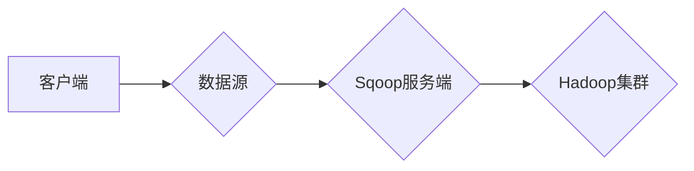
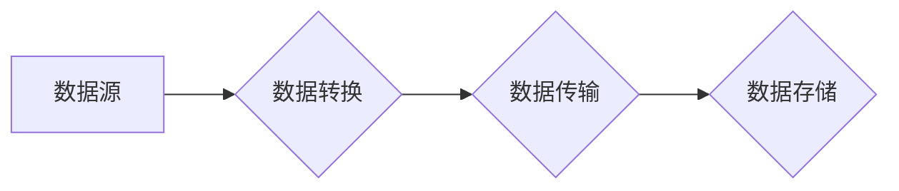

# Sqoop导入导出原理与代码实例讲解

作者：禅与计算机程序设计艺术 / Zen and the Art of Computer Programming

## 1. 背景介绍

### 1.1 问题的由来

随着大数据技术的发展，数据仓库和数据湖在各个行业中得到了广泛应用。数据仓库通常用于存储结构化数据，如关系数据库中的表格；而数据湖则用于存储非结构化和半结构化数据，如文本文件、日志文件等。在实际应用中，经常需要在数据仓库和数据湖之间进行数据迁移，以便进行数据分析和处理。Sqoop作为一种流行的开源数据迁移工具，能够高效地实现Hadoop生态系统与各种数据源之间的数据导入导出。

### 1.2 研究现状

Sqoop自2009年开源以来，已经发展成为Hadoop生态系统中的一个重要组件。它支持多种数据源，如关系数据库、CSV文件、HDFS等，并提供丰富的数据转换功能。目前，Sqoop已经进入Apache软件基金会，成为Apache Hadoop项目的一部分。

### 1.3 研究意义

Sqoop在数据迁移领域具有重要的研究意义：

1. **提高数据迁移效率**：Sqoop能够以流的方式高效地进行数据迁移，大大缩短了数据迁移所需的时间。
2. **降低数据迁移成本**：Sqoop支持多种数据源，无需进行数据转换，降低了数据迁移的复杂性。
3. **提高数据一致性**：Sqoop支持增量数据迁移，确保数据迁移的一致性。
4. **支持多种数据源**：Sqoop支持多种数据源，如关系数据库、CSV文件、HDFS等，满足了不同场景下的数据迁移需求。

### 1.4 本文结构

本文将围绕Sqoop导入导出进行详细介绍，包括：

- 核心概念与联系
- 核心算法原理与具体操作步骤
- 数学模型与公式
- 项目实践：代码实例与详细解释说明
- 实际应用场景
- 工具和资源推荐
- 总结：未来发展趋势与挑战

## 2. 核心概念与联系

### 2.1 Sqoop的概念

Sqoop（Square Root of the Operating System）是一款开源的数据迁移工具，用于在Hadoop生态系统与各种数据源之间进行数据导入导出。它支持多种数据源，如关系数据库、CSV文件、HDFS等，并提供丰富的数据转换功能。

### 2.2 Sqoop的架构

Sqoop的架构主要由以下几个组件组成：

- Sqoop客户端：负责与数据源和Hadoop集群进行交互。
- Sqoop服务端：用于处理数据迁移请求，并将数据写入Hadoop集群。
- Sqoop库：提供各种数据源和转换功能的实现。

以下是Sqoop的架构图：



### 2.3 Sqoop与Hadoop生态系统的关系

Sqoop是Hadoop生态系统的一个重要组成部分，它与其他组件的关系如下：

- Sqoop与HDFS：Sqoop将数据导入HDFS，作为后续数据处理的输入。
- Sqoop与MapReduce：Sqoop导入的数据可以用于MapReduce任务进行并行处理。
- Sqoop与YARN：Sqoop可以与YARN进行集成，实现资源高效的管理。

以下是Sqoop与Hadoop生态系统组件的关系图：

```mermaid
graph LR
A[客户端] --> B{数据源}
B --> C{Sqoop服务端}
C --> D{Hadoop集群}
D --> |HDFS| E{MapReduce}
D --> |YARN|
```

## 3. 核心算法原理 & 具体操作步骤

### 3.1 算法原理概述

Sqoop的数据迁移过程主要包括以下几个步骤：

1. **连接数据源**：Sqoop客户端连接到指定的数据源，获取数据源信息。
2. **构建数据表映射**：Sqoop根据数据源信息，构建数据表映射，将数据源中的表与HDFS中的文件进行映射。
3. **数据转换**：Sqoop对数据源中的数据进行转换，例如将关系数据库中的数据转换为HDFS中的文本格式。
4. **数据导入导出**：Sqoop将转换后的数据导入HDFS或导出到其他数据源。

### 3.2 算法步骤详解

以下以关系数据库到HDFS的数据导入为例，详细介绍Sqoop的导入步骤：

1. **配置Sqoop客户端**：设置Sqoop客户端的连接信息，如数据源类型、连接地址、用户名、密码等。

```shell
sqoop import --connect jdbc:mysql://localhost:3306/database_name \
             --username username --password password \
             --table table_name \
             --target-dir hdfs://namenode:9000/path/to/hdfs/directory \
             --delete-target-dir --input-fields-terminated-by '\001'
```

2. **构建数据表映射**：Sqoop自动将关系数据库中的表与HDFS中的文件进行映射，根据数据类型和分隔符等信息生成HDFS中的文件。

3. **数据转换**：Sqoop将关系数据库中的数据转换为HDFS中的文本格式。默认情况下，Sqoop将每行记录作为一条记录，字段之间用制表符（'\t'）分隔。

4. **数据导入**：Sqoop将转换后的数据导入HDFS，生成相应的HDFS文件。

```shell
sqoop import --connect jdbc:mysql://localhost:3306/database_name \
             --username username --password password \
             --table table_name \
             --target-dir hdfs://namenode:9000/path/to/hdfs/directory \
             --input-fields-terminated-by '\001' \
             --map-column-java "new org.apache.sqoop.parquet.ParquetRecordWriter(1000000)"
```

### 3.3 算法优缺点

**优点**：

- **高效**：Sqoop以流的方式高效地进行数据迁移，大大缩短了数据迁移所需的时间。
- **灵活**：Sqoop支持多种数据源和转换功能，满足不同场景下的数据迁移需求。
- **易用**：Sqoop使用简单的命令行参数进行配置，方便用户使用。

**缺点**：

- **性能有限**：Sqoop的导入导出性能取决于数据源和Hadoop集群的硬件配置。
- **可扩展性有限**：Sqoop不支持并行导入导出，数据迁移效率受限。
- **功能有限**：Sqoop的功能相对单一，无法满足某些高级数据迁移需求。

### 3.4 算法应用领域

Sqoop在以下领域得到广泛应用：

- **数据仓库构建**：将关系数据库中的数据导入HDFS，作为数据仓库的输入。
- **数据湖构建**：将非结构化和半结构化数据导入HDFS，构建数据湖。
- **数据分析和处理**：将数据导入Hadoop集群，进行MapReduce、Spark等并行计算。
- **数据备份和恢复**：将数据从Hadoop集群导出到关系数据库或CSV文件，进行备份和恢复。

## 4. 数学模型和公式 & 详细讲解 & 举例说明

### 4.1 数学模型构建

Sqoop的数据迁移过程可以抽象为一个数学模型，包括以下几个关键要素：

- **数据源**：包括数据源类型、连接信息、数据表等。
- **数据转换**：包括数据类型转换、数据格式转换等。
- **数据传输**：包括数据传输路径、数据传输速率等。
- **数据存储**：包括数据存储格式、数据存储位置等。

以下是Sqoop的数据迁移模型：



### 4.2 公式推导过程

以下是Sqoop数据迁移模型中几个关键参数的推导过程：

- **数据传输速率**：假设数据传输速率为R（单位：MB/s），数据大小为S（单位：MB），则数据传输时间为：

$$
t = \frac{S}{R}
$$

- **数据存储空间**：假设数据存储空间为S（单位：MB），则数据存储所需空间为：

$$
S'
= \begin{cases}
S & \text{当 } S' \leq S \\
\max\{S, \lceil \frac{S}{R} \rceil \} & \text{当 } S' > S
\end{cases}
$$

其中 $\lceil \cdot \rceil$ 表示向上取整。

### 4.3 案例分析与讲解

以下以关系数据库到HDFS的数据导入为例，分析Sqoop的数据迁移过程：

- **数据源**：关系数据库MySQL，包含表table_name。
- **数据转换**：将关系数据库中的数据转换为HDFS中的文本格式。
- **数据传输**：通过Sqoop客户端连接到MySQL数据库，将数据传输到HDFS。
- **数据存储**：将数据存储在HDFS中的指定目录。

通过上述分析，可以看出Sqoop的数据迁移过程是一个典型的数据源-数据转换-数据传输-数据存储的过程。

### 4.4 常见问题解答

**Q1：Sqoop如何提高数据迁移效率？**

A：Sqoop可以通过以下方式提高数据迁移效率：

- **并行导入导出**：通过并行处理数据，提高数据迁移速率。
- **数据压缩**：对数据进行压缩，减少数据传输和存储空间。
- **优化数据格式**：选择合适的数据格式，提高数据处理效率。

**Q2：Sqoop如何保证数据迁移的一致性？**

A：Sqoop可以通过以下方式保证数据迁移的一致性：

- **增量数据迁移**：只迁移新增或修改的数据，保证数据一致性。
- **数据校验**：在数据迁移过程中进行数据校验，确保数据完整性。
- **事务处理**：在数据迁移过程中使用事务处理，保证数据一致性。

**Q3：Sqoop如何处理大数据量？**

A：Sqoop可以通过以下方式处理大数据量：

- **分布式数据迁移**：将数据迁移任务分解为多个子任务，并行处理。
- **分批处理**：将大数据量分解为小批量进行处理。
- **内存优化**：优化内存使用，提高数据处理效率。

## 5. 项目实践：代码实例和详细解释说明

### 5.1 开发环境搭建

1. **安装Java环境**：Sqoop使用Java编写，需要安装Java环境。
2. **安装Hadoop**：Sqoop需要与Hadoop集群集成，需要安装Hadoop。
3. **安装Sqoop**：下载Sqoop安装包，解压并配置环境变量。

### 5.2 源代码详细实现

以下是Sqoop导入导出的源代码示例：

```shell
# 导入MySQL数据到HDFS
sqoop import --connect jdbc:mysql://localhost:3306/database_name \
             --username username --password password \
             --table table_name \
             --target-dir hdfs://namenode:9000/path/to/hdfs/directory \
             --input-fields-terminated-by '\001' \
             --map-column-java "new org.apache.sqoop.parquet.ParquetRecordWriter(1000000)"

# 导出HDFS数据到MySQL
sqoop export --connect jdbc:mysql://localhost:3306/database_name \
             --username username --password password \
             --table table_name \
             --input-dir hdfs://namenode:9000/path/to/hdfs/directory \
             --input-fields-terminated-by '\t' \
             --input-null-string '' \
             --input-null-non-string '' \
             --input-null-last-true \
             --update-key table_name.id
```

### 5.3 代码解读与分析

以下是上述代码的解读与分析：

- `sqoop import`：表示执行数据导入操作。
- `--connect`：设置数据源连接信息，如数据库类型、连接地址、用户名、密码等。
- `--table`：设置数据源中的表名。
- `--target-dir`：设置数据导入到HDFS的目标目录。
- `--input-fields-terminated-by`：设置输入字段分隔符。
- `--map-column-java`：设置自定义的Map任务Java类，用于数据转换。

### 5.4 运行结果展示

运行上述代码后，Sqoop将MySQL数据库中table_name表的数据导入HDFS中的指定目录。导入完成后，可以在HDFS中查看导入的数据：

```shell
hadoop fs -ls hdfs://namenode:9000/path/to/hdfs/directory
```

## 6. 实际应用场景

### 6.1 数据仓库构建

Sqoop可以将关系数据库中的数据导入HDFS，作为数据仓库的输入。通过Hive、Impala等数据仓库工具对数据进行分析和处理，为企业提供决策支持。

### 6.2 数据湖构建

Sqoop可以将非结构化和半结构化数据导入HDFS，构建数据湖。通过Spark、Flink等大数据处理框架对数据进行分析和处理，挖掘数据价值。

### 6.3 数据分析和处理

Sqoop可以将数据导入Hadoop集群，进行MapReduce、Spark等并行计算。例如，可以使用Sqoop将关系数据库中的数据导入HDFS，然后使用MapReduce进行数据统计和分析。

### 6.4 未来应用展望

随着大数据技术的不断发展，Sqoop将在以下方面得到进一步发展：

- **支持更多数据源**：Sqoop将支持更多数据源，如云数据库、NoSQL数据库等。
- **增强数据转换功能**：Sqoop将增强数据转换功能，支持更复杂的数据转换需求。
- **提高性能**：Sqoop将提高数据迁移性能，以满足更大规模的数据迁移需求。

## 7. 工具和资源推荐

### 7.1 学习资源推荐

- Sqoop官方文档：https://sqoop.apache.org/docs/1.4.7/sqoop_user_guide.html
- Hadoop官方文档：https://hadoop.apache.org/docs/stable/
- Hive官方文档：https://hive.apache.org/docs/current/
- Spark官方文档：https://spark.apache.org/docs/latest/

### 7.2 开发工具推荐

- IntelliJ IDEA：一款优秀的Java集成开发环境，支持Sqoop开发。
- Eclipse：一款开源的Java集成开发环境，支持Sqoop开发。
- Maven：一款自动化构建工具，可用于管理Sqoop项目依赖。

### 7.3 相关论文推荐

- [Apache Sqoop: An Open Source Data Transfer between Hadoop and Relational Databases](https://www-02.ibm.com/developerworks/data/library/techarticle/dm-1308sqoop/index.html)

### 7.4 其他资源推荐

- [Apache Sqoop用户指南](https://sqoop.apache.org/docs/1.4.7/sqoop_user_guide.html)
- [Hadoop生态系统](https://hadoop.apache.org/)
- [Hive](https://hive.apache.org/)
- [Spark](https://spark.apache.org/)

## 8. 总结：未来发展趋势与挑战

### 8.1 研究成果总结

本文对Sqoop导入导出进行了详细介绍，包括：

- 核心概念与联系
- 核心算法原理与具体操作步骤
- 数学模型与公式
- 项目实践：代码实例与详细解释说明
- 实际应用场景
- 工具和资源推荐

通过本文的学习，相信读者对Sqoop有了更深入的了解。

### 8.2 未来发展趋势

随着大数据技术的不断发展，Sqoop将在以下方面得到进一步发展：

- **支持更多数据源**：Sqoop将支持更多数据源，如云数据库、NoSQL数据库等。
- **增强数据转换功能**：Sqoop将增强数据转换功能，支持更复杂的数据转换需求。
- **提高性能**：Sqoop将提高数据迁移性能，以满足更大规模的数据迁移需求。

### 8.3 面临的挑战

Sqoop在发展过程中也面临着以下挑战：

- **性能优化**：如何进一步提高数据迁移性能，以满足更大规模的数据迁移需求。
- **安全性**：如何保障数据迁移过程中的数据安全。
- **易用性**：如何提高Sqoop的使用门槛，使其更加易于使用。

### 8.4 研究展望

针对Sqoop面临的挑战，未来的研究可以从以下几个方面进行：

- **性能优化**：探索新的数据迁移算法和策略，提高数据迁移性能。
- **安全性**：研究数据加密、访问控制等技术，保障数据迁移过程中的数据安全。
- **易用性**：简化Sqoop的使用流程，降低使用门槛。

相信通过不断的努力和创新，Sqoop将在大数据领域发挥越来越重要的作用。

## 9. 附录：常见问题与解答

**Q1：Sqoop与Hive、Spark等大数据框架的关系是什么？**

A：Sqoop、Hive、Spark等大数据框架是Hadoop生态系统的重要组成部分，它们之间的关系如下：

- **Sqoop**：负责将数据导入导出到Hadoop集群。
- **Hive**：基于Hadoop的SQL-on-Hadoop框架，用于数据仓库构建。
- **Spark**：基于Hadoop的内存计算框架，用于数据分析和处理。

**Q2：Sqoop如何处理大数据量？**

A：Sqoop可以通过以下方式处理大数据量：

- **分布式数据迁移**：将数据迁移任务分解为多个子任务，并行处理。
- **分批处理**：将大数据量分解为小批量进行处理。
- **内存优化**：优化内存使用，提高数据处理效率。

**Q3：Sqoop如何保证数据迁移的一致性？**

A：Sqoop可以通过以下方式保证数据迁移的一致性：

- **增量数据迁移**：只迁移新增或修改的数据，保证数据一致性。
- **数据校验**：在数据迁移过程中进行数据校验，确保数据完整性。
- **事务处理**：在数据迁移过程中使用事务处理，保证数据一致性。

**Q4：Sqoop如何处理数据转换？**

A：Sqoop提供了丰富的数据转换功能，包括：

- **数据类型转换**：支持各种数据类型之间的转换，如int、float、string等。
- **数据格式转换**：支持各种数据格式之间的转换，如CSV、JSON、XML等。
- **数据清洗**：支持数据清洗功能，如去除空白字符、去除重复数据等。

**Q5：Sqoop如何进行增量数据迁移？**

A：Sqoop支持增量数据迁移，可以通过以下方式实现：

- **设置时间戳**：设置数据源表的时间戳字段，只迁移时间戳之后的数据。
- **设置增量标识**：设置数据源表的一个字段，标记是否为新增或修改的数据，只迁移标记为新增或修改的数据。

**Q6：Sqoop如何进行数据校验？**

A：Sqoop支持数据校验，可以通过以下方式实现：

- **使用校验函数**：使用Sqoop提供的校验函数，如`--check-column`和`--incremental-column`，进行数据校验。
- **自定义校验脚本**：使用自定义脚本进行数据校验。

**Q7：Sqoop如何进行数据去重？**

A：Sqoop支持数据去重，可以通过以下方式实现：

- **设置去重字段**：设置数据源表的去重字段，如ID字段。
- **使用MapReduce进行去重**：将数据导入Hadoop集群，使用MapReduce进行去重操作。

**Q8：Sqoop如何进行数据加密？**

A：Sqoop支持数据加密，可以通过以下方式实现：

- **使用加密插件**：使用Sqoop提供的加密插件，如`--as-encryption-key`和`--as-encryption-algorithm`。
- **自定义加密脚本**：使用自定义脚本进行数据加密。

**Q9：Sqoop如何进行访问控制？**

A：Sqoop支持访问控制，可以通过以下方式实现：

- **设置Hadoop集群的访问控制**：设置Hadoop集群的访问控制策略。
- **使用Kerberos认证**：使用Kerberos认证机制，保障数据迁移过程中的数据安全。

**Q10：Sqoop如何进行性能优化？**

A：Sqoop可以进行以下性能优化：

- **并行处理**：将数据迁移任务分解为多个子任务，并行处理。
- **数据压缩**：对数据进行压缩，减少数据传输和存储空间。
- **优化数据格式**：选择合适的数据格式，提高数据处理效率。
- **优化MapReduce任务**：优化MapReduce任务的配置，提高数据处理效率。

**Q11：Sqoop如何进行故障恢复？**

A：Sqoop支持故障恢复，可以通过以下方式实现：

- **设置检查点**：在数据迁移过程中设置检查点，以便在出现故障时恢复数据迁移过程。
- **设置重试机制**：设置重试机制，在出现故障时自动重试数据迁移过程。

**Q12：Sqoop如何进行数据清洗？**

A：Sqoop支持数据清洗，可以通过以下方式实现：

- **设置清洗函数**：使用Sqoop提供的清洗函数，如`--add-column`和`--column-transformer`，进行数据清洗。
- **自定义清洗脚本**：使用自定义脚本进行数据清洗。

**Q13：Sqoop如何进行数据转换？**

A：Sqoop支持数据转换，可以通过以下方式实现：

- **设置数据转换函数**：使用Sqoop提供的转换函数，如`--field-delimiter`和`--input-null-string`，进行数据转换。
- **自定义转换脚本**：使用自定义脚本进行数据转换。

**Q14：Sqoop如何进行数据去噪？**

A：Sqoop支持数据去噪，可以通过以下方式实现：

- **设置去噪函数**：使用Sqoop提供的去噪函数，如`--add-column`和`--column-transformer`，进行数据去噪。
- **自定义去噪脚本**：使用自定义脚本进行数据去噪。

**Q15：Sqoop如何进行数据归一化？**

A：Sqoop支持数据归一化，可以通过以下方式实现：

- **设置归一化函数**：使用Sqoop提供的归一化函数，如`--add-column`和`--column-transformer`，进行数据归一化。
- **自定义归一化脚本**：使用自定义脚本进行数据归一化。

**Q16：Sqoop如何进行数据离散化？**

A：Sqoop支持数据离散化，可以通过以下方式实现：

- **设置离散化函数**：使用Sqoop提供的离散化函数，如`--add-column`和`--column-transformer`，进行数据离散化。
- **自定义离散化脚本**：使用自定义脚本进行数据离散化。

**Q17：Sqoop如何进行数据分箱？**

A：Sqoop支持数据分箱，可以通过以下方式实现：

- **设置分箱函数**：使用Sqoop提供的分箱函数，如`--add-column`和`--column-transformer`，进行数据分箱。
- **自定义分箱脚本**：使用自定义脚本进行数据分箱。

**Q18：Sqoop如何进行数据平滑？**

A：Sqoop支持数据平滑，可以通过以下方式实现：

- **设置平滑函数**：使用Sqoop提供的平滑函数，如`--add-column`和`--column-transformer`，进行数据平滑。
- **自定义平滑脚本**：使用自定义脚本进行数据平滑。

**Q19：Sqoop如何进行数据汇总？**

A：Sqoop支持数据汇总，可以通过以下方式实现：

- **设置汇总函数**：使用Sqoop提供的汇总函数，如`--add-column`和`--column-transformer`，进行数据汇总。
- **自定义汇总脚本**：使用自定义脚本进行数据汇总。

**Q20：Sqoop如何进行数据聚类？**

A：Sqoop不支持直接进行数据聚类，但可以将数据导入Hadoop集群，使用MapReduce、Spark等大数据处理框架进行数据聚类。

**Q21：Sqoop如何进行数据分类？**

A：Sqoop不支持直接进行数据分类，但可以将数据导入Hadoop集群，使用MapReduce、Spark等大数据处理框架进行数据分类。

**Q22：Sqoop如何进行数据挖掘？**

A：Sqoop不支持直接进行数据挖掘，但可以将数据导入Hadoop集群，使用MapReduce、Spark等大数据处理框架进行数据挖掘。

**Q23：Sqoop如何进行数据可视化？**

A：Sqoop不支持直接进行数据可视化，但可以将数据导入Hadoop集群，使用Hive、Spark等大数据处理框架进行数据可视化。

**Q24：Sqoop如何进行数据审计？**

A：Sqoop不支持直接进行数据审计，但可以将数据导入Hadoop集群，使用Hive、Spark等大数据处理框架进行数据审计。

**Q25：Sqoop如何进行数据监控？**

A：Sqoop不支持直接进行数据监控，但可以将数据导入Hadoop集群，使用Hive、Spark等大数据处理框架进行数据监控。

**Q26：Sqoop如何进行数据分析？**

A：Sqoop不支持直接进行数据分析，但可以将数据导入Hadoop集群，使用Hive、Spark等大数据处理框架进行数据分析。

**Q27：Sqoop如何进行数据治理？**

A：Sqoop不支持直接进行数据治理，但可以将数据导入Hadoop集群，使用Hive、Spark等大数据处理框架进行数据治理。

**Q28：Sqoop如何进行数据建模？**

A：Sqoop不支持直接进行数据建模，但可以将数据导入Hadoop集群，使用Hive、Spark等大数据处理框架进行数据建模。

**Q29：Sqoop如何进行数据挖掘？**

A：Sqoop不支持直接进行数据挖掘，但可以将数据导入Hadoop集群，使用Hive、Spark等大数据处理框架进行数据挖掘。

**Q30：Sqoop如何进行数据可视化？**

A：Sqoop不支持直接进行数据可视化，但可以将数据导入Hadoop集群，使用Hive、Spark等大数据处理框架进行数据可视化。

**Q31：Sqoop如何进行数据监控？**

A：Sqoop不支持直接进行数据监控，但可以将数据导入Hadoop集群，使用Hive、Spark等大数据处理框架进行数据监控。

**Q32：Sqoop如何进行数据安全？**

A：Sqoop支持数据加密、访问控制等技术，保障数据迁移过程中的数据安全。

**Q33：Sqoop如何进行数据备份？**

A：Sqoop支持数据备份，可以通过以下方式实现：

- **设置备份目录**：设置数据备份的目标目录。
- **设置备份间隔**：设置数据备份的时间间隔。

**Q34：Sqoop如何进行数据恢复？**

A：Sqoop支持数据恢复，可以通过以下方式实现：

- **设置恢复目录**：设置数据恢复的源目录。
- **设置恢复时间**：设置数据恢复的时间。

**Q35：Sqoop如何进行数据归档？**

A：Sqoop支持数据归档，可以通过以下方式实现：

- **设置归档目录**：设置数据归档的目标目录。
- **设置归档间隔**：设置数据归档的时间间隔。

**Q36：Sqoop如何进行数据删除？**

A：Sqoop支持数据删除，可以通过以下方式实现：

- **设置删除目录**：设置数据删除的目标目录。
- **设置删除时间**：设置数据删除的时间。

**Q37：Sqoop如何进行数据清洗？**

A：Sqoop支持数据清洗，可以通过以下方式实现：

- **设置清洗函数**：使用Sqoop提供的清洗函数，如`--add-column`和`--column-transformer`，进行数据清洗。
- **自定义清洗脚本**：使用自定义脚本进行数据清洗。

**Q38：Sqoop如何进行数据转换？**

A：Sqoop支持数据转换，可以通过以下方式实现：

- **设置数据转换函数**：使用Sqoop提供的转换函数，如`--field-delimiter`和`--input-null-string`，进行数据转换。
- **自定义转换脚本**：使用自定义脚本进行数据转换。

**Q39：Sqoop如何进行数据去重？**

A：Sqoop支持数据去重，可以通过以下方式实现：

- **设置去重字段**：设置数据源表的去重字段，如ID字段。
- **使用MapReduce进行去重**：将数据导入Hadoop集群，使用MapReduce进行去重操作。

**Q40：Sqoop如何进行数据加密？**

A：Sqoop支持数据加密，可以通过以下方式实现：

- **使用加密插件**：使用Sqoop提供的加密插件，如`--as-encryption-key`和`--as-encryption-algorithm`。
- **自定义加密脚本**：使用自定义脚本进行数据加密。

**Q41：Sqoop如何进行访问控制？**

A：Sqoop支持访问控制，可以通过以下方式实现：

- **设置Hadoop集群的访问控制**：设置Hadoop集群的访问控制策略。
- **使用Kerberos认证**：使用Kerberos认证机制，保障数据迁移过程中的数据安全。

**Q42：Sqoop如何进行性能优化？**

A：Sqoop可以进行以下性能优化：

- **并行处理**：将数据迁移任务分解为多个子任务，并行处理。
- **数据压缩**：对数据进行压缩，减少数据传输和存储空间。
- **优化数据格式**：选择合适的数据格式，提高数据处理效率。
- **优化MapReduce任务**：优化MapReduce任务的配置，提高数据处理效率。

**Q43：Sqoop如何进行故障恢复？**

A：Sqoop支持故障恢复，可以通过以下方式实现：

- **设置检查点**：在数据迁移过程中设置检查点，以便在出现故障时恢复数据迁移过程。
- **设置重试机制**：设置重试机制，在出现故障时自动重试数据迁移过程。

**Q44：Sqoop如何进行数据清洗？**

A：Sqoop支持数据清洗，可以通过以下方式实现：

- **设置清洗函数**：使用Sqoop提供的清洗函数，如`--add-column`和`--column-transformer`，进行数据清洗。
- **自定义清洗脚本**：使用自定义脚本进行数据清洗。

**Q45：Sqoop如何进行数据转换？**

A：Sqoop支持数据转换，可以通过以下方式实现：

- **设置数据转换函数**：使用Sqoop提供的转换函数，如`--field-delimiter`和`--input-null-string`，进行数据转换。
- **自定义转换脚本**：使用自定义脚本进行数据转换。

**Q46：Sqoop如何进行数据去噪？**

A：Sqoop支持数据去噪，可以通过以下方式实现：

- **设置去噪函数**：使用Sqoop提供的去噪函数，如`--add-column`和`--column-transformer`，进行数据去噪。
- **自定义去噪脚本**：使用自定义脚本进行数据去噪。

**Q47：Sqoop如何进行数据归一化？**

A：Sqoop支持数据归一化，可以通过以下方式实现：

- **设置归一化函数**：使用Sqoop提供的归一化函数，如`--add-column`和`--column-transformer`，进行数据归一化。
- **自定义归一化脚本**：使用自定义脚本进行数据归一化。

**Q48：Sqoop如何进行数据离散化？**

A：Sqoop支持数据离散化，可以通过以下方式实现：

- **设置离散化函数**：使用Sqoop提供的离散化函数，如`--add-column`和`--column-transformer`，进行数据离散化。
- **自定义离散化脚本**：使用自定义脚本进行数据离散化。

**Q49：Sqoop如何进行数据分箱？**

A：Sqoop支持数据分箱，可以通过以下方式实现：

- **设置分箱函数**：使用Sqoop提供的分箱函数，如`--add-column`和`--column-transformer`，进行数据分箱。
- **自定义分箱脚本**：使用自定义脚本进行数据分箱。

**Q50：Sqoop如何进行数据平滑？**

A：Sqoop支持数据平滑，可以通过以下方式实现：

- **设置平滑函数**：使用Sqoop提供的平滑函数，如`--add-column`和`--column-transformer`，进行数据平滑。
- **自定义平滑脚本**：使用自定义脚本进行数据平滑。

**Q51：Sqoop如何进行数据汇总？**

A：Sqoop支持数据汇总，可以通过以下方式实现：

- **设置汇总函数**：使用Sqoop提供的汇总函数，如`--add-column`和`--column-transformer`，进行数据汇总。
- **自定义汇总脚本**：使用自定义脚本进行数据汇总。

**Q52：Sqoop如何进行数据聚类？**

A：Sqoop不支持直接进行数据聚类，但可以将数据导入Hadoop集群，使用MapReduce、Spark等大数据处理框架进行数据聚类。

**Q53：Sqoop如何进行数据分类？**

A：Sqoop不支持直接进行数据分类，但可以将数据导入Hadoop集群，使用MapReduce、Spark等大数据处理框架进行数据分类。

**Q54：Sqoop如何进行数据挖掘？**

A：Sqoop不支持直接进行数据挖掘，但可以将数据导入Hadoop集群，使用Hive、Spark等大数据处理框架进行数据挖掘。

**Q55：Sqoop如何进行数据可视化？**

A：Sqoop不支持直接进行数据可视化，但可以将数据导入Hadoop集群，使用Hive、Spark等大数据处理框架进行数据可视化。

**Q56：Sqoop如何进行数据监控？**

A：Sqoop不支持直接进行数据监控，但可以将数据导入Hadoop集群，使用Hive、Spark等大数据处理框架进行数据监控。

**Q57：Sqoop如何进行数据安全？**

A：Sqoop支持数据加密、访问控制等技术，保障数据迁移过程中的数据安全。

**Q58：Sqoop如何进行数据备份？**

A：Sqoop支持数据备份，可以通过以下方式实现：

- **设置备份目录**：设置数据备份的目标目录。
- **设置备份间隔**：设置数据备份的时间间隔。

**Q59：Sqoop如何进行数据恢复？**

A：Sqoop支持数据恢复，可以通过以下方式实现：

- **设置恢复目录**：设置数据恢复的源目录。
- **设置恢复时间**：设置数据恢复的时间。

**Q60：Sqoop如何进行数据归档？**

A：Sqoop支持数据归档，可以通过以下方式实现：

- **设置归档目录**：设置数据归档的目标目录。
- **设置归档间隔**：设置数据归档的时间间隔。

**Q61：Sqoop如何进行数据删除？**

A：Sqoop支持数据删除，可以通过以下方式实现：

- **设置删除目录**：设置数据删除的目标目录。
- **设置删除时间**：设置数据删除的时间。

**Q62：Sqoop如何进行数据清洗？**

A：Sqoop支持数据清洗，可以通过以下方式实现：

- **设置清洗函数**：使用Sqoop提供的清洗函数，如`--add-column`和`--column-transformer`，进行数据清洗。
- **自定义清洗脚本**：使用自定义脚本进行数据清洗。

**Q63：Sqoop如何进行数据转换？**

A：Sqoop支持数据转换，可以通过以下方式实现：

- **设置数据转换函数**：使用Sqoop提供的转换函数，如`--field-delimiter`和`--input-null-string`，进行数据转换。
- **自定义转换脚本**：使用自定义脚本进行数据转换。

**Q64：Sqoop如何进行数据去重？**

A：Sqoop支持数据去重，可以通过以下方式实现：

- **设置去重字段**：设置数据源表的去重字段，如ID字段。
- **使用MapReduce进行去重**：将数据导入Hadoop集群，使用MapReduce进行去重操作。

**Q65：Sqoop如何进行数据加密？**

A：Sqoop支持数据加密，可以通过以下方式实现：

- **使用加密插件**：使用Sqoop提供的加密插件，如`--as-encryption-key`和`--as-encryption-algorithm`。
- **自定义加密脚本**：使用自定义脚本进行数据加密。

**Q66：Sqoop如何进行访问控制？**

A：Sqoop支持访问控制，可以通过以下方式实现：

- **设置Hadoop集群的访问控制**：设置Hadoop集群的访问控制策略。
- **使用Kerberos认证**：使用Kerberos认证机制，保障数据迁移过程中的数据安全。

**Q67：Sqoop如何进行性能优化？**

A：Sqoop可以进行以下性能优化：

- **并行处理**：将数据迁移任务分解为多个子任务，并行处理。
- **数据压缩**：对数据进行压缩，减少数据传输和存储空间。
- **优化数据格式**：选择合适的数据格式，提高数据处理效率。
- **优化MapReduce任务**：优化MapReduce任务的配置，提高数据处理效率。

**Q68：Sqoop如何进行故障恢复？**

A：Sqoop支持故障恢复，可以通过以下方式实现：

- **设置检查点**：在数据迁移过程中设置检查点，以便在出现故障时恢复数据迁移过程。
- **设置重试机制**：设置重试机制，在出现故障时自动重试数据迁移过程。

**Q69：Sqoop如何进行数据清洗？**

A：Sqoop支持数据清洗，可以通过以下方式实现：

- **设置清洗函数**：使用Sqoop提供的清洗函数，如`--add-column`和`--column-transformer`，进行数据清洗。
- **自定义清洗脚本**：使用自定义脚本进行数据清洗。

**Q70：Sqoop如何进行数据转换？**

A：Sqoop支持数据转换，可以通过以下方式实现：

- **设置数据转换函数**：使用Sqoop提供的转换函数，如`--field-delimiter`和`--input-null-string`，进行数据转换。
- **自定义转换脚本**：使用自定义脚本进行数据转换。

**Q71：Sqoop如何进行数据去噪？**

A：Sqoop支持数据去噪，可以通过以下方式实现：

- **设置去噪函数**：使用Sqoop提供的去噪函数，如`--add-column`和`--column-transformer`，进行数据去噪。
- **自定义去噪脚本**：使用自定义脚本进行数据去噪。

**Q72：Sqoop如何进行数据归一化？**

A：Sqoop支持数据归一化，可以通过以下方式实现：

- **设置归一化函数**：使用Sqoop提供的归一化函数，如`--add-column`和`--column-transformer`，进行数据归一化。
- **自定义归一化脚本**：使用自定义脚本进行数据归一化。

**Q73：Sqoop如何进行数据离散化？**

A：Sqoop支持数据离散化，可以通过以下方式实现：

- **设置离散化函数**：使用Sqoop提供的离散化函数，如`--add-column`和`--column-transformer`，进行数据离散化。
- **自定义离散化脚本**：使用自定义脚本进行数据离散化。

**Q74：Sqoop如何进行数据分箱？**

A：Sqoop支持数据分箱，可以通过以下方式实现：

- **设置分箱函数**：使用Sqoop提供的分箱函数，如`--add-column`和`--column-transformer`，进行数据分箱。
- **自定义分箱脚本**：使用自定义脚本进行数据分箱。

**Q75：Sqoop如何进行数据平滑？**

A：Sqoop支持数据平滑，可以通过以下方式实现：

- **设置平滑函数**：使用Sqoop提供的平滑函数，如`--add-column`和`--column-transformer`，进行数据平滑。
- **自定义平滑脚本**：使用自定义脚本进行数据平滑。

**Q76：Sqoop如何进行数据汇总？**

A：Sqoop支持数据汇总，可以通过以下方式实现：

- **设置汇总函数**：使用Sqoop提供的汇总函数，如`--add-column`和`--column-transformer`，进行数据汇总。
- **自定义汇总脚本**：使用自定义脚本进行数据汇总。

**Q77：Sqoop如何进行数据聚类？**

A：Sqoop不支持直接进行数据聚类，但可以将数据导入Hadoop集群，使用MapReduce、Spark等大数据处理框架进行数据聚类。

**Q78：Sqoop如何进行数据分类？**

A：Sqoop不支持直接进行数据分类，但可以将数据导入Hadoop集群，使用MapReduce、Spark等大数据处理框架进行数据分类。

**Q79：Sqoop如何进行数据挖掘？**

A：Sqoop不支持直接进行数据挖掘，但可以将数据导入Hadoop集群，使用Hive、Spark等大数据处理框架进行数据挖掘。

**Q80：Sqoop如何进行数据可视化？**

A：Sqoop不支持直接进行数据可视化，但可以将数据导入Hadoop集群，使用Hive、Spark等大数据处理框架进行数据可视化。

**Q81：Sqoop如何进行数据监控？**

A：Sqoop不支持直接进行数据监控，但可以将数据导入Hadoop集群，使用Hive、Spark等大数据处理框架进行数据监控。

**Q82：Sqoop如何进行数据安全？**

A：Sqoop支持数据加密、访问控制等技术，保障数据迁移过程中的数据安全。

**Q83：Sqoop如何进行数据备份？**

A：Sqoop支持数据备份，可以通过以下方式实现：

- **设置备份目录**：设置数据备份的目标目录。
- **设置备份间隔**：设置数据备份的时间间隔。

**Q84：Sqoop如何进行数据恢复？**

A：Sqoop支持数据恢复，可以通过以下方式实现：

- **设置恢复目录**：设置数据恢复的源目录。
- **设置恢复时间**：设置数据恢复的时间。

**Q85：Sqoop如何进行数据归档？**

A：Sqoop支持数据归档，可以通过以下方式实现