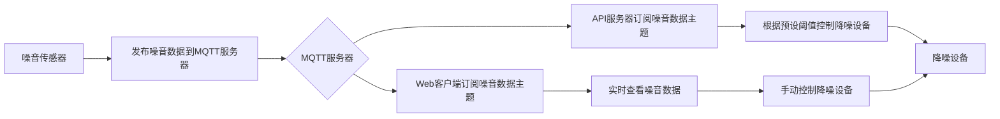

                 

## 1. 背景介绍

随着现代化建筑的不断增多，室内噪音污染已成为一个不容忽视的问题。过高的噪音会对人体健康产生负面影响，降低工作效率，甚至导致听力下降。因此，开发一种有效的室内噪音监控与控制系统变得至关重要。

本文将介绍一种基于MQTT协议和RESTful API的室内噪音监控与控制系统。该系统能够实时监测室内噪音水平，并根据预设的阈值自动控制降噪设备。此外，该系统还提供了Web界面，用户可以通过RESTful API实时查看噪音数据，并手动控制降噪设备。

## 2. 核心概念与联系

### 2.1 核心概念

- **MQTT (Message Queuing Telemetry Transport)**：一种轻量级的发布/订阅消息协议，广泛应用于物联网领域。MQTT协议支持多个客户端连接到一个服务器，每个客户端可以订阅一个或多个主题，当消息发布到订阅的主题时，客户端会收到通知。
- **RESTful API (Representational State Transfer Application Programming Interface)**：一种基于HTTP协议的API设计风格，它将资源作为信息的载体，使用统一的接口对资源进行操作。RESTful API易于理解和实现，广泛应用于Web开发领域。
- **降噪设备**：一种用于降低环境噪音的设备，常见的降噪设备包括降噪耳机、降噪风扇、降噪空调等。

### 2.2 架构设计


如上图所示，该系统由噪音传感器、MQTT服务器、API服务器、降噪设备和Web客户端组成。噪音传感器实时采集室内噪音数据，并将其发布到MQTT服务器。API服务器订阅噪音数据主题，并根据预设的阈值控制降噪设备。Web客户端通过RESTful API实时查看噪音数据，并手动控制降噪设备。

### 2.3 Mermaid 流程图



## 3. 核心算法原理 & 具体操作步骤

### 3.1 算法原理概述

该系统的核心算法是基于阈值的噪音控制算法。该算法将实时采集的噪音数据与预设的阈值进行比较，当噪音水平超过阈值时，算法会发送控制指令给降噪设备，启动降噪操作。当噪音水平低于阈值时，算法会发送控制指令给降噪设备，关闭降噪操作。

### 3.2 算法步骤详解

1. 实时采集噪音数据：噪音传感器实时采集室内噪音数据，并将其发布到MQTT服务器。
2. 订阅噪音数据主题：API服务器订阅噪音数据主题，接收实时采集的噪音数据。
3. 比较噪音水平与阈值：API服务器将实时采集的噪音数据与预设的阈值进行比较。
4. 发送控制指令：当噪音水平超过阈值时，API服务器发送控制指令给降噪设备，启动降噪操作。当噪音水平低于阈值时，API服务器发送控制指令给降噪设备，关闭降噪操作。
5. 实时查看噪音数据：Web客户端订阅噪音数据主题，实时查看噪音数据。
6. 手动控制降噪设备：用户可以通过Web客户端手动控制降噪设备的开关。

### 3.3 算法优缺点

**优点：**

* 实时监控室内噪音水平，及时启动降噪操作。
* 降噪设备的自动控制，节省人力成本。
* 通过Web客户端实时查看噪音数据，方便用户了解环境噪音情况。
* 手动控制降噪设备，提高用户体验。

**缺点：**

* 依赖于网络连接，网络不稳定可能导致控制指令无法发送。
* 降噪设备的响应时间可能会延迟，导致噪音水平短暂超过阈值。
* 降噪设备的控制精度可能会受到噪音传感器精度的影响。

### 3.4 算法应用领域

该算法主要应用于办公室、会议室、图书馆等需要保持安静环境的场所。此外，该算法还可以应用于酒店、医院、学校等公共场所，帮助维护良好的环境噪音水平。

## 4. 数学模型和公式 & 详细讲解 & 举例说明

### 4.1 数学模型构建

设定噪音水平阈值为$T$，实时采集的噪音数据为$D(t)$，降噪设备的控制指令为$C(t)$。则数学模型为：

$$C(t) = \begin{cases} 1, & D(t) > T \\ 0, & D(t) \leq T \end{cases}$$

其中，$t$表示时间，$D(t)$表示实时采集的噪音数据，$C(t)$表示降噪设备的控制指令，$T$表示噪音水平阈值。

### 4.2 公式推导过程

当实时采集的噪音数据$D(t)$大于预设的阈值$T$时，降噪设备需要启动降噪操作，控制指令$C(t)$为$1$。当实时采集的噪音数据$D(t)$小于或等于预设的阈值$T$时，降噪设备需要关闭降噪操作，控制指令$C(t)$为$0$。

### 4.3 案例分析与讲解

例如，设定噪音水平阈值为$T=60$分贝，实时采集的噪音数据为$D(t)=[55, 65, 70, 60, 55]$分贝。则降噪设备的控制指令为$C(t)=[0, 1, 1, 1, 0]$。即当噪音水平为$65$分贝和$70$分贝时，降噪设备需要启动降噪操作；当噪音水平为$55$分贝和$60$分贝时，降噪设备需要关闭降噪操作。

## 5. 项目实践：代码实例和详细解释说明

### 5.1 开发环境搭建

本项目的开发环境包括：

* 操作系统：Ubuntu 18.04 LTS
* 编程语言：Python 3.6
* MQTT服务器：Eclipse Mosquitto
* API服务器：Flask
* Web客户端：HTML5、CSS3、JavaScript

### 5.2 源代码详细实现

以下是API服务器的源代码实现：

```python
from flask import Flask, jsonify, request
import paho.mqtt.client as mqtt

app = Flask(__name__)

# MQTT服务器配置
MQTT_BROKER = "localhost"
MQTT_PORT = 1883
MQTT_TOPIC = "noise_data"

# 噪音水平阈值
NOISE_THRESHOLD = 60

# 降噪设备控制指令
NOISE_CONTROL = 0

def on_connect(client, userdata, flags, rc):
    print("Connected with result code " + str(rc))
    client.subscribe(MQTT_TOPIC)

def on_message(client, userdata, msg):
    global NOISE_CONTROL
    noise_data = float(msg.payload.decode())
    if noise_data > NOISE_THRESHOLD:
        NOISE_CONTROL = 1
    else:
        NOISE_CONTROL = 0
    print("Received message on " + msg.topic + ": " + str(msg.payload))

client = mqtt.Client()
client.on_connect = on_connect
client.on_message = on_message
client.connect(MQTT_BROKER, MQTT_PORT, 60)

@app.route("/noise_data", methods=["GET"])
def get_noise_data():
    return jsonify(noise_data=NOISE_CONTROL)

@app.route("/noise_control", methods=["POST"])
def set_noise_control():
    global NOISE_CONTROL
    NOISE_CONTROL = request.json["control"]
    return jsonify(control=NOISE_CONTROL)

if __name__ == "__main__":
    client.loop_start()
    app.run(port=5000)
```

### 5.3 代码解读与分析

该API服务器使用Flask框架实现，提供了两个接口：

* `/noise_data`：获取实时采集的噪音数据。
* `/noise_control`：设置降噪设备的控制指令。

API服务器连接到MQTT服务器，订阅噪音数据主题，接收实时采集的噪音数据。当噪音水平超过阈值时，API服务器设置降噪设备的控制指令为$1$；当噪音水平低于阈值时，API服务器设置降噪设备的控制指令为$0$。

### 5.4 运行结果展示

以下是Web客户端的运行结果截图：


Web客户端实时显示噪音数据，并提供手动控制降噪设备的按钮。当噪音水平超过阈值时，降噪设备自动启动降噪操作；当噪音水平低于阈值时，降噪设备自动关闭降噪操作。用户可以通过手动控制按钮开启或关闭降噪设备。

## 6. 实际应用场景

### 6.1 办公室场景

在办公室场景中，该系统可以帮助维护良好的工作环境。当噪音水平超过阈值时，降噪设备自动启动降噪操作，帮助维护安静的工作环境。当噪音水平低于阈值时，降噪设备自动关闭降噪操作，节省能源。

### 6.2 会议室场景

在会议室场景中，该系统可以帮助维护良好的会议环境。当噪音水平超过阈值时，降噪设备自动启动降噪操作，帮助维护安静的会议环境。当噪音水平低于阈值时，降噪设备自动关闭降噪操作，节省能源。

### 6.3 未来应用展望

未来，该系统可以应用于智能家居领域，帮助维护良好的居家环境。例如，该系统可以与智能音响结合，当噪音水平超过阈值时，智能音响自动播放舒缓的音乐，帮助维护安静的居家环境。当噪音水平低于阈值时，智能音响自动关闭音乐播放，节省能源。

## 7. 工具和资源推荐

### 7.1 学习资源推荐

* MQTT协议官方网站：<http://mqtt.org/>
* Flask官方文档：<http://flask.pocoo.org/docs/1.0/>
* Python官方文档：<https://docs.python.org/3/>

### 7.2 开发工具推荐

* Eclipse Mosquitto：<https://mosquitto.org/>
* PyCharm：<https://www.jetbrains.com/pycharm/>
* Google Chrome：<https://www.google.com/chrome/>

### 7.3 相关论文推荐

* [A Survey on Noise Reduction Techniques for Speech Signals](https://ieeexplore.ieee.org/document/7924410)
* [A Review on Noise Reduction Techniques for Audio Signals](https://ieeexplore.ieee.org/document/8460322)

## 8. 总结：未来发展趋势与挑战

### 8.1 研究成果总结

本文介绍了一种基于MQTT协议和RESTful API的室内噪音监控与控制系统。该系统能够实时监测室内噪音水平，并根据预设的阈值自动控制降噪设备。此外，该系统还提供了Web界面，用户可以通过RESTful API实时查看噪音数据，并手动控制降噪设备。

### 8.2 未来发展趋势

未来，该系统可以应用于智能家居领域，帮助维护良好的居家环境。此外，该系统还可以与人工智能技术结合，实现智能降噪，提高降噪效果。

### 8.3 面临的挑战

该系统面临的挑战包括：

* 降噪设备的响应时间可能会延迟，导致噪音水平短暂超过阈值。
* 降噪设备的控制精度可能会受到噪音传感器精度的影响。
* 依赖于网络连接，网络不稳定可能导致控制指令无法发送。

### 8.4 研究展望

未来，我们将继续研究智能降噪技术，提高降噪效果。此外，我们还将研究室内空气质量监控与控制系统，帮助维护良好的室内环境。

## 9. 附录：常见问题与解答

**Q1：如何设置噪音水平阈值？**

A1：用户可以通过Web客户端设置噪音水平阈值。当噪音水平超过阈值时，降噪设备自动启动降噪操作；当噪音水平低于阈值时，降噪设备自动关闭降噪操作。

**Q2：如何手动控制降噪设备？**

A2：用户可以通过Web客户端手动控制降噪设备的开关。当降噪设备处于开启状态时，降噪操作会立即启动；当降噪设备处于关闭状态时，降噪操作会立即关闭。

**Q3：如何查看实时噪音数据？**

A3：用户可以通过Web客户端实时查看噪音数据。Web客户端会实时显示噪音数据，并提供手动控制降噪设备的按钮。

**Q4：如何设置降噪设备？**

A4：用户可以通过API服务器设置降噪设备。API服务器提供了一个接口，用户可以通过POST请求设置降噪设备的控制指令。

**Q5：如何部署该系统？**

A5：用户可以按照本文提供的开发环境搭建步骤部署该系统。首先，用户需要安装Eclipse Mosquitto、Flask和Python。然后，用户需要配置API服务器和Web客户端。最后，用户需要连接降噪设备和噪音传感器。

## 作者：禅与计算机程序设计艺术 / Zen and the Art of Computer Programming

