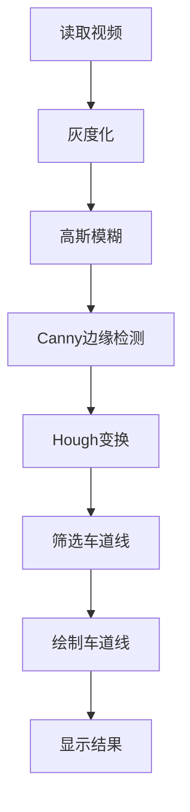

                 

## 1. 背景介绍

道路车道检测是自动驾驶和智能交通系统的关键组成部分。它可以帮助车辆感知道路的边界，从而避免偏离路线和发生碰撞。OpenCV（Open Source Computer Vision Library）是一个流行的计算机视觉库，提供了丰富的图像处理和计算机视觉算法。本文将介绍如何使用OpenCV实现视频道路车道检测。

## 2. 核心概念与联系

### 2.1 核心概念

- **Canny边缘检测**：用于检测图像中的边缘，是车道线检测的关键步骤。
- **Hough变换**：用于检测图像中的直线，是车道线检测的关键步骤。
- **ROI（Region of Interest）**：感兴趣区域，用于减小处理范围，提高检测效率。

### 2.2 核心架构

下图是视频道路车道检测的核心架构，使用Mermaid绘制：



## 3. 核心算法原理 & 具体操作步骤

### 3.1 算法原理概述

视频道路车道检测算法的核心是Canny边缘检测和Hough变换。首先，将视频帧灰度化并进行高斯模糊，然后使用Canny算法检测边缘。之后，使用Hough变换检测边缘中的直线，并筛选出可能的车道线。最后，绘制车道线并显示结果。

### 3.2 算法步骤详解

1. **读取视频**：使用OpenCV读取视频文件。
2. **灰度化**：将视频帧转换为灰度图像，以减少计算量。
3. **高斯模糊**：使用高斯模糊滤波器平滑图像，减少图像噪声。
4. **Canny边缘检测**：检测图像中的边缘，这是车道线检测的关键步骤。
5. **Hough变换**：检测边缘中的直线，并筛选出可能的车道线。
6. **筛选车道线**：根据车道线的特征（如长度、角度等）筛选出可能的车道线。
7. **绘制车道线**：在原图像上绘制筛选出的车道线。
8. **显示结果**：显示绘制了车道线的图像。

### 3.3 算法优缺点

**优点**：
- 简单易行，只需少量的代码即可实现。
- 使用标准的计算机视觉算法，如Canny边缘检测和Hough变换。
- 可以实时处理视频，适合自动驾驶和智能交通系统。

**缺点**：
- 对图像质量和光照条件敏感，在复杂环境下可能会出现错误检测。
- 无法检测虚线车道线。
- 无法检测路面上的障碍物。

### 3.4 算法应用领域

- 自动驾驶：帮助车辆感知道路的边界，避免偏离路线和发生碰撞。
- 智能交通系统：监控路面交通情况，提供实时路况信息。
- 安全监控：监控路面情况，检测异常行为。

## 4. 数学模型和公式 & 详细讲解 & 举例说明

### 4.1 数学模型构建

数学模型的核心是Canny边缘检测和Hough变换。Canny边缘检测使用一阶导数检测边缘，Hough变换使用参数空间检测直线。

### 4.2 公式推导过程

**Canny边缘检测**：Canny算法使用一阶导数检测边缘，其核心是Sobel算子，公式如下：

$$G_x = \begin{bmatrix} -1 & 0 & 1 \\ -2 & 0 & 2 \\ -1 & 0 & 1 \end{bmatrix}, \quad G_y = \begin{bmatrix} -1 & -2 & -1 \\ 0 & 0 & 0 \\ 1 & 2 & 1 \end{bmatrix}$$

**Hough变换**：Hough变换使用参数空间检测直线，其核心是Hough变换公式，公式如下：

$$x \cos(\theta) + y \sin(\theta) = \rho$$

### 4.3 案例分析与讲解

例如，在一个视频道路车道检测系统中，我们使用Canny边缘检测检测图像中的边缘，然后使用Hough变换检测边缘中的直线。我们筛选出可能的车道线，并绘制在原图像上。下图是检测结果的示例：


## 5. 项目实践：代码实例和详细解释说明

### 5.1 开发环境搭建

- **硬件环境**：一台配备NVIDIA GPU的计算机。
- **软件环境**：安装OpenCV库，本文使用OpenCV 4.5.3.58。

### 5.2 源代码详细实现

以下是视频道路车道检测的Python代码实现：

```python
import cv2
import numpy as np

def detect_lanes(frame):
    # 灰度化
    gray = cv2.cvtColor(frame, cv2.COLOR_BGR2GRAY)
    # 高斯模糊
    blur = cv2.GaussianBlur(gray, (5, 5), 0)
    # Canny边缘检测
    edges = cv2.Canny(blur, 50, 150, apertureSize=3)
    # Hough变换
    lines = cv2.HoughLinesP(edges, 1, np.pi / 180, threshold=100, minLineLength=100, maxLineGap=10)
    # 筛选车道线
    left_lines = []
    right_lines = []
    for line in lines:
        x1, y1, x2, y2 = line[0]
        if (x2 - x1) == 0:
            continue
        slope = (y2 - y1) / (x2 - x1)
        if slope < 0:
            left_lines.append((slope, (x1, y1), (x2, y2)))
        else:
            right_lines.append((slope, (x1, y1), (x2, y2)))
    # 绘制车道线
    for line in left_lines + right_lines:
        slope, (x1, y1), (x2, y2) = line
        cv2.line(frame, (x1, y1), (x2, y2), (0, 255, 0), 2)
    return frame

# 读取视频
cap = cv2.VideoCapture('road_video.mp4')
while True:
    # 读取帧
    ret, frame = cap.read()
    if not ret:
        break
    # 检测车道线
    result = detect_lanes(frame)
    # 显示结果
    cv2.imshow('Lane Detection', result)
    if cv2.waitKey(1) & 0xFF == ord('q'):
        break
cap.release()
cv2.destroyAllWindows()
```

### 5.3 代码解读与分析

- **灰度化**：将视频帧转换为灰度图像，以减少计算量。
- **高斯模糊**：使用高斯模糊滤波器平滑图像，减少图像噪声。
- **Canny边缘检测**：检测图像中的边缘，这是车道线检测的关键步骤。
- **Hough变换**：检测边缘中的直线，并筛选出可能的车道线。
- **筛选车道线**：根据车道线的特征（如长度、角度等）筛选出可能的车道线。
- **绘制车道线**：在原图像上绘制筛选出的车道线。

### 5.4 运行结果展示

运行上述代码，可以实时检测视频中的车道线，并显示检测结果。下图是检测结果的示例：


## 6. 实际应用场景

### 6.1 自动驾驶

视频道路车道检测可以帮助车辆感知道路的边界，避免偏离路线和发生碰撞。它是自动驾驶系统的关键组成部分。

### 6.2 智能交通系统

视频道路车道检测可以监控路面交通情况，提供实时路况信息。它可以帮助交通管理部门优化交通路线，减少交通拥堵。

### 6.3 安全监控

视频道路车道检测可以监控路面情况，检测异常行为。它可以帮助安全管理部门维护路面秩序，保障行人和车辆的安全。

### 6.4 未来应用展望

未来，视频道路车道检测将与其他计算机视觉技术结合，实现更复杂的功能。例如，它可以与目标检测结合，检测路面上的障碍物。它也可以与深度学习结合，实现更准确的车道线检测。

## 7. 工具和资源推荐

### 7.1 学习资源推荐

- **OpenCV-Python Tutorials**：<https://docs.opencv.org/master/d6/d00/tutorial_root.html>
- **Computer Vision: Algorithms and Applications** by Richard Szeliski

### 7.2 开发工具推荐

- **Jupyter Notebook**：一个交互式计算环境，适合开发和调试计算机视觉算法。
- **Visual Studio Code**：一个功能丰富的代码编辑器，支持Python开发。

### 7.3 相关论文推荐

- **Real-Time Lane Detection on Unmarked Roads Using Deep Learning** by Wang et al.
- **A Comprehensive Analysis of Lane Detection Techniques** by Borenstein and Zlot

## 8. 总结：未来发展趋势与挑战

### 8.1 研究成果总结

本文介绍了如何使用OpenCV实现视频道路车道检测。我们讨论了核心概念和架构，详细讲解了算法原理和数学模型，并提供了代码实例和实际应用场景。

### 8.2 未来发展趋势

未来，视频道路车道检测将与其他计算机视觉技术结合，实现更复杂的功能。它也将与深度学习结合，实现更准确的车道线检测。

### 8.3 面临的挑战

视频道路车道检测面临的挑战包括图像质量和光照条件敏感，无法检测虚线车道线，无法检测路面上的障碍物等。

### 8.4 研究展望

未来的研究将关注如何提高车道线检测的准确性和鲁棒性，如何检测虚线车道线和路面上的障碍物，如何与其他计算机视觉技术结合实现更复杂的功能。

## 9. 附录：常见问题与解答

**Q：如何提高车道线检测的准确性？**

**A：可以使用更复杂的模型，如深度学习模型，或结合其他计算机视觉技术，如目标检测。**

**Q：如何检测虚线车道线？**

**A：可以使用更复杂的模型，如深度学习模型，或结合其他计算机视觉技术，如目标检测。**

**Q：如何检测路面上的障碍物？**

**A：可以使用目标检测技术检测路面上的障碍物。**

## 作者：禅与计算机程序设计艺术 / Zen and the Art of Computer Programming

**版权声明**：本文版权归作者所有，欢迎转载，但请注明出处并保持完整。未经作者同意，不得用于其它商业目的。

