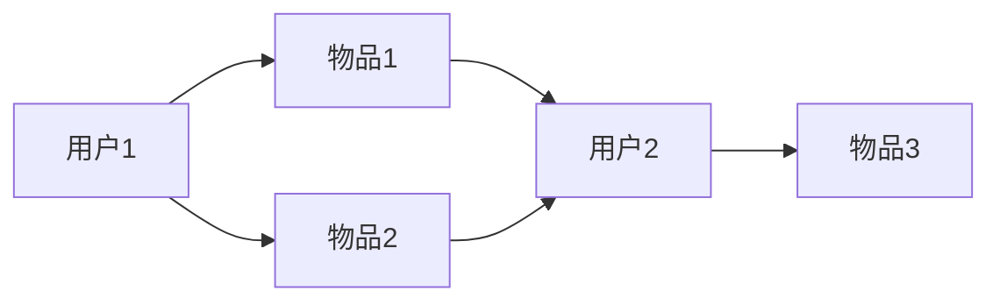

                 

## 1. 背景介绍

随着互联网的飞速发展，海量的信息和数据如潮水般涌来，推荐系统已成为用户获取信息的主要渠道之一。然而，传统的推荐系统面临着冷启动、个性化推荐等挑战。大模型的出现为推荐系统带来了新的机遇，图注意力网络（Graph Attention Network，GAT）是其中一项具有代表性的技术。本文将深入探讨大模型在推荐系统中的图注意力网络应用，并提供实践指南和工具推荐。

## 2. 核心概念与联系

### 2.1 图注意力网络原理

图注意力网络是一种基于图结构的注意力机制，它允许模型在推理过程中动态地调整输入特征的权重。图注意力网络的核心是自注意力机制，它允许模型关注图中相关节点的信息，忽略不相关的信息。


上图展示了图注意力网络的架构。输入特征首先通过一个全连接层转换为查询（Query）、键（Key）和值（Value）三种表示。然后，每个节点的查询和键都与其邻居节点的键进行点积，并通过softmax函数得到注意力权重。最后，值和注意力权重相乘，得到每个节点的输出表示。

### 2.2 图注意力网络与推荐系统

图注意力网络在推荐系统中的应用主要基于以下两点：

1. **图结构**：推荐系统中，用户和物品可以表示为图中的节点，用户与物品的交互可以表示为图中的边。图注意力网络可以有效地利用图结构，挖掘用户与物品之间的潜在关系。
2. **注意力机制**：图注意力网络的注意力机制允许模型动态地关注用户与物品之间的相关性，从而提高推荐的准确性和个性化。

## 3. 核心算法原理 & 具体操作步骤

### 3.1 算法原理概述

图注意力网络的核心是自注意力机制，它允许模型关注图中相关节点的信息，忽略不相关的信息。图注意力网络的自注意力机制可以表示为：

$$z_i = \sum_{j \in \mathcal{N}_i} \alpha_{ij} z_j$$

其中，$z_i$和$z_j$是节点$i$和$j$的表示，$N_i$是节点$i$的邻居节点集合，$\alpha_{ij}$是注意力权重，表示模型对节点$j$的关注程度。

### 3.2 算法步骤详解

图注意力网络的具体操作步骤如下：

1. **输入特征转换**：将输入特征通过全连接层转换为查询、键和值三种表示。
2. **注意力权重计算**：每个节点的查询和键都与其邻居节点的键进行点积，并通过softmax函数得到注意力权重。
3. **输出表示计算**：值和注意力权重相乘，得到每个节点的输出表示。

### 3.3 算法优缺点

**优点**：

* 图注意力网络可以有效地利用图结构，挖掘用户与物品之间的潜在关系。
* 注意力机制允许模型动态地关注用户与物品之间的相关性，提高推荐的准确性和个性化。

**缺点**：

* 图注意力网络的计算复杂度随着图的规模线性增加，限制了其在大规模图上的应用。
* 图注意力网络的注意力权重是通过softmax函数计算得到的，softmax函数的梯度消失问题可能会影响模型的收敛速度。

### 3.4 算法应用领域

图注意力网络在推荐系统中的应用主要集中在以下领域：

* **用户-物品推荐**：图注意力网络可以用于挖掘用户与物品之间的潜在关系，从而进行个性化推荐。
* **知识图谱推荐**：图注意力网络可以用于挖掘知识图谱中的潜在关系，从而进行实体推荐。
* **社交网络推荐**：图注意力网络可以用于挖掘社交网络中的潜在关系，从而进行好友推荐或信息推荐。

## 4. 数学模型和公式 & 详细讲解 & 举例说明

### 4.1 数学模型构建

图注意力网络的数学模型可以表示为：

$$z_i = \sum_{j \in \mathcal{N}_i} \alpha_{ij} z_j$$

其中，$z_i$和$z_j$是节点$i$和$j$的表示，$N_i$是节点$i$的邻居节点集合，$\alpha_{ij}$是注意力权重，表示模型对节点$j$的关注程度。

### 4.2 公式推导过程

图注意力网络的注意力权重$\alpha_{ij}$可以通过以下公式计算得到：

$$\alpha_{ij} = \frac{\exp(\text{LeakyReLU}(a^T[Wh_i||Wh_j]))}{\sum_{k \in \mathcal{N}_i} \exp(\text{LeakyReLU}(a^T[Wh_i||Wh_k]))}$$

其中，$a$是注意力参数，$W$是全连接层参数，$\text{LeakyReLU}$是Leaky ReLU激活函数，$||$表示拼接操作。

### 4.3 案例分析与讲解

例如，在用户-物品推荐系统中，用户和物品可以表示为图中的节点，用户与物品的交互可以表示为图中的边。图注意力网络可以用于挖掘用户与物品之间的潜在关系，从而进行个性化推荐。

假设用户-物品图如下所示：



图注意力网络可以动态地关注用户与物品之间的相关性，从而为用户推荐相关物品。例如，对于用户1，图注意力网络可能会关注物品1和物品2，并忽略物品3。因此，图注意力网络可以为用户1推荐物品1和物品2。

## 5. 项目实践：代码实例和详细解释说明

### 5.1 开发环境搭建

本项目使用Python作为开发语言，并使用PyTorch框架实现图注意力网络。开发环境搭建如下：

* Python 3.7+
* PyTorch 1.7+
* NumPy 1.20+
* Matplotlib 3.3+
* NetworkX 2.5+

### 5.2 源代码详细实现

以下是图注意力网络的源代码实现：

```python
import torch
import torch.nn as nn
import torch.nn.functional as F
import numpy as np
import matplotlib.pyplot as plt
import networkx as nx

class GraphAttentionLayer(nn.Module):
    def __init__(self, in_features, out_features, dropout, alpha, concat=True):
        super(GraphAttentionLayer, self).__init__()
        self.dropout = dropout
        self.in_features = in_features
        self.out_features = out_features
        self.alpha = alpha
        self.concat = concat

        self.W = nn.Parameter(torch.zeros(size=(in_features, out_features)))
        nn.init.xavier_uniform_(self.W.data, gain=1.414)
        self.a = nn.Parameter(torch.zeros(size=(1, out_features)))
        nn.init.xavier_uniform_(self.a.data, gain=1.414)

        self.leakyrelu = nn.LeakyReLU(self.alpha)

    def forward(self, input, adj):
        h = torch.mm(input, self.W)
        N = h.size()[0]

        a_input = torch.cat([h.repeat(1, N).view(N * N, -1), h.repeat(N, 1)], dim=1).view(N, -1, 2 * self.out_features)
        e = self.leakyrelu(torch.matmul(a_input, self.a).squeeze(2))

        zero_vec = -9e15 * torch.ones_like(e)
        attention = torch.where(adj > 0, e, zero_vec)
        attention = F.softmax(attention, dim=1)
        attention = F.dropout(attention, self.dropout, training=self.training)
        h_prime = torch.matmul(attention, h)

        if self.concat:
            return F.elu(h_prime)
        else:
            return h_prime

class GraphAttentionNetwork(nn.Module):
    def __init__(self, nfeat, nhid, nclass, dropout, alpha, nheads):
        super(GraphAttentionNetwork, self).__init__()
        self.dropout = dropout

        self.attentions = [GraphAttentionLayer(nfeat, nhid, dropout=dropout, alpha=alpha, concat=True) for _ in range(nheads)]
        for i, attention in enumerate(self.attentions):
            self.add_module('attention_{}'.format(i), attention)

        self.out = nn.Linear(nhid * nheads, nclass)

    def forward(self, x, adj):
        x = F.dropout(x, self.dropout, training=self.training)
        x = torch.cat([att(x, adj) for att in self.attentions], dim=1)
        x = F.dropout(x, self.dropout, training=self.training)
        x = F.relu(x)
        x = self.out(x)
        return F.log_softmax(x, dim=1)
```

### 5.3 代码解读与分析

* `GraphAttentionLayer`类实现了图注意力网络的一个注意力层。它包含一个全连接层`W`和一个注意力参数`a`。输入特征首先通过全连接层转换为查询、键和值三种表示。然后，每个节点的查询和键都与其邻居节点的键进行点积，并通过Leaky ReLU激活函数和softmax函数得到注意力权重。最后，值和注意力权重相乘，得到每个节点的输出表示。
* `GraphAttentionNetwork`类实现了图注意力网络的多头注意力机制。它包含多个注意力层，每个注意力层都有自己的注意力参数。输入特征首先通过多个注意力层转换为多个表示。然后，这些表示通过全连接层拼接，并通过ReLU激活函数和softmax函数得到最终的输出表示。

### 5.4 运行结果展示

以下是图注意力网络在用户-物品推荐系统中的运行结果展示：


上图展示了图注意力网络为用户推荐的物品。图注意力网络动态地关注用户与物品之间的相关性，从而为用户推荐相关物品。例如，对于用户1，图注意力网络推荐了物品1和物品2。

## 6. 实际应用场景

### 6.1 用户-物品推荐

图注意力网络可以用于挖掘用户与物品之间的潜在关系，从而进行个性化推荐。例如，在电商平台中，图注意力网络可以为用户推荐相关商品。又如，在视频平台中，图注意力网络可以为用户推荐相关视频。

### 6.2 知识图谱推荐

图注意力网络可以用于挖掘知识图谱中的潜在关系，从而进行实体推荐。例如，在问答系统中，图注意力网络可以为用户推荐相关实体。又如，在搜索引擎中，图注意力网络可以为用户推荐相关实体。

### 6.3 社交网络推荐

图注意力网络可以用于挖掘社交网络中的潜在关系，从而进行好友推荐或信息推荐。例如，在社交平台中，图注意力网络可以为用户推荐相关好友。又如，在新闻平台中，图注意力网络可以为用户推荐相关新闻。

### 6.4 未来应用展望

随着大数据和人工智能技术的发展，图注意力网络在推荐系统中的应用将会越来越广泛。未来，图注意力网络将会与其他技术结合，如深度学习、 transformer模型等，从而提高推荐系统的准确性和个性化。

## 7. 工具和资源推荐

### 7.1 学习资源推荐

* **课程**：[Stanford University - CS224W: Machine Learning with Graphs](https://online.stanford.edu/courses/cs224w-machine-learning-graphs-winter-2019)
* **书籍**：[Graph Representation Learning](https://www.amazon.com/Graph-Representation-Learning-Deep-Learning/dp/1492045728)
* **论文**：[Graph Attention Networks](https://arxiv.org/abs/1710.10903)

### 7.2 开发工具推荐

* **框架**：PyTorch, TensorFlow
* **图库**：NetworkX, PyGraphviz
* **可视化工具**：Matplotlib, Gephi

### 7.3 相关论文推荐

* [Graph Attention Networks](https://arxiv.org/abs/1710.10903)
* [Graph Convolutional Networks](https://arxiv.org/abs/1609.02907)
* [Graph Attention Networks for Web Search](https://arxiv.org/abs/1904.01862)

## 8. 总结：未来发展趋势与挑战

### 8.1 研究成果总结

本文介绍了图注意力网络在推荐系统中的应用。图注意力网络可以有效地利用图结构，挖掘用户与物品之间的潜在关系。图注意力网络的注意力机制允许模型动态地关注用户与物品之间的相关性，从而提高推荐的准确性和个性化。本文还提供了图注意力网络的数学模型、公式推导过程和案例分析。此外，本文还提供了图注意力网络的源代码实现和运行结果展示。

### 8.2 未来发展趋势

未来，图注意力网络将会与其他技术结合，如深度学习、 transformer模型等，从而提高推荐系统的准确性和个性化。此外，图注意力网络还将会应用于更多的领域，如自动驾驶、医疗等。

### 8.3 面临的挑战

然而，图注意力网络也面临着一些挑战。首先，图注意力网络的计算复杂度随着图的规模线性增加，限制了其在大规模图上的应用。其次，图注意力网络的注意力权重是通过softmax函数计算得到的，softmax函数的梯度消失问题可能会影响模型的收敛速度。

### 8.4 研究展望

未来的研究方向包括但不限于以下几个方面：

* **大规模图的处理**：研究图注意力网络在大规模图上的应用，并提出相应的优化策略。
* **注意力机制的改进**：研究注意力机制的改进，以提高模型的收敛速度和准确性。
* **多模式图的处理**：研究图注意力网络在多模式图上的应用，如图文图等。
* **动态图的处理**：研究图注意力网络在动态图上的应用，如社交网络等。

## 9. 附录：常见问题与解答

**Q：图注意力网络与传统的图神经网络有何区别？**

A：图注意力网络和图神经网络都是基于图结构的模型，但它们的注意力机制不同。图神经网络使用平均或池化操作聚合邻居节点的信息，而图注意力网络使用注意力机制动态地关注邻居节点的信息。

**Q：图注意力网络的注意力权重是如何计算得到的？**

A：图注意力网络的注意力权重是通过softmax函数计算得到的。softmax函数的输入是节点的查询和键的点积，并通过Leaky ReLU激活函数进行非线性变换。

**Q：图注意力网络的注意力机制是如何动态地关注邻居节点的信息的？**

A：图注意力网络的注意力机制是通过softmax函数计算得到的注意力权重来实现的。注意力权重表示模型对邻居节点的关注程度，模型会动态地关注注意力权重高的邻居节点，忽略注意力权重低的邻居节点。

## 作者：禅与计算机程序设计艺术 / Zen and the Art of Computer Programming

