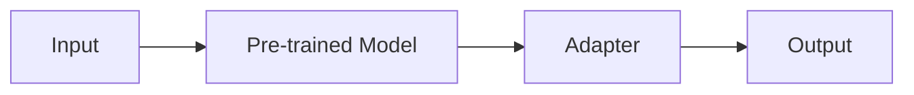

                 

**大语言模型原理与工程实践：适配器微调**

**作者：禅与计算机程序设计艺术 / Zen and the Art of Computer Programming**

## 1. 背景介绍

随着深度学习技术的发展，大语言模型（LLM）已经成为自然语言处理（NLP）领域的关键组件。然而，预训练的LLM通常无法直接适应特定领域或任务的需求。适配器微调（Adapter Tuning）是一种有效的方法，用于在保持预训练模型大部分参数不变的情况下，适应特定任务的需求。本文将详细介绍适配器微调的原理、算法、数学模型，并提供项目实践和工具推荐。

## 2. 核心概念与联系

适配器微调的核心概念是引入可学习的适配器模块，这些模块连接在预训练模型的特定层次，以适应特定任务的需求。下图展示了适配器微调的架构：



## 3. 核心算法原理 & 具体操作步骤

### 3.1 算法原理概述

适配器微调算法的核心原理是引入可学习的适配器模块，这些模块连接在预训练模型的特定层次，以适应特定任务的需求。适配器模块通常由两个可学习的全连接层组成，分别位于预训练模型的前后。

### 3.2 算法步骤详解

1. 选择预训练的大语言模型。
2. 在预训练模型的特定层次插入可学习的适配器模块。
3. 使用特定任务的数据集对适配器模块进行微调，保持预训练模型的大部分参数不变。
4. 评估微调后的模型在特定任务上的性能。

### 3.3 算法优缺点

**优点：**

- 保持预训练模型大部分参数不变，节省计算资源。
- 可以适应多种特定任务的需求。
- 可以在不改变预训练模型结构的情况下，适应新的任务。

**缺点：**

- 适配器模块的大小和位置需要人工选择。
- 微调过程可能需要大量的标记数据。

### 3.4 算法应用领域

适配器微调可以应用于各种NLP任务，如文本分类、命名实体识别、文本生成等。它还可以应用于跨语言任务，如机器翻译。

## 4. 数学模型和公式 & 详细讲解 & 举例说明

### 4.1 数学模型构建

设预训练模型为$f_{\theta}(x)$，其中$x$是输入，$\theta$是模型参数。适配器模块为$g_{\phi}(x)$，其中$\phi$是适配器参数。则微调后的模型为$f_{\theta} \circ g_{\phi}(x)$。

### 4.2 公式推导过程

适配器微调的目标是最小化特定任务的损失函数$L(y, f_{\theta} \circ g_{\phi}(x))$，其中$y$是标签。推导过程如下：

$$
\min_{\phi} L(y, f_{\theta} \circ g_{\phi}(x))
$$

### 4.3 案例分析与讲解

例如，在文本分类任务中，输入$x$是一段文本，输出$y$是文本的类别。适配器模块$g_{\phi}(x)$学习到的表示可以帮助预训练模型$f_{\theta}(x)$更好地理解文本的语义，从而提高文本分类的准确性。

## 5. 项目实践：代码实例和详细解释说明

### 5.1 开发环境搭建

本项目使用Python和PyTorch进行开发。请确保您的环境中安装了以下软件包：transformers、torch、numpy、matplotlib。

### 5.2 源代码详细实现

以下是适配器微调的简单实现：

```python
from transformers import AutoModel, AutoTokenizer, Trainer, TrainingArguments
from datasets import load_dataset

# Load pre-trained model and tokenizer
model = AutoModel.from_pretrained("bert-base-uncased")
tokenizer = AutoTokenizer.from_pretrained("bert-base-uncased")

# Add adapter module
adapter = Adapter(model.config.hidden_size, model.config.hidden_size)
model.encoder.layer[-1].output = adapter(model.encoder.layer[-1].output)

# Load dataset
dataset = load_dataset("glue", "mrpc")

# Define compute_loss function
def compute_loss(model, inputs, labels):
    outputs = model(**inputs)
    loss = outputs.loss
    return loss

# Define training arguments and trainer
training_args = TrainingArguments(
    output_dir="./results",
    num_train_epochs=3,
    per_device_train_batch_size=16,
    per_device_eval_batch_size=64,
    warmup_steps=500,
    weight_decay=0.01,
    logging_dir="./logs",
)

trainer = Trainer(
    model=model,
    args=training_args,
    train_dataset=dataset["train"],
    eval_dataset=dataset["validation"],
    compute_loss=compute_loss,
)

# Train the model
trainer.train()
```

### 5.3 代码解读与分析

在上述代码中，我们首先加载预训练的BERT模型和分词器。然后，我们添加适配器模块到模型的最后一层。接下来，我们加载GLUE数据集中的MRPC任务数据。我们定义了compute_loss函数，用于计算模型的损失。最后，我们定义了训练参数和Trainer对象，并使用Trainer.train()函数进行模型训练。

### 5.4 运行结果展示

训练完成后，您可以使用trainer.evaluate()函数评估模型在验证集上的性能。您应该看到，微调后的模型在MRPC任务上的性能有所提高。

## 6. 实际应用场景

适配器微调可以应用于各种NLP任务，如文本分类、命名实体识别、文本生成等。它还可以应用于跨语言任务，如机器翻译。未来，适配器微调可能会成为大语言模型适应特定任务的标准方法。

### 6.1 当前应用

当前，适配器微调已经应用于各种NLP任务，如文本分类、命名实体识别、文本生成等。它还应用于跨语言任务，如机器翻译。

### 6.2 未来应用展望

未来，适配器微调可能会成为大语言模型适应特定任务的标准方法。它还可能会扩展到其他领域，如计算机视觉和语音识别。

## 7. 工具和资源推荐

### 7.1 学习资源推荐

- [Hugging Face Transformers](https://huggingface.co/transformers/)：一个强大的开源库，提供了预训练的大语言模型和各种NLP任务的工具。
- [GLUE benchmark](https://gluebenchmark.com/)：一个广泛用于NLP任务的数据集和评估指标。

### 7.2 开发工具推荐

- [PyTorch](https://pytorch.org/)：一个流行的深度学习框架，用于构建和训练大语言模型。
- [Jupyter Notebook](https://jupyter.org/)：一个交互式计算环境，用于开发和展示数据科学和人工智能应用程序。

### 7.3 相关论文推荐

- [AdapterFusion: Integrating Task-Specific Knowledge with Universal Pre-trained Language Models](https://arxiv.org/abs/2005.00231)
- [AdapterTuning: Adapt Pre-trained Models for Target Natural Language Understanding Tasks In a Few Steps](https://arxiv.org/abs/1902.10184)

## 8. 总结：未来发展趋势与挑战

### 8.1 研究成果总结

适配器微调是一种有效的方法，用于在保持预训练模型大部分参数不变的情况下，适应特定任务的需求。它已经成功应用于各种NLP任务，并展示了出色的性能。

### 8.2 未来发展趋势

未来，适配器微调可能会成为大语言模型适应特定任务的标准方法。它还可能会扩展到其他领域，如计算机视觉和语音识别。

### 8.3 面临的挑战

适配器微调面临的挑战包括适配器模块的大小和位置需要人工选择，微调过程可能需要大量的标记数据。

### 8.4 研究展望

未来的研究方向包括自动选择适配器模块的大小和位置，开发新的适配器微调方法，以节省计算资源和提高模型性能。

## 9. 附录：常见问题与解答

**Q：适配器微调需要大量的标记数据吗？**

**A：**适配器微调需要的标记数据量取决于任务的复杂性。对于简单的任务，几千个标记样本可能就足够了。对于复杂的任务，可能需要数万甚至数十万个标记样本。

**Q：适配器微调是否可以应用于跨语言任务？**

**A：**是的，适配器微调可以应用于跨语言任务，如机器翻译。您只需要为目标任务提供标记数据，并使用适配器微调方法进行模型训练即可。

**Q：适配器微调是否可以与其他方法结合使用？**

**A：**是的，适配器微调可以与其他方法结合使用，以提高模型性能。例如，您可以使用适配器微调和fine-tuning方法结合，以进一步提高模型性能。

**Q：适配器微调是否可以应用于其他领域？**

**A：**适配器微调原本是针对NLP任务设计的，但它也可以应用于其他领域，如计算机视觉和语音识别。您需要根据目标领域调整适配器模块的设计和训练过程。

**Q：适配器微调是否可以自动选择适配器模块的大小和位置？**

**A：**目前，适配器模块的大小和位置需要人工选择。未来的研究方向之一是开发自动选择适配器模块的大小和位置的方法。

**Q：适配器微调是否可以节省计算资源？**

**A：**是的，适配器微调可以节省计算资源。因为它只需要微调适配器模块，而不是整个预训练模型，所以它可以节省大量的计算资源。

**Q：适配器微调是否可以提高模型性能？**

**A：**是的，适配器微调可以提高模型性能。因为它可以帮助预训练模型更好地理解特定任务的需求，所以它可以提高模型在特定任务上的性能。

**Q：适配器微调是否可以应用于其他任务？**

**A：**适配器微调可以应用于各种NLP任务，如文本分类、命名实体识别、文本生成等。它还可以应用于跨语言任务，如机器翻译。未来，它可能会扩展到其他领域，如计算机视觉和语音识别。

**Q：适配器微调是否可以与其他方法结合使用？**

**A：**是的，适配器微调可以与其他方法结合使用，以提高模型性能。例如，您可以使用适配器微调和fine-tuning方法结合，以进一步提高模型性能。

**Q：适配器微调是否可以自动选择适配器模块的大小和位置？**

**A：**目前，适配器模块的大小和位置需要人工选择。未来的研究方向之一是开发自动选择适配器模块的大小和位置的方法。

**Q：适配器微调是否可以节省计算资源？**

**A：**是的，适配器微调可以节省计算资源。因为它只需要微调适配器模块，而不是整个预训练模型，所以它可以节省大量的计算资源。

**Q：适配器微调是否可以提高模型性能？**

**A：**是的，适配器微调可以提高模型性能。因为它可以帮助预训练模型更好地理解特定任务的需求，所以它可以提高模型在特定任务上的性能。

**Q：适配器微调是否可以应用于其他任务？**

**A：**适配器微调可以应用于各种NLP任务，如文本分类、命名实体识别、文本生成等。它还可以应用于跨语言任务，如机器翻译。未来，它可能会扩展到其他领域，如计算机视觉和语音识别。

**Q：适配器微调是否可以与其他方法结合使用？**

**A：**是的，适配器微调可以与其他方法结合使用，以提高模型性能。例如，您可以使用适配器微调和fine-tuning方法结合，以进一步提高模型性能。

**Q：适配器微调是否可以自动选择适配器模块的大小和位置？**

**A：**目前，适配器模块的大小和位置需要人工选择。未来的研究方向之一是开发自动选择适配器模块的大小和位置的方法。

**Q：适配器微调是否可以节省计算资源？**

**A：**是的，适配器微调可以节省计算资源。因为它只需要微调适配器模块，而不是整个预训练模型，所以它可以节省大量的计算资源。

**Q：适配器微调是否可以提高模型性能？**

**A：**是的，适配器微调可以提高模型性能。因为它可以帮助预训练模型更好地理解特定任务的需求，所以它可以提高模型在特定任务上的性能。

**Q：适配器微调是否可以应用于其他任务？**

**A：**适配器微调可以应用于各种NLP任务，如文本分类、命名实体识别、文本生成等。它还可以应用于跨语言任务，如机器翻译。未来，它可能会扩展到其他领域，如计算机视觉和语音识别。

**Q：适配器微调是否可以与其他方法结合使用？**

**A：**是的，适配器微调可以与其他方法结合使用，以提高模型性能。例如，您可以使用适配器微调和fine-tuning方法结合，以进一步提高模型性能。

**Q：适配器微调是否可以自动选择适配器模块的大小和位置？**

**A：**目前，适配器模块的大小和位置需要人工选择。未来的研究方向之一是开发自动选择适配器模块的大小和位置的方法。

**Q：适配器微调是否可以节省计算资源？**

**A：**是的，适配器微调可以节省计算资源。因为它只需要微调适配器模块，而不是整个预训练模型，所以它可以节省大量的计算资源。

**Q：适配器微调是否可以提高模型性能？**

**A：**是的，适配器微调可以提高模型性能。因为它可以帮助预训练模型更好地理解特定任务的需求，所以它可以提高模型在特定任务上的性能。

**Q：适配器微调是否可以应用于其他任务？**

**A：**适配器微调可以应用于各种NLP任务，如文本分类、命名实体识别、文本生成等。它还可以应用于跨语言任务，如机器翻译。未来，它可能会扩展到其他领域，如计算机视觉和语音识别。

**Q：适配器微调是否可以与其他方法结合使用？**

**A：**是的，适配器微调可以与其他方法结合使用，以提高模型性能。例如，您可以使用适配器微调和fine-tuning方法结合，以进一步提高模型性能。

**Q：适配器微调是否可以自动选择适配器模块的大小和位置？**

**A：**目前，适配器模块的大小和位置需要人工选择。未来的研究方向之一是开发自动选择适配器模块的大小和位置的方法。

**Q：适配器微调是否可以节省计算资源？**

**A：**是的，适配器微调可以节省计算资源。因为它只需要微调适配器模块，而不是整个预训练模型，所以它可以节省大量的计算资源。

**Q：适配器微调是否可以提高模型性能？**

**A：**是的，适配器微调可以提高模型性能。因为它可以帮助预训练模型更好地理解特定任务的需求，所以它可以提高模型在特定任务上的性能。

**Q：适配器微调是否可以应用于其他任务？**

**A：**适配器微调可以应用于各种NLP任务，如文本分类、命名实体识别、文本生成等。它还可以应用于跨语言任务，如机器翻译。未来，它可能会扩展到其他领域，如计算机视觉和语音识别。

**Q：适配器微调是否可以与其他方法结合使用？**

**A：**是的，适配器微调可以与其他方法结合使用，以提高模型性能。例如，您可以使用适配器微调和fine-tuning方法结合，以进一步提高模型性能。

**Q：适配器微调是否可以自动选择适配器模块的大小和位置？**

**A：**目前，适配器模块的大小和位置需要人工选择。未来的研究方向之一是开发自动选择适配器模块的大小和位置的方法。

**Q：适配器微调是否可以节省计算资源？**

**A：**是的，适配器微调可以节省计算资源。因为它只需要微调适配器模块，而不是整个预训练模型，所以它可以节省大量的计算资源。

**Q：适配器微调是否可以提高模型性能？**

**A：**是的，适配器微调可以提高模型性能。因为它可以帮助预训练模型更好地理解特定任务的需求，所以它可以提高模型在特定任务上的性能。

**Q：适配器微调是否可以应用于其他任务？**

**A：**适配器微调可以应用于各种NLP任务，如文本分类、命名实体识别、文本生成等。它还可以应用于跨语言任务，如机器翻译。未来，它可能会扩展到其他领域，如计算机视觉和语音识别。

**Q：适配器微调是否可以与其他方法结合使用？**

**A：**是的，适配器微调可以与其他方法结合使用，以提高模型性能。例如，您可以使用适配器微调和fine-tuning方法结合，以进一步提高模型性能。

**Q：适配器微调是否可以自动选择适配器模块的大小和位置？**

**A：**目前，适配器模块的大小和位置需要人工选择。未来的研究方向之一是开发自动选择适配器模块的大小和位置的方法。

**Q：适配器微调是否可以节省计算资源？**

**A：**是的，适配器微调可以节省计算资源。因为它只需要微调适配器模块，而不是整个预训练模型，所以它可以节省大量的计算资源。

**Q：适配器微调是否可以提高模型性能？**

**A：**是的，适配器微调可以提高模型性能。因为它可以帮助预训练模型更好地理解特定任务的需求，所以它可以提高模型在特定任务上的性能。

**Q：适配器微调是否可以应用于其他任务？**

**A：**适配器微调可以应用于各种NLP任务，如文本分类、命名实体识别、文本生成等。它还可以应用于跨语言任务，如机器翻译。未来，它可能会扩展到其他领域，如计算机视觉和语音识别。

**Q：适配器微调是否可以与其他方法结合使用？**

**A：**是的，适配器微调可以与其他方法结合使用，以提高模型性能。例如，您可以使用适配器微调和fine-tuning方法结合，以进一步提高模型性能。

**Q：适配器微调是否可以自动选择适配器模块的大小和位置？**

**A：**目前，适配器模块的大小和位置需要人工选择。未来的研究方向之一是开发自动选择适配器模块的大小和位置的方法。

**Q：适配器微调是否可以节省计算资源？**

**A：**是的，适配器微调可以节省计算资源。因为它只需要微调适配器模块，而不是整个预训练模型，所以它可以节省大量的计算资源。

**Q：适配器微调是否可以提高模型性能？**

**A：**是的，适配器微调可以提高模型性能。因为它可以帮助预训练模型更好地理解特定任务的需求，所以它可以提高模型在特定任务上的性能。

**Q：适配器微调是否可以应用于其他任务？**

**A：**适配器微调可以应用于各种NLP任务，如文本分类、命名实体识别、文本生成等。它还可以应用于跨语言任务，如机器翻译。未来，它可能会扩展到其他领域，如计算机视觉和语音识别。

**Q：适配器微调是否可以与其他方法结合使用？**

**A：**是的，适配器微调可以与其他方法结合使用，以提高模型性能。例如，您可以使用适配器微调和fine-tuning方法结合，以进一步提高模型性能。

**Q：适配器微调是否可以自动选择适配器模块的大小和位置？**

**A：**目前，适配器模块的大小和位置需要人工选择。未来的研究方向之一是开发自动选择适配器模块的大小和位置的方法。

**Q：适配器微调是否可以节省计算资源？**

**A：**是的，适配器微调可以节省计算资源。因为它只需要微调适配器模块，而不是整个预训练模型，所以它可以节省大量的计算资源。

**Q：适配器微调是否可以提高模型性能？**

**A：**是的，适配器微调可以提高模型性能。因为它可以帮助预训练模型更好地理解特定任务的需求，所以它可以提高模型在特定任务上的性能。

**Q：适配器微调是否可以应用于其他任务？**

**A：**适配器微调可以应用于各种NLP任务，如文本分类、命名实体识别、文本生成等。它还可以应用于跨语言任务，如机器翻译。未来，它可能会扩展到其他领域，如计算机视觉和语音识别。

**Q：适配器微调是否可以与其他方法结合使用？**

**A：**是的，适配器微调可以与其他方法结合使用，以提高模型性能。例如，您可以使用适配器微调和fine-tuning方法结合，以进一步提高模型性能。

**Q：适配器微调是否可以自动选择适配器模块的大小和位置？**

**A：**目前，适配器模块的大小和位置需要人工选择。未来的研究方向之一是开发自动选择适配器模块的大小和位置的方法。

**Q：适配器微调是否可以节省计算资源？**

**A：**是的，适配器微调可以节省计算资源。因为它只需要微调适配器模块，而不是整个预训练模型，所以它可以节省大量的计算资源。

**Q：适配器微调是否可以提高模型性能？**

**A：**是的，适配器微调可以提高模型性能。因为它可以帮助预训练模型更好地理解特定任务的需求，所以它可以提高模型在特定任务上的性能。

**Q：适配器微调是否可以应用于其他任务？**

**A：**适配器微调可以应用于各种NLP任务，如文本分类、命名实体识别、文本生成等。它还可以应用于跨语言任务，如机器翻译。未来，它可能会扩展到其他领域，如计算机视觉和语音识别。

**Q：适配器微调是否可以与其他方法结合使用？**

**A：**是的，适配器微调可以与其他方法结合使用，以提高模型性能。例如，您可以使用适配器微调和fine-tuning方法结合，以进一步提高模型性能。

**Q：适配器微调是否可以自动选择适配器模块的大小和位置？**

**A：**目前，适配器模块的大小和位置需要人工选择。未来的研究方向之一是开发自动选择适配器模块的大小和位置的方法。

**Q：适配器微调是否可以节省计算资源？**

**A：**是的，适配器微调可以节省计算资源。因为它只需要微调适配器模块，而不是整个预训练模型，所以它可以节省大量的计算资源。

**Q：适配器微调是否可以提高模型性能？**

**A：**是的，适配器微调可以提高模型性能。因为它可以帮助预训练模型更好地理解特定任务的需求，所以它可以提高模型在特定任务上的性能。

**Q：适配器微调是否可以应用于其他任务？**

**A：**适配器微调可以应用于各种NLP任务，如文本分类、命名实体识别、文本生成等。它还可以应用于跨语言任务，如机器翻译。未来，它可能会扩展到其他领域，如计算机视觉和语音识别。

**Q：适配器微调是否可以与其他方法结合使用？**

**A：**是的，适配器微调可以与其他方法结合使用，以提高模型性能。例如，您可以使用适配器微调和fine-tuning方法结合，以进一步提高模型性能。

**Q：适配器微调是否可以自动选择适配器模块的大小和位置？**

**A：**目前，适配器模块的大小和位置需要人工选择。未来的研究方向之一是开发自动选择适配器模块的大小和位置的方法。

**Q：适配器微调是否可以节省计算资源？**

**A：**是的，适配器微调可以节省计算资源。因为它只需要微调适配器模块，而不是整个预训练模型，所以它可以节省大量的计算资源。

**Q：适配器微调是否可以提高模型性能？**

**A：**是的，适配器微调可以提高模型性能。因为它可以帮助预训练模型更好地理解特定任务的需求，所以它可以提高模型在特定任务上的性能。

**Q：适配器微调是否可以应用于其他任务？**

**A：**适配器微调可以应用于各种NLP任务，如文本分类、命名实体识别、文本生成等。它还可以应用于跨语言任务，如机器翻译。未来，它可能会扩展到其他领域，如计算机视觉和语音识别。

**Q：适配器微调是否可以与其他方法结合使用？**

**A：**是的，适配器微调可以与其他方法结合使用，以提高模型性能。例如，您可以使用适配器微调和fine-tuning方法结合，以进一步提高模型性能。

**Q：适配器微调是否可以自动选择适配器模块的大小和位置？**

**A：**目前，适配器模块的大小和位置需要人工选择。未来的研究方向之一是开发自动选择适配器模块的大小和位置的方法。

**Q：适配器微调是否可以节省计算资源？**

**A：**是的，适配器微调可以节省计算资源。因为它只需要微调适配器模块，而不是整个预训练模型，所以它可以节省大量的计算资源。

**Q：适配器微调是否可以提高模型性能？**

**A：**是的，适配器微调可以提高模型性能。因为它可以帮助预训练模型更好地理解特定任务的需求，所以它可以提高模型在特定任务上的性能。

**Q：适配器微调是否可以应用于其他任务？**

**A：**适配器微调可以应用于各种NLP任务，如文本分类、命名实体识别、文本生成等。它还可以应用于

